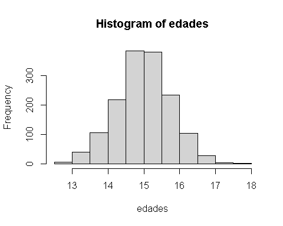
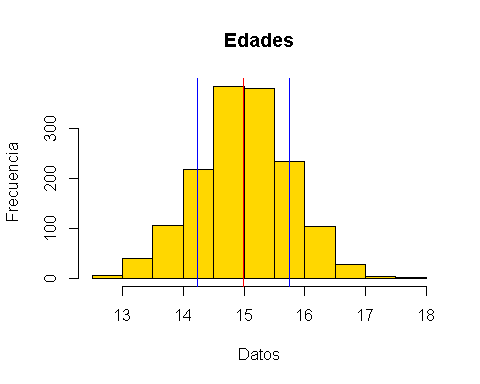
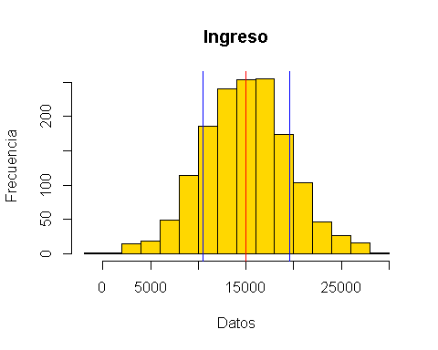
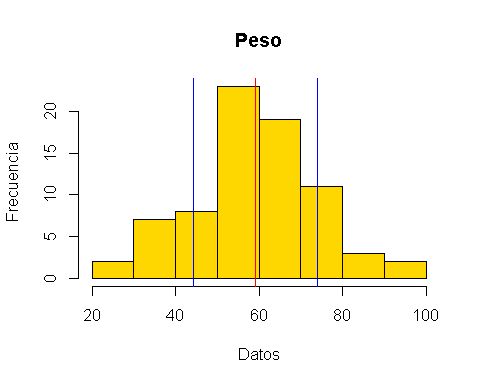
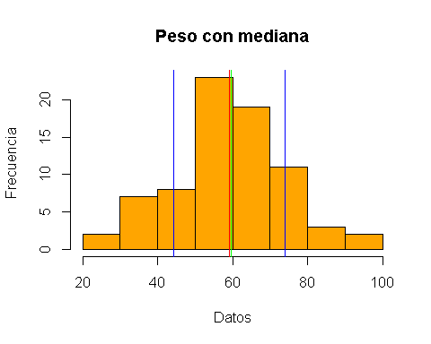

# Funciones
La instalación base de R tiene suficientes funciones para que realicemos todas las tareas básicas de análisis de datos, desde importar información hasta crear documentos para comunicarla (¡este libro ha sido creado con R!).

Sin embargo, es común que necesitemos realizar tareas para las que no existe una función específica o que para encontrar solución necesitemos combinar o utilizar funciones en sucesión, lo cual puede complicar nuestro código.

Ilustremos lo anterior con un ejemplo.

## ¿Por qué necesitamos crear nuestrar propias funciones?
Supongamos que tenemos un jefe que nos ha pedido crear un histograma con datos de edad que hemos recogido en una encuesta. 

Esto es sencillo de resolver pues contamos con la función `hist()` que hace exactamente esto. Sólo tenemos que dar un vector numérico como argumento para generar una gráfica (veremos esto con más detalle en el [capítulo 12](#graficas)).

Primero, generaremos datos aleatorios sacados de una distribución normal con la función `rnorm()`. Esta función tiene los siguientes argumentos:

* `n`: Cantidad de números a generar.
* `mean`: Media de la distribución de la que sacaremos nuestros números.
* `sd`: Desviación estándar de la distribución de la que sacaremos nuestros números.

Además, llamaremos `set.seed()` para que estos resultados sean replicables. Cada que llamamos `rnorm()` se generan número aleatorios diferentes, pero si antes llamamos a `set.seed()`, con un número específico como argumento obtendremos los mismos resultados.

Obtendremos 1500 números con media 15 y desviación estándar .75.

```r
set.seed(173)
edades <- rnorm(n = 1500, mean = 15, sd = .75)
```

Veamos los primero diez números de nuestro objeto.

```r
edades[1:10]
```

```
##  [1] 15.79043 14.68603 16.29119 14.66079 15.25658 14.62890 14.87498 16.35364
##  [9] 16.04607 16.35803
```

Ahora, sólo tenemos que ejecutar `hist()` con el argumento `x` igual a nuestro vector y obtendremos un histograma.

```r
# Histograma
hist(x = edades)
```

<!-- -->

Estupendo. Hemos logrado nuestro objetivo.

Nuestro jefe está satisfecho, pero le gustaría que en el histograma se muestre la media y desviación estándar de los datos, que tenga un título descriptivo y que los ejes estén etiquetados en español, además de que las barras sean de color dorado.

Suena complicado, pero podemos calcular la media de los datos usando la función `mean()`, la desviación estándar con `sd()` y podemos agregar los resultados de este cálculo al histograma usando la función `abline()`. Para agregar título, etiquetas en español y colores al histograma sólo basta agregar los argumentos apropiados a la función `hist()`.

No te preocupes mucho por los detalles de todo esto, lo veremos más adelante.

Calculamos media y desviación estándar de nuestros datos.

```r
media <- mean(edades)
desv_est <- sd(edades)
```

Agregamos líneas con `abline()`, para la media de rojo y desviación estándar con azul. También ajustamos los argumentos de `hist()`.

```r
hist(edades, main = "Edades", xlab = "Datos", ylab = "Frecuencia", col = "gold")
abline(v = media, col = "red")
abline(v = media + (desv_est * c(1, -1)), col = "blue")
```

<!-- -->

Con esto nuestro jefe ahora sí ha quedado complacido. Tanto, que nos pide que hagamos un histograma igual para todas las variables numéricas de esa encuesta. Que son cincuenta en total.

Para cumplir con esta tarea podríamos usar el código que ya hemos escrito. Simplemente lo copiamos y pegamos cincuenta veces, cambiando los valores para cada una de variables que nos han pedido.

Pero hacer las cosas de este modo propicia errores y es difícil de corregir y actualizar.

Para empezar, si copias el código anterior cincuenta veces, tendrás un *script* con más de **400 líneas**. Si en algún momento te equivocas porque escribiste "Enceusta" en lugar de "Encuesta", incluso con las herramientas de búsqueda de RStudio, encontrar donde está el error será una tarea larga y tediosa.

Y si tu jefe en esta ejemplo quiere que agregues, quites o modifiques tu histograma, tendrás que hacer el cambio cincuenta veces, una para cada copia del código. De nuevo, con esto se incrementa el riesgo de que ocurran errores.

Es en situaciones como esta en las que se hace evidente la necesidad de crear nuestras propias funciones, capaces de realizar una tarea específica a nuestros problemas, y que pueda usarse de manera repetida. Así reducimos errores, facilitamos hacer correcciones o cambios y nos hacemos la vida más fácil, a nosotros y a quienes usen nuestro código después.

## Funciones definidas por el usuario
Una función tiene un nombre, argumentos y un cuerpo. Las funciones definidas por el usuario son creadas usando la siguiente estructura.

```r
nombre <- function(argumentos) {
  operaciones
}
```

Cuando asignamos una función a un nombre decimos que hemos **definido una función**.

El **nombre** que asignamos a una función nos permite ejecutarla y hacer referencias a ella. Podemos asignar la misma función a diferentes nombres o cambiar una función a la que ya le hemos asignado un nombre. Es recomendable elegir nombres claros, no ambiguos y descriptivos. 

Una vez que la función tiene nombre, podemos llamarla usando su nombre, al igual que con las funciones por defecto de R.

Los **argumentos** son las variables que necesita la función para realizar sus operaciones. Aparecen entre paréntesis, separados por comas. Los valores son asignados al nombre del argumento por el usuario cada vez que ejecuta una función. Esto permite que usemos nuestras funciones en distintas situaciones con diferentes datos y especificaciones.

Los argumentos pueden ser datos, estructuras de datos, conexiones a archivos u otras funciones y todos deben tener nombres diferentes.

El **cuerpo** de la función contiene, entre llaves, todas las operaciones que se ejecutarán cuando la función sea llamada. El cuerpo de una función puede ser tan sencillo o complejo como nosotros deseemos, incluso podemos definir funciones dentro de una función (y definir funciones dentro de una función dentro de otra función, aunque esto se vuelve confuso rápidamente). 

Si el código del cuerpo de la función tiene errores, sus operaciones no se realizarán y nos será devuelto un mensaje de error **al ejecutarla**. R no avisa si nuestra función va a funcionar o no hasta que intentamos correrla. 

Una ventaja de usar RStudio es que nos indica errores de sintaxis en nuestro código, lo cual puede prevenir algunos errores. Sin embargo, hay alguno que no detecta, como realizar operaciones o coerciones imposibles.

Para ver esto en acción, crearemos una función sencilla para obtener el área de un cuadrilátero.

## Nuestra primera función
Partimos del algoritmo para calcular el área de un cuadrilátero: `lado x lado`.

Podemos convertir esto a operaciones de R y asignarlas a una función llamada `area_cuad` de la siguiente manera:

```r
area_cuad <- function(lado1, lado2) {
  lado1 * lado2
}
```

Las partes de nuestra función son:

* **Nombre**: `area_cuad`. 
* **Argumentos**: `lado1`, `lado2`. Estos son los datos que necesita la función para calcular el área, representan el largo de los lados de un cuadrilátero.
* **Cuerpo**: La operación `lado1 * lado2`, escrita de manera que R pueda interpretarla.

Ejecutaremos nuestra función para comprobar que funciona. Nota que lo único que hacemos cada que la llamamos es cambiar la medida de los lados del cuadrilátero para el que calcularemos un área, en lugar de escribir la operación `lado1 * lado2` en cada ocasión.


```r
area_cuad(lado1 = 4, lado2 = 6)
```

```
## [1] 24
```

```r
area_cuad(lado1 = 36, lado2 = 36)
```

```
## [1] 1296
```

En cada llamada a nuestra función estamos asignando valores distintos a los argumentos usando el signo de igual. Si no asignamos valores a un argumento, se nos mostrará un error


```r
area_cuad(lado1 = 14)
```

```
## Error in area_cuad(lado1 = 14): el argumento "lado2" está ausente, sin valor por omisión
```

En R, podemos especificar los argumentos por posición. El orden de los argumentos se determina cuando creamos una función. 

En este caso, nosotros determinamos que el primer argumento que recibe `area_cuad` es `lado1` y el segundo es `lado2.` Así, podemos escribir lo siguiente y obtener el resultado esperado.

```r
area_cuad(128, 64)
```

```
## [1] 8192
```
Esto es equivalente a escribir `lado1 = 128, lado2 = 64` como argumentos.

Podemos crear ahora una función ligeramente más compleja para calcular el volumen de un prisma rectangular 

Siguiendo la misma lógica de transformar un algoritmo a código de R, podemos crear una función con el  algoritmo: `arista x arista x arista`.

Definimos la función `area_prisma()`.

```r
area_prisma <- function(arista1, arista2, arista3) {
  arista1 * arista2 * arista3
}
```

Probemos nuestra función.

```r
area_prisma(arista1 = 3, arista2 = 6, arista3 = 9)
```

```
## [1] 162
```

También podríamos escribir esta función aprovechando nuestra función `area_cuad`.

```r
area_prisma <- function(arista1, arista2, arista3) {
  area_cuad(arista1, arista2) * arista3
}

# Probemos la función
area_prisma(3, 6, 9)
```

```
## [1] 162
```

Con esto estamos listos para definir una función para crear histogramas con las características que nos pidió nuestro jefe hipotético.

## Definiendo la función `crear_histograma()`
Definiremos una función con el nombre `crear_histograma()` para generar un gráfico con las especificaciones que se nos han pedido. 

Partimos de una función sin argumentos y el cuerpo vacío.

```r
crear_histograma <- function() {

}
```

Para que esta función realice lo que deseamos necesitamos:

* Los datos que serán graficados.
* El nombre de la variable graficada

Por lo tanto, nuestros argumentos serán:

* `datos`
* `nombre`


```r
crear_histograma <- function(datos, nombre) {
  
}
```

Ya sabemos las operaciones realizaremos, sólo tenemos que incluirlas al cuerpo de nuestro función.

Reemplazaremos las variables que hacen referencia a un objeto en particular por el nombre de nuestros argumentos. De esta manera será generalizable a otros casos.

En este ejemplo, cambiamos la referencia a la variable **edades** por referencias al argumento `datos` y la referencia a **Edades**, que usaremos como título del histograma, por una referencia al argumento `nombre`.

```r
crear_histograma <- function(datos, nombre) {
  media <- mean(datos)
  desv_est <- sd(datos)
  
  hist(datos, main = nombre, xlab = "Datos", ylab = "Frecuencia", col = "gold")
  abline(v = media, col = "red")
  abline(v = media + (desv_est * c(1, -1)), col = "blue")
}
```

Probemos nuestra función usando datos distintos, generados de manera similar a las edades, con la función `rnorm()`. 

Generaremos datos de ingreso, con una media igual a 15000 y una desviación estándar de 4500.

```r
ingreso <- rnorm(1500, mean = 15000, sd = 4500)

# Resultado
ingreso[1:10]
```

```
##  [1] 14365.18 16621.70 13712.35 21796.08 14226.73 13830.29 22187.37 17879.22
##  [9] 11040.41 17923.13
```

Corremos nuestra función.

```r
crear_histograma(ingreso, "Ingreso")
```

<!-- -->

Luce bien. Probemos ahora con datos sobre el peso de las personas. siguiendo el mismo procedimiento.

```r
peso <- rnorm(75, mean = 60, sd = 15)

crear_histograma(peso, "Peso")
```

<!-- -->

Las funciones definidas por el usuario pueden devolvernos errores. Por ejemplo, si introducimos datos que no son apropiados para las operaciones a realizar, nuestra función no se ejecutará correctamente.

```r
crear_histograma("Cuatro", ingreso)
```

```
## Warning in mean.default(datos): argument is not numeric or logical: returning NA
```

```
## Warning in var(if (is.vector(x) || is.factor(x)) x else as.double(x), na.rm =
## na.rm): NAs introducidos por coerción
```

```
## Error in hist.default(datos, main = nombre, xlab = "Datos", ylab = "Frecuencia", : 'x' must be numeric
```

Por esta razón es importante crear **documentación** para las funciones que hayas creado. Puede ser tan sencilla como una explicación de qué hace la función y qué tipo de datos necesita para realizar sus operaciones.

La primera persona beneficiada por esto eres tu, pues tu yo de un mes en el futuro puede haber olvidado por completo la lógica de una función específica, así que la documentación es una manera de recordar tu trabajo.

Una manera simple de documentar tus funciones es con comentarios.

```r
# crear_histograma
# Devuelve un histograma con lineas indicando la media y desviación estándar de un vector de datos numérico
# Argumentos:
# - datos: Un vector numérico.
# - nombre: Una cadena de texto.
```

### Ejecutando 
Ahora, podremos cumplir con la solicitud de nuestro jefe ficticio usando cincuenta llamadas a una función en lugar de correr más de cuatrocientas líneas de código y que hemos reducido la probabilidad de cometer errores. 

Además, si a nuestro jefe se le ocurren nuevas características para los histogramas, basta con cambiar el cuerpo de nuestra función una vez y esto se verá reflejado en nuestro cincuenta casos al correr de nuevo el código.

Por ejemplo, supongamos que nuestro jefe también quiere que el histograma muestre la mediana de nuestros datos y que las barras sean de color naranja. Basta con hacer un par de cambios.

```r
crear_histograma <- function(datos, nombre) {
  media <- mean(datos)
  desv_est <- sd(datos)
  mediana <- median(datos)
  
  hist(datos, main = nombre, xlab = "Datos", ylab = "Frecuencia", col = "orange")
  abline(v = media, col = "red")
  abline(v = media + (desv_est * c(1, -1)), col = "blue")
  abline(v = mediana, col = "green")
}

# Resultado
crear_histograma(peso, "Peso con mediana")
```

<!-- -->

Quizás estés pensando que escribir una función cincuenta veces de todos modos es demasiada repetición y aún se presta a cometer errores. Lo cual es cierto, pero podemos hacer más breve nuestro código y menos susceptible a equivocaciones con la familia de funciones **apply**, que revisaremos en el [capítulo 10](#la-familia-apply).
