# Gráficas
R cuenta con un sistema de generación de gráficas poderoso y flexible. Sin embargo, tener estar cualidades hace que este sistema sea un tanto complejo para aprender.

En este capítulo revisaremos como crear las gráficas más comunes con R *base*, así como algunos de los parámetros que podemos ajustar para mejorar su presentación. 


Al crear gráficas, notarás que ponemos en práctica todo lo que hemos visto en los capítulos anteriores, incluyendo importar datos, hacer subconjuntos de un objeto y uso de funciones.

## Datos usados en el capítulo
Para las siguientes secciones utilizaremos de nuevo una copia de los datos disponibles en el [*UCI Machine Learning Repository*](https://archive.ics.uci.edu/ml/index.php).

Usaremos un conjunto de datos llamado *"Bank Marketing Data Set"*, que contiene información de personas contactadas en una campaña de *marketing* directo puesta en marcha por un banco de Portugal.

Comenzamos con la descarga de la copia del archivo **csv** desde el sitio de *Github* de este libro.

```r
download.file(
  url = "https://raw.githubusercontent.com/jboscomendoza/r-principiantes-bookdown/master/datos/bank.csv", 
  destfile = "datos/bank.csv"
  )
```

Damos un vistazo al contenido del archivo **bank.csv** con `readLines()`.

```r
readLines("datos/bank.csv", n = 4) 
```

```
## [1] "\"age\";\"job\";\"marital\";\"education\";\"default\";\"balance\";\"housing\";\"loan\";\"contact\";\"day\";\"month\";\"duration\";\"campaign\";\"pdays\";\"previous\";\"poutcome\";\"y\""
## [2] "30;\"unemployed\";\"married\";\"primary\";\"no\";1787;\"no\";\"no\";\"cellular\";19;\"oct\";79;1;-1;0;\"unknown\";\"no\""                                                                
## [3] "33;\"services\";\"married\";\"secondary\";\"no\";4789;\"yes\";\"yes\";\"cellular\";11;\"may\";220;1;339;4;\"failure\";\"no\""                                                            
## [4] "35;\"management\";\"single\";\"tertiary\";\"no\";1350;\"yes\";\"no\";\"cellular\";16;\"apr\";185;1;330;1;\"failure\";\"no\""
```

Por la estructura de los datos, podremos usar la función  `read.csv()`, con el argumento `sep = ";"` para importarlos como un data frame.

```r
banco <- read.csv(file = "datos/bank.csv", sep = ";")
```

Vemos las primeras líneas del conjunto con `head()`, el número de renglones y columnas con  `dim()`.

```r
# Primeros datos
head(banco)
```

```
##   age         job marital education default balance housing loan  contact day
## 1  30  unemployed married   primary      no    1787      no   no cellular  19
## 2  33    services married secondary      no    4789     yes  yes cellular  11
## 3  35  management  single  tertiary      no    1350     yes   no cellular  16
## 4  30  management married  tertiary      no    1476     yes  yes  unknown   3
## 5  59 blue-collar married secondary      no       0     yes   no  unknown   5
## 6  35  management  single  tertiary      no     747      no   no cellular  23
##   month duration campaign pdays previous poutcome  y
## 1   oct       79        1    -1        0  unknown no
## 2   may      220        1   339        4  failure no
## 3   apr      185        1   330        1  failure no
## 4   jun      199        4    -1        0  unknown no
## 5   may      226        1    -1        0  unknown no
## 6   feb      141        2   176        3  failure no
```

```r
# Dimensiones
dim(banco)
```

```
## [1] 4521   17
```

Usamos `lapply()` con la función `class()` para determinar el tipo de dato de cada columna en `banco`. Conocer esto nos será muy útil más adelante.

```r
lapply(banco, class)
```

```
## $age
## [1] "integer"
## 
## $job
## [1] "character"
## 
## $marital
## [1] "character"
## 
## $education
## [1] "character"
## 
## $default
## [1] "character"
## 
## $balance
## [1] "integer"
## 
## $housing
## [1] "character"
## 
## $loan
## [1] "character"
## 
## $contact
## [1] "character"
## 
## $day
## [1] "integer"
## 
## $month
## [1] "character"
## 
## $duration
## [1] "integer"
## 
## $campaign
## [1] "integer"
## 
## $pdays
## [1] "integer"
## 
## $previous
## [1] "integer"
## 
## $poutcome
## [1] "character"
## 
## $y
## [1] "character"
```

Y por último, pedimos un resumen de nuestros datos con la función `summary()`. Esta función acepta cualquier tipo de objeto como argumento y nos devuelve un resumen descriptivo de los datos de cada uno de sus elementos.

```r
summary(banco)
```

```
##       age            job              marital           education        
##  Min.   :19.00   Length:4521        Length:4521        Length:4521       
##  1st Qu.:33.00   Class :character   Class :character   Class :character  
##  Median :39.00   Mode  :character   Mode  :character   Mode  :character  
##  Mean   :41.17                                                           
##  3rd Qu.:49.00                                                           
##  Max.   :87.00                                                           
##    default             balance        housing              loan          
##  Length:4521        Min.   :-3313   Length:4521        Length:4521       
##  Class :character   1st Qu.:   69   Class :character   Class :character  
##  Mode  :character   Median :  444   Mode  :character   Mode  :character  
##                     Mean   : 1423                                        
##                     3rd Qu.: 1480                                        
##                     Max.   :71188                                        
##    contact               day           month              duration   
##  Length:4521        Min.   : 1.00   Length:4521        Min.   :   4  
##  Class :character   1st Qu.: 9.00   Class :character   1st Qu.: 104  
##  Mode  :character   Median :16.00   Mode  :character   Median : 185  
##                     Mean   :15.92                      Mean   : 264  
##                     3rd Qu.:21.00                      3rd Qu.: 329  
##                     Max.   :31.00                      Max.   :3025  
##     campaign          pdays           previous         poutcome        
##  Min.   : 1.000   Min.   : -1.00   Min.   : 0.0000   Length:4521       
##  1st Qu.: 1.000   1st Qu.: -1.00   1st Qu.: 0.0000   Class :character  
##  Median : 2.000   Median : -1.00   Median : 0.0000   Mode  :character  
##  Mean   : 2.794   Mean   : 39.77   Mean   : 0.5426                     
##  3rd Qu.: 3.000   3rd Qu.: -1.00   3rd Qu.: 0.0000                     
##  Max.   :50.000   Max.   :871.00   Max.   :25.0000                     
##       y            
##  Length:4521       
##  Class :character  
##  Mode  :character  
##                    
##                    
## 
```

## La función `plot()`
En R, la función `plot()` es usada de manera general para crear gráficos.

Esta función tiene un comportamiento especial, pues dependiendo del tipo de dato que le demos como argumento, generará diferentes tipos de gráfica. Además, para cada tipo de gráfico, podremos ajustar diferentes parámetros que controlan su aspecto, dentro de esta misma función.

Puedes imaginar a  `plot()` como una especie de navaja Suiza multi-funcional, con una herramienta para cada ocasión.

`plot()` siempre pide un argumento `x`, que corresponde al **eje X** de una gráfica. `x` requiere un vector y si no especificamos este argumento, obtendremos un error y no se creará una gráfica.

El resto de los argumentos de `plot()` son opcionales, pero el más importante es `y`. Este argumento también requiere un vector y corresponde al **eje Y** de nuestra gráfica. 

Dependiendo del tipo de dato que demos a `x` y `y` será el gráfico que obtendremos, de acuerdo a las siguientes reglas:

`x`       | `y`         | Gráfico
---       |---          |---
Continuo  | Continuo    | Diagrama de dispersión (*Scatterplot*)
Continuo  | Discreto    | Diagrama de dispersión, `y` coercionada a numérica
Continuo  | Ninguno     | Diagrama de dispersión, por número de renglón
Discreto  | Continuo    | Diagrama de caja (*Box plot*)
Discreto  | Discreto    | Gráfico de mosaico (Diagrama de Kinneman)
Discreto  | Ninguno     | Gráfica de barras
Ninguno   | Cualquiera  | Error

En donde los tipos de dato son:

* **Continuo**: Un vector numérico, entero, lógico o complejo.
* **Discreto**: Un vector de factores o cadenas de texto.

Además de `plot()`, hay funciones que generan tipos específicos de gráfica. Por ejemplo, podemos crear una gráfica de barras con `plot()` pero existe también la función `barplot()`. También existen también casos como el de los histogramas, que sólo pueden ser creados con la función `hist()`.

Cuando llamas a la función `plot()` o alguna otra similar, R abre una ventana mostrando ese gráfico. Si estás usando RStudio, el gráfico aparece en el panel **Plot**. Si llamas de nuevo la función `plot()`, el gráfico generado más reciente reemplazará al más antiguo y en RStudio se creará una nueva pestaña en en el panel **Plot**. El gráfico reemplazado se perderá.

Por lo tanto, a menos que nosotros los indiquemos, nuestros gráficos se pierden al crear uno nuevo. Al final de este capítulo veremos cómo exportar gráficos de manera más permanente.

## Histogramas
Un histograma es una gráfica que nos permite observar la distribución de datos numéricos usando barras. Cada barra representa el número de veces (frecuencia) que se observaron datos en un rango determinado.

Para crear un histograma usamos la función `hist()`, que siempre nos pide como argumento `x` un vector numérico. El resto de los argumentos de esta función son opcionales. Si damos un vector no numérico, se nos devolverá un error.

Ya hemos trabajado con esta función en el [capítulo 8](##nuestra-funcion-crear-histograma), pero ahora profundizaremos sobre ella.

Probemos creando un histograma con las edades (*age*) de las personas en nuestro data frame `banco`. Sabemos que *age* 

Daremos como argumento a `hist()` la columna **age** como un vector, extraído de `banco` usando el signo de dolar `$`, aunque también podemos usar corchetes e índices.

```r
hist(x = banco$age)
```

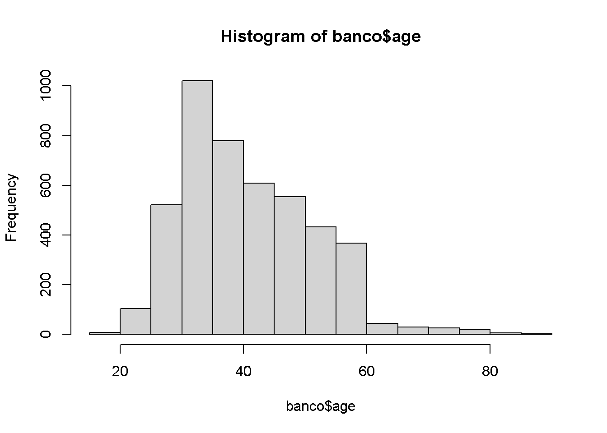

Nuestro histograma luce bastante bien para habernos costado tan poco trabajo crearlo, aunque puede mejorar su presentación.

Podemos agregar algunos argumentos a la función `hist()` para modificar ciertos parámetros gráficos. 

Vamos a cambiar el título del gráfico con el argumento `main`, y el nombre de los ejes X y Y con `xlab` y `ylab`, respectivamente.

Estos argumentos requiere una cadena de texto y pueden agregados también a gráficos generados con `plot()`.

```r
hist(x = banco$age, main = "Histograma de Edad", 
     xlab = "Edad", ylab = "Frecuencia")
```

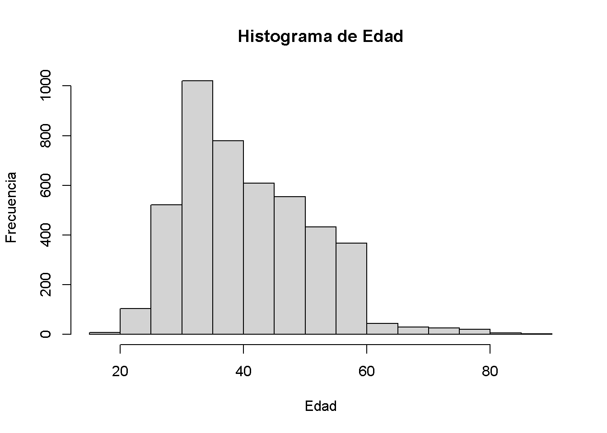

Probemos cambiando el color de las barras del histograma agregando el argumento `col`. Este argumento acepta nombres de colores genéricos en inglés como "red", "blue" o "purple"; y también acepta colores hexadecimales, como "#00FFFF", "#08001a" o "#1c48b5".

Puedes ver una lista de los nombres de colores válidos en R en el siguiente enlace:

* http://www.stat.columbia.edu/~tzheng/files/Rcolor.pdf

El tema de los colores hexadecimales sale del alcance de este libro, pero en el siguiente enlace encontrarás una *web app* para generar y elegir fácilmente colores de este tipo.

* https://www.w3schools.com/colors/colors_picker.asp

Probemos con columnas de color púrpura ("purple").

```r
hist(x = banco$age, main = "Histograma de Edad", 
     xlab = "Edad", ylab = "Frecuencia",
     col = "purple")
```

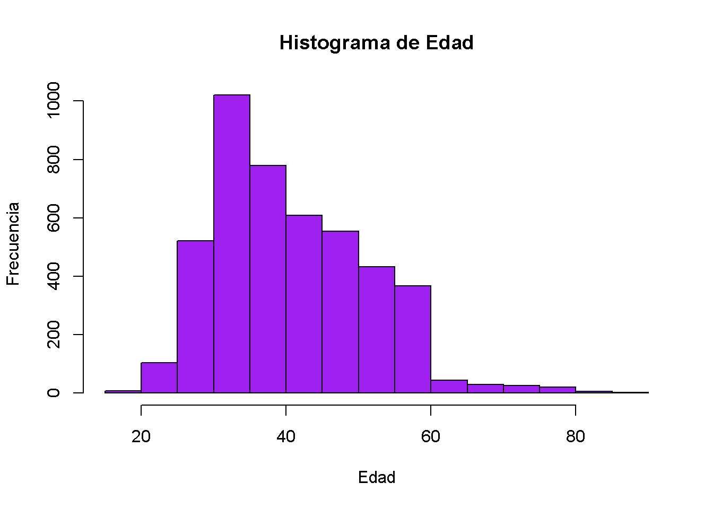

Nuestro histograma ya luce presentable.

Creamos ahora un histograma con los mismos argumentos, pero con los datos de la columna "duration", con barras de color marfil ("ivory") y los títulos apropiados.

```r
hist(x = banco$duration, main = "Histograma de Duration", 
     xlab = "Duration", ylab = "Frecuencia",
     col = "ivory")
```

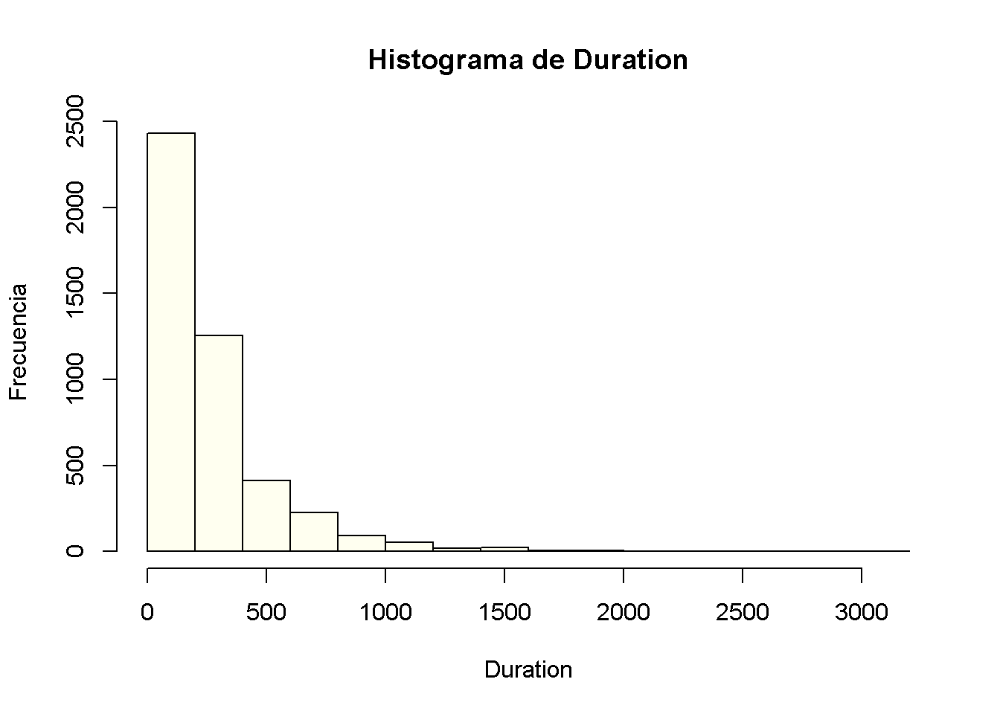

Como es usual, puedes consultar los demás argumentos de esta función llamando `?hist()`.

## Gráficas de barras
Este es quizás el tipo de gráfico mejor conocido de todos. Una gráfica de este tipo nos muestra la frecuencia con la que se han observado los datos de una variable discreta, con una barra para cada categoría de esta variable.

La función `plot()` puede generar gráficos de barra si damos como argumento `x` un vector de factor o cadena de texto, sin dar un argumento `y`.

Por ejemplo, creamos una gráfica de barras de la variable educación ("education") de `banco`

```r
#plot(x = banco$education)
```

Al igual que con los histogramas, obtenemos un resultado aceptable no obstante el esfuerzo mínimo que hemos hecho para generar nuestra gráfica de barras.

Podemos ajustar los parámetros gráficos con los argumentos `main`, `xlab`, `ylab` y `col`. En este caso, podemos darle a `col` un vector de colores, uno por barra, para que cada una sea distinta.

```r
#plot(x = banco$education, main = "Gráfica de Educacíón",
#     xlab = "Nivel educativo", ylab = "Frecuencia", 
#     col = c("royalblue", "seagreen", "purple", "grey"))
```

La combinación de colores puede mejorar, pero ya tenemos una gráfica de barras presentable.

Sin embargo, hay ocasiones en las que deseamos usar gráficas de barras para presentar proporciones, que deseamos barras apiladas. Para esos casos, usamos la función `barplot()`.

### La función `barplot()`
Además de usar `plot()`, podemos crear gráficas de barra con la función `barplot()`.

`barplot` pide como argumento una matriz, que represente una **tabla de contingencia** con los datos a graficar. Este tipo de tablas pueden ser generadas con la función `table()`.

`table()` pide como argumento uno o más vectores, de preferencia variables discretas. Si damos sólo un vector como argumento, devuelve un conteo, si damos dos o más variables, devuelve tablas de contingencia.

Por ejemplo, el conteo de la variable **education**,

```r
table(banco$education)
```

```
## 
##   primary secondary  tertiary   unknown 
##       678      2306      1350       187
```

Si damos como argumentos la variable **education** y la variable **loan** (préstamo), obtenemos una tabla de contingencia, que asignaremos al objeto `tab_banco`.

```r
tab_banco <- table(banco$loan, banco$education)

# Resultado
tab_banco
```

```
##      
##       primary secondary tertiary unknown
##   no      584      1890     1176     180
##   yes      94       416      174       7
```

Damos como argumento `tab_banco` a `barplot()` y nos devuelve una gráfica de barras apiladas.

```r
barplot(tab_banco)
```

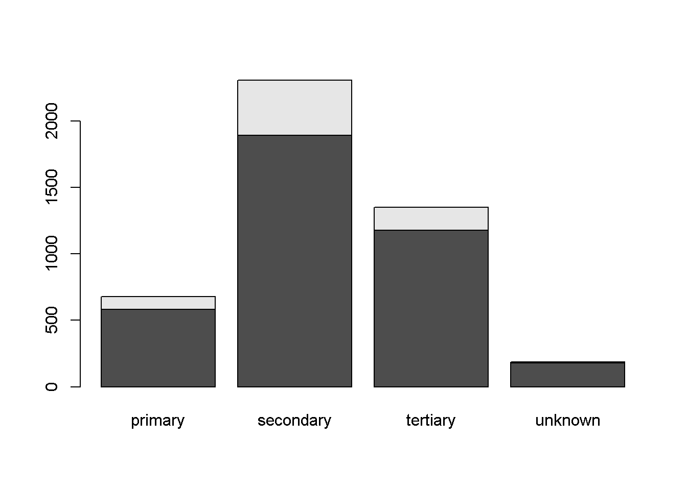

Si deseamos graficar proporciones en lugar de conteos, usamos la función `prop.table()`. 

Esta función nos pide como argumento una tabla de contingencia generada por `table()`. y un número para `margin`. El argumento `margin` es similar a `MARGIN` de `apply()` (como vimos en el [capítulo 10](###que-es-fun)). 

* Si damos como argumento 1, las proporciones se calcularán agrupadas por renglón. La suma de proporciones por renglón será igual a 1.
* Si damos como argumento 2, las proporciones se calcularán agrupadas por columna. La suma de proporciones por columna será igual a 1
* Si no damos ningún argumento, las proporciones se calcularán usando toda la tabla como grupo. La suma de proporciones de todas las celdas en la tabla será igual a 1.

Para ilustrar esto, veamos los tres casos para `margin` usando como argumento nuestro objeto `tab_banco`.

```r
# Proporción por renglón
prop.table(tab_banco, margin = 1)
```

```
##      
##          primary  secondary   tertiary    unknown
##   no  0.15248042 0.49347258 0.30704961 0.04699739
##   yes 0.13603473 0.60202605 0.25180897 0.01013025
```

```r
# Porporción por columna
prop.table(tab_banco, margin = 2)
```

```
##      
##          primary  secondary   tertiary    unknown
##   no  0.86135693 0.81960104 0.87111111 0.96256684
##   yes 0.13864307 0.18039896 0.12888889 0.03743316
```

```r
# Porporción por tabla
prop.table(tab_banco)
```

```
##      
##          primary  secondary   tertiary    unknown
##   no  0.12917496 0.41804910 0.26011944 0.03981420
##   yes 0.02079186 0.09201504 0.03848706 0.00154833
```

Nosotros queremos obtener las proporciones por columna, así que usaremos `margin = 2`.

```r
ptab_banco <- prop.table(tab_banco, margin = 2)
```

Damos el resultado de la operación anterior a `barplot()`.

```r
barplot(ptab_banco)
```

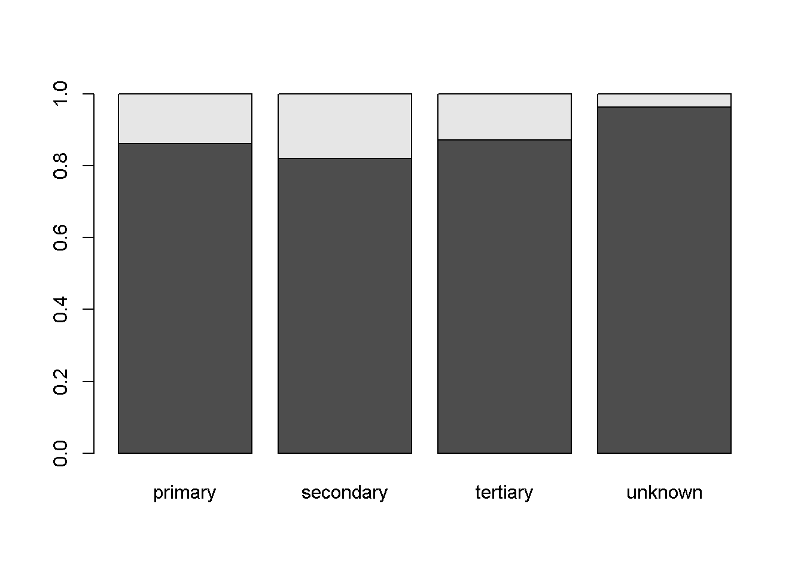

Hemos obtenido el resultado esperado, pero podemos mejorar la presentación. Nota que con barras apiladas el argumento `col` se puede usar para colorear las categorías al interior de las barras.

```r
barplot(ptab_banco,  main = "Préstamos por nivel educativo",
     xlab = "Nivel educativo", ylab = "Proporción", 
     col = c("royalblue", "grey"))
```

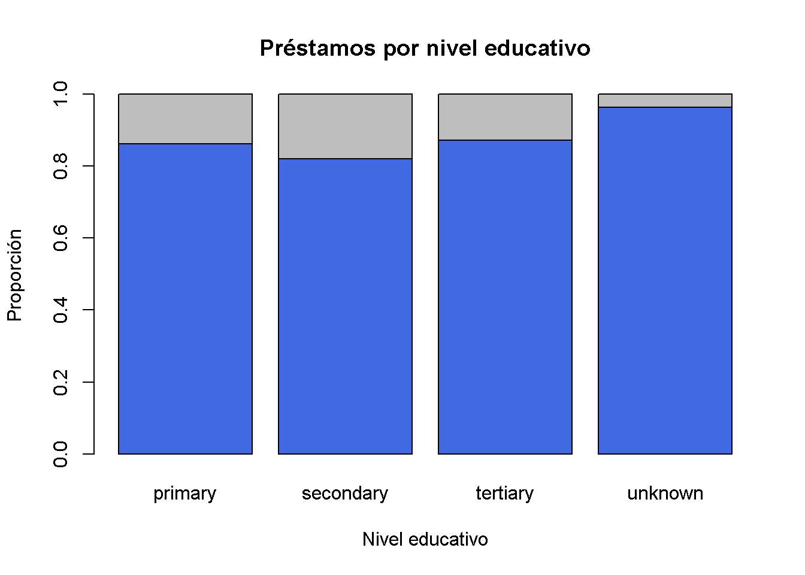

Luce bien, pero tenemos un problema: no sabemos qué representan las categorías en nuestras barras apiladas viendo solamente nuestra gráfica. 

Nosotros podemos consultar directamente con los datos, pero una persona que vea por primera vez esta gráfica no tendrá esa opción, reduciendo con ello su utilidad. 

Para solucionar este problema, usamos leyendas.

## Leyendas
Las leyendas son usadas para identificar con mayor claridad los distintos elementos en un gráfico, tales como colores y formas.

En R usamos la función `legend()` para generar leyendas. Esta función debe ser llamada después de crear un gráfico. En cierto modo es una anotación a un gráfico ya existente. `legend()` es una función relativamente compleja, así que sólo revisaremos lo esencial. 

`legend()` siempre nos pide siempre los siguientes argumentos.

* `legend`: Las etiquetas de los datos que queremos describir con la leyenda. Por ejemplo, si tenemos cuatro categorías a describir, proporcionamos un vector de cuatro cadenas de texto.
* `fill`: Los colores que acompañan a las etiquetas definidas con `legend`. Estos colores tienen que coincidir con los que hemos usado en el gráfico.
* `x` y `y`: Las coordenadas en pixeles, en las que estará ubicada la leyenda. Podemos dar como argumento a `x` alguno de los siguientes, para ubicar automáticamente la leyenda:  "bottomright", "bottom", "bottomleft", "left", "topleft", "top", "topright", "right", "center".
* `title`: Para poner título a la leyenda.

Además, tenemos muchos otros argumentos opcionales, que puedes consultar en la documentación  llamando `?legend()`.

Vamos a agregar una leyenda a la última gráfica de barras que creamos en la sección anterior de este capítulo.

Entonces necesitamos conocer las etiquetas que daremos como argumento `legend` y a qué colores corresponden al vector `banco$loan`.

Usamos la función `unique` para determinar cuántos valores únicos hay en este vector. Cada uno de estos valores corresponde a una etiqueta. Esta función, si la aplicamos a un vector de tipo factor, nos devuelve sus niveles.

```r
unique(banco$loan)
```

```
## [1] "no"  "yes"
```

Tenemos dos etiquetas, "no" y "yes" (no y sí, respectivamente), en ese orden, por lo que ese será nuestro argumento `legend`.

Nosotros determinamos los colores en la sección anterior como "royalblue" y "grey", en ese orden. Por lo tanto, tendremos que "no" será coloreado con "royalblue", y "yes" con "grey". como vamos a rellenar una barra, esto colores los daremos al argumento `fill`.

Por último, daremos como "topright" como argumento `x` para que nuestra leyenda se unique en la parte superior derecha de nuestro gráfico.

Aplicamos todo, incluido generar el gráfico al que agregaremos la leyenda.

```r
barplot(ptab_banco,  main = "Préstamos por nivel educativo",
     xlab = "Nivel educativo", ylab = "Proporción", 
     col = c("royalblue", "grey"))
legend(x = "topright", legend = c("No", "Yes"), fill = c("royalblue", "grey"), 
       title = "Loan")
```

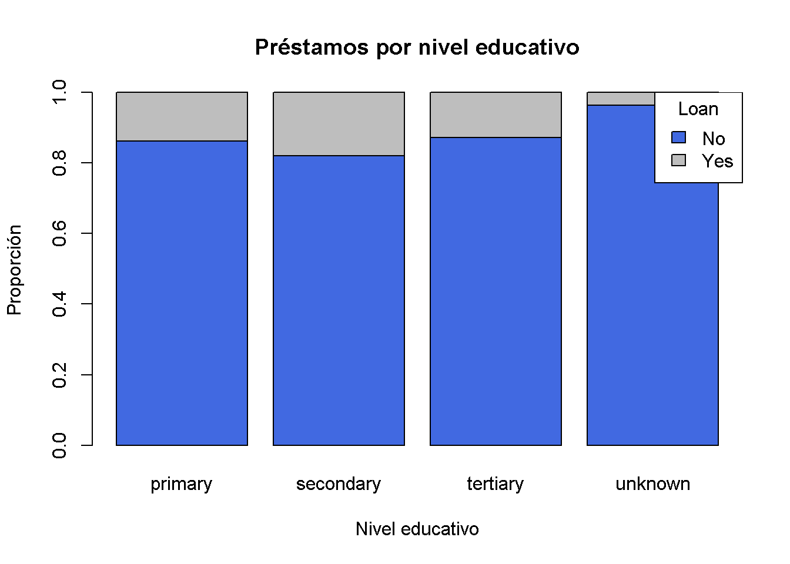

Se ve mucho más clara la información, pues ahora estamos mostrando a qué categoría corresponden los colores que hemos empleado en el gráfico.

En las secciones siguientes agregaremos leyendas a otros gráficos, con lo cual quedará un poco más claro el uso de `legend()`.

## Diagramas de dispersión
Este tipo de gráfico es usado para mostrar la relación entre dos variables numéricas continuas, usando puntos. Cada punto representa la intersección entre los valores de ambas variables.

Para generar un diagrama de dispersión, damos vectores numéricos como argumentos `x` y `y` a la función `plot()`.

Veamos la relación entre las variables **age** y **balance** de `banco`.

```r
plot(x = banco$age, y = banco$balance)
```

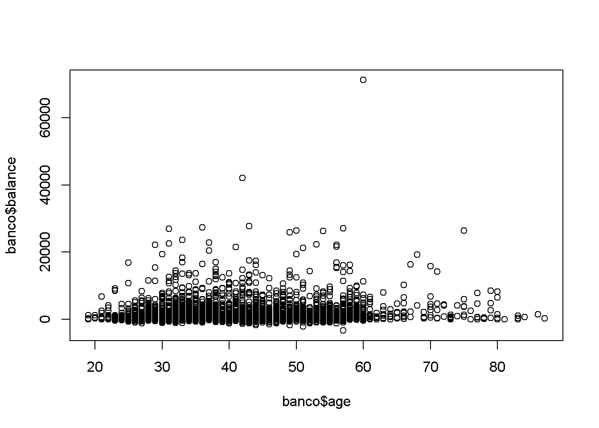

Tenemos algunos datos extremos tanto en **balance**. Para fines de tener una gráfica más informativa, vamos a recodificarlos usando `ifelse()`, cambiando todos los valores mayores a 15 000.

```r
banco$balance <- ifelse(banco$balance > 15000, 15000, banco$balance)
```


```r
plot(x = banco$age, y = banco$balance)
```

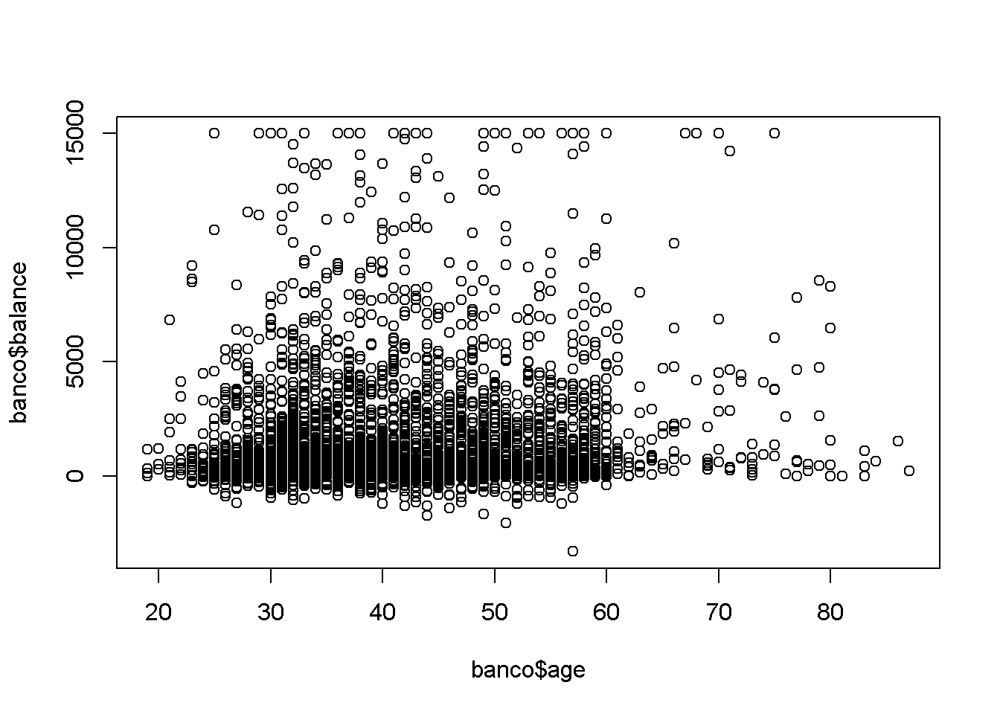

En los diagramas de dispersión, podemos usar el argumento `col` para camiar el color de los puntos usando como referencia una tercera variable.

La variable que usaremos será, de nuevo, **loan**

```r
# plot(x = banco$age, y = banco$balance, col= banco$loan)
```

Nos sería de utilidad una leyenda para interpretar más fácilmente los colores. 

Ya sabemos que los niveles de **loan** son "no" y "yes", además de que los colores han sido rojo y negro, así que agregar una leyenda será relativamente fácil.


```r
#plot(x = banco$age, y = banco$balance, col= banco$loan)
#legend(x = "topleft", legend = c("No", "Yes"), fill = c("Black", "Red"), title = "Loan")
```

Desafortunadamente esta gráfica no es muy informativa para nuestros datos. Por fortuna, podemos probar con un conjunto de datos diferente.

Si usamos diagramas de dispersión con `iris` obtendremos gráficos mucho más interesantes. 

Creamos un gráfico con las medidas de pétalo, aplicando lo que hemos visto para generar diagramas de dispersión.

```r
plot(x = iris$Petal.Length, y = iris$Petal.Width, col = iris$Species, 
     main = "Iris - Pétalo", xlab = "Largo", ylab = "Ancho")
legend(x = "topleft", legend = c("Setosa", "Versicolor", "Virginica"), 
       fill = c("black", "red", "green"), title = "Especie")
```

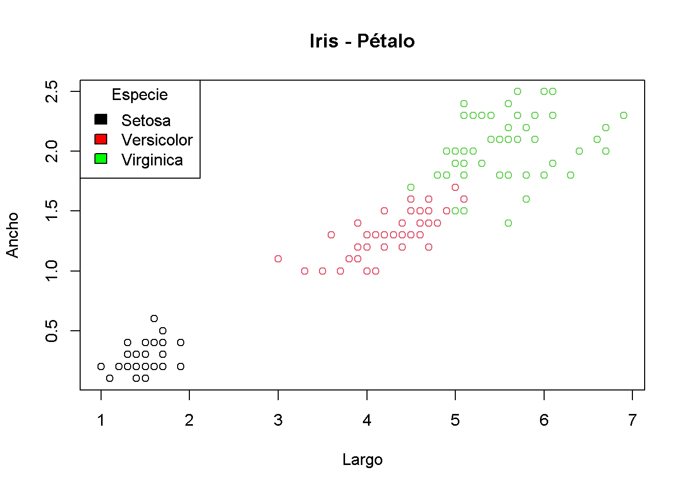

## Diagramas de caja
Los diagrama de caja, también conocidos como de caja y bigotes son gráficos que muestra la distribución de una variable usando cuartiles, de modo que de manera visual podemos inferir algunas cosas sobre su dispersión, ubicación y simetría.

Una gráfica de este tipo dibuja un rectángulo cruzado por una línea recta horizontal. Esta linea recta representa la mediana, el segundo cuartil, su base representa el primer cuartil y su parte superior el tercer cuartil. Al rango entre el primer y tercer cuartil se le conoce como intercuartílico (RIC). Esta es la caja.

Además, de la caja salen dos líneas. Una que llega hasta el mínimo valor de los datos en la variable o hasta el primer cuartil menos hasta 1.5 veces el RIC; y otra que llegar hasta el valor máximo de los datos o el tercer cuartil más hasta 1.5 veces el RIC. Estos son los bigotes.

Usamos la función `plot()` para crear este tipo de gráfico, dando como argumento `x` un vector de factor o cadena de texto, y como argumento `y` un vector numérico.

Una ventaja de este tipo de gráfico es que podemos comparar las distribución de una misma variable para diferentes grupos.

Vamos a ver cómo se distribuye la edad por nivel de educación en nuestro objeto `banco`, esto es, las variables **education** y  **age**.

```r
#plot(x = banco$education, y = banco$age)
```

Podemos ver que las personas con menor nivel educativo tienden a tener una edad mayor. La mayoría de las personas con educación primaria tienen entre 40 y 50 años, mientras que la mayoría con educación terciaria tiene entre 35 y 45 años, aproximadamente.

Por supuesto, podemos cambiar los parámetros gráficos a un diagrama de caja.

```r
#plot(x = banco$education, y = banco$age, main = "Edad por nivel educativo", 
#     xlab = "Nivel educativo", ylab = "Edad", 
 #    col = c("orange3", "yellow3", "green3", "grey"))
```

También podemos crear diagramas de caja con la función `boxplot()`.  Esta función puede generar diagramas de caja de dos maneras distintas.

En la primera manera, si damos como argumento `x` un vector numérico, nos dará un diagrama de caja de esa variable.

```r
boxplot(x = banco$age)
```

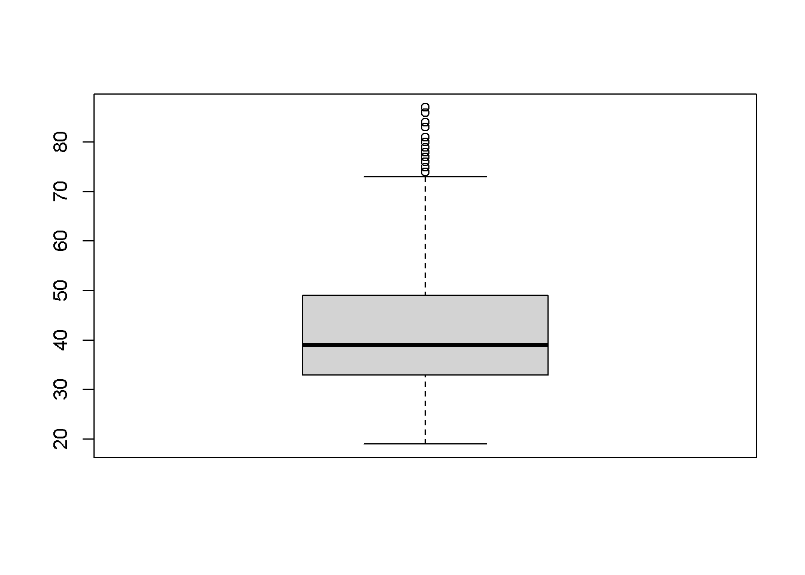

En la segunda manera necesitamos dar dos argumentos:

* `formula`: Para esta función las fórmulas tienen el formato `y ~ x`, donde x es el nombre de la variable continua a graficar, y la x es la variable que usaremos como agrupación.
* `data`: Es el data frame del que serán tomadas las variables.

Por ejemplo, para mostrar diagramas de caja por nivel educativo, nuestra variable y es **age** y nuestra variable x es **education**, por lo tanto, `formula` será `age ~ education`.

```r
boxplot(formula = age ~ education, data =  banco)
```

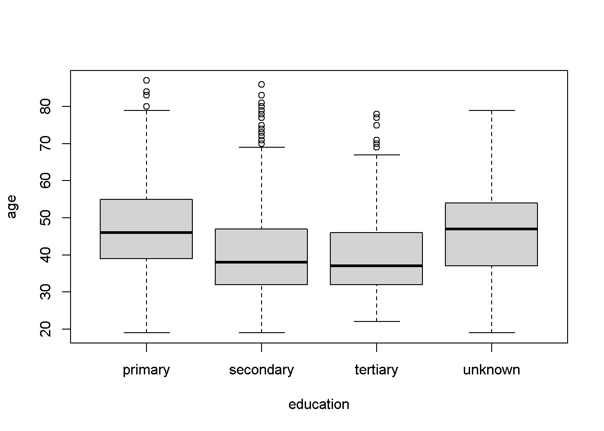


## Gráficos de mosaico
Los gráficos de mosaico o diagramas de Marimekko son usados para mostrar la relación entre dos variables discretas, ya sean factores o cadenas de texto.

Este tipo de gráfico recibe su nombre porque consiste en una cuadricula, en la que cada rectángulo representa el numero de casos que corresponden a un cruce específico de variables. Entre más casos se encuentren en ese cruce, más grande será el rectángulo.

Para obtener un gráfico de mosaico, damos como vectores de factor o cadena de texto como argumentos `x` y `y` a la función `plot()`.

Por ejemplo, intentemos graficar el estado marital con el nivel educativo de las personas en `banco`

```r
#plot(x = banco$marital, y = banco$education)
```

Podemos cambiar el color de los mosaicos con el argumento `col`. Debemos proporcionar un color por cada nivel del vector en el eje Y.

```r
#plot(x = banco$marital, y = banco$education, 
 #    col = c("#99cc99", "#cc9999", "#9999cc", "#9c9c9c"))
```

De esta manera es más claro que el grupo más numeroso de personas son las casadas con educación secundaria y el más pequeño, divorciadas con educación primaria.

## Exportar gráficos
Exportar los gráficos que hemos creado es un proceso que puede parecer un poco confuso.

Cuando llamamos una de estas funciones, le estamos indicando a R que "mande" nuestro gráfico a un **dispositivo gráfico** (*graphic device*) en nuestra computadora, donde podemos verlo, que por defecto es **una ventana en nuestro escritorio** o el panel **Plot** si estás usando *RStudio*.

Una consecuencia de esto es que si creas y lo mandas a un dispositivo gráfico en uso, el gráfico nuevo reemplazará al anterior. Por ejemplo, si usas `plot()` para crear un gráfico, se mostrará en una ventana de tu escritorio, pero si usas `plot()` de generar un gráfico distinto, el contenido de esta ventana será reemplazada con este nuevo gráfico. Lo mismo pasa con todos los dispositivos gráficos.

Además, los gráficos no pueden ser guardados en un objetos para después ser exportados. Es necesario mandar nuestros gráficos a un dispositivo como JPG, PNG o algún otro tipo de archivo que pueda ser almacenado en nuestro disco duro.

Para exportar un gráfico usamos alguna de las siguientes funciones, cada una corresponde con un tipo de archivo distinto. No son las únicas, pero son las más usadas. 

* `bpm()`
* `jpeg()`
* `pdf()`
* `png()`
* `tiff()`

Cada una de estas funciones tiene los siguientes argumentos tres argumentos principales.

* `filename`: El nombre y ruta del archivo de imagen a crear. Si no especificamos una ruta completa, entonces el el archivo será creado en nuestro directorio de trabajo.
* `width`: El **ancho** del archivo de imagen a crear, por defecto en pixeles.
* `height`: El **alto** del archivo de imagen a crear, por defecto en pixeles.

La manera de utilizar estas funciones llamándolas **antes** de llamar a una función que genere una gráfica. Al hacer esto, le indicamos a R que en lugar de mandar nuestro gráfico a una ventana del escritorio, lo mande a un dispositivo gráfico distinto.

Finalmente, llamamos a la función `dev.off()`, para cerrar el dispositivo gráfico que hemos elegido, de este modo se creará un archivo y podremos crear más gráficos después.

Por ejemplo, para exportar un gráfico con leyenda como un archivo PNG llamamos lo siguiente. Nota que tenemos que dar la misma extensión de archivo que la función que estamos llamando, en este caso **.png**.

```r
#png(filename = "loan_age.png", width = 800, height = 600)
#plot(x = banco$age, y = banco$duration, col = banco$loan, 
 #    main = "Edad y Duración", xlab = "Edad", ylab = "Duración")
#legend(x = "top", legend = c("No", "Yes"), fill = c("Black", "Red"), 
 #      title = "Loan")
#dev.off()
```

Si aparece un mensaje como el siguiente, es que hemos tenido éxito.

>null device 
          1 

Podemos ver el resultado usando `file.show()`.

```r
file.show("loan_age.png")
```

De esta manera podemos exportar cualquier tipo de gráfico generado con R.
