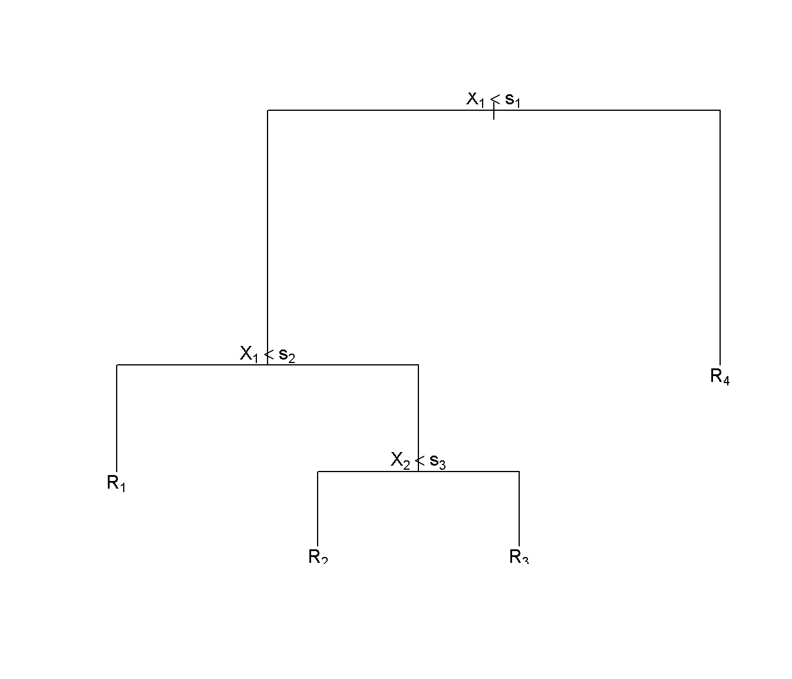
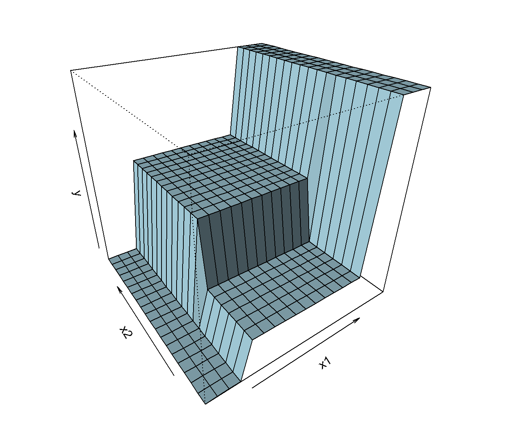

# Árboles de decisión {#trees}

Los *árboles de decisión* son uno de los métodos más simples y fáciles de interpretar para realizar predicciones en problemas de clasificación y de regresión. 
Se desarrollan a partir de los años 70 del siglo pasado como una alternativa versátil a los métodos clásicos de la estadística, fuertemente basados en las hipótesis de linealidad y de normalidad, y enseguida se convierten en una técnica básica del aprendizaje automático. 
Aunque su calidad predictiva es mediocre (especialmente en el caso de regresión), constituyen la base de otros métodos altamente competitivos (bagging, bosques aleatorios, boosting) en los que se combinan múltiples árboles para mejorar la predicción, pagando el precio, eso sí, de hacer más difícil la interpretación del modelo resultante.

La idea de este método consiste en la segmentación (partición) del *espacio predictor* (es decir, del conjunto de posibles valores de las variables predictoras) en regiones tan simples que el proceso se pueda representar mediante un árbol binario. 
Se parte de un nodo inicial que representa a toda la muestra (se utiliza la muestra de entrenamiento), del que salen dos ramas que dividen la muestra en dos subconjuntos, cada uno representado por un nuevo nodo. 
Este proceso se repite un número finito de veces hasta obtener las hojas del árbol, es decir, los nodos terminales, que son los que se utilizan para realizar la predicción.
Una vez construido el árbol, la predicción se realizará en cada nodo terminal utilizando, típicamente, la media en un problema de regresión y la moda en un problema de clasificación. 

<!-- 
Pendiente:
Incluir figuras en dos columnas? 
fig.cap="Izquierda: ejemplo de un árbol obtenido al realizar una partición binaria recursiva de un espacio bidimensional. Derecha: superficie de predicción correspondiente."
-->

Al final de este proceso iterativo el espacio predictor se ha particionado en regiones de forma rectangular en la que la predicción de la respuesta es constante. 
Si la relación entre las variables predictoras y la variable respuesta no se puede describir adecuadamente mediante rectángulos, la calidad predictiva del árbol será limitada. 
Como vemos, la simplicidad del modelo es su principal argumento, pero también su talón de Aquiles.

Como se ha dicho antes, cada nodo padre se divide, a través de dos ramas, en dos nodos hijos. 
Esto se hace seleccionando una variable predictora y dando respuesta a una pregunta dicotómica sobre ella.
Por ejemplo, ¿es el sueldo anual menor que 30000 euros?, o ¿es el género igual a *mujer*? 
Lo que se persigue con esta partición recursiva es que los nodos terminales sean homogéneos respecto a la variable respuesta $Y$. 

Por ejemplo, en un problema de clasificación, la homogeneidad de los nodos terminales significaría que en cada uno de ellos sólo hay elementos de una clase (categoría), y diríamos que los nodos son *puros*. 
En la práctica, esto siempre se puede conseguir construyendo árboles suficientemente profundos, con muchas hojas. 
Pero esta solución no es interesante, ya que va a dar lugar a un modelo excesivamente complejo y por tanto sobreajustado y de difícil interpretación. 
Será necesario encontrar un equilibrio entre la complejidad del árbol y la pureza de los nodos terminales.

En resumen:

- Métodos simples y fácilmente interpretables.

- Se representan mediante árboles binarios.

- Técnica clásica de apendizaje automático (computación).

- Válidos para regresión y para clasificación.

- Válidos para predictores numéricos y categóricos.

La metodología CART (Classification and Regresion Trees, Breiman *et al.*, 1984) es la más popular para la construcción de árboles de decisión y es la que se va a explicar con algo de detalle en las siguientes secciones. 

En primer lugar se tratarán los *árboles de regresión* (árboles de decisión en un problema de regresión, en el que la variable respuesta $Y$ es numérica) y después veremos los *arboles de clasificación* (respuesta categórica) que son los más utilizados en la práctica (los primeros se suelen emplear únicamente como métodos descriptivos o como base de métodos más complejos).
Las variables predictoras $\mathbf{X}=(X_1, X_2, \ldots, X_p)$ pueden ser tanto numéricas como categóricas.
Además, con la metodología CART, las variables explicativas podrían contener datos faltantes.
Se pueden establecer "particiones sustitutas" (*surrogate splits*), de forma que cuando falta un valor en una variable que determina una división, se usa una variable alternativa que produce una partición similar. 

## Árboles de regresión CART

Como ya se comentó, la construcción del modelo se hace a partir de la muestra de entrenamiento, y 
consiste en la partición del espacio predictor en $J$ regiones 
$R_1, R_2, \ldots, R_J$, para cada una de las cuales se va a calcular una constante: 
la media de la variable respuesta $Y$ para las observaciones de entranamiento que 
caen en la región. Estas constantes son las que se van a utilizar para 
la predicción de nuevas observaciones; para ello solo hay que comprobar cuál es 
la región que le corresponde.

La cuestión clave es cómo se elige la partición del espacio predictor, para lo 
que vamos a utilizar como criterio de error el RSS (suma de los residuos al cuadrado). 
Como hemos dicho, vamos a modelizar la respuesta en cada región como una constante, 
por tanto en la región $R_j$ nos interesa el 
$min_{c_j} \sum_{i\in R_j} (y_i - c_j)^2$, que se alcanza en la media de las 
respuestas $y_i$ (de la muestra de entrenamiento) en la región $R_j$, 
a la que llamaremos $\widehat y_{R_j}$.
Por tanto, se deben seleccionar las regiones $R_1, R_2, \ldots, R_J$ que minimicen 

$$RSS = \sum_{j=1}^{J} \sum_{i\in R_j} (y_i - \widehat y_{R_j})^2$$ 
(Obsérvese el abuso de notación $i\in R_j$, que significa las observaciones 
$i\in N$ que verifican $x_i \in R_j$).

Pero este problema es, en la práctica, intratable y vamos a tener que simplificarlo. 
El método CART busca un compromiso 
entre rendimiento, por una parte, y sencillez e interpretabilidad, por otra, y por ello 
en lugar de hacer una búsqueda por todas las particiones posibles sigue un proceso 
iterativo (recursivo) en el que va realizando cortes binarios. En la primera iteración 
se trabaja con todos los datos:

- Una variable explicativa $X_j$ y un punto de corte $s$ definen dos hiperplanos
$R_1 = \{ X \mid X_j \le s \}$ y $R_2 = \{ X \mid X_j > s \}$.

- Se seleccionan los valores de $j$ y $s$ que minimizen 

$$ \sum_{i\in R_1} (y_i - \widehat y_{R_1})^2 + \sum_{i\in R_2} (y_i - \widehat y_{R_2})^2$$

A diferencia del problema original, este se soluciona de forma muy rápida. A continuación 
se repite el proceso en cada una de las dos regiones $R_1$ y $R_2$, y así sucesivamente 
hasta alcanzar un criterio de parada.

Fijémonos en que este método hace dos concesiones importantes: no solo restringe la forma 
que pueden adoptar las particiones, sino que además sigue un criterio de error *greedy*: 
en cada iteración busca minimizar el RSS de las dos regiones resultantes, sin preocuparse 
del error que se va a cometer en iteraciones sucesivas. Y fijémonos también en que este 
proceso se puede representar en forma de árbol binario (en el sentido de que de cada nodo 
salen dos ramas, o ninguna cuando se llega al final), de ahí la terminología de *hacer 
crecer* el árbol.

¿Y cuándo paramos? Se puede parar cuando se alcance una profundidad máxima, aunque lo 
más habitual es, para dividir un nodo (es decir, una región), exigirle un número mínimo 
de observaciones.

- Si el árbol resultante es demasiado grande, va a ser un modelo demasiado complejo, 
por tanto va a ser difícil de interpretar y, sobre todo, 
va a provocar un sobreajuste de los datos. Cuando se evalúe el rendimiento utilizando 
la muestra de validación, los resultados van a ser malos. Dicho de otra manera, tendremos un 
modelo con poco sesgo pero con mucha varianza y en consecuencia inestable (pequeños 
cambios en los datos darán lugar a modelos muy distintos). Más adelante veremos que esto 
justifica la utilización del *bagging* como técnica para reducir la varianza.

- Si el árbol es demasiado pequeño, va a tener menos varianza (menos inestable) a costa 
de más sesgo. Más adelante veremos que esto justifica la utilización del *boosting*. Los 
árboles pequeños son más fáciles de interpretar ya que permiten identificar las variables 
explicativas que más influyen en la predicción.

Sin entrar por ahora en métodos combinados (métodos *ensemble*, tipo *bagging* o *boosting*), 
vamos a explicar cómo encontrar un equilibrio entre sesgo y varianza. Lo que se hace es 
construir un árbol grande para a continuación empezar a *podarlo*. Podar un árbol significa 
colapsar cualquier cantidad de sus nodos internos (no terminales), dando lugar a otro árbol más 
pequeño al que llamaremos *subárbol* del árbol original. Sabemos que el árbol completo es 
el que va a tener menor error si utilizamos la muestra de entrenamiento, pero lo que 
realmente nos interesa es encontrar el subárbol con un menor error al utilizar la muestra 
de validación. Lamentablemente, no es una buena estrategia el evaluar todos los subárboles: 
simplemente, hay demasiados. Lo que se hace es, mediante un 
hiperparámetro (*tuning parameter* o parámetro de ajuste) controlar el tamaño del árbol, 
es decir, la complejidad del modelo, seleccionando el subárbol *optimo* (para los datos 
de los que disponemos, claro). Veamos la idea.

Dado un subárbol $T$ con $R_1, R_2, \ldots, R_t$ nodos terminales, consideramos como 
medida del error el RSS más una penalización que depende de un hiperparámetro 
no negativo $\alpha \ge 0$

\begin{equation} 
RSS_{\alpha} = \sum_{j=1}^t \sum_{i\in R_j} (y_i - \widehat y_{R_j})^2 + \alpha t
(\#eq:rss-alpha)
\end{equation} 

Para cada valor del parámetro $\alpha$ existe un único subárbol *más pequeño* 
que minimiza este error (obsérvese que aunque hay un continuo de valores 
distinos de $\alpha$, sólo hay una cantidad finita de subárboles). 
Evidentemente, cuando $\alpha = 0$, ese subárbol será el árbol completo, algo que 
no nos interesa. Pero a medida que se incrementa $\alpha$ se penalizan los subárboles 
con muchos nodos terminales, dando lugar a una solución más pequeña. 
Encontrarla puede parecer muy costoso computacionalmente, pero lo 
cierto es que no lo es. El algoritmo consistente en ir colapsando nodos de forma 
sucesiva, de cada vez el nodo que produzca el menor incremento en el RSS (corregido por 
un factor que depende del tamaño), da 
lugar a una sucesión finita de subárboles que contiene, para todo $\alpha$, la 
solución.

Para finalizar, sólo resta seleccionar un valor de $\alpha$. 
Para ello, como se comentó en la Sección \@ref(entrenamiento-test), se podría dividir la muestra en tres subconjuntos: datos de entrenamiento, de validación y de test. 
Para cada valor del parámetro de complejidad $\alpha$ hemos utilizado la muestra de entrenamiento para obtener un árbol 
(en la jerga, para cada valor del hiperparámetro $\alpha$ se entrena un modelo). 
Se emplea la muestra independiente de validación para seleccionar el valor de $\alpha$ (y por tanto el árbol) con el que nos quedamos. 
Y por último emplearemos la muestra de test (independiente de las otras dos) para evaluar el rendimiento del árbol seleccionado. 
No obstante, lo más habitual para seleccionar el valor del hiperparámetro $\alpha$ es emplear validación cruzada (o otro tipo de remuestreo) en la muestra de entrenamiento en lugar de considerar una muestra adicional de validación.

Hay dos opciones muy utilizadas en la práctica para seleccionar el valor de $\alpha$: 
se puede utilizar directamente el valor que minimice el error; o se puede forzar 
que el modelo sea un poco más sencillo con la regla *one-standard-error*, que selecciona 
el árbol más pequeño que esté a una distancia de un error estándar del árbol obtenido 
mediante la opción anterior.

También es habitual escribir la Ecuación \@ref(eq:rss-alpha) reescalando el parámetro de complejidad como $\tilde \alpha = \alpha / RSS_0$, siendo $RSS_0 = \sum_{i=1}^{n} (y_i - \bar y)^2$ la variabilidad total (la suma de cuadrados residual del árbol sin divisiones):
$$RSS_{\tilde \alpha}=RSS + \tilde \alpha RSS_0 t$$

De esta forma se podría interpretar el hiperparámetro $\tilde \alpha$ como una penalización en la proporción de variabilidad explicada, ya que dividiendo la expresión anterior por $RSS_0$ obtendríamos:
$$R^2_{\tilde \alpha}=R^2+ \tilde \alpha  t$$

## Árboles de clasificación CART

En un problema de clasificación la variable respuesta puede tomar los valores 
$1, 2, \ldots, K$, etiquetas que identifican las $K$ categorías del problema. 
Una vez construido el árbol, se comprueba cuál es la categoría modal de cada 
región: considerando la muestra de entrenamiento, la categoría más frecuente. 
Dada una observación, se predice que pertenece a la categoría modal de la 
región a la que pertenece.

El resto del proceso es idéntico al de los árboles de regresión ya explicado, 
con una única salvedad: no podemos utilizar RSS como medida del error. Es 
necesario buscar una medida del error adaptada a este contexto. 
Fijada una región, vamos a denotar por 
$\widehat p_{k}$, con $k = 1, 2, \ldots, K$, a la proporción de observaciones 
(de la muestra de entrenamiento) en la región que pertenecen a la categoría $k$. 
Se utilizan tres medidas distintas del error en la región:

- Proporción de errores de clasificación:
    $$1 - max_{k} (\widehat p_{k})$$

- Índice de Gini:
    $$\sum_{k=1}^K \widehat p_{k} (1 - \widehat p_{k})$$

- Entropía^[La entropía es un concepto básico de la teoría de la información (Shannon, 1948) y se mide en *bits* (cuando en la definición se utilizan $log_2$).] (*cross-entropy*):
    $$- \sum_{k=1}^K \widehat p_{k} \text{log}(\widehat p_{k})$$

Aunque la proporción de errores de clasificación es la medida del error más intuitiva, en la práctica sólo se utiliza para la fase de poda. Fijémonos que en el cálculo de esta medida sólo interviene $max_{k} (\widehat p_{k})$, mientras que en las medidas alternativas intervienen las proporciones $\widehat p_{k}$ de todas las categorías. Para la fase de crecimiento se utilizan indistintamente el índice de Gini o la entropía. Cuando nos interesa el error no en una única región sino en varias (al romper un nodo en dos, o al considerar todos los nodos terminales), se suman los errores de cada región previa ponderación por el número de observaciones que hay en cada una de ellas.

En la introducción de este tema se comentó que los árboles de decisión admiten tanto variables predictoras numéricas como categóricas, y esto es cierto tanto para árboles de regresión como para árboles de clasificación. Veamos brevemente como se tratarían los predictores categóricos a la hora de incorporarlos al árbol. El problema radica en qué se entiende por hacer un corte si las categorías del predictor no están ordenadas. Hay dos soluciones básicas:

- Definir variables predictoras *dummy*. Se trata de variables indicadoras, una por cada una de las categorías que tiene el predictor. Este criterio de *uno contra todos* tiene la ventaja de que estas variables son fácilmente interpretables, pero tiene el inconveniente de que puede aumentar mucho el número de variables predictoras.

- Ordenar las categorías de la variable predictora. Lo ideal sería considerar todas las ordenaciones posibles, pero eso es desde luego poco práctico: el incremento es factorial. El truco consiste en utilizar un único órden basado en algún criterio *greedy*. Por ejemplo, si la variable respuesta $Y$ también es categórica, se puede seleccionar una de sus categorías que resulte especialmente interesante y ordenar las categorías del predictor según su proporción en la categoría de $Y$. Este enfoque no añade complejidad al modelo, pero puede dar lugar a resultados de difícil interpretación.

## CART con el paquete `rpart`

La metodología CART está implementada en el paquete [`rpart`](https://CRAN.R-project.org/package=rpart) 
(Recursive PARTitioning)^[El paquete [`tree`](https://CRAN.R-project.org/package=tree) es una traducción del original en S.]. 
La función principal es `rpart()` y habitualmente se emplea de la forma:

`rpart(formula, data, method, parms, control, ...)`  

* `formula`: permite especificar la respuesta y las variables predictoras de la forma habitual, 
  se suele establecer de la forma `respuesta ~ .` para incluir todas las posibles variables explicativas.
  
* `data`: `data.frame` (opcional; donde se evaluará la fórmula) con la muestra de entrenamiento.

* `method`: método empleado para realizar las particiones, puede ser `"anova"` (regresión), `"class"` (clasificación), 
  `"poisson"` (regresión de Poisson) o `"exp"` (supervivencia), o alternativamente una lista de funciones (con componentes 
  `init`, `split`, `eval`; ver la vignette [*User Written Split Functions*](https://cran.r-project.org/web/packages/rpart/vignettes/usercode.pdf)). 
  Por defecto se selecciona a partir de la variable respuesta en `formula`, 
  por ejemplo si es un factor (lo recomendado en clasificación) emplea `method = "class"`.

* `parms`: lista de parámetros opcionales para la partición en el caso de clasificación 
  (o regresión de Poisson). Puede contener los componentes `prior` (vector de probabilidades previas; 
  por defecto las frecuencias observadas), `loss` (matriz de pérdidas; con ceros en la diagonal y por defecto 1 en el resto) 
  y `split` (criterio de error; por defecto `"gini"` o alternativamente `"information"`).
  
* `control`: lista de opciones que controlan el algoritmo de partición, por defecto se seleccionan mediante la función `rpart.control`, 
  aunque también se pueden establecer en la llamada a la función principal, y los principales parámetros son:
  
    `rpart.control(minsplit = 20, minbucket = round(minsplit/3), cp = 0.01, xval = 10, maxdepth = 30, ...)`
  
    - `cp` es el parámetro de complejidad $\tilde \alpha$ para la poda del árbol, de forma que un valor de 1 se corresponde con un árbol sin divisiones y un valor de 0 con un árbol de profundidad máxima. 
      Adicionalmente, para reducir el tiempo de computación, el algoritmo empleado no realiza una partición si la proporción de reducción del error es inferior a este valor (valores más grandes simplifican el modelo y reducen el tiempo de computación).
      
    - `maxdepth` es la profundidad máxima del árbol (la profundidad de la raíz sería 0).
    
    - `minsplit` y `minbucket` son, respectivamente, los números mínimos de observaciones en un nodo intermedio para particionarlo 
      y en un nodo terminal.
    
    - `xval` es el número de grupos (folds) para validación cruzada.

Para más detalles consultar la documentación de esta función o la vignette [*Introduction to Rpart*](https://cran.r-project.org/web/packages/rpart/vignettes/longintro.pdf).

### Ejemplo: regresión

Emplearemos el conjunto de datos *winequality.RData* (ver Cortez et al., 2009), que contiene información fisico-química 
(`fixed.acidity`, `volatile.acidity`, `citric.acid`, `residual.sugar`, `chlorides`, `free.sulfur.dioxide`, 
`total.sulfur.dioxide`, `density`, `pH`, `sulphates` y `alcohol`) y sensorial (`quality`) 
de una muestra de 1250 vinos portugueses de la variedad *Vinho Verde*.
Como respuesta consideraremos la variable `quality`, mediana de al menos 3 evaluaciones de la calidad del vino 
realizadas por expertos, que los evaluaron entre 0 (muy malo) y 10 (muy excelente).

