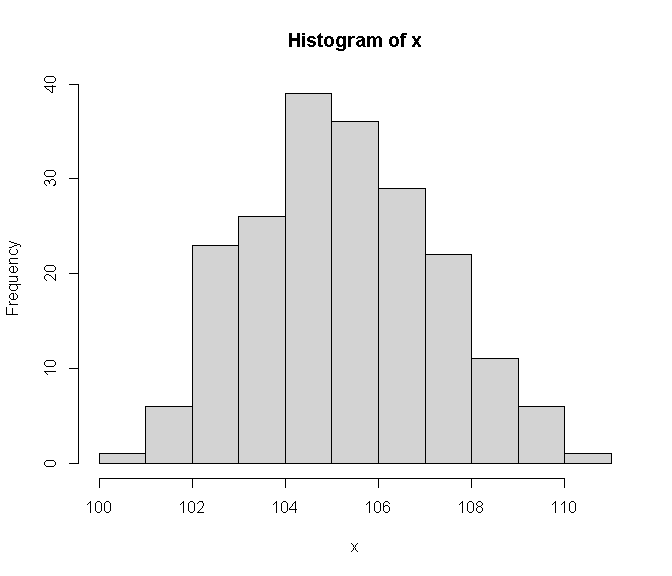
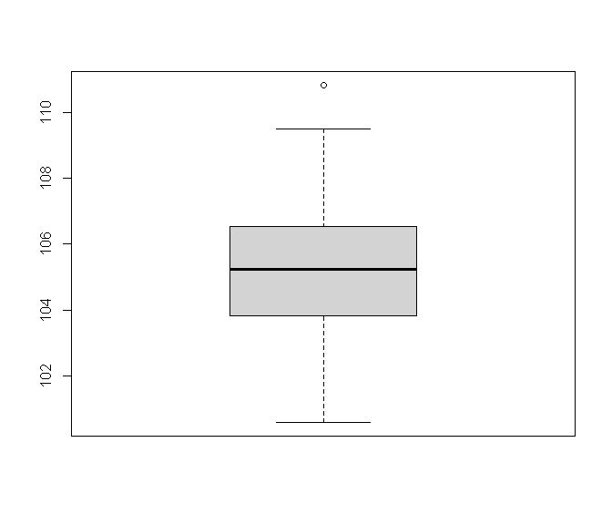
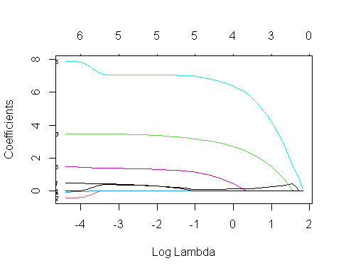
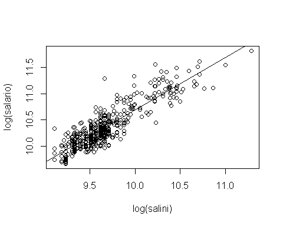

# Prefacio {-}


<center></center>


<center></center>
<br><center></center>
<br><center><a href="https://www.jeshuanomics.com/" target="blank">Publicado por Jeshua Romero Guadarrama en colaboración con JeshuaNomics:</a></center>
<br><center><a href="https://github.com/JeshuaNomics" class="fa fa-github"><span class="label">  Git Hub</span></a>
<a href="https://www.facebook.com/JeshuaNomics/" class="fa fa-facebook"><span class="label">  Facebook</span></a>
<a href="https://twitter.com/JeshuaNomics" class="fa fa-twitter"><span class="label">  Twitter</span></a>
<a href="https://www.linkedin.com/in/jeshua-romero-guadarrama/" class="fa fa-linkedin"><span class="label">  Linkedin</span></a>
<a href="https://vk.com/jeshuanomics" class="fa fa-vk"><span class="label">  Vkontakte</span></a>
<a href="https://jeshuanomics.tumblr.com/" class="fa fa-tumblr"><span class="label">  Tumblr</span></a>
<a href="https://www.youtube.com/channel/UCY7f84mJGvMN7TF7XI4-Jgg?view_as=subscriber/" class="fa fa-youtube-play"><span class="label">  YouTube</span></a>
<a href="https://www.instagram.com/JeshuaNomics/" class="fa fa-instagram"><span class="label">  Instagram</span></a></center>

<br> Jeshua Romero Guadarrama es economista y actuario por la <a href="http://www.economia.unam.mx/">Universidad Nacional Autónoma de México</a>, quien ha construido el presente proyecto en colaboración con <a href="https://www.jeshuanomics.com">JeshuaNomics</a>, ubicado en la Ciudad de México, se puede contactar mediante el siguiente correo electrónico: jeshuanomics@gmail.com.
<br>
<br> Última actualización el sábado 07 del 08 de 2021
<br>


Los estudiantes con poca experiencia en el análisis avanzado de estadísticas a menudo tienen dificultades para entender los beneficios de desarrollar habilidades de programación al momento de aplicar diversos métodos descriptivos e inferenciales. <i>Análisis estadístico con R para principiantes</i> por Jeshua Romero Guadarrama (2021), ofrece una introducción interactiva a los aspectos esenciales de la programación por medio del lenguaje y software estadístico R, así como una guía para la aplicación de la teoría económica y econométrica en entornos específicos. En otras palabras, el objetivo es que los estudiantes se adentren al mundo de la economía aplicada mediante ejemplos empíricos presentados en la vida diaria y haciendo uso de las habilidades de programación recién adquiridas. Dicho objetivo se encuentra respaldado por ejercicios de programación interactivos y la incorporación de visualizaciones dinámicas de conceptos fundamentales mediante la flexibilidad de JavaScript, a través de la biblioteca D3.js.

En los últimos años, el lenguaje de programación estadística R se ha convertido en una parte integral del plan de estudios de las clases de estadística que se imparten en las universidades. Regularmente una gran parte de los estudiantes no han estado expuestos a ningún lenguaje de programación antes y, por lo tanto, tienen dificultades para participar en el aprendizaje de R por sí mismos. Con poca experiencia en el análisis avanzado de estadísticas, es natural que los novicios tengan dificultades para comprender los beneficios de desarrollar habilidades en R para aprender y aplicar la estadística. Estos incluyen particularmente la capacidad de realizar, documentar y comunicar estudios empíricos y tener las facilidades para programar estudios de simulación, lo cual es útil para, por ejemplo, comprender y validar teoremas que generalmente no se asimilan o entienden fácilmente con el estudio de las fórmulas. Al ser un economistas aplicado y econometrista, me gustaría que mis colegas desarrollen capacidades de gran valor; en consecuencia, deseo compartir con las nuevas generaciones de economistas mis conocimientos.

En lugar de confrontar a los estudiantes con ejercicios de codificación puros y literatura clásica complementaria, he pensado que sería mejor proporcionar material de aprendizaje interactivo que combine el código en R con el contenido del curso de texto *Introducción a la Econometría* de @stock2015 que sirve de base para el presente material. El presente trabajo es un complemento empírico interactivo al estilo de un informe de investigación reproducible que permite a los estudiantes no solo aprender cómo los resultados de los estudios de casos se pueden replicar con R, sino que también fortalece su capacidad para utilizar las habilidades recién adquiridas en otras aplicaciones empíricas.

#### Las convenciones usadas en el presente curso {-}

+ El texto *en cursiva* indica nuevos términos, nombres, botones y similares.

+ El texto **en negrita** se usa generalmente en párrafos para referirse al código **R**. Esto incluye comandos, variables, funciones, tipos de datos, bases de datos y nombres de archivos.

+ <code>Texto de ancho constante sobre fondo gris</code> indica un código **R** que usted puede escribir literalmente. Puede aparecer en párrafos para una mejor distinción entre declaraciones de código ejecutables y no ejecutables, pero se encontrará principalmente en forma de grandes bloques de código **R**. Estos bloques se denominan fragmentos de código.

#### Reconocimiento {-}

A mi alma máter: Universidad Nacional Autónoma de México (Facultad de Economía y Facultad de Ciencias). Por brindarme valiosas oportunidades que coadyuvaron a mi formación.


## Contenido {-}

- Introducción
- Sobre este curso
- Similitud con este curso Otro para principiantes
- Lo que puede omitir con seguridad
- Supuestos tontos
- Cómo está organizado este curso
    + Parte I: Introducción al análisis estadístico con **R**
    + Parte II: Descripción de datos
    + Parte III: Sacar conclusiones a partir de los datos
    + Parte IV: Trabajar con probabilidad
    + Parte V: La parte de diez
    + Apéndice A en línea: Más sobre probabilidad
    + Apéndice B en línea: Estadísticas no paramétricas
    + Apéndice C en línea: Diez temas que simplemente no encajan en ningún otro capítulo
- Iconos utilizados en este curso
- A dónde ir desde aquí

## Índice de contenido {-}

Parte I: Introducción al análisis estadístico con **R**

1. Datos, estadísticas y decisiones
    - Las nociones estadísticas (y relacionadas) que solo debe conocer
        + Muestras y poblaciones
        + Variables: dependientes e independientes
        + Tipos de datos
        + Un poco de probabilidad
    - Estadística inferencial: probando hipótesis
        + Hipótesis nulas y alternativas
        + Dos tipos de error

2. **R**: Qué hace y cómo lo hace
    - Descargando **R** y **RStudio**
    - Una sesión con **R**
        + El directorio de trabajo
        + Así que comencemos, ya
        + Datos faltantes
    - Funciones **R**
    - Funciones definidas por el usuario
    - comentarios
    - **R** Estructuras
        + Vectores
        + Vectores numéricos
        + Matrices
        + Factores
        + Listas
        + Listas y estadísticas
        + Marcos de datos
    - Paquetes
    - Más paquetes
    - **R** Fórmulas
    - Leyendo y escribiendo
        + Hojas de cálculo
        + Archivos CSV
        + Archivos de texto

Parte II: Descripción de datos

3. Obtención de gráficos
    - Encontrar patrones
        + Graficar una distribución
        + Salto de bares
        + Rebanar el pastel
        + La trama de dispersión
        + De cajas y bigotes
    - Gráficos básicos **R**
        + Histogramas
        + Añadiendo características gráficas
        + Parcelas de barras
        + Gráficos circulares
        + Gráficos de puntos
        + Parcelas de barras revisitadas
        + Diagramas de dispersión
        + Diagramas de caja
    - Graduarse a ggplot2
        + Histogramas
        + Parcelas de barras
        + Gráficos de puntos
        + Parcelas de barras revisitadas
        + Diagramas de dispersión
        + Diagramas de caja
    - Terminando

4. Encontrar su centro
    - Medios: el atractivo de los promedios
    - El promedio en **R**: mean()
        + ¿Cuál es tu condición?
        + Eliminar $-signos con with()
        + Explorando los datos
        + Valores atípicos: el defecto de los promedios
        + Otros medios para un fin
    - Medianas: atrapadas en el medio
    - La mediana en **R**: median()
    - Estadísticas à la Mode
    - El modo en **R**

5. Desviarse del promedio
    - Medición de la variación
        + Desviaciones cuadradas promedio: varianza y cómo calcularla
        + Varianza de la muestra
        + Varianza en **R**
    - Regreso a las raíces: desviación estándar
        + Desviación estándar de la población
        + Desviación estándar de la muestra
    - Desviación estándar en **R**
    - Condiciones, condiciones, condiciones

6. Cumplimiento de estándares y posiciones
    - Atrapando algunas Z
        + Características de las puntuaciones z
        + Bonos versus Bambino
        + Puntajes de exámenes
    - Puntuaciones estándar en **R**
    - ¿Cuál es tu posición?
        + Clasificación en **R**
        + Puntuaciones empatadas
        + Nth más pequeño, Nth más grande
        + Percentiles
        + Rangos de porcentaje
    - Resumiendo

7. Resumiendo todo
    - ¿Cuántos?
    - Lo alto y lo bajo
    - Viviendo en los momentos
        + Un momento de enseñanza
        + Volver a descriptivos
        + Asimetría
        + Curtosis
    - Sintonización de la frecuencia
        + Variables nominales: table() et al
        + Variables numéricas: hist()
        + Variables numéricas: stem()
    - Resumiendo un marco de datos

8. ¿Qué es normal?
    - Golpear la curva
        + Profundizando
        + Parámetros de una distribución normal
    - Trabajar con distribuciones normales
        + Distribuciones en **R**
        + Función de densidad normal
        + Función de densidad acumulativa
        + Cuantiles de distribuciones normales
        + Muestreo aleatorio
    - Un miembro distinguido de la familia

Parte III: Sacar conclusiones a partir de los datos

9. El juego de la confianza: estimación
    - Comprensión de las distribuciones de muestreo
    - Una idea EXTREMADAMENTE importante: el teorema del límite central
        + (Aproximadamente) Simulando el teorema del límite central
        + Predicciones del teorema del límite central
    - Confianza: ¡tiene sus límites!
        + Encontrar límites de confianza para una media
    - Encajar en una t

10. Prueba de hipótesis de una muestra
    - Hipótesis, pruebas y errores
    - Pruebas de hipótesis y distribuciones muestrales
    - Coger algo de Z de nuevo
    - Prueba Z en **R**
    - t para uno
    - t Prueba en **R**
    - Trabajar con distribuciones t
    - Visualización de distribuciones t
        + Trazado de t en gráficos **R** base
        + Trazando t en ggplot2
        + Una cosa más sobre ggplot2
    - Probando una varianza
        + Pruebas en **R**
    - Trabajar con distribuciones de chi-cuadrado
    - Visualización de distribuciones de chi-cuadrado
        + Trazado de chi-cuadrado en gráficos **R** base
        + Trazar chi-cuadrado en ggplot2

11. Prueba de hipótesis de dos muestras
    - Hipótesis construidas para dos
    - Distribuciones de muestreo revisadas
        + Aplicación del teorema del límite central
        + Z una vez más
        + Prueba Z para dos muestras en **R**
    - t para dos
    - Como guisantes en una vaina: variaciones iguales
    - Prueba t en **R**
        + Trabajando con dos vectores
        + Trabajar con un marco de datos y una fórmula
        + Visualizando los resultados
        + Como p y q: varianzas desiguales
    - Un conjunto emparejado: prueba de hipótesis para muestras emparejadas
    - Prueba t de muestras pareadas en **R**
    - Prueba de dos variaciones
        + Prueba F en **R**
        + F junto con t
    - Trabajar con distribuciones F
    - Visualización de distribuciones F

12. Prueba de más de dos muestras
    - Probando más de dos
        + Un problema espinoso
        + Una solución
        + Relaciones significativas
    - ANOVA en **R**
        + Visualizando los resultados
        + Después del ANOVA
        + Contrastes en **R**
        + Comparaciones no planificadas
    - Otro tipo de hipótesis, otro tipo de prueba
        + Trabajo con ANOVA de medidas repetidas
        + ANOVA de medidas repetidas en **R**
        + Visualizando los resultados
    - Ponerse de moda
    - Análisis de tendencias en **R**

13. Pruebas más complicadas
    - Rompiendo las combinaciones
        + Interacciones
        + El análisis
    - ANOVA bidireccional en **R**
        + Visualización de los resultados bidireccionales
    - Dos tipos de variables. . . En seguida
        + ANOVA mixto en **R**
        + Visualización de los resultados de ANOVA mixtos
    - Después del análisis
    - Análisis multivariado de varianza
        + MANOVA en **R**
        + Visualización de los resultados de MANOVA
        + Después del análisis

14. Regresión: modelo lineal, múltiple y lineal general
    - La trama de la dispersión
    - Graficar líneas
    - Regresión: ¡Qué línea!
        + Uso de regresión para pronosticar
        + Variación alrededor de la línea de regresión
        + Prueba de hipótesis sobre regresión
    - Regresión lineal en **R**
        + Características del modelo lineal
        + Haciendo predicciones
        + Visualización del diagrama de dispersión y la línea de regresión
        + Graficando los residuales
    - Hacer malabares con muchas relaciones a la vez: regresión múltiple
        + Regresión múltiple en **R**
        + Haciendo predicciones
        + Visualización del diagrama de dispersión 3D y el plano de regresión
    - ANOVA: otra mirada
    - Análisis de covarianza: el componente final del GLM
        + Pero espera, hay más

15. Correlación: el auge y la caída de las relaciones
    - Parcelas de dispersión de nuevo
    - Comprensión de la correlación
    - Correlación y regresión
    - Prueba de hipótesis sobre la correlación
        + ¿Un coeficiente de correlación es mayor que cero?
        + ¿Se diferencian dos coeficientes de correlación?
    - Correlación en **R**
        + Calcular un coeficiente de correlación
        + Prueba de un coeficiente de correlación
        + Prueba de la diferencia entre dos coeficientes de correlación
        + Calcular una matriz de correlación
        + Visualización de matrices de correlación
    - Correlación múltiple
        + Correlación múltiple en **R**
        + Ajuste de R-cuadrado
    - Correlación parcial
    - Correlación parcial en **R**
    - Correlación semiparcial
    - Correlación semiparcial en **R**

16. Regresión curvilínea: cuando las relaciones se complican
    - ¿Qué es un logaritmo?
    - ¿Qué es e?
    - Regresión de potencia
    - Regresión exponencial
    - Regresión logarítmica
    - Regresión polinomial: un poder superior
    - ¿Qué modelo debería utilizar?

Parte IV: Trabajar con probabilidad

17. Introducción a la probabilidad
    - ¿Qué es la probabilidad?
        + Experimentos, ensayos, eventos y espacios de muestra
        + Espacios muestrales y probabilidad
    - Eventos compuestos
        + Unión e intersección
        + Intersección de nuevo
    - La probabilidad condicional
        + Trabajando con las probabilidades
        + La base de la prueba de hipótesis
    - Grandes espacios de muestra
        + Permutaciones
        + Combinaciones
    - **R** Funciones para contar reglas
    - Variables aleatorias: discretas y continuas
    - Distribuciones de probabilidad y funciones de densidad
    - La distribución binomial
    - El binomio binomial y el binomio negativo en **R**
        + Distribución binomial
        + Distribución binomial negativa
    - Prueba de hipótesis con la distribución binomial
    - Más sobre pruebas de hipótesis: **R** versus tradición

18. Introducción al modelado
    - Modelado de una distribución
        + Sumergirse en la distribución de Poisson
        + Modelado con la distribución de Poisson
        + Probando el ajuste del modelo
        + Un comentario sobre chisq.test()
        + Jugando a la pelota con un modelo
    - Una discusión simulada
        + Arriesgarse: el método Monte Carlo
        + Cargando los dados
        + Simulando el teorema del límite central

Parte V: La parte de diez

19. Diez consejos para emigrados de Excel
    - Definir un vector en **R** es como nombrar un rango en Excel
    - Operar en vectores es como operar en rangos con nombre
    - A veces, las funciones estadísticas funcionan de la misma manera
    - Y a veces no
    - Contraste: Excel y **R** funcionan con diferentes formatos de datos
    - Las funciones de distribución son (algo) similares
    - Un marco de datos es (algo) como un rango con nombre de varias columnas
    - La función sapply() es como arrastrar
    - Usar edit() es (casi) como editar una hoja de cálculo
    - Utilice el portapapeles para importar una tabla de Excel a **R**

20. Diez valiosos recursos **R** en línea
    - Sitios web para usuarios **R**
        + **R** - blogueros
        + Red de aplicaciones de Microsoft **R**
        + Rápido - **R**
        + **RStudio** Aprendizaje en línea
        + Desbordamiento de pila
    - Libros y documentación en línea
        + **R** manuales
        + Documentación **R**
        + **RDocumentación**
        + USTED PUEDE analizar
        + El diario **R**

<!--chapter:end:index.Rmd-->

# Introducción: ¿Qué es R y para qué es usado?

R es un lenguaje de programación y entorno computacional dedicado a la estadística. 

Decimos que es un lenguaje de programación porque nos permite dar instrucciones, usando código, a nuestros equipos de cómputo para que realicen tareas específicas (además de que es Turing Completo, pero profundizaremos en ello); para ello sólo necesitamos un intérprete para este código y es a esto a lo que llamamos un entorno computacional. 

Cuando instalamos R en nuestra computadora en realidad lo que estamos instalando es el entorno computacional, y para que podamos hacer algo en ese entorno necesitamos conocer la manera de escribir instrucciones que el software pueda interpretar y ejecutar. Eso es lo que aprenderemos a hacer en este curso.

R es diferente a otros lenguajes de programación que por lo general están diseñados para realizar muchas tareas diferentes; esto es porque fue creado con el único propósito de hacer estadística. Esta característica es la razón de que R sea un lenguaje de programación peculiar, que puede resultar absurdo en algunos sentidos para personas con experiencia en otros lenguajes, pero también es la razón por la que R es una herramienta muy poderosa para el trabajo en estadística, puesto que funciona de la manera que una persona especializada en esta disciplina desearía que lo hiciera.

Para entender mejor estas peculiaridades, nos conviene conocer un poco de los orígenes de este lenguaje de programación.

## Un poco de historia
R tiene sus orígenes en S, un lenguaje de programación creado en los Laboratorios Bell de Estados Unidos. Sí, los mismos laboratorios que inventaron el transistor, el láser, el sistema operativo Unix y algunas otras cosas más. 

Dado que S y sus estándares son propiedad de los Laboratorios Bell, lo cual restringe su uso, Ross Ihaka y Robert Gentleman, de la Universidad de Auckland en Nueva Zelanda, decidieron crear una implementación abierta y gratuita de S. Este trabajo, que culminaría en la creación de R inició en 1992, teniendo una versión inicial del lenguaje en 1995 y en el 2000 una versión final estable.

R hereda muchas características de S, por lo que puedes correr código de este lenguaje usando R sin mayor problema. Para lograr esto, en R frecuentemente existe más de una manera de realizar tareas comunes, una compatible con S y otra diseñada específicamente para R. Lo anterior tiene como resultado inconsistencias, sintaxis poco intuitiva y abundante frustración de cabeza para las personas que quieren aprender R. 

En el presente, el mantenimiento y desarrollo de R es realizado por el R Development Core Team, un equipo de especialistas en ciencias computacionales y estadística provenientes de diferentes instituciones y lugares alrededor del mundo. La versión de R mantenida por este equipo es conocida como “base” y como su nombre indica, es sobre aquella que se crean otras implementaciones de R así como los paquetes que expanden su funcionalidad.

Para lograr que R sea usado sin restricciones es distribuido de manera gratuita, a través de la Licencia Pública General de GNU, por lo que es software libre y de código abierto. Si lo deseas, puedes examinar y estudiar el código que hace que R funcione o puedes crear versiones propias de R que se ajusten a tus necesidades particulares. Esta licencia también te permite usar R para los fines que desees, sin limitaciones, no importando si personales, académicos o comerciales.

En la actualidad, el desarrollo de este lenguaje de programación se mantiene activa. La versión más reciente de R al momento de escribir este documento es la 3.4.2 “Short Summer” fue publicada en septiembre del 2017 y diariamente son publicados nuevos paquetes y sus respectivas actualizaciones.

## ¿Quién usa R?
R es un lenguaje relativamente joven pero que ha experimentado un crecimiento acelerado en su adopción durante los últimos 10 años. 

En septiembre de 2017, de acuerdo al TIOBE programming community index (2017), que es uno de los índices de más prestigio en el mundo en relación popularidad en el uso de lenguajes de programación, R era el lenguaje número 11 en popularidad, después de haber sido el lenguaje número 18 en el 2016. Esto es sobresaliente si consideramos que R es un lenguaje dedicado únicamente a la estadística, mientras que lenguajes como Python (número 5 en 2017) o Java (número 1) son lenguajes que pueden ser usados para todo tipo de tareas, desde crear sitios web hasta programar robots.

La adopción de R se debe en gran medida a que permite responder preguntas mediante el uso de datos de forma efectiva, y como es un lenguaje abierto y gratuito, se facilita compartir código, crear herramientas para solucionar problemas comunes y que todo tipo de personas interesadas en análisis estadísticos puedan participar y contribuir al desarrollo y uso de R, no sólo aquellas que tengan acceso a licencias de software cerrado. 

Incluso compañías e instituciones que no tendrían ninguna dificultad para financiar el costo de licencias de software cerrado utilizan R.

R, por citar un ejemplo, es usado por Facebook para analizar la manera en que sus usuarios interactúan con sus muros de publicaciones para así determinar qué contenido mostrarles. Esta es una tarea muy importante en Facebook, pues las interacciones de los usuarios con publicidad y contenido pagado son la principal fuente de ingreso de esta compañía.  Además de que su división de recursos humanos emplea esta herramienta para estudiar las interacciones entre sus trabajadores. 

Google usa R para analizar la efectividad las campañas de publicidad implementadas en sus servicios, por ejemplo, los anuncios pagados que te aparecen cuando “googleas” algo. Nuevamente, esta es la principal fuente de ingresos de esta compañía. R También es usado para hacer predicciones económicas y otras actividades. 

Microsoft adquirió y ahora desarrolla una versión propia de R llamada OpenR, que ha hecho disponible para uso general del público. OpenR es empleada para realizar todo tipo de análisis estadísticos, por ejemplo, para empatar a jugadores en la plataforma de videojuegos XBOX Live (así que puedes culpar a R cuando te tocan partidas contra jugadores mucho más hábiles que tú). 

Otras compañías que usan R de modo cotidiano son American Express, IBM, Ford, Citibank, HP y Roche, entre  muchas más (Bhalla, 2016; Level, 2017; Microsoft, 2014).

Lo anterior ilustra algunas de las aplicaciones específicas de este lenguaje y de manera general podemos decir que R es usado para procesar, analizar, modelar y comunicar datos. 

Aunque R está diseñado para análisis estadístico, con el paso del tiempo los usuarios de este lenguaje han creado extensiones a R, llamadas paquetes, que han ampliado su funcionalidad. En la actualidad es posible realizar en R minería de textos, procesamiento de imagen, visualizaciones interactivas de datos y  procesamiento de Big Data, entre muchas otras cosas.

Así que, empecemos a usar R.

**Referencias**

* Level (2017). How Big Companies Are Using R for Data Analysis. Recuperado en septiembre de 2017 de: http://www.northeastern.edu/levelblog/2017/05/31/big-companies-using-r-data-analysis/ 
* Microsoft (2014). Companies using R in 2014. Recuperado en septiembre de 2017 de: http://blog.revolutionanalytics.com/2014/05/companies-using-r-in-2014.html 
* Bhalla, D. (2016) Companies using R. Recuperado en septiembre de 2017 de: http://www.listendata.com/2016/12/companies-using-r.html 
* R FAQ. Recuperado en Septiembre de 2017 de: https://cran.r-project.org/doc/FAQ/R-FAQ.html#What-is-R_003f 
* TIOBE Index for September 2017. Recuperado en Septiembre de 2017 de: https://www.tiobe.com/tiobe-index/ 
* Adesanya, T. (2017). A Gentler Introduction to Programming. Recuperado en Septiembre de 2017 de: https://medium.freecodecamp.org/a-gentler-introduction-to-programming-707453a79ee8 

<!--chapter:end:01-intro.Rmd-->

# Instalación
La manera de instalar R cambia dependiendo del sistema operativo utilices pero todas tienen en común el uso de **CRAN**.

[CRAN](https://cran.r-project.org/) es el *The Comprehensive R Archive Network*, una red en la que se archivan todas las versiones de R *base*, así como todos los paquetes para R que han pasado por un proceso de revisión riguroso, realizado por el *CRAN Team*, que se encarga de asegurar su correcto funcionamiento.

CRAN es una red porque existen copias de su contenido en diferentes servidores alrededor del mundo, los cuales se actualizan diariamente. De este modo, no importa de qué servidor de CRAN descargues R o algún paquete, lo que vas a obtener será la versión más reciente de ese recurso, que es igual a la disponible en todos los demás servidores.

Como veremos más adelante, cuando descargamos un paquete de R, lo estamos haciendo desde CRAN, a menos que indiquemos otra cosa.

El sitio oficial de CRAN, en el que encontrarás más información sobre este repositorio es el siguiente:

* https://cran.r-project.org/ 

## Windows
Para instalar R en *Windows*, la forma más simple es descargar la versión más reciente de R *base* desde el siguiente enlace de CRAN:

* https://cran.r-project.org/bin/windows/base/

El archivo que necesitamos tiene la extensión **.exe** (por ejemplo *R-3.5.1-win.exe*). Una vez descargado, lo ejecutamos como cualquier instalable.

Después de la instalación, estamos listos para usar R.

## OSX
Para instalar R en *OSX*, se sigue un procedimiento similar que en *Windows*. Necesitamos descargar los archivos binarios de R base desde CRAN y ejecutarlos.

* https://cran.r-project.org/bin/macosx/ 

Al concluir la instalación, podremos usar R, incluso llamándolo directamente desde la consola.

## Linux
En *Linux*, como suele ser el caso para casi todo, hay una manera fácil y una difícil de instalar R.

La manera fácil depende de la  presencia de R en los repositorios de la distribución de *Linux* que estés usando. Si R se encuentra en los repositorios de tu distribución, sólo es necesario usar el gestor de paquetes de tu preferencia para instalarlo, como cualquier otro *software*.

Si R no se encuentra en los repositorios, debes agregar una entrada a tu lista de fuentes de software. Esta entrada depende de tu distribución. 

También tienes la opción de puedes compilar R directamente desde archivos fuente.

Para todas las opciones anteriores, los detalles de instalación se se encuentran en el siguiente enlace:

* https://cran.r-project.org/bin/linux/ 

Si estás usando *Linux* no te debería ser difícil seguir las instrucciones presentadas.

## RStudio - un IDE para R
Aunque podemos usar R directamente, es recomendable instalar y usar un entorno integrado de desarrollo (*IDE*, por sus siglas en inglés). 

Podemos utilizar R ejecutando nuestro código directamente desde documentos de texto plano, pero esta es una manera poco efectiva de trabajar, especialmente en proyectos complejos.

Un IDE nos proporciona herramientas para escribir y revisar nuestro código, administrar los archivos que estamos usando, gestionar nuestro entorno de trabajo y algunas otras herramientas de productividad. Tareas que serían difíciles o tediosas de realizar de otro modo, son fáciles a través de un IDE.

Hay varias opciones de IDE para R,  y entre ellas mi preferido es [RStudio](https://www.rstudio.com/). Este entorno, además de incorporar las funciones esenciales de una IDE, es desarrollado por un equipo que ha contribuido de manera significativa para lograr que R sea lenguaje de programación más accesible, con un énfasis en la colaboración y la reproducción de los análisis.

Para instalar RStudio, es necesario con descargar y ejecutar alguno de los instaladores disponibles en su sitio oficial. Están disponibles versiones para *Windows*, *OSX* y *Linux*.

* https://www.rstudio.com/products/rstudio/download/ 

Si ya hemos instalado R en nuestro equipo, RStudio lo detectará automáticamente y podremos utilizarlo desde este entorno. Si no instalamos RStudio antes que R, no hay problema, cada vez que iniciamos este programa, verificará la instalación de R.

<!--chapter:end:02-instalacion.Rmd-->

# Conceptos básicos
Para trabajar con R es necesario conocer un poco del vocabulario usado en en este lenguaje de programación. Los siguientes son conceptos básicos que usaremos a lo largo de todo el libro.

## La consola de R
Lo primero que nos encontramos al ejecutar R es una pantalla que nos muestra la versión de este lenguaje que estamos ejecutando y un *prompt*:

`>_                                               ` 

Esta es la consola de R y corresponde al **entorno computacional** de este lenguaje. Es aquí donde nuestro **código** es interpretado.

Podemos escribir código directamente en la consola y R nos dará el resultado de lo pidamos allí mismo. Esta es la razón por la que se dice que R permite el uso interactivo, pues no es necesario compilar nuestro código para ver sus resultados.

Si estás usando RStudio, te encontrarás la consola de R en uno de los paneles de este programa.


## Ejecutar, llamar, correr y devolver
Cuando hablamos de ejecutar, llamar o correr nos referimos a pedir que R realice algo, en otras palabras, estamos dando una instrucción o una *entrada*. 

Cuando decimos que R nos devuelve algo, es que ha realizado algo que le hemos pedido, es decir, nos está dando una *salida*.

Por ejemplo, si escribimos los siguiente en la consola lo siguiente y damos *Enter*, estamos pidiendo que se ejecute esta operación:
`> 1 + 1`

Y nos será devuelto su resultado:
`[1] 2`

## Objetos
En R, todo es un objeto. Todos los datos y estructuras de datos son objetos. Además, todos los objetos tienen un nombre para identificarlos.

La explicación de esto es un tanto compleja y se sale del alcance de este libro. Se relaciona con el paradigma de **programación orientada a objetos** y ese es todo un tema en sí mismo.

Lo importante es que recuerdes que al hablar de un objeto, estamos hablando de cualquier cosa que existe en R y que tiene un nombre.

## Constantes y variables
De manera análoga al uso de estos términos en lenguaje matemático, una constante es un objeto cuyo valor no podemos cambiar, en contraste, una variable es un objeto que puede cambiar de valor.

Por ejemplo, en la siguiente expresión, **$\pi$** y **2** son constantes, mientras que **a** y **r** son variables.

$a = \pi r ^ 2$

Las constantes y variables en R tienen nombres que nos permiten hacer referencia a ellas en operaciones.

Las constantes ya están establecidas por R, mientras que nosotros podemos crear variables, asignándoles valores a nombres.

En R usamos `<-` para hacer asignaciones. De este modo, podemos asignar el valor **3** a la variable **radio**

```r
radio <- 3
```

Hablaremos sobre asignaciones más adelante, en el capítulo de [operadores](##operadores-de-asignacion).

Es recomendable que al crear una variable usemos **nombres claros, no ambiguos y descriptivos**. Esto previene confusión y hace que nuestro código sea más fácil de comprender por otras personas o por nosotros mismos en el futuro.

Los nombres de las variables pueden incluir letras, números, puntos y guiones bajos. Deben empezar siempre con una letra o un punto y si empiezan con un punto, a este no le puede seguir un número.

Finalmente, cuando te encuentres con un renglón de código que inicia con un gato (hashtag), esto representa un comentario, es código que no se ejecutará, sólo se mostrará.

```r
# Este es un comentario
```

## Funciones (introducción básica)
Una función es **una serie de operaciones a la que les hemos asignados un nombre**. Las funciones aceptan **argumentos**, es decir, especificaciones sobre cómo deben funcionar.

Cuando llamamos una función, se realizan las operaciones que contiene, usando los argumentos que hemos establecido.

En R reconocemos a una función usando la notación: `nombre_de_la_función()`. Por ejemplo:

* `mean()`
* `quantile()`
* `summary()`
* `density()`
* `c()`

Al igual que con las variables, se recomienda que los nombres de las funciones sean claros, no ambiguos y descriptivos. Idealmente, el nombre de una función  describe lo que hace. De hecho, es probable que adivines qué hacen casi todas funciones de la lista de arriba a partir de su nombre.

Aunque estrictamente hablando una función es un objeto, para fines de explicación, en este libro nos referiremos a ambos como si fueran cosas diferentes.

Las funciones son un tema que revisamos más adelante. Por el momento, recuerda que una función realiza operaciones y nos pide argumentos para poder llevarlas a cabo.

## Documentación
Las funciones de R *base* y aquellas que forman parte de paquete tienen un archivo de documentación.

Este archivo describe qué hace la función, sus argumentos, detalles sobre las operaciones que realiza,los resultados que devuelve y ejemplos de uso.

Para obtener la documentación de una función, escribimos el `?` antes de su nombre y lo ejecutamos. También podemos usar la función `help()`, con el nombre de la función.

Los dos procedimientos siguientes son equivalentes.

```r
?mean()

help("mean")
```

Si usas RStudio, la documentación de la función se mostrará en uno de los paneles de este IDE. Si estas usando R directamente, se abrirá una ventana de tu navegador de Internet.

También podemos obtener la documentación de un paquete, si damos el argumento `package` a la función `help()`, con el nombre de un paquete.

Por ejemplo, la documentación del paquete **stats**, instalado por defecto en R *base*.

```r
help(package = "stats")
```


## Directorio de trabajo
El directorio o carpeta de trabajo es el lugar en nuestra computadora en el que se encuentran los archivos con los que estamos trabajando en R. Este es el lugar donde R buscara archivos para importarlos y al que serán exportados, a menos que indiquemos otra cosa.

Puedes encontrar cuál es tu directorio de trabajo con la función `getwd()`. Sólo tienes que escribir la función en la consola y ejecutarla.

```r
getwd()
```

```
## [1] "D:/# Libros/# Libros-GitHub/R_grupo_de_estudios_economicos"
```
Se mostrará en la consola la ruta del directorio que está usando R.

Puedes cambiar el directorio de trabajo usando la función `setwd()`, dando como argumento la ruta del directorio que quieres usar.

```r
setwd("C:\otro_directorio")
```

Por último, si deseas conocer el contenido de tu directorio de trabajo, puedes ejecutar. la función `list.files()`, sin argumentos, que devolverá una lista con el nombre de los archivos de tu directorio de trabajo. La función `list.dirs()`, también sin argumentos` te dará una lista de los directorios dentro del directorio de trabajo.


```r
# Ver archivos
list.files()

# Ver directorios
list.dirs()
```

### Sesión
Los objetos y funciones de R son almacenados en la memoria RAM de nuestra computadora.

Cuando ejecutamos R, ya sea directamente o a través de RStudio, estamos creando una instancia del entorno del entorno computacional de este lenguaje de programación. **cada instancia es una sesión**.

Todos los objetos y funciones creadas en una sesión, permanecen sólo en ella, no son compartidos entre sesiones, sin embargo una sesión puede tener el mismo directorio de trabajo que otra sesión.

Es posible tener más de una sesión de R activa en la misma computadora. Aunque ambas

Cuando cerramos R, también cerramos nuestra sesión. Se nos preguntará si deseamos guardar el contenido de nuestra sesión para poder volver a ella después. Esto se guarda en un archivo con extensión **.Rdata* en tu directorio de trabajo.

Para conocer los objetos y funciones que contiene nuestra sesión, usamos la función `ls()`, que nos devolverá una lista con los nombres de todo lo guardado en la sesión.

```r
ls()
```

```
## [1] "radio"
```

De manera más precisa, nuestra sesión es un **entorno** de trabajo y los objetos pertenecen a un entorno específico. 

Los entornos son un concepto importante al hablar de lenguajes de programación, pero también son un tema que sale del alcance de este libro. 

Con que recuerdes que **cada sesión de R tiene su propio entorno global**, eso será suficiente.

## Paquetes
R puede ser expandido con **paquetes**. Cada paquete es una colección de funciones diseñadas para atender una tarea específica. Por ejemplo, hay paquetes para trabajo visualización geoespacial, análisis psicométricos, minería de datos, interacción con servicios de Internet y muchas otras cosas más.

Estos paquetes se encuentran alojados en **CRAN**, así que pasan por un control riguroso antes de estar disponibles para su uso generalizado.

Podemos instalar paquetes usando la función `install.packages()`, dando como argumento el nombre del paquete que deseamos instalar, entre comillas.

Por ejemplo, para instalar el paquete **readr**, corremos lo siguiente.

```r
install.packages("readr")
```

Hecho esto, aparecerán algunos mensajes en la consola mostrando el avance de la instalación

Una vez concluida la instalación de un paquete, podrás usar sus funciones con la función `library()`. Sólo tienes que llamar esta función usando como argumento el nombre del paquete que quieres utilizar

```r
library(readr)
```

Cuando haces esto, R importa las funciones contenidas en el paquete al entorno de trabajo actual. 

Es importante que tengas en mente que debes hacer una llamada a  `library()` cada que inicies una sesión en R. Aunque hayas importado las funciones de un paquete con anterioridad, las sesiones de R se inician "limpias", sólo con los objetos y funciones de *base*.

Este comportamiento es para evitar problemas de compatibilidad y  para propiciar buenas prácticas de colaboración. 

Si importamos paquetes automáticamente y usamos sus funciones sin indicar de donde provienen, al compartir nuestro código con otras personas, estas no tendrán la información completa para entender qué estamos haciendo. R, al pedirnos que cada sesión indiquemos qué estamos importando, nos obliga a ser explícito con todo lo que estamos haciendo. Es un poco latoso, pero te acostumbras a ello.

En caso de escribir en `install.packages()` el nombre de un paquete no disponible en **CRAN**, se nos mostrará una advertencia y no se instalará nada.

```r
install.packages("un_paquete_falso")
```

Los paquetes que hemos importado en nuestra sesión actual aparecen al llamar `sessionInfo()`.

También podemos ver qué paquetes tenemos ya instalados ejecutando la función `installed.packages()` sin ningún argumento. Una instalación nueva de R tiene pocos paquetes instalados, pero esta lista puede crecer considerablemente con el tiempo.

## Scripts
Los *scripts* son documentos de texto con la extensión de archivo **.R**, por ejemplo `mi_script.R`.

Estos archivos son iguales a cualquier documentos de texto, pero R los puede leer y ejecutar el código que contienen.

Aunque R permite el uso interactivo, es recomendable que guardes tu código en un archivo .R, de esta manera puedes usarlo después y compartirlo con otras personas. En realidad, en proyectos complejos, es posible que sean necesarios múltiples *scripts* para distintos fines.

Podemos abrir y ejecutar *scripts* en R usando la función `source()`, dándole como argumento la ruta del archivo .R en nuestra computadora, entre comillas. 

Por ejemplo.

```r
source("C:/Mis scripts/mi_script.R")
```

Cuando usamos RStudio y abrimos un *script* con extensión .R, este programa nos abre un panel en el cual podemos ver su contenido. De este modo podemos ejecutar todo el código que contiene o sólo partes de él.

<!--chapter:end:03-conceptos-basicos.Rmd-->

# Tipos de datos
En R los datos pueden ser de diferentes tipos. Cada tipo tiene características particulares que lo distinguen de los demás. Entre otras cosas algunas operaciones sólo pueden realizarse con tipos de datos específicos

En este capítulo revisaremos los tipos de datos más comunes en R y sus propiedades, así como la coerción entre tipos de dato.

## Datos más comunes
Los tipos de datos de uso más común en R son los siguientes.

Tipo            | Ejemplo | Nombre en inglés
-----           | -----   |----
Entero          | 1       | integer
Numérico        | 1.3     | numeric
Cadena de texto | "uno"   | character
Factor          | uno     | factor
Lógico          | TRUE    | logical
Perdido         | `NA`    | NA
Vacío           | `NULL`  | null

Además de estos tipos, en R también contamos con datos complejos numéricos complejos (con una parte real y una imaginaria), **raw** (bytes), fechas y *raster*, entre otros. Estos tipos tiene aplicaciones muy específicas, por ejemplo, los datos de tipo fecha son ampliamente usados en economía, para análisis de series de tiempo.

Revisemos las principales características de estos tipos de dato.

## Entero y numérico
Como su nombre lo indica, los datos enteros representan números enteros, sin una parte decimal o fraccionaria, que pueden ser usados en operaciones matemáticas. 

Por su parte, como su nombre lo indica, los datos numéricos representan números, la diferencia de estos con los datos enteros es que tiene una parte decimal o fraccionaria.

Los datos numéricos también son llamados *doble* o *float* (flotantes). Este nombre se debe a que, en realidad, son números de doble precisión, pues tienen una parte entera y una fraccionaria decimal, y son llamados *float* debido a que se usa un punto flotante para su representación computacional. 

Para fines prácticos, estos términos son sinónimos. En este libro, siempre que hablemos de datos numéricos, nos referimos a este tipo. 

## Cadena de texto
El tipo *character* representa texto y es fácil reconocerlo porque un dato siempre esta rodeado de comillas, simples o dobles. De manera convencional, nos referimos a este tipo de datos como cadenas de texto, es decir, secuencias de caracteres.

Este es el tipo de datos más flexible de R, pues una cadena de texto puede contener letras, números, espacios, signos de puntuación y símbolos especiales.

## Factor
Un factor es un tipo de datos específico a R. Puede ser descrito como un dato numérico representado por una etiqueta. 

Supongamos que tenemos un conjunto de datos que representan el sexo de personas encuestadas por teléfono, pero estos se encuentran capturados con los números 1 y 2. El número 1 corresponde a **femenino** y  el 2 a **masculino**. 

En R, podemos indicar que se nos muestre, en la consola y para otros análisis, los 1 como `femenino` y los 2 como `masculino`. Aunque para nuestra computadora, `femenino` tiene un valor de 1, pero a nosotros se nos muestra la palabra `femenino`. De esta manera reducimos el espacio de almacenamiento necesario para nuestros datos.

Este comportamiento es similar a lo que ocurre con paquetes estadísticos comerciales como *SPSS Statistics*, en los que podemos asignar etiquetas a los datos, dependiendo de su valor. La diferencia se encuentra en que R trata a los factores de manera diferente a un dato numérico.

Por último, cada una de las etiquetas o valores que puedes asumir un factor se conoce como **nivel**. En nuestro ejemplo con `femenino` y `masculino`, tendríamos dos niveles.

## Lógico
Los datos de tipo lógico sólo tienen dos valores posibles: verdadero (`TRUE`) y falso (`FALSE`). Representan si una condición o estado se cumple, es verdadero, o no, es falso.

Este tipo de dato es, generalmente, el resultado de operaciones relacionales y lógicas, son esenciales para trabajar con **álgebra Booleana**, lo cual revisaremos en el (capítulo 5)(#-operadores).

Como este tipo de dato sólo admite dos valores específicos, es el más restrictivo de R.

## `NA` y `NULL`
En R, usamos `NA` para representar datos perdidos, mientras que `NULL` representa la ausencia de datos.

La diferencia entre las dos es que un dato `NULL` aparece sólo cuando R intenta recuperar un dato y no encuentra nada, mientras que `NA` es usado para representar de modo explícito datos perdidos, omitidos o que por alguna razón son faltantes.

Por ejemplo, si tratamos de recuperar la edad de una persona encuestada que no existe, obtendríamos un `NULL`, pues no hay ningún dato que corresponda con ello. En cambio, si tratamos de recuperar su estado civil, y la persona encuestada no contestó esta pregunta, obtendríamos un `NA`.

`NA` además puede aparecer como resultado de una operación realizada, pero no tuvo éxito en su ejecución.

## Coerción
En R, los datos pueden ser coercionados, es decir, forzados, para transformarlos de un tipo a otro.

La coerción es muy importante. Cuando pedimos a R ejecutar una operación, intentará coercionar de manera **implícita**, sin avisarnos, los datos de su tipo original al tipo correcto que la permita realizar. Habrá ocasiones en las que R tenga éxito y la operación ocurra sin problemas, y otras en las que falle y obtengamos un error.

Lo anterior ocurre porque no todos los tipos de datos pueden ser transformados a los demás, para ello se sigue una regla general.

**La coerción de tipos se realiza de los tipos de datos más restrictivos a los más flexibles.**

Las coerciones ocurren en el siguiente orden.

`lógico -> entero -> numérico -> cadena de texto`
(`logical -> integer -> numeric -> character`)

Las coerciones no pueden ocurrir en orden inverso. Podemos coercionar un dato de tipo entero a uno numérico, pero uno de cadena de texto a numérico.

Como los datos de tipo lógico sólo admiten dos valores (`TRUE` y `FALSE`), estos son los más restrictivos; mientras que los datos de cadena de texto, al admitir cualquier cantidad y combinación de caracteres, son los más flexibles. 

Los factores son un caso particular para la coerción. Dado que son valores numéricos con etiquetas, pueden ser coercionados a tipo numérico y cadena de texto; y los datos numéricos y cadena de texto pueden ser coercionados a factor. Sin embargo, al coercionar un factor tipo numérico, perdemos sus niveles.

### Coerción explícita con la familia `as()`
También podemos hacer coerciones **explícitas** usando la familia de funciones `as()`.

Función           | Tipo al que hace coerción
-----             | -----
`as.integer()`    | Entero
`as.numeric()`    | Numérico
`as.character()`  | Cadena de texto
`as.factor()`     | Factor
`as.logical()`    | Lógico
`as.null()`       | `NULL`

Todas estas funciones aceptan como argumento datos o vectores (veremos qué es un vector en el [capítulo 6](#estructuras-de-datos)). 

Cuando estas funciones tienen éxito en la coerción, nos devuelven datos del tipo pedido. Si fallan, obtenemos `NA` como resultado.

Por ejemplo, intentemos convertir el número 5 a una cadena de texto. Para ello usamos la función `as.character()`.

```r
as.character(5)
```

```
## [1] "5"
```

Esta es una coerción válida, así que tenemos éxito. Pero, si intentamos convertir la palabra "cinco" a un dato numérico, obtendremos una advertencia y `NA`.

```r
as.numeric("cinco")
```

```
## Warning: NAs introducidos por coerción
```

```
## [1] NA
```

Comprobemos el comportamiento especial de los factores. 

Podemos coercionar al número 5 y la palabra "cinco" en un factor. 


```r
as.factor(5)
```

```
## [1] 5
## Levels: 5
```

```r
as.factor("cinco")
```

```
## [1] cinco
## Levels: cinco
```

Asignamos la palabra "cinco" como factor al objeto `factor_cinco`.

```r
factor_cinco <- as.factor("cinco")

#Resultado
factor_cinco
```

```
## [1] cinco
## Levels: cinco
```

Ahora podemos coercionar `factor_cinco` a cadena de texto y a numérico.

```r
# Cadena de texto
as.character(factor_cinco)
```

```
## [1] "cinco"
```

```r
# Numérico
as.numeric(factor_cinco)
```

```
## [1] 1
```

Si coercionamos un dato de tipo lógico a numérico, `TRUE` siempre devolverá 1 y `FALSE` dará como resultado 0.

```r
as.numeric(TRUE)
```

```
## [1] 1
```

```r
as.numeric(FALSE)
```

```
## [1] 0
```

Por último, la función `as.null()` siempre devuelve `NULL`, sin importar el tipo de dato que demos como argumento.


```r
# Lógico
as.null(FALSE)
```

```
## NULL
```

```r
# Numérico
as.null(457)
```

```
## NULL
```

```r
# Cadena de texto
as.null("palabra")
```

```
## NULL
```

## Verificar el tipo de un dato
En ocasiones, tenemos datos pero no sabemos de simple vistazo de qué tipo son. Para esto casos, podemos usar la función `class()` para determinar el tipo de un dato. Esto es de utilidad para asegurarnos que las operaciones que deseamos realizar tendrán los datos apropiados para llevarse a cabo con éxito.

`class()` recibe como argumento un dato o vector y devuelve el nombre del tipo al que pertenece, en inglés.

Por ejemplo, verificamos el tipo de datos que son 3, "3" y `TRUE`.

```r
class(3)
```

```
## [1] "numeric"
```

```r
class("3")
```

```
## [1] "character"
```

```r
class(TRUE)
```

```
## [1] "logical"
```

### Verificación con la familia de funciones `is()`
También podemos verificar si un dato es de un tipo específico con la familia de funciones `is()`. 

Función           | Tipo que verifican
-----             | -----
`is.integer()`    | Entero
`is.numeric()`    | Numérico
`is.character()`  | Cadena de texto
`is.factor()`     | Factor
`is.logical()`    | Lógico
`is.na()`         | `NA`
`is.null()`       | `NULL`

Estas funciones toman como argumento un dato, si este es del tipo que estamos verificando, nos devolverán `TRUE` y en caso contrario devolverán `FALSE`.

Por ejemplo, verificamos que 5 sea numérico.

```r
is.numeric(5)
```

```
## [1] TRUE
```
Obtenemos `TRUE`, pues es verdadero que este es un dato numérico.

Verificamos que `5` sea de tipo cadena de texto.

```r
is.character(5)
```

```
## [1] FALSE
```
El resultado es `FALSE`, por lo tanto este no es un dato de cadena de texto.

Conociendo el tipo de datos con los que estamos trabajando, nos aseguramos de que obtendremos los resultados esperados para las operaciones que estemos realizando.

<!--chapter:end:04-datos.Rmd-->

# Operadores
Los operadores son los símbolos que le indican a R que debe realizar una tarea. Combinando datos y operadores es que logramos que R haga su trabajo.

Existen operadores específicos para cada tipo de tarea. Los tipos de operadores principales son los siguientes:

* Aritméticos
* Relacionales
* Lógicos
* De asignación

Familiarizarnos con los operadores nos permitirá manipular y transformar datos de distintos tipos. 

## Operadores aritméticos
Como su nombre lo indica, este tipo de operador es usado para operaciones aritméticas.

En R tenemos los siguientes operadores aritméticos:

Operador  | Operación       | Ejemplo | Resultado
----      |----             |----     |----
`+`       | Suma            | `5 + 3` | 8
`-`       | Resta           | `5 - 3` | 2
`*`       | Multiplicación  | `5 * 3` | 18
`/`       | División        | `5 /3`  | 1.666667
`^`       | Potencia        | `5 ^ 3` | 125
`%%`      | División entera | `5 %% 3`| 2

Es posible realizar operaciones aritméticas con datos de tipo **entero** y **numérico**. 

Si escribes una operación aritmética en la consola de R y das *Enter*, esta se realiza y se devuelve su resultado.

```r
15 * 3
```

```
## [1] 45
```

Cuando intentas realizar una operación aritmética con otro tipo de dato, R primero intentará coercionar ese dato a uno numérico. Si la coerción tiene éxito se realizará la operación normalmente, si falla, el resultado será un error.

Por ejemplo, `4 + "tres"` devuelve: `Error in 4 + "tres" : non-numeric argument for binary operator."`

```r
4 + "tres"
```

```
## Error in 4 + "tres": argumento no-numérico para operador binario
```
  
El mensaje *"non-numeric argument for binary operator"* aparece siempre que intentas realizar una operación aritmética con un argumento no numérico. Si te encuentras un un error que contiene este mensaje, es la primera pista para que identifiques donde ha ocurrido un problema.

Cualquier operación aritmética que intentemos con un dato `NA`, devolverá `NA` como resultado.

```r
NA - 66
```

```
## [1] NA
```

```r
21 * NA
```

```
## [1] NA
```

```r
NA ^ 13
```

```
## [1] NA
```

### La división entera
Entre los operadores aritméticos, el de división entera o **módulo** requiere una explicación adicional sobre su uso. La operación que realiza es una división de un número entre otro, pero en lugar de devolver el cociente, nos devuelve el residuo.

Por ejemplo, si hacemos una división entera de 4 entre 2, el resultado será 0. Esta es una división exacta y no tiene residuo.

```r
4 %% 2
```

```
## [1] 0
```

En cambio, si hacemos una división entera de 5 entre 2, el resultado será 1, pues este es el residuo de la operación.

```r
5 %% 2
```

```
## [1] 1
```

## Operadores relacionales
Los operadores lógicos son usados para hacer comparaciones y siempre devuelven como resultado `TRUE` o `FALSE` (verdadero o falso, respectivamente).

Operador| Comparación           | Ejemplo   | Resultado
----    |----                   |----       |----
`<`     | Menor que             | `5 < 3`   | `FALSE`
`<=` 	  | Menor o igual que     | `5 <= 3`  | `FALSE`
`>`     |	Mayor que             | `5 > 3`   | `TRUE`
`>=` 	  | Mayor o igual que     | `5 >= 3`  | `TRUE`
`==` 	  | Exactamente igual que | `5 == 3`  | `FALSE`
`!=` 	  | No es igual que       | `5 != 3`  | `TRUE`

Es posible comparar cualquier tipo de dato sin que resulte en un error.

Sin embargo, al usar los operadores `>`, `>=`, `<` y `<=` con cadenas de texto, estos tienen un comportamiento especial. 

Por ejemplo, `"casa" > "barco"` nos devuelve `TRUE`.

```r
"casa" > "barco"
```

```
## [1] TRUE
```

Este resultado se debe a que se ha hecho una comparación por orden alfabético. En este caso, la palabra "casa" tendría una posición posterior a "barco", pues empieza con "c" y esta letra tiene una posición posterior a la "b" en el alfabeto. Por lo tanto, es verdadero que sea "mayor".

Cuando intentamos comparar factores, siempre obtendremos como resultado `NA` y una advertencia acerca de que estos operadores no son significativos para datos de tipo factor.

```r
as.factor("casa") > "barco"
```

```
## Warning in Ops.factor(as.factor("casa"), "barco"): '>' not meaningful for
## factors
```

```
## [1] NA
```

## Operadores lógicos
Los operadores lógicos son usados para operaciones de **álgebra Booleana**, es decir, para describir relaciones lógicas, expresadas como verdadero (`TRUE`) o falso (`FALSO`).
  
Operador    | Comparación                   | Ejemplo         | Resultado
----        |----                           |----             |----
`x | y`     |	x Ó y es verdadero            | `TRUE | FALSE`  | `TRUE`
`x & y`     |	x Y y son verdaderos          | `TRUE & FALSE`  | `FALSE`
`!x`        |	x no es verdadero (negación)  | `!TRUE`         | `FALSE`
`isTRUE(x)` |	x es verdadero (afirmación)   | `isTRUE(TRUE)`  | `TRUE`

Los operadores `|` y `&` siguen estas reglas:

* `|` devuelve `TRUE` si alguno de los datos es `TRUE`
* `&` solo devuelve `TRUE` si ambos datos es `TRUE`
* `|` solo devuelve `FALSE` si ambos datos son `FALSE`
* `&` devuelve `FALSE` si alguno de los datos es `FALSE`

Estos operadores pueden ser usados con estos con datos de tipo **numérico**, **lógico** y **complejo**. Al igual que con los operadores relacionales, los operadores lógicos siempre devuelven `TRUE` o `FALSE`.

Para realizar operaciones lógicas, todos los valores numéricos y complejos distintos a `0` son coercionados a `TRUE`, mientras que `0` siempre es coercionado a `FALSE`. 

Por ejemplo, `5 | 0` resulta en `TRUE` y `5 & FALSE` resulta en `FALSE`. Podemos comprobar lo anterior con la función `isTRUE()`.

```r
5 | 0
```

```
## [1] TRUE
```

```r
5 & 0
```

```
## [1] FALSE
```

```r
isTRUE(0)
```

```
## [1] FALSE
```

```r
isTRUE(5)
```

```
## [1] FALSE
```

Estos operadores se pueden combinar para expresar relaciones complejas.

Por ejemplo, la negación `FALSE` Y `FALSE` dará como resultado `TRUE`.

```r
!(FALSE | FALSE)
```

```
## [1] TRUE
```

También podemos combinar operadores lógicos y relacionales, dado que esto últimos dan como resultado `TRUE` y `FALSE`.

```
## [1] TRUE
```

## Operadores de asignación
Este es probablemente el operador más importante de todos, pues nos permite asignar datos a variables.

Operador  | Operación   
----      |----         
`<-`      | Asigna un valor a una variable
`=`       | Asigna un valor a una variable

Aunque podemos usar el signo igual para una asignación, a lo largo de este libro utilizaremos `<-`, por ser característico de R y fácil de reconocer visualmente.

Después de realizar la operación de asignación, podemos usar el nombre de la variable para realizar operaciones con ella, como si fuera del tipo de datos que le hemos asignado. Si asignamos un valor a una variable a la que ya habíamos asignado datos, nuestra variable conserva el valor más reciente.

Además, esta operación nos permite "guardar" el resultado de operaciones, de modo que los podemos recuperar sin necesidad de realizar las operaciones otra vez. Basta con llamar el nombre de la variable en la consola

En este ejemplo, asignamos valores a las variables `estatura` y `peso`.

```r
estatura <- 1.73
peso <- 83
```
Llamamos a sus valores asignados

```r
estatura
```

```
## [1] 1.73
```

```r
peso
```

```
## [1] 83
```

Usamos los valores asignados para realizar operaciones.

```r
peso / estatura ^ 2
```

```
## [1] 27.7323
```

Cambiamos el valor de una variable a uno nuevo y realizamos operaciones

```r
peso <- 76

peso
```

```
## [1] 76
```

```r
peso / estatura ^ 2
```

```
## [1] 25.39343
```

```r
estatura <- 1.56
peso <- 48

peso / estatura ^ 2
```

```
## [1] 19.72387
```

Asignamos el resultado de una operación a una variable nueva.

```r
bmi <- peso / estatura ^ 2

bmi
```

```
## [1] 19.72387
```

Como podrás ver, es posible asignar a una variable valores de otra variable o el resultado de operaciones con otras variables.

```r
velocidad_inicial <- 110
velocidad_final <- 185

tiempo_inicial <- 0
tiempo_final <- 15

variacion_velocidad <- velocidad_final - velocidad_inicial
variacion_tiempo <- tiempo_final - tiempo_inicial

variacion_velocidad / variacion_tiempo
```

```
## [1] 5
```

## Orden de operaciones
En R, al igual que en matemáticas, las operaciones tienen un orden de evaluación definido. 

Cuanto tenemos varias operaciones ocurriendo al mismo tiempo, en realidad, algunas de ellas son realizadas antes que otras y el resultado de ellas dependerá de este orden.

El orden de operaciones incluye a las aritméticas, relacionales, lógicas y de asignación.

En la tabla siguiente se presenta el orden en que ocurren las operaciones que hemos revisado en este capítulo.

Orden | Operadores
---   |---
1     | `^`          
2     | `*` `/`
3     | `+` `-`
4     | `<` `>` `<=` `>=` `==` `!=`
5     | `!`
6     | `&`
7     | `|`
8     | `<-`

Si deseamos que una operación ocurra antes que otra, rompiendo este orden de evaluación, usamos paréntesis.


Podemos tener paréntesis anidados.


<!--chapter:end:05-operadores.Rmd-->

# Estructuras de datos
Las estructuras de datos son objetos que contienen datos. Cuando trabajamos con R, lo que estamos haciendo es manipular estas estructuras.

Las estructuras tienen diferentes características. Entre ellas, las que distinguen a una estructura de otra son su número de **dimensiones** y si son **homogeneas** o **hereterogeneas**.

La siguiente tabla muestra las principales estructuras de control que te encontrarás en R.

Dimensiones| Homogéneas| Heterogéneas
----       |----       |----
1          | Vector    | Lista
2          | Matriz    | Data frame 
n          | Array     | 
*Adaptado de Wickham (2016).*

Veamos las características de cada una de ellas.

## Vectores
Un vector es la estructura de datos más sencilla en R. Un vector es una colección de uno o más datos del mismo tipo.

Todos los vectores tienen tres propiedades:

* **Tipo**. Un vector tiene el mismo tipo que los datos que contiene. Si tenemos un vector que contiene datos de tipo numérico, el vector será también de tipo numérico. Los vectores son **atómicos**, pues sólo pueden contener datos de un sólo tipo, no es posible mezclar datos de tipos diferentes dentro de ellos.
* **Largo**. Es el número de elementos que contiene un vector. El largo es la única **dimensión** que tiene esta estructura de datos.
* **Atributos**. Los vectores pueden tener metadatos de muchos tipos, los cuales describen características de los datos que contienen. Todos ellos son incluidos en esta propiedad. En este libro no se usarán vectores con metadatos, por ser una propiedad con usos van más allá del alcance de este libro.

Cuando una estructura únicamente puede contener datos de un sólo tipo, como es el caso de los vectores, decimos que es **homogénea**, pero no implica que necesariamente sea **atómica**. Regresaremos sobre esto al hablar de matrices y arrays.

Como los vectores son la estructura de datos más sencilla de R, datos simples como el número **3**, son en realidad vectores. En este caso, un vector de tipo numérico y largo igual a 1.

```r
3
```

```
## [1] 3
```

Verificamos que  el **3** es un vector con la función `is.vector()`.

```r
is.vector(3)
```

```
## [1] TRUE
```

Y usamos la función `length()` para conocer su largo.

```r
length(3)
```

```
## [1] 1
```

Lo mismo ocurre con los demás tipos de datos, por ejemplo, con cadenas de texto y datos lógicos.

```r
is.vector("tres")
```

```
## [1] TRUE
```

```r
is.vector(TRUE)
```

```
## [1] TRUE
```

### Creación de vectores
Creamos vectores usando la función `c()` (*combinar*). 

Llamamos esta función y le damos como argumento los elementos que deseamos combinar en un vector, separados por comas.

```r
# Vector numérico
c(1, 2, 3, 5, 8, 13)
```

```
## [1]  1  2  3  5  8 13
```

```r
# Vector de cadena de texto
c("arbol", "casa", "persona")
```

```
## [1] "arbol"   "casa"    "persona"
```

```r
# Vector lógico
c(TRUE, TRUE, FALSE, FALSE, TRUE)
```

```
## [1]  TRUE  TRUE FALSE FALSE  TRUE
```

Si deseamos agregar un elemento a un vector ya existente, podemos hacerlo combinando nuestro vector original con los elementos nuevos y asignando el resultado a nuestro vector original.

```r
mi_vector <- c(TRUE, FALSE, TRUE)

mi_vector <- c(mi_vector, FALSE)

mi_vector
```

```
## [1]  TRUE FALSE  TRUE FALSE
```

Naturalmente, podemos crear vectores que son combinación de vectores.

```r
mi_vector_1 <- c(1, 3, 5)
mi_vector_2 <- c(2, 4, 6)

mi_vector_3 <- c(mi_vector_1, mi_vector_2)

mi_vector_3
```

```
## [1] 1 3 5 2 4 6
```

Si intentamos combinar datos de diferentes tipos en un mismo vector, R realizará coerción automáticamente. El vector resultante será del tipo más flexible entre los datos que contenga, siguiendo las reglas de ***coerción***.

Creamos un vector numérico.

```r
mi_vector <- c(1, 2, 3)

class(mi_vector)
```

```
## [1] "numeric"
```

Si intentamos agregar un dato de tipo cadena de texto, nuestro vector ahora será de tipo cadena de texto.

```r
mi_vector_nuevo <- c(mi_vector, "a")

class(mi_vector_nuevo)
```

```
## [1] "character"
```

Como las cadenas de texto son el tipo de dato más flexible, siempre que creamos un vector que incluye un dato de este tipo, el resultado será un vector de texto.

```r
mi_vector_mezcla <- c(FALSE, 2, "tercero", 4.00)

class(mi_vector_mezcla)
```

```
## [1] "character"
```

Podemos crear vectores de secuencias numéricas usando `:`. De un lado de los dos puntos escribimos el número de inicio de la secuencia y del otro el final.

Por ejemplo, creamos una secuencia del 1 al 10.

```r
1:10
```

```
##  [1]  1  2  3  4  5  6  7  8  9 10
```

También podemos crear una secuencia del 10 al 1.

```r
10:1
```

```
##  [1] 10  9  8  7  6  5  4  3  2  1
```

Las secuencias creadas con `:` son consecutivas con incrementos o decrementos de 1. Estas secuencias pueden empezar con cualquier número, incluso si este es negativo o tiene cifras decimales


```r
# Número negativo
-43:-30
```

```
##  [1] -43 -42 -41 -40 -39 -38 -37 -36 -35 -34 -33 -32 -31 -30
```

```r
# Número con cifras decimales
67.23:75
```

```
## [1] 67.23 68.23 69.23 70.23 71.23 72.23 73.23 74.23
```

Si nuestro número de inicio tiene cifras decimales, estas serán respetadas al hacer los incrementos o decrementos de uno en uno. En contraste, si es nuestro número de final el que tiene cifras decimales, este será redondeado.

```r
# Se conservan los decimales del inicio
-2.48:2
```

```
## [1] -2.48 -1.48 -0.48  0.52  1.52
```

```r
56.007:50
```

```
## [1] 56.007 55.007 54.007 53.007 52.007 51.007 50.007
```

```r
# Se redondean los decimales del final
166:170.05
```

```
## [1] 166 167 168 169 170
```

```r
968:960.928
```

```
## [1] 968 967 966 965 964 963 962 961
```

### Vectorización de operaciones
Existen algunas operaciones al aplicarlas a un vector, se aplican a cada uno de sus elementos. A este proceso le llamamos **vectorización**.

Las operaciones aritméticas y relacionales pueden vectorizarse. Si las aplicamos a un vector, la operación se realizará para cada uno de los elementos que contiene.

Por ejemplo, creamos un vector numérico.

```r
mi_vector <- c(2, 3, 6, 7, 8, 10, 11)
```

Si aplicamos operaciones aritméticas, obtenemos un vector con un resultado por cada elemento.

```r
# Operaciones aritméticas
mi_vector + 2
```

```
## [1]  4  5  8  9 10 12 13
```

```r
mi_vector * 2
```

```
## [1]  4  6 12 14 16 20 22
```

```r
mi_vector %% 2
```

```
## [1] 0 1 0 1 0 0 1
```

Al aplicar operaciones relacionales, obtenemos un vector de `TRUE`y `FALSE`, uno para cada elemento comparado.

```r
mi_vector > 7
```

```
## [1] FALSE FALSE FALSE FALSE  TRUE  TRUE  TRUE
```

```r
mi_vector < 7
```

```
## [1]  TRUE  TRUE  TRUE FALSE FALSE FALSE FALSE
```

```r
mi_vector == 7
```

```
## [1] FALSE FALSE FALSE  TRUE FALSE FALSE FALSE
```

Esta manera de aplicar una operación es muy eficiente. Comparada con otros procedimientos, requiere de menos tiempo de cómputo, lo cual a veces es considerable, en particular cuando trabajamos con un número grande de datos.

Aunque el nombre de este proceso es **vectorización**, también funciona, en ciertas circunstancias, para otras estructuras de datos.

## Matrices y arrays
Las matrices y arrays pueden ser descritas como **vectores multidimensionales**. Al igual que un vector, únicamente pueden contener datos de un sólo tipo, pero además de largo, tienen más dimensiones.

En un sentido estricto, las matrices son una caso especial de un array, que se distingue por tener **específicamente dos dimensiones**, un "largo"" y un "alto". Las matrices son, por lo tanto, una estructura con forma rectangular, con renglones y columnas.

Como las matrices son usadas de manera regular en matemáticas y estadística, es una estructura de datos de uso común en R común y en la que nos enfocaremos en este libro.

Los arrays, por su parte, pueden tener un número arbitrario de dimensiones. Pueden ser cubos, hipercubos y otras formas. Su uso no es muy común en R, aunque a veces es deseable contar con objetos n-dimensionales para manipular datos. Como los arrays tienen la restricción de que todos sus datos deben ser del mismo tipo, no importando en cuántas dimensiones se encuentren, esto limita sus usos prácticos. 

En general, es preferible usar listas en lugar de arrays, una estructura de datos que además tienen ciertas ventajas que veremos más adelante.

### Creación de matrices
Creamos matrices en R con la función `matrix()`. La función `matrix()` acepta dos argumentos, `nrow` y `ncol`. Con ellos especificamos el número de renglones y columnas que tendrá nuestra matriz.

```r
# Un vector numérico del uno al doce
1:12
```

```
##  [1]  1  2  3  4  5  6  7  8  9 10 11 12
```

```r
# matrix() sin especificar renglones ni columnas
matrix(1:12)
```

```
##       [,1]
##  [1,]    1
##  [2,]    2
##  [3,]    3
##  [4,]    4
##  [5,]    5
##  [6,]    6
##  [7,]    7
##  [8,]    8
##  [9,]    9
## [10,]   10
## [11,]   11
## [12,]   12
```

```r
# Tres renglones y cuatro columnas
matrix(1:12, nrow = 3, ncol = 4)
```

```
##      [,1] [,2] [,3] [,4]
## [1,]    1    4    7   10
## [2,]    2    5    8   11
## [3,]    3    6    9   12
```

```r
# Cuatro columnas y tres columnas
matrix(1:12, nrow = 4, ncol = 3)
```

```
##      [,1] [,2] [,3]
## [1,]    1    5    9
## [2,]    2    6   10
## [3,]    3    7   11
## [4,]    4    8   12
```

```r
# Dos renglones y seis columnas
matrix(1:12, nrow = 4, ncol = 3)
```

```
##      [,1] [,2] [,3]
## [1,]    1    5    9
## [2,]    2    6   10
## [3,]    3    7   11
## [4,]    4    8   12
```

Los datos que intentemos agrupar en una matriz serán acomodados en orden, de arriba a abajo, y de izquierda a derecha, hasta formar un rectángulo.

Si multiplicamos el número de renglones por el número de columnas, obtendremos el número de celdas de la matriz. En los ejemplo anteriores, el número de celdas es igual al número de elementos que queremos acomodar, así que la operación ocurre sin problemas.

Cuando intentamos acomodar un número diferente de elementos y celdas, ocurren dos cosas diferentes. 

Si el número de elementos es mayor al número de celdas, se acomodarán todos los datos que sean posibles y los demás se omitirán. 

```r
matrix(1:12, nrow = 3, ncol = 3)
```

```
##      [,1] [,2] [,3]
## [1,]    1    4    7
## [2,]    2    5    8
## [3,]    3    6    9
```

Si, por el contrario, el número de celdas es mayor que el número de elementos, estos se **reciclaran**. En cuanto los elementos sean insuficientes para acomodarse en las celdas, R nos devolverá una advertencia y se empezaran a usar los elementos a partir del primero de ellos

```r
matrix(1:12, nrow = 5, ncol = 4)
```

```
## Warning in matrix(1:12, nrow = 5, ncol = 4): la longitud de los datos [12] no es
## un submúltiplo o múltiplo del número de filas [5] en la matriz
```

```
##      [,1] [,2] [,3] [,4]
## [1,]    1    6   11    4
## [2,]    2    7   12    5
## [3,]    3    8    1    6
## [4,]    4    9    2    7
## [5,]    5   10    3    8
```

Otro procedimiento para crear matrices es la unión vectores con las siguientes funciones:

* `cbind()` para unir vectores, usando cada uno como una columna.
* `rbind()` para unir vectores, usando cada uno como un renglón.

De este modo podemos crear cuatro vectores y unirlos para formar una matriz. Cada vector será un renglón en esta matriz.

Creamos cuatro vectores, cada uno de largo igual a cuatro.

```r
vector_1 <- 1:4
vector_2 <- 5:8
vector_3 <- 9:12
vector_4 <- 13:16
```

Usamos `rbind()` para crear un matriz, en la que cada vector será un renglón.

```r
matriz <- rbind(vector_1, vector_2, vector_3, vector_4)

# Resultado
matriz
```

```
##          [,1] [,2] [,3] [,4]
## vector_1    1    2    3    4
## vector_2    5    6    7    8
## vector_3    9   10   11   12
## vector_4   13   14   15   16
```

Si utilizamos `cbind()`, entonces cada vector será una columna.

```r
matriz <- cbind(vector_1, vector_2, vector_3, vector_4)

# Resultado
matriz
```

```
##      vector_1 vector_2 vector_3 vector_4
## [1,]        1        5        9       13
## [2,]        2        6       10       14
## [3,]        3        7       11       15
## [4,]        4        8       12       16
```

Al igual que con `matrix()`, los elementos de los vectores son reciclados para formar una estructura rectangular y se nos muestra un mensaje de advertencia.

```r
# Elementos de largo diferente
vector_1 <- 1:2
vector_2 <- 1:3
vector_3 <- 1:5

matriz <- cbind(vector_1, vector_2, vector_3)
```

```
## Warning in cbind(vector_1, vector_2, vector_3): number of rows of result is not
## a multiple of vector length (arg 1)
```

```r
# Resultado
matriz
```

```
##      vector_1 vector_2 vector_3
## [1,]        1        1        1
## [2,]        2        2        2
## [3,]        1        3        3
## [4,]        2        1        4
## [5,]        1        2        5
```

Finalmente, las matrices pueden contener `NA`s.

Creamos dos vectores con un `NA` en ellos.

```r
vector_1 <- c(NA, 1, 2)
vector_2 <- c(3,  4, NA)
```

Creamos una matriz con `rbind()`.

```r
matriz <- rbind(vector_1, vector_2)

# Resultados
matriz
```

```
##          [,1] [,2] [,3]
## vector_1   NA    1    2
## vector_2    3    4   NA
```

Como `NA` representa datos perdidos, puede estar presente en compañía de todo tipo de de datos.

### Propiedades de las matrices
No obstante que las matrices y arrays son estructuras que sólo pueden contener un tipo de datos, no son atómicas. Su clase es igual a **matriz (matrix)** o **array** según corresponda.

Verificamos esto usando la función `class()`.

```r
mi_matriz <- matrix(1:10)

class(mi_matriz)
```

```
## [1] "matrix" "array"
```

Las matrices y arrays pueden tener más de una dimensión.

Obtenemos el número de dimensiones de una matriz o array con la función `dim()`. Esta función nos devolverá varios números, cada uno de ellos indica la cantidad de elementos que tiene una dimensión.

```r
mi_matriz <- matrix(1:12, nrow = 4, ncol = 3)
dim(mi_matriz)
```

```
## [1] 4 3
```

Cabe señalar que si usamos `dim()` con un vector, obtenemos `NULL`. Esto ocurre con todos los objetos unidimensionales 

```r
mi_vector <- 1:12

dim(mi_vector)
```

```
## NULL
```

Finalmente, las operaciones aritméticas también son vectorizadas al aplicarlas a una matriz. La operación es aplicada a cada uno de los elementos de la matriz.

Creamos una matriz.

```r
mi_matriz <- matrix(1:9, nrow = 3, ncol = 3)

# Resultado
mi_matriz
```

```
##      [,1] [,2] [,3]
## [1,]    1    4    7
## [2,]    2    5    8
## [3,]    3    6    9
```

Intentemos sumar, multiplicar y elevar a la tercera potencia.

```r
# Suma
mi_matriz + 1
```

```
##      [,1] [,2] [,3]
## [1,]    2    5    8
## [2,]    3    6    9
## [3,]    4    7   10
```

```r
# Multiplicación
mi_matriz * 2
```

```
##      [,1] [,2] [,3]
## [1,]    2    8   14
## [2,]    4   10   16
## [3,]    6   12   18
```

```r
# Potenciación
mi_matriz ^ 3
```

```
##      [,1] [,2] [,3]
## [1,]    1   64  343
## [2,]    8  125  512
## [3,]   27  216  729
```

Si intentamos vectorizar una operación utilizando una matriz con `NA`s, esta se aplicará para los elementos válidos, devolviendo `NA` cuando corresponda.

Creamos una matriz con `NA`s.

```r
vector_1 <- c(NA, 2, 3)
vector_2 <- c(4, 5, NA)

matriz <- rbind(vector_1, vector_2)

# Resultado
matriz
```

```
##          [,1] [,2] [,3]
## vector_1   NA    2    3
## vector_2    4    5   NA
```

Intentamos dividir sus elementos entre dos.

```r
matriz / 2
```

```
##          [,1] [,2] [,3]
## vector_1   NA  1.0  1.5
## vector_2    2  2.5   NA
```

Finalmente, podemos usar la función `t()` para transponer una matriz, es decir, rotarla 90°.

Creamos una matriz con tres renglones y dos columnas.

```r
matriz <- matrix(1:6, nrow = 3)

# Resultado
matriz
```

```
##      [,1] [,2]
## [1,]    1    4
## [2,]    2    5
## [3,]    3    6
```

Usamos `t()` para transponer.

```r
matriz_t <- t(matriz)

# Resultado
matriz_t
```

```
##      [,1] [,2] [,3]
## [1,]    1    2    3
## [2,]    4    5    6
```

Obtenemos una matriz con dos renglones y dos columnas.

## Data frames
Los data frames son estructuras de datos de dos dimensiones (rectangulares) que pueden contener datos de diferentes tipos, por lo tanto, son heterogéneas. Esta estructura de datos es la más usada para realizar análisis de datos y seguro te resultará familiar si has trabajado con otros paquetes estadísticos.

Podemos entender a los data frames como una versión más flexible de una matriz. Mientras que en una matriz todas las celdas deben contener datos del mismo tipo, los renglones de un data frame admiten datos de distintos tipos, pero sus columnas conservan la restricción de contener datos de un sólo tipo.

En términos generales, los renglones en un data frame representan casos, individuos u observaciones, mientras que las columnas representan atributos, rasgos o variables. 
Por ejemplo, así lucen los primeros cinco renglones del objeto **iris**, el famoso conjunto de datos  *Iris de Ronald Fisher*, que está incluido en todas las instalaciones de R.

```
##   Sepal.Length Sepal.Width Petal.Length Petal.Width Species
## 1          5.1         3.5          1.4         0.2  setosa
## 2          4.9         3.0          1.4         0.2  setosa
## 3          4.7         3.2          1.3         0.2  setosa
## 4          4.6         3.1          1.5         0.2  setosa
## 5          5.0         3.6          1.4         0.2  setosa
```

Los primeros cinco renglones corresponden a cinco casos, en este caso flores. Las columnas son variables con los rasgos de cada flor: largo y ancho de sépalo, largo y ancho de pétalo, y especie.

Para crear un data frame usamos la función `data.frame()`. Esta función nos pedirá un número de vectores igual al número de columnas que deseemos. Todos los vectores que proporcionemos deben tener el mismo largo. 

Esto es muy importante: **Un data frame está compuesto por vectores**.

Más adelante se hará evidente porque esta característica de un data frame es sumamente importante y también, cómo podemos sacarle provecho.

Además, podemos asignar un nombre a cada vector, que se convertirá en el nombre de la columna. Como todos los nombres, es recomendable que este sea claro, no ambiguo y descriptivo.

```r
mi_df <- data.frame(
  "entero" = 1:4, 
  "factor" = c("a", "b", "c", "d"), 
  "numero" = c(1.2, 3.4, 4.5, 5.6),
  "cadena" = as.character(c("a", "b", "c", "d"))
)

mi_df
```

```
##   entero factor numero cadena
## 1      1      a    1.2      a
## 2      2      b    3.4      b
## 3      3      c    4.5      c
## 4      4      d    5.6      d
```

```r
# Podemos usar dim() en un data frame
dim(mi_df)
```

```
## [1] 4 4
```

```r
# El largo de un data frame es igual a su número de columnas
length(mi_df)
```

```
## [1] 4
```

```r
# names() nos permite ver los nombres de las columnas
names(mi_df)
```

```
## [1] "entero" "factor" "numero" "cadena"
```

```r
# La clase de un data frame es data.frame
class(data.frame) 
```

```
## [1] "function"
```

Si los vectores que usamos para construir el data frame no son del mismo largo, los datos **no se reciclaran**. Se nos devolverá un error.

```r
data.frame(
  "entero" = 1:3, 
  "factor" = c("a", "b", "c", "d"), 
  "numero" = c(1.2, 3.4, 4.5, 5.6),
  "cadena" = as.character(c("a", "b", "c", "d"))
)
```

```
## Error in data.frame(entero = 1:3, factor = c("a", "b", "c", "d"), numero = c(1.2, : arguments imply differing number of rows: 3, 4
```

También podemos coercionar esta matriz a un data frame.

Creamos una matriz.

```r
matriz <- matrix(1:12, ncol = 4)
```

Usamos `as.data.frame()` para coercionar una matriz a un data frame.

```r
df <- as.data.frame(matriz)
```

Verificamos el resultado

```r
class(df)
```

```
## [1] "data.frame"
```

```r
# Resultado
df
```

```
##   V1 V2 V3 V4
## 1  1  4  7 10
## 2  2  5  8 11
## 3  3  6  9 12
```

### Propiedades de un data frame
Al igual que con una matriz, si aplicamos una operación aritmética a un data frame, esta se vectorizará. 

Los resultados que obtendremos dependerán del tipo de datos de cada columna. R nos devolverá todas las advertencias que ocurran como resultado de las operaciones realizadas, por ejemplo, aquellas que hayan requerido una coerción.

```r
mi_df <- data.frame(
  "entero" = 1:4, 
  "factor" = c("a", "b", "c", "d"), 
  "numero" = c(1.2, 3.4, 4.5, 5.6),
  "cadena" = as.character(c("a", "b", "c", "d"))
)

# mi_df * 2
```

## Listas
Las listas, al igual que los vectores, son estructuras de datos unidimensionales, sólo tienen largo, pero a diferencia de los vectores cada uno de sus elementos puede ser de diferente tipo o incluso de diferente clase, por lo que son estructuras heterogéneas.

Podemos tener listas que contengan datos atómicos, vectores, matrices, arrays, data frames u otras listas. Esta última característica es la razón por la que una lista puede ser considerada un vector recursivo, pues es un objeto que puede contener objetos de su misma clase.

Para crear una lista usamos la función `list()`, que nos pedirá los elementos que deseamos incluir en nuestra lista. Para esta estructura, no importan las dimensiones o largo de los elementos que queramos incluir en ella. 

Al igual que con un data frame, tenemos la opción de poner nombre a cada elemento de una lista.

Por último, no es posible vectorizar operaciones aritméticas usando una lista, se nos devuelve un error como resultado.

```r
mi_vector <- 1:10
mi_matriz <- matrix(1:4, nrow = 2)
mi_df     <- data.frame("num" = 1:3, "let" = c("a", "b", "c"))

mi_lista <- list("un_vector" = mi_vector, "una_matriz" = mi_matriz, "un_df" = mi_df)

mi_lista
```

```
## $un_vector
##  [1]  1  2  3  4  5  6  7  8  9 10
## 
## $una_matriz
##      [,1] [,2]
## [1,]    1    3
## [2,]    2    4
## 
## $un_df
##   num let
## 1   1   a
## 2   2   b
## 3   3   c
```

Creamos una lista que contiene otras listas.

```r
lista_recursiva <- list("lista1" = mi_lista, "lista2" = mi_lista)

# Resultado
lista_recursiva
```

```
## $lista1
## $lista1$un_vector
##  [1]  1  2  3  4  5  6  7  8  9 10
## 
## $lista1$una_matriz
##      [,1] [,2]
## [1,]    1    3
## [2,]    2    4
## 
## $lista1$un_df
##   num let
## 1   1   a
## 2   2   b
## 3   3   c
## 
## 
## $lista2
## $lista2$un_vector
##  [1]  1  2  3  4  5  6  7  8  9 10
## 
## $lista2$una_matriz
##      [,1] [,2]
## [1,]    1    3
## [2,]    2    4
## 
## $lista2$un_df
##   num let
## 1   1   a
## 2   2   b
## 3   3   c
```

### Propiedades de una lista
Una lista es unidimensional, sólo tiene largo.

El largo de una lista es igual al número de elementos que contiene, sin importar de qué tipo o clase sean. Usamos la lista recursiva que creamos en la sección anterior para ilustrar esto.

```r
length(lista_recursiva)
```

```
## [1] 2
```

Dado que una lista siempre tiene una sola dimensión, la función `dim()` nos devuelve `NULL`.

```r
dim(lista_recursiva)
```

```
## NULL
```

Las listas tienen clase **list**, sin importar qué elementos contienen.

```r
class(lista_recursiva)
```

```
## [1] "list"
```

Finalmente, no es posible vectorizar operaciones aritméticas usando listas. Al intentarlo nos es devuelto un error.

```r
mi_lista / 2
```

```
## Error in mi_lista/2: argumento no-numérico para operador binario
```

Si deseamos aplicar una función a cada elemento de una lista, usamos `lapply()`, como veremos en el [capítulo 10](#apply).

## Coerción
Al igual que con los datos, cuando intentamos hacer operaciones con una estructura de datos, R intenta coercionarla al tipo apropiado para poder llevarlas a cabo con éxito.

También podemos usar alguna de las funciones de la familia `as()` coercionar de un tipo de estructura de datos. A continuación se presentan las más comunes.

Función           | Coerciona a | Coerciona exitosamente a
----              |----         | ----
`as.vector()`     | Vector      | Matrices
`as.matrix()`     | Matrices    | Vectores, Data frames
`as.data.frame()` | Data frame  | Vectores, Matrices              
`as.list()`       | Lista       | Vectores, Matrices, Data frames

Como podrás ver, las estructuras de datos más sencillas, (unidimensionales, homogéneas) pueden ser coercionadas a otras más complejas (multidimensionales, heterogéneas), pero la operación inversa casi nunca es posible.

Veamos algunos ejemplos.

Creamos un vector, una matriz, un data frame y una lista.

```r
mi_vector <- c("a", "b", "c")
mi_matriz <- matrix(1:4, nrow = 2)
mi_df <- data.frame("a" = 1:2, "b" = c("a", "b"))
mi_lista <- list("a" = mi_vector, "b" = mi_matriz, "c" = mi_df)
```

Intentemos coercionar a vector con `as.vector()`.

```r
as.vector(mi_matriz)
```

```
## [1] 1 2 3 4
```

```r
as.vector(mi_df)
```

```
##   a b
## 1 1 a
## 2 2 b
```

```r
as.vector(mi_lista)
```

```
## $a
## [1] "a" "b" "c"
## 
## $b
##      [,1] [,2]
## [1,]    1    3
## [2,]    2    4
## 
## $c
##   a b
## 1 1 a
## 2 2 b
```

La coerción que intentamos sólo tuvo éxito para una matriz. Para data frame y lista, nos devolvió los mismos objetos.

Nota que `as.vector()` **no devolvió un error o una advertencia a pesar de que no tuvo éxito** al coercionar, en este caso un data frame o una lista. Esto es importante, pues no puedes confiar que `as.vector()` tuvo éxito porque corrió sin errores, es necesaria una verificación adicional. Como R intenta coercionar automáticamente, esto puede producir resultados inesperados si no tenemos cuidado.

Intentemos coercionar a matriz con `as.matrix()`.

```r
as.matrix(mi_vector)
```

```
##      [,1]
## [1,] "a" 
## [2,] "b" 
## [3,] "c"
```

```r
as.matrix(mi_df)
```

```
##      a   b  
## [1,] "1" "a"
## [2,] "2" "b"
```

```r
as.matrix(mi_lista)
```

```
##   [,1]        
## a character,3 
## b integer,4   
## c data.frame,2
```
El vector fue coercionado a una matriz con una sola columna. 

Por su parte, al correr la función con un data frame, coercionamos también todos los datos que contiene, siguiendo las reglas de coerción de tipos de dato que vimos en el [capítulo 4](## coercion).

Al coercionar una lista a una matriz, efectivamente obtenemos un objeto de este tipo, sin embargo perdemos toda la información que contiene, por lo tanto, no podemos considerar que esta es una coerción exitosa. Del mismo modo que con `as.vector()`, no nos es mostrado ningún error ni advertencia.

Intentemos coercionar a matriz con `as.data.frame()`.

```r
as.data.frame(mi_vector)
```

```
##   mi_vector
## 1         a
## 2         b
## 3         c
```

```r
as.data.frame(mi_matriz)
```

```
##   V1 V2
## 1  1  3
## 2  2  4
```

```r
as.data.frame(mi_lista)
```

```
## Error in (function (..., row.names = NULL, check.rows = FALSE, check.names = TRUE, : arguments imply differing number of rows: 3, 2
```

Tuvimos éxito al coercionar vectores y matrices. 

El vector, al igual que cuando fue coercionado a matriz, devolvió como resultado un objeto con una sola columna, mientras que la matriz conservó sus renglones y columnas.

En este caso, al intentar la coerción de lista a data frame, obtenemos un error. Esta es la única situación en la que esto ocurre utilizando las funciones revisadas en esta sección.

Por último, intentemos coercionar a matriz con `as.list()`.

```r
as.list(mi_vector)
```

```
## [[1]]
## [1] "a"
## 
## [[2]]
## [1] "b"
## 
## [[3]]
## [1] "c"
```

```r
as.list(mi_matriz)
```

```
## [[1]]
## [1] 1
## 
## [[2]]
## [1] 2
## 
## [[3]]
## [1] 3
## 
## [[4]]
## [1] 4
```

```r
as.list(mi_df)
```

```
## $a
## [1] 1 2
## 
## $b
## [1] "a" "b"
```

Dado que las listas son el tipo de objeto más flexible de todos, hemos tenido éxito en todos los casos con nuestra coerción.

Nota que para los vectores y matrices, cada uno de los elementos es transformado en un elemento dentro de la lista resultante. Si tuviéramos una matriz con cuarenta y ocho celdas, obtendríamos una lista con ese mismo número de elementos.

En cambio, para un data frame, el resultado es una lista, en la que cada elemento contiene los datos de una columna del data frame original. Un data frame con diez columnas resultará en una lista de diez elementos.

Conocer cómo ocurre la coerción de estructuras de datos te ayudará a entender mejor algunos resultados devueltos por funciones de R, además de que te facilitará la manipulación y procesamiento de datos.

<!--chapter:end:06-estructuras-datos.Rmd-->

# Subconjuntos
En R, podemos obtener subconjuntos de nuestras estructuras de datos. Es decir, podemos extraer partes de una estructura de datos (nuestro conjunto).

Hacemos esto para seleccionar datos que tienen características específicas, por ejemplo, todos los valores mayores a cierto número o aquellos que coinciden exactamente con un valor de nuestro interés.

Para realizar esta operación haremos uso de índices, operadores lógicos y álgebra Booleana. Algunos procedimientos para obtener subconjuntos pueden usarse con cualquier estructura de datos, mientras que otras sólo funcionan con algunas de ellas.

En este capítulo revisaremos cómo extraer subconjuntos de vectores, matrices, data frames y listas, usando índices, nombres y condicionales.

## Índices
Usar índices para obtener subconjuntos es el procedimiento más universal en R, pues funciona para todas las estructuras de datos.

Un índice en R representa una **posición**. Cuando usamos índices le pedimos a R que extraiga de una estructura los datos que se encuentran en una o varias posiciones específicas dentro de ella.

A diferencia de la mayoría de los lenguajes de programación, los índices en R empiezan en **1**, no en **0**. El índice del primer elemento de una estructura de datos siempre es 1, el segundo 2, y así sucesivamente.

Un aspecto muy importante de este procedimiento es que, para data frames y listas, **cuando extraemos un subconjunto de un objeto usando corchetes, obtenemos como resultado un objeto de la misma clase que el objeto original**. Si extraemos un subconjunto de un data frame, obtenemos un vector; y si extraemos de una lista, obtenemos una lista.

El uso de índices tiene además otras características particulares para las distintas estructuras de datos, así que veremos este procedimiento para cada una de ellas.

### Vectores
Empecemos creando un vector que contiene los nombres de distintos niveles educativos. 

```r
nivel <- c("Preescolar", "Primaria", "Secundaria", "Educación Media Superior",
           "Educación Superior")

nivel
```

```
## [1] "Preescolar"               "Primaria"                
## [3] "Secundaria"               "Educación Media Superior"
## [5] "Educación Superior"
```

Este es un vector de largo igual a cinco.

```r
length(nivel)
```

```
## [1] 5
```

¿Cómo obtendríamos el tercer elemento de este vector usando índices? ¿O del primer al cuarto elemento? ¿O el segundo y quinto elemento?

Para obtener subconjuntos con índices escribimos corchetes `[]` después del nombre de un objeto.  Dentro de los corchetes escribimos el o los números que corresponden a la posición que nos interesa extraer del objeto.

Por ejemplo:

* `objeto[3]`
* `lista[4:5]` 
* `dataframe[c(2, 7), ]`

Entonces, para extraer el tercer elemento de nuestro vector `nivel` hacemos lo siguiente.

```r
nivel[3]
```

```
## [1] "Secundaria"
```

Para extraer del primer al cuarto elemento de un vector, usamos un vector con una secuencia numérica del 1 al 4 creada con `:`.

```r
nivel[1:4]
```

```
## [1] "Preescolar"               "Primaria"                
## [3] "Secundaria"               "Educación Media Superior"
```

Sin embargo, si intentamos extraer el segundo y quinto elemento del vector `nivel` corriendo lo siguiente, obtendremos un error.

```r
nivel[2, 5]
```

```
## Error in nivel[2, 5]: número incorreto de dimensiones
```

¿Porqué no ha funcionado lo anterior? 

El mensaje de error nos da una pista muy importante. Al usar una coma dentro de los corchetes estamos dando la instrucción a R de buscar los índices solicitados en más de una dimensión. El número antes de la coma será buscado en la primera dimensión del objeto, y el segundo número, en su segunda dimensión.

Entonces, al llamar `nivel[2, 5]`, lo que estamos pidiendo es que R extraiga el elemento que se encuentra en la posición **2** de la primera dimensión del vector, y el elemento en la posición **5** de su segunda dimensión.  Como los vectores son unidimensionales, es imposible cumplir esta instrucción y se produce un error.

Recuerda que en R, un número sencillo es también un vector, por lo tanto, cuando escribimos `vector[3]`, en realidad estamos dando como índice un vector que contiene al número 3.

Por lo tanto, si deseamos extraer elementos en posiciones no consecutivas, debemos usar vectores generados con `c()`. De este modo damos un vector, de más de un número de largo al corchete, pero todos se encuentran en una misma dimensión.

Aplicando lo anterior, si escribimos dentro de los corchetes `c(2, 5)`, entonces tendremos éxito al extraer el segundo y quinto elemento de `nivel`.

```r
nivel[c(2, 5)]
```

```
## [1] "Primaria"           "Educación Superior"
```

Para estructuras de dos dimensiones, como son matrices y data frames, **el primer vector de un índice, antes de una coma, es la posición en los renglones y el segundo es la posición las columnas**. 

Obtener subconjuntos por renglones y columnas es un tipo de operación muy común al trabajar con data frames y matrices.

### Data frames
Creamos un data frame llamado `mi_df`. 

```r
mi_df <- data.frame("nombre" = c("Armando", "Elsa", "Ignacio", "Olga"),
                    "edad" = c(20, 24, 22, 30),
                    "sexo" = c("H", "M", "M", "H"),
                    "grupo" = c(0, 1, 1, 0))

# Resultado
mi_df
```

```
##    nombre edad sexo grupo
## 1 Armando   20    H     0
## 2    Elsa   24    M     1
## 3 Ignacio   22    M     1
## 4    Olga   30    H     0
```

Usamos `dim()` para confirmar que nuestro objeto tiene dos dimensiones: tres renglones y tres columnas.

```r
dim(mi_df)
```

```
## [1] 4 4
```

Si usamos un índice con un sólo número, extraemos una columna completa, con todos sus renglones.

```r
mi_df[1]
```

```
##    nombre
## 1 Armando
## 2    Elsa
## 3 Ignacio
## 4    Olga
```

Si usamos un vector, sin comas, obtenemos varias columnas.

```r
mi_df[c(1, 3)]
```

```
##    nombre sexo
## 1 Armando    H
## 2    Elsa    M
## 3 Ignacio    M
## 4    Olga    H
```

Al usar comas, el vector antes de la coma nos devolverá un renglón completo.


```r
mi_df[3,]
```

```
##    nombre edad sexo grupo
## 3 Ignacio   22    M     1
```

Nota que si dejamos vació el espacio después de la coma, se nos devuelven todas las columnas del data frame.

Si el espacio que dejamos vacío es el que se encuentra después de la coma, obtenemos columnas. Esto es equivalente a usar un solo vector dentro de los corchetes.

```r
mi_df[ ,1]
```

```
## [1] "Armando" "Elsa"    "Ignacio" "Olga"
```

Al combinar índices para renglones y columnas, obtenemos los datos que se encuentran en una posición específica.

Por ejemplo, el dato en el tercer renglón y la tercer columna.

```r
mi_df[3, 3]
```

```
## [1] "M"
```

El segundo y tercer dato de la tercera columna.

```r
mi_df[2:3, 3]
```

```
## [1] "M" "M"
```

El cuarto renglón de la tercera y cuarta columna.

```r
mi_df[4, 3:4]
```

```
##   sexo grupo
## 4    H     0
```

También podemos usar vectores de más de un número. Por ejemplo, los datos en en el primer y segundo renglón, y en la segunda y cuarta columna.

```r
mi_df[1:2, c(2, 4)]
```

```
##   edad grupo
## 1   20     0
## 2   24     1
```

Por último, en todos los casos anteriores, hemos obtenido como resultado un data frame.


```r
sub_df <- mi_df[1:2, c(2, 4)]

class(sub_df)
```

```
## [1] "data.frame"
```

Si damos un índice inválido para las columnas, es decir, un número de columna que no exista, se nos devuelve un renglón.

Intentemos obtener la séptima columna de `mi_df`.

```r
mi_df[7]
```

```
## Error in `[.data.frame`(mi_df, 7): undefined columns selected
```

Sin embargo, para los renglones simplemente se nos devuelve `NA`.


```r
mi_df[7, ]
```

```
##    nombre edad sexo grupo
## NA   <NA>   NA <NA>    NA
```

### Matrices
El procedimiento anterior para data frames funciona de la misma manera para las matrices, con una excepción.

Si usamos como índice un sólo número, entonces obtendremos el valor que se encuentre en esa posición, contando celdas de arriba a abajo y de izquierda a derecha.

Creamos una matriz con 4 renglones y dos columnas.

```r
mi_matriz <- matrix(1:8, nrow = 4)

# Resultado
mi_matriz
```

```
##      [,1] [,2]
## [1,]    1    5
## [2,]    2    6
## [3,]    3    7
## [4,]    4    8
```

Si damos como índice el número 8, R no intentará devolvernos la octava columna de la matriz, sino la octava celda.

```r
mi_matriz[8]
```

```
## [1] 8
```

Fuera de este caso, los índices de renglones y columna tienen el mismo comportamiento que en un data frame.

```r
# Tercer renglón
mi_matriz[3, ]
```

```
## [1] 3 7
```

```r
# Segunda columna
mi_matriz[ ,2]
```

```
## [1] 5 6 7 8
```

```r
# Tercer renglón y segunda columna
mi_matriz[3, 2]
```

```
## [1] 7
```

Nota que en este caso obtenemos vectores al extraer un subconjunto.

### Arrays
Para objetos de tres o más dimensiones se siguen las mismas reglas que con las matrices, aunque ya no es tan fácil hablar de renglones y columnas. 

Creamos un array de cuatro dimensiones.

```r
mi_array <- array(data = 1:16, dim = c(2, 2, 2, 2))
```

Veamos nuestro resultado y comprobamos con `dim()` su número de dimensiones.

```r
mi_array
```

```
## , , 1, 1
## 
##      [,1] [,2]
## [1,]    1    3
## [2,]    2    4
## 
## , , 2, 1
## 
##      [,1] [,2]
## [1,]    5    7
## [2,]    6    8
## 
## , , 1, 2
## 
##      [,1] [,2]
## [1,]    9   11
## [2,]   10   12
## 
## , , 2, 2
## 
##      [,1] [,2]
## [1,]   13   15
## [2,]   14   16
```

```r
# Comprobamos el número de dimensiones de nuestro objeto
dim(mi_array)
```

```
## [1] 2 2 2 2
```

Intentemos extraer varios subconjuntos, sólo para ilustrar cómo funcionan los índices con arrays.

```r
mi_array[1, , , ]
```

```
## , , 1
## 
##      [,1] [,2]
## [1,]    1    5
## [2,]    3    7
## 
## , , 2
## 
##      [,1] [,2]
## [1,]    9   13
## [2,]   11   15
```

```r
mi_array[1, 2, , ]
```

```
##      [,1] [,2]
## [1,]    3   11
## [2,]    7   15
```

```r
mi_array[1, 2, 1, ]
```

```
## [1]  3 11
```

```r
mi_array[1, 2, 1, 2]
```

```
## [1] 11
```

Nota que como resultados obtenemos matrices, a menos que hagamos una extraigamos el contenido de una sola celda.

## Nombres
Un segundo método para extraer subconjuntos es usar los nombres de los elementos en una estructura de datos. Este forma de obtener subconjuntos es usada principalmente con data frames y listas. 

De manera similar a los índices, usamos corchetes cuadrados `[]` después del nombre de un objeto, pero en lugar de escribir un número, escribimos el nombre del elemento que deseamos extraer como una cadena de texto, es decir, entre comillas.

### Data frames
Los elementos de un data frame son sus columnas y cada una de ellas tiene un nombre, lo que estamos pidiendo a R con este método es que nos devuelva los elementos cuyo nombre coincida con el que hemos proporcionado

Para mostrar el uso de este método, utilizaremos el mismo data frame que en la sección anterior.

Si escribimos entre corchetes "nombre", obtendremos toda la columna **nombre**.

```r
mi_df["nombre"]
```

```
##    nombre
## 1 Armando
## 2    Elsa
## 3 Ignacio
## 4    Olga
```

Al escribir "grupo", nos es devuelta toda la columna con ese nombre.

```r
mi_df["grupo"]
```

```
##   grupo
## 1     0
## 2     1
## 3     1
## 4     0
```

De igual manera que con los índices, al escribir una coma dentro de los corchetes, estamos pidiendo con ello extraer elementos en más de una dimensión. Lo que está antes escrito antes de la coma corresponde a renglones, y lo que está después, a columnas.

Si ejecutamos lo siguiente, obtendremos `NA` en lugar de obtener las columnas **edad** y **sexo**.

```r
mi_df["edad", "sexo"]
```

```
## [1] NA
```

Lo anterior ocurre porque R intenta encontrar un renglón llamado "edad" y una columna llamada "sexo", al no encontrarlas, nos devuelve `NA`. Recuerda que aunque no es lo más común, los renglones de un data frame pueden tener nombres.

Al igual que con los índices, si damos el nombre de un renglón que existe, obtenemos `NA`. Es sólo al solicitar un nombre de columna no válido que se nos devuelve un error.

Pedimos un nombre de renglón inexistente y obtenemos `NA`.

```r
mi_df["localidad", ]
```

```
##    nombre edad sexo grupo
## NA   <NA>   NA <NA>    NA
```

Pero si pedimos un nombre inválido de columna, nos es devuelto un error.

```r
mi_df[, "localidad"]
```

```
## Error in `[.data.frame`(mi_df, , "localidad"): undefined columns selected
```

Para extraer más de una columna, escribimos un vector de texto entre los corchetes.
Por ejemplo

```r
mi_df[c("edad", "sexo")]
```

```
##   edad sexo
## 1   20    H
## 2   24    M
## 3   22    M
## 4   30    H
```

Además, las columnas son devueltas en el orden que las pedimos, lo cual es conveniente cuando estamos procesando y recodificando datos.

```r
mi_df[c("sexo", "edad")]
```

```
##   sexo edad
## 1    H   20
## 2    M   24
## 3    M   22
## 4    H   30
```

### Listas
Para una lista, el procedimiento es prácticamente el mismo que para un data frame, pero en lugar de obtener columnas, obtenemos los elementos contenidos en ella.

La primera diferencia con los data frame es que, dado que las listas son unidimensionales, si usamos una coma dentro de los corchetes, nos será devuelto un error.

Creamos una lista llamada `mi_lista`.

```r
mi_lista <- list("uno" = 1, "dos" = "2", "tres" = as.factor(3), 
                 "cuatro" = matrix(1:4, nrow = 2))
```

Intentamos obtener un subconjunto con una coma.

```r
mi_lista["uno", "dos"]
```

```
## Error in mi_lista["uno", "dos"]: número incorreto de dimensiones
```

Si pedimos un nombre que no existe en la lista, se nos devuelve `NULL` en lugar de un error.

```r
mi_lista["cinco"]
```

```
## $<NA>
## NULL
```

Para todo lo demás, los nombres tienen el mismo comportamiento que para los data frames.

Extremos un elemento de la lista.

```r
mi_lista["dos"]
```

```
## $dos
## [1] "2"
```

Extraemos más de un elemento de la lista.

```r
mi_lista[c("cuatro", "tres")]
```

```
## $cuatro
##      [,1] [,2]
## [1,]    1    3
## [2,]    2    4
## 
## $tres
## [1] 3
## Levels: 3
```

## Subconjuntos por índice y nombre
Al extraer subconjuntos podemos combinar índices con nombres dentro del mismo corchete para objetos multidimensionales, por ejemplo, usando un índice antes de la coma y un nombre después de ella. 

Esto nos da una gran flexibilidad para hacer subconjuntos con data frames y matrices. En particular, es útil al definir funciones y al trabajar con conjuntos de datos de los tenemos información incompleta.

Por ejemplo, extraemos el tercer y cuarto renglón de la columna **nombre** en nuestro data frame `mi_df`.

```r
mi_df[3:4, "nombre"]
```

```
## [1] "Ignacio" "Olga"
```

También podemos usar vectores dentro de los corchetes. 

Extraemos los renglones con los nombres "48" y "100" de las primera y cuarta columna de `iris`.

```r
iris[c("48", "100"), c(1, 4)]
```

```
##     Sepal.Length Petal.Width
## 48           4.6         0.2
## 100          5.7         1.3
```

## El signo de dolar `$` y los corchetes dobles `[[]]`
Otra manera en la que podemos extraer subconjuntos usando nombres, es con el signo de dólar `$`.

Para usar este método, escribir el signo `$` después del nombre de un objeto de la siguiente forma: `objeto$nombre`.

Este método permite extraer un sólo elemento a la vez, funciona para data frames y listas, y para el caso de los data frame, el elemento extraído siempre será una columna.

Por ejemplo, extraemos la columna **nombre** del data frame `mi_df`.

```r
mi_df$nombre
```

```
## [1] "Armando" "Elsa"    "Ignacio" "Olga"
```

También podemos escribir el nombre del elemento que deseamos entre comillas, esto es útil si el nombre tiene espacios.

```r
mi_df$"nombre"
```

```
## [1] "Armando" "Elsa"    "Ignacio" "Olga"
```

Si intentamos dar más de un nombre después del signo `$`, nos es devuelto un error.

```r
mi_df$c("nombre", "edad")
```

El resultado de las operaciones anteriores no es un data frame, sino un vector. 

```r
class(mi_df$nombre)
```

```
## [1] "character"
```

Esta es una característica distintiva de este método, **al usar el signo `$` para extraer un elemento de un data frame o una lista, obtenemos un objeto de la clase que ese elemento era originalmente**.

Recuerda que **un data frame está formado por vectores**. Como vimos en el [capítulo 6](##data-frames), una manera de generar data frames es combinar vectores. Estos vectores, aunque estén contenidos dentro de un data frame, conservan todas las características de un vector y es posible extraerlos como tales.

Cuando usamos el signo `$`, le pedimos a R que extraiga de un objeto un subconjunto con sus propiedades originales. Por esta razón, para los data frame, siempre son devueltos vectores, mientras que para las listas lo que obtenemos depende del tipo de objeto contenido en ellas.

Por ejemplo, si extraemos el elemento **uno** de `mi_lista` usando corchetes, obtenemos una lista.

```r
class(mi_lista["uno"])
```

```
## [1] "list"
```

Pero si usamos el signo `$`, el resultado es un vector numérico, pues esta es su clase original.

```r
class(mi_lista$uno)
```

```
## [1] "numeric"
```

Si intentamos  extraer el elemento **cuatro**, obtendremos una matriz.

```r
class(mi_lista$"cuatro")
```

```
## [1] "matrix" "array"
```

De manera similar, podemos extraer elementos de un objeto, con su clase original,  usando índices y corchetes dobles `[[]]`. 

La ventaja de usar corchetes dobles es no sólo podemos usar índices, sino que los podemos combinar con nombres, lo cual nos da acceso a una mayor flexibilidad para extraer subconjuntos y permite usarlos en estructuras de datos con elementos sin nombre.

Por ejemplo, para extraer la columna **edad** de `mi_df` con corchetes dobles, podemos usar su índice, 2, o su nombre.

```r
# Usando un índice
mi_df[[2]]
```

```
## [1] 20 24 22 30
```

```r
# Usando un nombre
mi_df[["edad"]]
```

```
## [1] 20 24 22 30
```

A diferencia de los corchetes sencillos, no podemos extraer más de una columna de un data frame usando corchetes dobles y un vector.

Si escribimos un vector numérico dentro de corchetes dobles, será interpretado como si cada número estuviera separado por una coma, indicando las dimensiones de las cuales se extraerán datos.

Por ejemplo, intentamos extraer las columnas uno y tres de `mi_df`.

```r
mi_df[[c(1, 3)]]
```

```
## [1] "Ignacio"
```

El resultado que obtenemos no es el esperado.

Lo que ocurre es que cuando escribimos lo siguiente.

`mi_df[[c(1, 3)]]`

R lo interpreta como:

`mi_df[[1, 3]]`

Es decir,  R extraerá el dato en el renglón uno y la columna tres, en lugar de las columnas uno y tres.

```r
mi_df[[1, 3]]
```

```
## [1] "H"
```

Por lo tanto si escribimos lo siguiente:

`mi_df[[1:3]]`

R lo interpretará como buscar el dato uno en la primera dimensión, el dato dos, en la segunda dimensión, y el dato tres en la tercera dimensión. Como un data frame solo tiene dos dimensiones, se nos devolverá un error

```r
mi_df[[1:3]]
```

```
## Error in .subset2(x, i, exact = exact): falló indexación recursiva en nivel 2
```

Lo mismo ocurre con vectores que contienen nombres de columnas.

```r
mi_df[[c("nombre", "edad")]]
```

```
## Error in .subset2(x, i, exact = exact): subíndice fuera de  los límites
```

Como las listas son unidimensionales, sólo podemos extraer un elemento a la vez usando corchetes dobles `[[]]`

```r
mi_lista[[1]]
```

```
## [1] 1
```

Si damos más de un índice o nombre, siempre obtendremos un error.

```r
# Más de un índice
mi_lista[[1:2]]
```

```
## Error in mi_lista[[1:2]]: subíndice fuera de  los límites
```

```r
# Más de un nombre
mi_lista[["uno", "dos"]]
```

```
## Error in mi_lista[["uno", "dos"]]: número incorrecto de subíndices
```

### Los data frames y listas son como cajas de manzanas
Para comprender mejor el comportamiento comportamiento del signo `$` y los corchetes dobles, imagina que los data frames y listas son cajas que contienen manzanas. Los data frame contienen las manzanas en bolsas, y estas bolsas serían vectores, en los cuales cada manzana sería un elemento. 

Por su parte, las listas pueden tener manzanas en diferentes presentaciones: bolsas, manzanas sueltas o incluso otras cajas de manzana.

Cuando usamos corchetes, estamos sacando manzanas de una caja, usando una caja más pequeña, otro data frame o lista. Así, con un data frame, obtenemos otra caja que contiene bolsas de manzanas, y con una lista obtenemos otra caja con manzanas en las presentaciones que se encuentren.

En contraste, al usar el signo `$` o corchetes dobles, estamos sacando bolsas de manzana directamente en un data frame, y en las listas estamos sacando las manzanas en su presentación original, sin que haya de por medio otra caja en ninguno de estos casos.

Dado lo anterior, podemos extraer subconjuntos de subconjuntos combinando diferentes tipos de corchetes. 

```r
# Subconjunto de un subconjunto: Data frame.
mi_df[[2]][3]
```

```
## [1] 22
```

```r
# Subconjunto de un subcojunto: Lista.
mi_lista[["cuatro"]][2]
```

```
## [1] 2
```

No te preocupes mucho si lo anterior te parece confuso, lo es. No profundizaremos sobre este tema específico de los subconjuntos en este libro, pero ten en cuenta que si te encuentras con código como el del ejemplo anterior, lo que está ocurriendo es la extracción de subconjuntos de subconjuntos.

## Condicionales
Las condicionales nos permiten obtener subconjuntos que para los que una o más condiciones son verdaderas (`TRUE`). 

Para este procedimiento usamos operadores lógicos y condicionales, como revisamos en el [capítulo 5](#operadores) y lo podemos aplicar a **data frames**.

Con este procedimiento, podemos extraer todos los datos de una encuesta que corresponden a mujeres, o a personas que viven en una entidad específica, o que tienen un ingreso superior a la media, o cualquier otra condición que se verificable con **álgebra Booleana**.

Realizamos la extracción de subconjuntos mediante operaciones relacionales y lógicas dentro de corchetes.

Esta operación tiene la siguiente estructura.


```r
objeto[condicion, columnas_devueltas]
```

En donde:

* `objeto`: es un data frame.
* `condición`: un subconjunto de `objeto`, que devuelva un columna como vector, al que se le aplica una o más operaciones lógicas o relacionales.
* `columnas_devueltas`: los índices o nombres de las columnas que deseamos sean devueltas como resultado.

Dentro del corchete escribimos, antes de una coma, el código para obtener un subconjunto que extraiga una columna, del data frame al que queremos extraer un subconjunto usando un subconjunto.

Este primer subconjunto debe ser extraído con alguno de los dos procedimientos que da como resultado un vector, ya sea el signo `$` o corchetes dobles `[[]]`.

Necesitamos extraer un vector, porque aplicaremos a todos los elementos de esa columna una operación relacional, usando vectorización, como lo vimos en el [capítulo 6](###vectorizacion-de-operaciones).

Todos los elementos para los que el resultado de esta operación sea **TRUE**, formarán parte de nuestro subconjunto usando condicionales. Como cada elemento de una columna de un data frame está ubicado en su propio renglón, podemos decir que nos serán devueltos los renglones para los que la condición sea verdadera.

Si dejamos el espacio para `columnas_devueltas` vacío, nuestro resultado será un data frame con las mismas columnas que el data frame original. Si damos un índice o un nombre, entonces obtendremos un data frame sólo con las columnas solicitadas. De este modo, podemos extraer renglones y columnas específicas.

Veamos esto en práctica, extrayendo subconjuntos de los datos `iris`.

### Usando condicionales
Intentaremos extraer todos los datos en `iris` en los que el largo del sépalo, columna **Petal.Width**, sea mayor que 7.5.

Primero, obtenemos el subconjunto de esta columna de `iris`. Usaremos el signo `$`

```r
iris$Sepal.Length
```

```
##   [1] 5.1 4.9 4.7 4.6 5.0 5.4 4.6 5.0 4.4 4.9 5.4 4.8 4.8 4.3 5.8 5.7 5.4 5.1
##  [19] 5.7 5.1 5.4 5.1 4.6 5.1 4.8 5.0 5.0 5.2 5.2 4.7 4.8 5.4 5.2 5.5 4.9 5.0
##  [37] 5.5 4.9 4.4 5.1 5.0 4.5 4.4 5.0 5.1 4.8 5.1 4.6 5.3 5.0 7.0 6.4 6.9 5.5
##  [55] 6.5 5.7 6.3 4.9 6.6 5.2 5.0 5.9 6.0 6.1 5.6 6.7 5.6 5.8 6.2 5.6 5.9 6.1
##  [73] 6.3 6.1 6.4 6.6 6.8 6.7 6.0 5.7 5.5 5.5 5.8 6.0 5.4 6.0 6.7 6.3 5.6 5.5
##  [91] 5.5 6.1 5.8 5.0 5.6 5.7 5.7 6.2 5.1 5.7 6.3 5.8 7.1 6.3 6.5 7.6 4.9 7.3
## [109] 6.7 7.2 6.5 6.4 6.8 5.7 5.8 6.4 6.5 7.7 7.7 6.0 6.9 5.6 7.7 6.3 6.7 7.2
## [127] 6.2 6.1 6.4 7.2 7.4 7.9 6.4 6.3 6.1 7.7 6.3 6.4 6.0 6.9 6.7 6.9 5.8 6.8
## [145] 6.7 6.7 6.3 6.5 6.2 5.9
```

Si aplicamos la operación relacional `> 7` a este subconjunto, obtenemos un vector, con `TRUE` o `FALSE` para cada elemento de `iris$Petal.Width`.

```r
iris$Sepal.Length > 7.5
```

```
##   [1] FALSE FALSE FALSE FALSE FALSE FALSE FALSE FALSE FALSE FALSE FALSE FALSE
##  [13] FALSE FALSE FALSE FALSE FALSE FALSE FALSE FALSE FALSE FALSE FALSE FALSE
##  [25] FALSE FALSE FALSE FALSE FALSE FALSE FALSE FALSE FALSE FALSE FALSE FALSE
##  [37] FALSE FALSE FALSE FALSE FALSE FALSE FALSE FALSE FALSE FALSE FALSE FALSE
##  [49] FALSE FALSE FALSE FALSE FALSE FALSE FALSE FALSE FALSE FALSE FALSE FALSE
##  [61] FALSE FALSE FALSE FALSE FALSE FALSE FALSE FALSE FALSE FALSE FALSE FALSE
##  [73] FALSE FALSE FALSE FALSE FALSE FALSE FALSE FALSE FALSE FALSE FALSE FALSE
##  [85] FALSE FALSE FALSE FALSE FALSE FALSE FALSE FALSE FALSE FALSE FALSE FALSE
##  [97] FALSE FALSE FALSE FALSE FALSE FALSE FALSE FALSE FALSE  TRUE FALSE FALSE
## [109] FALSE FALSE FALSE FALSE FALSE FALSE FALSE FALSE FALSE  TRUE  TRUE FALSE
## [121] FALSE FALSE  TRUE FALSE FALSE FALSE FALSE FALSE FALSE FALSE FALSE  TRUE
## [133] FALSE FALSE FALSE  TRUE FALSE FALSE FALSE FALSE FALSE FALSE FALSE FALSE
## [145] FALSE FALSE FALSE FALSE FALSE FALSE
```

Escribimos esta operación dentro de los corchetes, antes de una coma. No escribimos nada después de la coma, para obtener un subconjunto con todas las columnas de `iris`.

```r
iris[iris$Sepal.Length > 7.5, ]
```

```
##     Sepal.Length Sepal.Width Petal.Length Petal.Width   Species
## 106          7.6         3.0          6.6         2.1 virginica
## 118          7.7         3.8          6.7         2.2 virginica
## 119          7.7         2.6          6.9         2.3 virginica
## 123          7.7         2.8          6.7         2.0 virginica
## 132          7.9         3.8          6.4         2.0 virginica
## 136          7.7         3.0          6.1         2.3 virginica
```

Podemos pedir que se nos devuelvan sólo los datos de la columna **Species**, escribiendo el índice o nombre de esta columna después de la coma.

```r
# Usando índice
iris[iris$Sepal.Length > 7.5, 5]
```

```
## [1] virginica virginica virginica virginica virginica virginica
## Levels: setosa versicolor virginica
```

```r
#USando nombres
iris[iris$Sepal.Length > 7.5, "Species"]
```

```
## [1] virginica virginica virginica virginica virginica virginica
## Levels: setosa versicolor virginica
```

Nota que si pedimos una sola columna en nuestros resultado, el resultado será un vector en lugar de un data frame.

```r
class(iris[iris$Sepal.Length > 7.5, "Species"])
```

```
## [1] "factor"
```

Podemos realizar más de una operación relacional antes de la coma, usando operadores lógicos. 

Por ejemplo, extraemos todos los datos para los que el ancho del pétalo (**Sepal.Width**) sea menor que 3 y la especie (**Species**) sea "setosa".

```r
iris[iris$Sepal.Width < 3 & iris$Species == "setosa", ]
```

```
##    Sepal.Length Sepal.Width Petal.Length Petal.Width Species
## 9           4.4         2.9          1.4         0.2  setosa
## 42          4.5         2.3          1.3         0.3  setosa
```

Recuerda que puedes usar el operados `!` para negaciones. De este modo puedes extraer todos los datos que no son de la especie virginica o su largo sea menor a 4.7.

```r
iris[!(iris$Petal.Length < 4.7 | iris$Species == "virginica"), ]
```

```
##    Sepal.Length Sepal.Width Petal.Length Petal.Width    Species
## 51          7.0         3.2          4.7         1.4 versicolor
## 53          6.9         3.1          4.9         1.5 versicolor
## 57          6.3         3.3          4.7         1.6 versicolor
## 64          6.1         2.9          4.7         1.4 versicolor
## 71          5.9         3.2          4.8         1.8 versicolor
## 73          6.3         2.5          4.9         1.5 versicolor
## 74          6.1         2.8          4.7         1.2 versicolor
## 77          6.8         2.8          4.8         1.4 versicolor
## 78          6.7         3.0          5.0         1.7 versicolor
## 84          6.0         2.7          5.1         1.6 versicolor
## 87          6.7         3.1          4.7         1.5 versicolor
```

En realidad podemos usar un vector lógico para extraer subconjuntos, sin necesidad de realizar una operación relacional.

Por ejemplo, para obtener los dato en el primer y cuarto renglón de `mi_df`.

```r
mi_df[c(TRUE, FALSE, FALSE, TRUE), ]
```

```
##    nombre edad sexo grupo
## 1 Armando   20    H     0
## 4    Olga   30    H     0
```

Si damos un vector lógico de largo menor que el número de renglones en un data frame, el vector es reciclado. 

Al utilizar vector `c(FALSE, TRUE)`, nos serán devueltos el segundo y cuarto renglón de `mi_df`.

```r
mi_df[c(FALSE, TRUE), ]
```

```
##   nombre edad sexo grupo
## 2   Elsa   24    M     1
## 4   Olga   30    H     0
```

Si proporcionamos una condición que no se cumple en ningún caso, es decir, devuelve un vector que consiste sólo de `FALSE`, el subconjunto que obtenemos es una data frame sin renglones.

```r
iris[iris$Species == "oceanica", ]
```

```
## [1] Sepal.Length Sepal.Width  Petal.Length Petal.Width  Species     
## <0 rows> (or 0-length row.names)
```

Finalmente, si no escribimos una coma dentro del corchete después de la condicional, obtendremos un data frame sin columnas, que para fines prácticos es un objeto sin utilidad.

```r
iris[iris$Petal.Width >= 5]
```

```
## data frame with 0 columns and 150 rows
```

### La función `subset()`
Una alternativa para usar condicionales, sin necesidad de corchetes, es la función `subset()`.

Esta función tiene los siguientes argumentos:

* `x`: Un objeto, generalmente un data frame.
* `subset`: Una condición, expresada como operaciones relacionales o condicionales, que se aplicarán a una columna de `x`.
* `select`: Un vector con los nombres de las columnas a conservar en el resultado. Si no asignamos un valor a este argumento, se nos devuelven todas las columnas de `x`.

Puedes leer la documentación completa llamando `?subset`.

Como podrás ver, `subset()` necesita como argumentos los mismos elementos que usamos para extraer subconjuntos con corchetes. La principal diferencia se encuentra en el argumento `subset`.

Al usar corchetes, necesitamos aplicar una operación relacional a un vector, extraído de nuestro objeto original, por ejemplo `iris[iris$Species == "setosa", ]`. Con `subset()`, basta proporcionar el nombre del elemento al que aplicaremos las operaciones relacionales y condicionales. Para este caso, escribimos `Species == "setosa"`. Nota que el nombre de la columna está escrito sin comillas.

Por ejemplo, para extraer de iris todos los datos en los que el largo del sépalo es mayor que 7.5, damos a `iris` como argumento `x` y `Sepal.Lenght` como argumento `subset`. Dejamos sin definir el argumento `select`, para obtener todas las columnas.

```r
subset(x = iris, subset = Sepal.Length > 7.5)
```

```
##     Sepal.Length Sepal.Width Petal.Length Petal.Width   Species
## 106          7.6         3.0          6.6         2.1 virginica
## 118          7.7         3.8          6.7         2.2 virginica
## 119          7.7         2.6          6.9         2.3 virginica
## 123          7.7         2.8          6.7         2.0 virginica
## 132          7.9         3.8          6.4         2.0 virginica
## 136          7.7         3.0          6.1         2.3 virginica
```

Obtenemos el mismo resultado que al llamar `iris[iris.Sepal.Length > 7.5, ]`.

Damos además `c("Sepal.Length", "Species")` como argumento a `select` y con ello sólo nos serán devueltas las columnas con estos nombres.

```r
subset(x = iris, subset = Sepal.Length > 7.5, select = c("Sepal.Length", "Species"))
```

```
##     Sepal.Length   Species
## 106          7.6 virginica
## 118          7.7 virginica
## 119          7.7 virginica
## 123          7.7 virginica
## 132          7.9 virginica
## 136          7.7 virginica
```

Desde luego, esto es equivalente a llamar `iris[iris.Sepal.Length > 7.5, c("Sepal.Length", "Species")]`.

También podemos usar operaciones lógicas para el argumento `subset`. 

Por ejemplo, los datos para los que el largo del sépalo sea mayor que 7.5 y el ancho del pétalo sea igual a 3.


```r
subset(x = iris, subset = Sepal.Length > 7.5 & Sepal.Width == 3)
```

```
##     Sepal.Length Sepal.Width Petal.Length Petal.Width   Species
## 106          7.6           3          6.6         2.1 virginica
## 136          7.7           3          6.1         2.3 virginica
```

Si damos como argumento a subset una comparación con un nombre de columna no válido, obtenemos un error.

```r
subset(x = iris, subset = Sepal.Weight > 7.5 )
```

```
## Error in eval(e, x, parent.frame()): objeto 'Sepal.Weight' no encontrado
```

Al igual que si usamos corchetes, si pedimos una condición que para ningún caso es verdadera, nuestro resultado es un data frame sin renglones.

```r
subset(x = iris, subset = Sepal.Length > 9 )
```

```
## [1] Sepal.Length Sepal.Width  Petal.Length Petal.Width  Species     
## <0 rows> (or 0-length row.names)
```

Si damos como argumento `select` el nombre de una columna inválida, también se nos devuelve un error.

```r
subset(x = iris, subset = Sepal.Length > 7, select = "Sepal.Weight")
```

```
## Error in `[.data.frame`(x, r, vars, drop = drop): undefined columns selected
```


Finalmente, también podemos dar un vector lógico como argumento `subset` para obtener subconjuntos. Por ejemplo, el segundo y cuarto renglón de `mi_df `.

```r
subset(x = mi_df, subset = c(TRUE, FALSE, FALSE, TRUE))
```

```
##    nombre edad sexo grupo
## 1 Armando   20    H     0
## 4    Olga   30    H     0
```

La función `subset()` casi siempre resulta en código más breve y es más fácil de interpretar por el usuario que los subconjuntos condicionales con corchetes. Sin embargo, la mayor parte de las veces, usar uno u otro procedimiento depende de tu preferencia personal y de las necesidades de los proyectos en los que colaboras.

<!--chapter:end:07-subconjuntos.Rmd-->

# Funciones
La instalación base de R tiene suficientes funciones para que realicemos todas las tareas básicas de análisis de datos, desde importar información hasta crear documentos para comunicarla (¡este libro ha sido creado con R!).

Sin embargo, es común que necesitemos realizar tareas para las que no existe una función específica o que para encontrar solución necesitemos combinar o utilizar funciones en sucesión, lo cual puede complicar nuestro código.

Ilustremos lo anterior con un ejemplo.

## ¿Por qué necesitamos crear nuestrar propias funciones?
Supongamos que tenemos un jefe que nos ha pedido crear un histograma con datos de edad que hemos recogido en una encuesta. 

Esto es sencillo de resolver pues contamos con la función `hist()` que hace exactamente esto. Sólo tenemos que dar un vector numérico como argumento para generar una gráfica (veremos esto con más detalle en el [capítulo 12](#graficas)).

Primero, generaremos datos aleatorios sacados de una distribución normal con la función `rnorm()`. Esta función tiene los siguientes argumentos:

* `n`: Cantidad de números a generar.
* `mean`: Media de la distribución de la que sacaremos nuestros números.
* `sd`: Desviación estándar de la distribución de la que sacaremos nuestros números.

Además, llamaremos `set.seed()` para que estos resultados sean replicables. Cada que llamamos `rnorm()` se generan número aleatorios diferentes, pero si antes llamamos a `set.seed()`, con un número específico como argumento obtendremos los mismos resultados.

Obtendremos 1500 números con media 15 y desviación estándar .75.

```r
set.seed(173)
edades <- rnorm(n = 1500, mean = 15, sd = .75)
```

Veamos los primero diez números de nuestro objeto.

```r
edades[1:10]
```

```
##  [1] 15.79043 14.68603 16.29119 14.66079 15.25658 14.62890 14.87498 16.35364
##  [9] 16.04607 16.35803
```

Ahora, sólo tenemos que ejecutar `hist()` con el argumento `x` igual a nuestro vector y obtendremos un histograma.

```r
# Histograma
hist(x = edades)
```

<!-- -->

Estupendo. Hemos logrado nuestro objetivo.

Nuestro jefe está satisfecho, pero le gustaría que en el histograma se muestre la media y desviación estándar de los datos, que tenga un título descriptivo y que los ejes estén etiquetados en español, además de que las barras sean de color dorado.

Suena complicado, pero podemos calcular la media de los datos usando la función `mean()`, la desviación estándar con `sd()` y podemos agregar los resultados de este cálculo al histograma usando la función `abline()`. Para agregar título, etiquetas en español y colores al histograma sólo basta agregar los argumentos apropiados a la función `hist()`.

No te preocupes mucho por los detalles de todo esto, lo veremos más adelante.

Calculamos media y desviación estándar de nuestros datos.

```r
media <- mean(edades)
desv_est <- sd(edades)
```

Agregamos líneas con `abline()`, para la media de rojo y desviación estándar con azul. También ajustamos los argumentos de `hist()`.

```r
hist(edades, main = "Edades", xlab = "Datos", ylab = "Frecuencia", col = "gold")
abline(v = media, col = "red")
abline(v = media + (desv_est * c(1, -1)), col = "blue")
```

<!-- -->

Con esto nuestro jefe ahora sí ha quedado complacido. Tanto, que nos pide que hagamos un histograma igual para todas las variables numéricas de esa encuesta. Que son cincuenta en total.

Para cumplir con esta tarea podríamos usar el código que ya hemos escrito. Simplemente lo copiamos y pegamos cincuenta veces, cambiando los valores para cada una de variables que nos han pedido.

Pero hacer las cosas de este modo propicia errores y es difícil de corregir y actualizar.

Para empezar, si copias el código anterior cincuenta veces, tendrás un *script* con más de **400 líneas**. Si en algún momento te equivocas porque escribiste "Enceusta" en lugar de "Encuesta", incluso con las herramientas de búsqueda de RStudio, encontrar donde está el error será una tarea larga y tediosa.

Y si tu jefe en esta ejemplo quiere que agregues, quites o modifiques tu histograma, tendrás que hacer el cambio cincuenta veces, una para cada copia del código. De nuevo, con esto se incrementa el riesgo de que ocurran errores.

Es en situaciones como esta en las que se hace evidente la necesidad de crear nuestras propias funciones, capaces de realizar una tarea específica a nuestros problemas, y que pueda usarse de manera repetida. Así reducimos errores, facilitamos hacer correcciones o cambios y nos hacemos la vida más fácil, a nosotros y a quienes usen nuestro código después.

## Funciones definidas por el usuario
Una función tiene un nombre, argumentos y un cuerpo. Las funciones definidas por el usuario son creadas usando la siguiente estructura.

```r
nombre <- function(argumentos) {
  operaciones
}
```

Cuando asignamos una función a un nombre decimos que hemos **definido una función**.

El **nombre** que asignamos a una función nos permite ejecutarla y hacer referencias a ella. Podemos asignar la misma función a diferentes nombres o cambiar una función a la que ya le hemos asignado un nombre. Es recomendable elegir nombres claros, no ambiguos y descriptivos. 

Una vez que la función tiene nombre, podemos llamarla usando su nombre, al igual que con las funciones por defecto de R.

Los **argumentos** son las variables que necesita la función para realizar sus operaciones. Aparecen entre paréntesis, separados por comas. Los valores son asignados al nombre del argumento por el usuario cada vez que ejecuta una función. Esto permite que usemos nuestras funciones en distintas situaciones con diferentes datos y especificaciones.

Los argumentos pueden ser datos, estructuras de datos, conexiones a archivos u otras funciones y todos deben tener nombres diferentes.

El **cuerpo** de la función contiene, entre llaves, todas las operaciones que se ejecutarán cuando la función sea llamada. El cuerpo de una función puede ser tan sencillo o complejo como nosotros deseemos, incluso podemos definir funciones dentro de una función (y definir funciones dentro de una función dentro de otra función, aunque esto se vuelve confuso rápidamente). 

Si el código del cuerpo de la función tiene errores, sus operaciones no se realizarán y nos será devuelto un mensaje de error **al ejecutarla**. R no avisa si nuestra función va a funcionar o no hasta que intentamos correrla. 

Una ventaja de usar RStudio es que nos indica errores de sintaxis en nuestro código, lo cual puede prevenir algunos errores. Sin embargo, hay alguno que no detecta, como realizar operaciones o coerciones imposibles.

Para ver esto en acción, crearemos una función sencilla para obtener el área de un cuadrilátero.

## Nuestra primera función
Partimos del algoritmo para calcular el área de un cuadrilátero: `lado x lado`.

Podemos convertir esto a operaciones de R y asignarlas a una función llamada `area_cuad` de la siguiente manera:

```r
area_cuad <- function(lado1, lado2) {
  lado1 * lado2
}
```

Las partes de nuestra función son:

* **Nombre**: `area_cuad`. 
* **Argumentos**: `lado1`, `lado2`. Estos son los datos que necesita la función para calcular el área, representan el largo de los lados de un cuadrilátero.
* **Cuerpo**: La operación `lado1 * lado2`, escrita de manera que R pueda interpretarla.

Ejecutaremos nuestra función para comprobar que funciona. Nota que lo único que hacemos cada que la llamamos es cambiar la medida de los lados del cuadrilátero para el que calcularemos un área, en lugar de escribir la operación `lado1 * lado2` en cada ocasión.


```r
area_cuad(lado1 = 4, lado2 = 6)
```

```
## [1] 24
```

```r
area_cuad(lado1 = 36, lado2 = 36)
```

```
## [1] 1296
```

En cada llamada a nuestra función estamos asignando valores distintos a los argumentos usando el signo de igual. Si no asignamos valores a un argumento, se nos mostrará un error


```r
area_cuad(lado1 = 14)
```

```
## Error in area_cuad(lado1 = 14): el argumento "lado2" está ausente, sin valor por omisión
```

En R, podemos especificar los argumentos por posición. El orden de los argumentos se determina cuando creamos una función. 

En este caso, nosotros determinamos que el primer argumento que recibe `area_cuad` es `lado1` y el segundo es `lado2.` Así, podemos escribir lo siguiente y obtener el resultado esperado.

```r
area_cuad(128, 64)
```

```
## [1] 8192
```
Esto es equivalente a escribir `lado1 = 128, lado2 = 64` como argumentos.

Podemos crear ahora una función ligeramente más compleja para calcular el volumen de un prisma rectangular 

Siguiendo la misma lógica de transformar un algoritmo a código de R, podemos crear una función con el  algoritmo: `arista x arista x arista`.

Definimos la función `area_prisma()`.

```r
area_prisma <- function(arista1, arista2, arista3) {
  arista1 * arista2 * arista3
}
```

Probemos nuestra función.

```r
area_prisma(arista1 = 3, arista2 = 6, arista3 = 9)
```

```
## [1] 162
```

También podríamos escribir esta función aprovechando nuestra función `area_cuad`.

```r
area_prisma <- function(arista1, arista2, arista3) {
  area_cuad(arista1, arista2) * arista3
}

# Probemos la función
area_prisma(3, 6, 9)
```

```
## [1] 162
```

Con esto estamos listos para definir una función para crear histogramas con las características que nos pidió nuestro jefe hipotético.

## Definiendo la función `crear_histograma()`
Definiremos una función con el nombre `crear_histograma()` para generar un gráfico con las especificaciones que se nos han pedido. 

Partimos de una función sin argumentos y el cuerpo vacío.

```r
crear_histograma <- function() {

}
```

Para que esta función realice lo que deseamos necesitamos:

* Los datos que serán graficados.
* El nombre de la variable graficada

Por lo tanto, nuestros argumentos serán:

* `datos`
* `nombre`


```r
crear_histograma <- function(datos, nombre) {
  
}
```

Ya sabemos las operaciones realizaremos, sólo tenemos que incluirlas al cuerpo de nuestro función.

Reemplazaremos las variables que hacen referencia a un objeto en particular por el nombre de nuestros argumentos. De esta manera será generalizable a otros casos.

En este ejemplo, cambiamos la referencia a la variable **edades** por referencias al argumento `datos` y la referencia a **Edades**, que usaremos como título del histograma, por una referencia al argumento `nombre`.

```r
crear_histograma <- function(datos, nombre) {
  media <- mean(datos)
  desv_est <- sd(datos)
  
  hist(datos, main = nombre, xlab = "Datos", ylab = "Frecuencia", col = "gold")
  abline(v = media, col = "red")
  abline(v = media + (desv_est * c(1, -1)), col = "blue")
}
```

Probemos nuestra función usando datos distintos, generados de manera similar a las edades, con la función `rnorm()`. 

Generaremos datos de ingreso, con una media igual a 15000 y una desviación estándar de 4500.

```r
ingreso <- rnorm(1500, mean = 15000, sd = 4500)

# Resultado
ingreso[1:10]
```

```
##  [1] 14365.18 16621.70 13712.35 21796.08 14226.73 13830.29 22187.37 17879.22
##  [9] 11040.41 17923.13
```

Corremos nuestra función.

```r
crear_histograma(ingreso, "Ingreso")
```

<!-- -->

Luce bien. Probemos ahora con datos sobre el peso de las personas. siguiendo el mismo procedimiento.

```r
peso <- rnorm(75, mean = 60, sd = 15)

crear_histograma(peso, "Peso")
```

<!-- -->

Las funciones definidas por el usuario pueden devolvernos errores. Por ejemplo, si introducimos datos que no son apropiados para las operaciones a realizar, nuestra función no se ejecutará correctamente.

```r
crear_histograma("Cuatro", ingreso)
```

```
## Warning in mean.default(datos): argument is not numeric or logical: returning NA
```

```
## Warning in var(if (is.vector(x) || is.factor(x)) x else as.double(x), na.rm =
## na.rm): NAs introducidos por coerción
```

```
## Error in hist.default(datos, main = nombre, xlab = "Datos", ylab = "Frecuencia", : 'x' must be numeric
```

Por esta razón es importante crear **documentación** para las funciones que hayas creado. Puede ser tan sencilla como una explicación de qué hace la función y qué tipo de datos necesita para realizar sus operaciones.

La primera persona beneficiada por esto eres tu, pues tu yo de un mes en el futuro puede haber olvidado por completo la lógica de una función específica, así que la documentación es una manera de recordar tu trabajo.

Una manera simple de documentar tus funciones es con comentarios.

```r
# crear_histograma
# Devuelve un histograma con lineas indicando la media y desviación estándar de un vector de datos numérico
# Argumentos:
# - datos: Un vector numérico.
# - nombre: Una cadena de texto.
```

### Ejecutando 
Ahora, podremos cumplir con la solicitud de nuestro jefe ficticio usando cincuenta llamadas a una función en lugar de correr más de cuatrocientas líneas de código y que hemos reducido la probabilidad de cometer errores. 

Además, si a nuestro jefe se le ocurren nuevas características para los histogramas, basta con cambiar el cuerpo de nuestra función una vez y esto se verá reflejado en nuestro cincuenta casos al correr de nuevo el código.

Por ejemplo, supongamos que nuestro jefe también quiere que el histograma muestre la mediana de nuestros datos y que las barras sean de color naranja. Basta con hacer un par de cambios.

```r
crear_histograma <- function(datos, nombre) {
  media <- mean(datos)
  desv_est <- sd(datos)
  mediana <- median(datos)
  
  hist(datos, main = nombre, xlab = "Datos", ylab = "Frecuencia", col = "orange")
  abline(v = media, col = "red")
  abline(v = media + (desv_est * c(1, -1)), col = "blue")
  abline(v = mediana, col = "green")
}

# Resultado
crear_histograma(peso, "Peso con mediana")
```

<!-- -->

Quizás estés pensando que escribir una función cincuenta veces de todos modos es demasiada repetición y aún se presta a cometer errores. Lo cual es cierto, pero podemos hacer más breve nuestro código y menos susceptible a equivocaciones con la familia de funciones **apply**, que revisaremos en el [capítulo 10](#la-familia-apply).

<!--chapter:end:08-funciones.Rmd-->

# Estructuras de control
Como su nombre lo indica, las estructuras de control nos permiten controlar la manera en que se ejecuta nuestro código. 

Las estructuras de control establecen **condicionales** en nuestros código. Por ejemplo, qué condiciones deben cumplirse para realizar una operación o qué debe ocurrir para ejecutar una función.

Esto es de gran utilidad para determinar la lógica y el orden en que ocurren las operaciones, en especial al definir funciones.

Las estructuras de control más usadas en R son las siguientes.

| Estructura de control | Descripción
| ---                   |---
| `if`, `else`          | Si, de otro modo
| `for`                 | Para cada uno en
| `while`               | Mientras
| `break`               | Interrupción
| `next`                | Siguiente

## if, else
`if` (si) es usado cuando deseamos que una operación se ejecute únicamente cuando una condición se cumple. 

`else` (de otro modo) es usado para indicarle a R qué hacer en caso de la condición de un `if` no se cumpla. 

Un `if` es la manera de decirle a R: 

* **SI** esta condición es cierta, **ENTONCES** haz estas operaciones.

El modelo para un `if` es:

```r
if(Condición) {
  operaciones_si_la_condición_es_TRUE
}
```

Si la condición se cumple, es decir, es verdadera (`TRUE`), entonces se realizan las operaciones. En caso contrario, no ocurre nada y el código con las operaciones no es ejecutado.

Por ejemplo, le pedimos a R que nos muestre el texto "Verdadero" si la condición se cumple.

```r
# Se cumple la condición y se muestra "verdadero"
if(4 > 3) {
  "Verdadero"
}
```

```
## [1] "Verdadero"
```

```r
# No se cumple la condición y no pasa nada
if(4 > 5) {
  "Verdadero"
}
```

`else` complementa un `if`, pues indica qué ocurrirá cuando la condición no se cumple, es falsa (`FALSE`), en lugar de no hacer nada.

Un `if` con `else` es la manera de decirle a R:

* **SI** esta condición es es cierta, **ENTONCES** haz estas operaciones, **DE OTRO MODO** haz estas otras operaciones.

El modelo para un **if** con un **else** es:

```r
if(condición) {
  operaciones_si_la_condición_es_TRUE
} else {
  operaciones_si_la_condición_es_FALSE
}
```

Usando los ejemplos anteriores, podemos mostrar "Falso" si no se cumple la condición, en lugar de que no ocurra nada.


```r
# Se cumple la condición y se muestra "Verdadero"
if(4 > 3) {
  "Verdadero"
} else {
  "Falso"
}
```

```
## [1] "Verdadero"
```

```r
# No se cumple la condición y se muestra "Falso"
if(4 > 5) {
  "Verdadero"
} else {
  "Falso"
}
```

```
## [1] "Falso"
```

### Usando if y else
Para ilustrar el uso de `if` `else` definiremos una función que calcule el promedio de calificaciones de un estudiante y, dependiendo de la calificación calculada, nos devuelva un mensaje específico.

Empezamos definiendo una función para calcular promedio. En realidad, sólo es la aplicación de la función `mean()` ya existente en R *base*, pero la ampliaremos después.

```r
promedio <- function(calificaciones) {
  mean(calificaciones)
}

promedio(c(6, 7, 8, 9, 8))
```

```
## [1] 7.6
```

```r
promedio(c(5, 8, 5, 6, 5))
```

```
## [1] 5.8
```

Ahora deseamos que esta función nos muestre si un estudiante ha aprobado o no.

Si asumimos que un estudiante necesita obtener 6 o más de promedio para aprobar, podemos decir que:

* **SI** el promedio de un estudiante es igual o mayor a 6, **ENTONCES** mostrar "Aprobado", **DE OTRO MODO**, mostrar "Reprobado".

Aplicamos esta lógica con un `if`,  `else` en la función `promedio()`.

```r
promedio <- function(calificaciones) {
  media <- mean(calificaciones)
  
  if(media >= 6) {
    print("Aprobado")
  } else {
    print("Reprobado")
  }
}
```

Probemos nuestra función

```r
promedio(c(6, 7, 8, 9, 8))
```

```
## [1] "Aprobado"
```

```r
promedio(c(5, 8, 5, 6, 5))
```

```
## [1] "Reprobado"
```

Está funcionando, aunque los resultados podrían tener una mejor presentación.

Usaremos la función `paste0()` para pegar el promedio de calificaciones, como texto, con el resultado de "Aprobado" o "Reprobado". Esta función acepta como argumentos cadenas de texto y las pega (concatena) entre sí, devolviendo como resultado una nueva cadena.

Primero concatenaremos la palabra "Calificación: " a la media obtenida con la función `promedio()` y después el resultado de esta operación con la palabra "aprobado" o "reprobado", según corresponda.

```r
promedio <- function(calificaciones) {
  media <- mean(calificaciones)
  texto <- paste0("Calificación: ", media, ", ")
  
  if(media >= 6) {
    print(paste0(texto, "aprobado"))
  } else {
    print(paste0(texto, "reprobado"))
  }
}
```

Pongamos a prueba nuestra función.

```r
promedio(c(6, 7, 8, 9, 8))
```

```
## [1] "Calificación: 7.6, aprobado"
```

```r
promedio(c(5, 8, 5, 6, 5))
```

```
## [1] "Calificación: 5.8, reprobado"
```

Por supuesto, como lo vimos en el capítulo sobre [funciones](#funciones), podemos hacer aún más compleja a `promedio()`, pero esto es suficiente para conocer mejor las aplicaciones de `if` `else`.

### ifelse
La función `ifelse( )` nos permite vectorizar `if, else`. En lugar de escribir una línea de código para cada comparación, podemos usar una sola llamada a esta función, que se aplicará a todos los elementos de un vector.

Si intentamos usar `if` `else` con un vector, se nos mostrará una advertencia.

```r
if(1:10 < 3) {
  "Verdadero"
}
```

```
## Warning in if (1:10 < 3) {: la condición tiene longitud > 1 y sólo el primer
## elemento será usado
```

```
## [1] "Verdadero"
```
Este mensaje nos dice que sólo se usará el primer elemento del vector para evaluar su la condición es verdadera y lo demás será ignorado.

En cambio, con `ifelse` se nos devolverá un valor para cada elemento de un vector en el que la condición sea `TRUE`, además nos devolverá otro valor para los elementos en que la condición sea `FALSE`. 

Esta función tiene la siguiente forma.

```r
ifelse(vector, valor_si_TRUE, valor_si_FALSE)
```

Si intentamos el ejemplo anterior con `ifelse()`, se nos devolverá un resultado para cada elemento del vector, no sólo del primero de ellos.

```
##  [1] "Verdadero" "Verdadero" "Falso"     "Falso"     "Falso"     "Falso"    
##  [7] "Falso"     "Falso"     "Falso"     "Falso"
```
De este modo podemos usar `ifelse()` para saber si los números en un vector son pares o nones.

```r
num <- 1:8

ifelse(num %% 2 == 0, "Par", "Non")
```

```
## [1] "Non" "Par" "Non" "Par" "Non" "Par" "Non" "Par"
```

También tenemos la opción de crear condiciones más complejas usando operadores Booleanos.

Por ejemplo, pedimos sólo los números que son exactamente divisibles entre 2 y 3.

```r
num <- 1:20

ifelse(num %% 2 == 0 & num %% 3, "Divisible", "No divisible")
```

```
##  [1] "No divisible" "Divisible"    "No divisible" "Divisible"    "No divisible"
##  [6] "No divisible" "No divisible" "Divisible"    "No divisible" "Divisible"   
## [11] "No divisible" "No divisible" "No divisible" "Divisible"    "No divisible"
## [16] "Divisible"    "No divisible" "No divisible" "No divisible" "Divisible"
```

Desde luego, esto es particularmente útil para recodificar datos.

```r
num <- c(0, 1, 0, 0, 0, 1, 1)

num <- ifelse(num == 0, "Hombre", "Mujer")

num
```

```
## [1] "Hombre" "Mujer"  "Hombre" "Hombre" "Hombre" "Mujer"  "Mujer"
```


## for 
La estructura `for` nos permite ejecutar un bucle (*loop*), realizando una operación para cada elemento de un conjunto de datos.

Su estructura es la siguiente:

```r
for(elemento in objeto) {
  operacion_con_elemento
}
```

Con lo anterior le decimos a R:

* **PARA** cada elemento **EN** un objeto, haz la siguiente operación.

Al escribir un bucle `for` la parte que corresponde al **elemento** la podemos llamar como nosotros deseemos, pero la parte que corresponde al **objeto** debe ser el nombre de un objeto existente.

Los dos bucles siguientes son equivalentes, sólo cambia el nombre que le hemos puesto al **elemento**.

```r
objeto <- 1:10

for(elemento in objeto) {
  operacion_con_elemento
}

for(i in objeto) {
  operacion_con_elemento
}
```

Tradicionalmente se usa la letra **i** para denotar al elemento, pero nosotros usaremos nombres más descriptivos en este capítulo.


### Usando for
Vamos a obtener el cuadrado de cada uno de los elementos en un vector numérico del 1 al 6, que representa las caras de un dado.

```r
dado <- 1:6

for(cara in dado) {
  dado ^ 2 
}
```

Notarás que al ejecutar el código anterior parece que no ha ocurrido nada. En realidad, sí se han realizado las operaciones, pero R no ha devuelto sus resultados.

Las operaciones en un `for` se realizan pero sus resultados nunca son devueltos automáticamente, es necesario pedirlos de manera explícita.

A diferencia de otros lenguajes de programación en los que pedimos los resultados de un bucle con `return()`, en R este procedimiento sólo funciona con funciones.

Una solución para mostrar los resultados de un bucle `for` es usar la función `print()`.

```r
for(cara in dado) {
  print(cara ^ 2)
}
```

```
## [1] 1
## [1] 4
## [1] 9
## [1] 16
## [1] 25
## [1] 36
```

Comprobamos que la operación ha sido realizada a cada elemento de nuestro objeto. Sin embargo, usar `print()` sólo mostrará los resultados de las operaciones en la consola, no los asignará a un objeto.

Si deseamos asignar los resultados de un bucle `for` a un objeto, usamos [índices](##indices). 

Aprovechamos que el primer elemento en un bucle siempre es identificado con el número **1** y que continuará realizando operaciones hasta llegar al total de elementos que hemos especificado.

```r
for(numero in 1:10) {
  print(numero)
}
```

```
## [1] 1
## [1] 2
## [1] 3
## [1] 4
## [1] 5
## [1] 6
## [1] 7
## [1] 8
## [1] 9
## [1] 10
```

En nuestro ejemplo, pasamos por los valores de dado, cara por cara. La primera cara será igual a **1**, la segunda a **2**, y así sucesivamente hasta el **6**. 

Podemos usar estos valores para asignar cada valor resultante de nuestras operaciones a una posición específica en un vector, incluso si este está vacío.

Creamos un vector vacío, asignándole como `NULL` como valor.

```r
mi_vector <- NULL
```

Ejecutamos nuestro bucle.

```r
for(cara in dado) {
  mi_vector[cara] <- cara ^ 2
}
```

Aunque no fueron mostrados en la consola, los resultados han sido asignados al objeto `mi_vector`.

```r
mi_vector
```

```
## [1]  1  4  9 16 25 36
```

### for y vectorización
Notarás que el resultado que obtuvimos usando **for** es el mismo que si vectorizamos la operación.

```r
dado ^ 2
```

```
## [1]  1  4  9 16 25 36
```

Dado que en R contamos con vectorización de operaciones, que podemos usar las funciones de [la familia apply](#la-familia-apply) (discutido en siguiente capítulo) en objetos diferentes a vectores y que la manera de recuperar los resultados de un `for` es un tanto laboriosa, este tipo de bucle no es muy popular en R. 

En R generalmente hay opciones mejores, en cuanto a simplicidad y velocidad de cómputo, que un bucle `for`.

Sin embargo, es conveniente que conozcas esta estructura de control, pues hay ocasiones en la que es la mejor herramienta para algunos problemas específicos.

## while
Este es un tipo de bucle que ocurre **mientras** una condición es verdadera (`TRUE`). La operación se realiza hasta que se se llega a cumplir un criterio previamente establecido.

El modelo de **while** es:

```r
while(condicion) {
  operaciones
}
```

Con esto le decimos a R:

* **MIENTRAS** esta condición sea **VERDADERA**, haz estas operaciones.

La condición generalmente es expresada como el resultado de una o varias operaciones de comparación, pero también puede ser el resultado de una función.

### Usando while
Probemos sumar `+1` a un valor, mientras que este sea menor que 5. Al igual que con `for`, necesitamos la función `print()` para mostrar los resultados en la consola.

```r
umbral <- 5
valor <- 0

while(valor < umbral) {
  print("Todavía no.")
  valor <- valor + 1
}
```

```
## [1] "Todavía no."
## [1] "Todavía no."
## [1] "Todavía no."
## [1] "Todavía no."
## [1] "Todavía no."
```

¡Ten cuidado con crear bucles infinitos! Si ejecutas un `while` con una condición que nunca será `FALSE`, este nunca se detendrá.

Si corres lo siguiente, presiona la tecla **ESC** para detener la ejecución, de otro modo, correrá por siempre y puede llegar a congelar tu equipo.

```r
while(1 < 2) {
  print("Presiona ESC para detener")
}
```

El siguiente es un error común. Estamos sumando 1 a `i` con cada iteración del bucle, pero como no estamos asignando este nuevo valor a `i`, su valor se  mantiene igual, entonces la condición nunca se cumplirá y el bucle será infinito.

De nuevo, si corres lo siguiente, presiona la tecla **ESC** para detener la ejecución.

```r
i <- 0
while(i < 10) {
  i + 1
}
```

Un uso común de **while** es que realice operaciones que queremos detener cuando se cumple una condición, pero desconocemos cuándo ocurrirá esto.

Supongamos que, por alguna razón queremos sumar calificaciones, del 1 al 10 al azar, hasta llegar a un número que mayor o igual a 50. Además nos interesa saber cuántas calificaciones sumaron y cuál fue el resultado al momento de cumplir la condición.

Para obtener números al azar del 1 al 10, usamos la función `sample()`. Esta función va a tomar una muestra al azar de tamaño igual a 1 (argumento `size`) de un vector del 1 al 10 (argumento `x`) cada vez que se ejecute.

Por lo tanto, cada vez que corras el ejemplo siguiente obtendrás un resultado distinto, pero siempre llegarás a un valor mayor a 50.

Creamos dos objetos, `conteo` y `valor`. Les asignamos el valor 0.

```r
conteo <-  0
valor <- 0
```

Nuestro `while` hará dos cosas. 

Primero, tomará un número al azar del 1 al 10, y lo sumará a `valor`. Segundo, le sumará 1 a `conteo` cada que esto ocurra, de esta manera sabremos cuántas iteraciones ocurrieron para llegar a un valor que no sea menor a 50.

```r
while(valor < 50) {
  valor <- valor + sample(x = 1:10, size = 1)
  conteo <- conteo + 1
}
```

Aunque no son mostrados en la consola los resultados son asignados a los objetos `valor`y `conteo`

```r
valor
```

```
## [1] 52
```

```r
conteo
```

```
## [1] 9
```

Por último, si intentamos ejecutar un `while` para el que la condición nunca es igual a `TRUE`, este no realizará ninguna operación.

```r
conteo <- 0

while("dado" == "ficha") {
  conteo <- conteo + 1
}

conteo
```

```
## [1] 0
```

## break y next
`break` y `next`  son  **palabras reservadas** en R, no podemos asignarles nuevos valores y realizan una operación específica cuando aparecen en nuestro código.

`break` nos permite **interrumpir** un bucle, mientras que `next` nos deja avanzar a la **siguiente** iteración del bucle, "saltándose" la actual. Ambas funcionan para `for` y `while`.

### Usando break
Para interrumpir un bucle con `break`, necesitamos que se cumpla una condición. Cuando esto ocurre, el bucle se detiene, aunque existan elementos a los cuales aún podría aplicarse.

Interrumpimos un `for` cuando `i` es igual a 3, aunque aún queden 7 elementos en el objeto.

```r
for(i in 1:10) {
  if(i == 3) {
    break
  }
  print(i)
}
```

```
## [1] 1
## [1] 2
```

Interrumpimos un `while` antes de se cumpla la condición de que `numero` sea mayor a 5, en cuanto este tiene el valor de 15.

```r
numero <- 20

while(numero > 5) {
  if(numero == 15) {
    break
  }
  numero <- numero - 1
}

numero
```

```
## [1] 15
```

Como habrás notado, la  aplicación de `break` es muy similar a `while`, realizar una operación hasta que se cumple una condición, y ambos pueden usarse en conjunto.

### Usando next
Por su parte, usamos next para "saltarnos" una iteración en un bucle. Cuando la condición se cumple, esa iteración es omitida. 

```r
for(i in 1:4) {
  if(i == 3) {
    next
  }
  print(i)
}
```

```
## [1] 1
## [1] 2
## [1] 4
```

Estas dos estructuras de control nos dan un control fino sobre nuestro código. aunque los dos ejemplos de arriba son con **for**, también funcionan con **while** y **repeat**. 

En realidad, **break** es indispensable para **repeat**.

## repeat
Este es un bucle que se llevará a cabo el número de veces que especifiquemos, usando un `break` para detenerse. `repeat` asegura que las operaciones que contiene sean iteradas al menos en una ocasión.

La estructura de **repeat** es el siguiente:

```r
repeat {
  operaciones
  
  un_break_para_detener
}
```

Si no incluimos un `break`, el bucle se repetirá indefinidamente y sólo lo podremos detener pulsando la tecla ESC, así que hay que tener cuidado al usar esta estructura de control.

Por ejemplo, el siguiente `repeat` sumará `+1` a `valor` hasta que este sea igual a cinco, entonces se detendrá.

```r
valor <-  0
mi_vector <- NULL

repeat{
  valor <- valor + 1
  if(valor == 5) {
    break
  }
}

# Resultado
valor
```

```
## [1] 5
```

Este tipo de bucle es quizás el menos utilizado de todos, pues en R existen alternativas para obtener los mismos resultados de manera más sencilla y sin el riesgo de crear un bucle infinito. Sin embargo, puede ser la mejor alternativa para problemas específicos.

<!--chapter:end:09-estructuras-control.Rmd-->

# La familia apply
La familia de funciones `apply` es usada para aplicar una función a cada elemento de una estructura de datos. En particular, es usada para aplicar funciones en matrices, data frames, arrays y listas.

Con esta familia de funciones podemos automatizar tareas complejas usando poca líneas de código y es una de las características distintivas de R como lenguaje de programación.

La familia de funciones `apply` es una expresión de los rasgos del paradigma funcional de programación presentes en R. Sobre esto no profundizaremos demasiado, pero se refiere saber que en R las funciones son "ciudadanos de primera", con la misma importancia que los objetos, y por lo tanto, operamos en ellas. 

La familia de funciones apply no sólo recibe datos como argumentos, también recibe funciones.

### Un recordatorio sobre vectorización
Para entender más fácilmente el uso de la familia 0, recordemos la [vectorización de operaciones](###vectorización-de-operaciones).

Hay operaciones que, si las aplicamos a un vector, son aplicadas a todos sus elementos.

```r
mi_vector <- 1:10

mi_vector
```

```
##  [1]  1  2  3  4  5  6  7  8  9 10
```

```r
mi_vector ^ 2
```

```
##  [1]   1   4   9  16  25  36  49  64  81 100
```

Lo anterior es, generalmente, preferible a escribir una operación para cada elemento o a usar un bucle **for**, como se describió en  el capítulo sobre [estructuras de control](#estructuras-de-control).

Como todo lo que ocurre en R es una función, podemos decir que **al vectorizar estamos aplicando una función a cada elemento de un vector**. La familia de funciones **apply** nos permite implementar esto en estructuras de datos distintas a los vectores.

### Las funciones de la familia apply
La familia apply esta formada por las siguientes funciones:

* `apply()`
* `eapply()`
* `lapply()`
* `mapply()`
* `rapply()`
* `sapply()`
* `tapply()`
* `vapply()`

Es una familia numerosa y esta variedad de funciones se debe a que varias de ellas tienen aplicaciones sumamente específicas.

Todas las funciones de esta familia tienen una característica en común: **reciben como argumentos a un objeto y al menos una función**. 

Hasta ahora, todas las funciones que hemos usado han recibido como argumentos estructuras de datos, sean vectores, data frames o de otro tipo. Las funciones de la familia apply tienen la particularidad que pueden recibir a otra función como un argumento. Lo anterior puede sonar confuso, pero es más bien intuitivo al verlo implementado.

Nosotros trabajaremos con las funciones más generales y de uso común de esta familia:

* `apply()`
* `lapply()`

Estas dos funciones nos permitirán solucionar casi todos los problemas a los que nos encontremos. Además, conociendo su uso, las demás funciones de la familia **apply** serán relativamente fáciles de entender.

## apply
`apply` aplica una función a todos los elementos de una **matriz**.

La estructura de esta función es la siguiente.

```r
apply(X, MARGIN, FUN)
```

`apply` tiene tres argumentos:

* `X`: Una matriz o un objeto que pueda coercionarse a una matriz, generalmente, un data frame.
* `MARGIN`: La dimensión (margen) que agrupará los elementos de la matriz `X`, para aplicarles una función. Son identificadas con números, **1** son renglones y **2** son columnas.
* `FUN`: La función que aplicaremos a la matriz `X` en su dimensión `MARGIN`.

### ¿Qué es X
`X` es una matriz o cualquier otro objeto que sea posible coercionar a una matriz. Esto es, principalmente, vectores y data frames. 

Recuerda que puedes coercionar objetos a matriz usando `as.matrix()` y puedes comprobar si un objeto es de esta clase con `is.matrix()`.

```r
# Creamos un data frame
mi_df <- data.frame(v1 = 1:3, v2 = 4:6)

mi_df
```

```
##   v1 v2
## 1  1  4
## 2  2  5
## 3  3  6
```

```r
# Coerción a matriz
mi_matriz <- as.matrix(mi_df)

# Verificamos que sea matriz
is.matrix(mi_matriz)
```

```
## [1] TRUE
```

```r
# Resultado
mi_matriz
```

```
##      v1 v2
## [1,]  1  4
## [2,]  2  5
## [3,]  3  6
```

Aunque también podemos coercionar listas y arrays a matrices, los resultados que obtenemos no siempre son apropiados para `apply()`, por lo que no es recomendable usar estos objetos como argumentos.

### ¿Qué es MARGIN?
Recuerda que las matrices y los data frames están formadas por vectores y que estas estructuras tienen dos dimensiones, ordenadas en renglones y columnas. Esto lo vimos en en [Matrices y arrays](##matrices-y-arrays) y [Data frames](##data-frames).

Para `MARGIN`:

* 1 es renglones.
* 2 es columnas.

Por ejemplo, podemos usar `apply()` para obtener la sumatoria de los elementos de una matriz, por renglón.

Creamos una matriz de cuatro renglones.

```r
matriz <- matrix(1:14, nrow = 4) 
```

```
## Warning in matrix(1:14, nrow = 4): la longitud de los datos [14] no es un
## submúltiplo o múltiplo del número de filas [4] en la matriz
```

Aplicamos `apply()`, dando la función `sum()` el argumento `FUN`, nota que sólo necesitamos el nombre de la función, sin paréntesis.

Por último, damos el argumento `MARGIN = 1`, para aplicar la función por renglón.

```r
apply(X = matriz, MARGIN = 1, FUN = sum)
```

```
## [1] 28 32 22 26
```

Esto es equivalente a hacer lo siguiente.

```r
sum(matriz[1, ])
```

```
## [1] 28
```

```r
sum(matriz[2, ])
```

```
## [1] 32
```

```r
sum(matriz[3, ])
```

```
## [1] 22
```

```r
sum(matriz[4, ])
```

```
## [1] 26
```

Y naturalmente, es equivalente a hacer lo siguiente.


**Estamos aplicando una función a cada elemento de nuestra matriz. Los elementos son los renglones. Cada renglón es un vector. Cada vector es usado como argumento de la función.**

Si cambiamos el argumento MARGIN de `MARGIN = 1` a `MARGIN = 2`, entonces la función se aplicará por columna.

```r
apply(X = matriz, MARGIN = 2, FUN = sum)
```

```
## [1] 10 26 42 30
```

En este caso, la función `sum()` ha sido aplicado a cada elementos de nuestra matriz, los elementos son las columnas, y cada columna es un vector.

### ¿Qué es FUN?
FUN es un argumento que nos pide el **nombre de una función que se se aplicarla a todos los elementos de nuestra matriz**.

El ejemplo de la sección anterior aplicamos las funciones `mean()` y `sum()` usando sus nombres, sin paréntesis, esto es, sin especificar argumentos.

Podemos dar como argumento cualquier nombre de función, siempre y cuando ésta acepte vectores como argumentos.

Probemos cambiando el argumento `FUN`. Usaremos la función `mean()` para obtener la media de cada renglón y de cada columna.

Aplicado a los renglones.

```r
apply(matriz, 1, mean)
```

```
## [1] 7.0 8.0 5.5 6.5
```

Aplicado a las columnas

```r
apply(matriz, 2, mean)
```

```
## [1]  2.5  6.5 10.5  7.5
```

Las siguientes llamadas a `sd()`, `max()` y `quantile()` se ejecutan sin necesidad de especificar argumentos.

```r
# Desviación estándar
apply(matriz, 1, FUN = sd)
```

```
## [1] 5.163978 5.163978 4.434712 4.434712
```

```r
# Máximo
apply(matriz, 1, FUN = max)
```

```
## [1] 13 14 11 12
```

```r
# Cuantiles
apply(matriz, 1, FUN = quantile)
```

```
##      [,1] [,2] [,3] [,4]
## 0%      1    2  1.0  2.0
## 25%     4    5  2.5  3.5
## 50%     7    8  5.0  6.0
## 75%    10   11  8.0  9.0
## 100%   13   14 11.0 12.0
```

### ¿Cómo sabe FUN cuáles son sus argumentos?
Recuerda que podemos llamar una función y proporcionar sus argumentos en orden, tal como fueron establecidos en su definición.

Por lo tanto, **el primer argumento que espera la función, será la `X` del `apply()`**.

Para ilustrar esto, usaremos la función `quantile()`. Llama `?quantile` en la consola para ver su documentación.

```r
?quantile
```

`quantile()` espera siempre un argumento `x`, que debe ser un vector numérico, además tener varios argumentos adicionales. 

* `probs` es un vector numérico con las probabilidades de las que queremos extraer cuantiles.
* `na.rm`, si le asignamos `TRUE` quitará de x los `NA` y `NaN` antes de realizar operaciones. 
* `names`, si le asignamos `TRUE`, hará que el objeto resultado de la función tenga nombres. 
* `type` espera un valor entre 1 y 9, para determinar el algoritmo usado para el cálculo de los cuantiles.

En orden, el primer argumento es `x`, el segundo `probs`, y así sucesivamente.

Cuando usamos `quantile()` en un `apply()`, el argumento `x` de la función será cada elemento de nuestra matriz. Es decir, los vectores como renglones o columnas de los que está constituida la matriz.

Esto funcionará siempre y cuando los argumentos sean apropiados para la función. Si proporcionamos un argumento inválido, la función no se ejecutará y **apply** fallará.

Por ejemplo, intentamos obtener cuantiles de las columnas de una matriz, en la que una de ellas es de tipo carácter.

Creamos una matriz.

```r
matriz2 <- matrix(c(1:2, "a", "b"), nrow = 2)

# Resultado
```

Aplicamos la función y obtenemos un error.

```r
apply(matriz2, 2, quantile)
```

```
## Error in (1 - h) * qs[i]: argumento no-numérico para operador binario
```

Por lo tanto, **apply sólo puede ser usado con funciones que esperan vectores como argumentos**.

### ¿Qué pasa si deseamos utilizar los demás argumentos de una función con apply?
En los casos en los que una función tiene recibe más de un argumento, asignamos los valores de estos del nombre de la función, separados por comas, usando sus propios nombres (a este procedimiento es al que se refiere el argumento `...` descrito en la documentación de `apply`).

Supongamos que deseamos encontrar los cuantiles de un vector, correspondientes a las probabilidades **.33** y **.66**. Esto es definido con el argumento `probs` de esta función. 

Para ello, usamos `quantile()` y después de haber escrito el nombre de la función, escribimos el nombre del argumento probs y los valores que deseamos para este.

```r
apply(X = matriz, MARGIN = 2, FUN = quantile, probs = c(.33, .66))
```

```
##     [,1] [,2]  [,3]  [,4]
## 33% 1.99 5.99  9.99  1.99
## 66% 2.98 6.98 10.98 12.78
```

Como podrás ver, hemos obtenido los resultados esperados.

Si además deseamos que el resultado aparezca sin nombres, entonces definimos el valor del argumento `names` de la misma manera.

```r
apply(matriz, 2, quantile, probs = c(.33, .66), names = FALSE)
```

```
##      [,1] [,2]  [,3]  [,4]
## [1,] 1.99 5.99  9.99  1.99
## [2,] 2.98 6.98 10.98 12.78
```

De este modo es posible aplicar funciones complejas que aceptan múltiples argumentos, con la ventaja que usamos pocas líneas de código.

### ¿Qué tipo de resultados devuelve apply?
En los ejemplos anteriores, el resultado de `apply()` en algunas ocasiones fue un vector y en otros fue una matriz. 

Si aplicamos `mean()`, obtenemos como resultado un vector.

```r
mat_media <- apply(matriz, 1, mean)

class(mat_media)
```

```
## [1] "numeric"
```

Pero si aplicamos `quantile()`, obtenemos una matriz.

```r
mat_cuant <- apply(matriz, 1, quantile)

class(mat_cuant)
```

```
## [1] "matrix" "array"
```

Este comportamiento se debe a que **`apply()` nos devolverá objetos del mismo tipo que la función aplicada devuelve**. Dependiendo de la función, será el tipo de objeto que obtengamos. 

Sin embargo, este comportamiento puede causarte algunos problemas. En primer lugar, anterior te obliga a conocer de antemano el tipo del resultado que obtendrás, lo cual no siempre es fácil de determinar, en particular si las funciones que estás utilizando son poco comunes o tienen comportamientos poco convencionales.

Cuando estás trabajando en proyectos en los que el resultado de una operación será usado en operaciones posteriores, corres el riesgo de que en alguna parte del proceso, un `apply()` te devuelva un resultado que te impida continuar adelante.

Con algo de práctica es más o menos sencillo identificar problemas posibles con los resultados de `apply()`, pero es algo que debes tener en cuenta, pues puede explicar por qué tu código no funciona como esperabas.

En este sentido, `lapply()` tiene la ventaja de que siempre devuelve una lista.

## lapply
`lapply()` es un caso especial de `apply()`, diseñado para **aplicar funciones a todos los elementos de una lista**. La **l** de su nombre se refiere, precisamente, a **lista**. 

`lapply()` intentará coercionar a una lista el objeto que demos como argumento y después aplicará una función a todos sus elementos. 

`lapply` siempre nos devolverá una lista como resultado. A diferencia de `apply`, sabemos que siempre obtendremos un objeto de tipo lista después de aplicar una función, sin importar cuál función sea.

Dado que en R todas las estructuras de datos pueden coercionarse a una lista, `lapply()` puede usarse en un número más amplio de casos que `apply()`, además de que esto nos permite utilizar funciones que aceptan argumentos distintos a vectores.

La estructura de esta función es:

```r
lapply(X, FUN)
```

En donde:

* `X` es una lista o un objeto coercionable a una lista.
* `FUN` es la función a aplicar.

Estos argumentos son idéntico a los de `apply()`, pero a diferencia aquí no especificamos `MARGIN`, pues las listas son estructuras con una unidimensionales, que sólo tienen largo.

### Usando lapply()
Probemos `lapply()` aplicando una función a un data frame. Usaremos el conjunto de datos `trees`, incluido por defecto en R *base*.

`trees` contiene datos sobre el grueso, alto y volumen de distinto árboles de cerezo negro. Cada una de estas variables está almacenada en una columna del data frame.

Veamos los primeros cinco renglones de `trees`.

```r
trees[1:5, ]
```

```
##   Girth Height Volume
## 1   8.3     70   10.3
## 2   8.6     65   10.3
## 3   8.8     63   10.2
## 4  10.5     72   16.4
## 5  10.7     81   18.8
```

Aplicamos la función `mean()`, usando su nombre.

```r
lapply(X = trees, FUN = mean)
```

```
## $Girth
## [1] 13.24839
## 
## $Height
## [1] 76
## 
## $Volume
## [1] 30.17097
```

Dado que un data frame está formado por columnas y cada columna es un vector atómico, cuando usamos `lapply()` , la función es aplicada a cada columna. `lapply()`, a diferencia de `apply()` no puede aplicarse a renglones.

En este ejemplo, obtuvimos la media de grueso (Girth), alto (Height) y volumen (Volume), como una lista.

Verificamos que la clase de nuestro resultado es una lista con `class()`.

```r
arboles <- lapply(X = trees, FUN = mean)

class(arboles)
```

```
## [1] "list"
```

Esto es muy conveniente, pues la recomendación para almacenar datos en un data frame es que cada columna represente una variable y cada renglón un caso (por ejemplo, el enfoque **tidy** de [Wickham (2014)](https://www.jstatsoft.org/article/view/v059i10/v59i10.pdf)). Por lo tanto,  con `lapply()` podemos manipular y transformar datos, por variable.

Al igual que con `apply()`, podemos definir argumentos adicionales a las funciones que usemos, usando sus nombres, después del nombre de la función.

```r
lapply(X = trees, FUN = quantile, probs = .8)
```

```
## $Girth
##  80% 
## 16.3 
## 
## $Height
## 80% 
##  81 
## 
## $Volume
##  80% 
## 42.6
```

Si usamos `lapply` con una matriz, la función se aplicará a cada **celda** de la matriz, no a cada columna.

Creamos una matriz.

```r
matriz <- matrix(1:9, ncol = 3)

# Resultado
matriz
```

```
##      [,1] [,2] [,3]
## [1,]    1    4    7
## [2,]    2    5    8
## [3,]    3    6    9
```

Llamamos a  `lapply()`.

```r
lapply(matriz, quantile, probs = .8)
```

```
## [[1]]
## 80% 
##   1 
## 
## [[2]]
## 80% 
##   2 
## 
## [[3]]
## 80% 
##   3 
## 
## [[4]]
## 80% 
##   4 
## 
## [[5]]
## 80% 
##   5 
## 
## [[6]]
## 80% 
##   6 
## 
## [[7]]
## 80% 
##   7 
## 
## [[8]]
## 80% 
##   8 
## 
## [[9]]
## 80% 
##   9
```

Para usar una matriz con `lapply()` y que la función se aplique a cada columna, primero la coercionamos a un data frame con la función `as.data.frame()`

```r
lapply(as.data.frame(matriz), quantile, probs = .8)
```

```
## $V1
## 80% 
## 2.6 
## 
## $V2
## 80% 
## 5.6 
## 
## $V3
## 80% 
## 8.6
```

Si deseamos aplicar una función a los renglones de una matriz, una manera de lograr es transponer la matriz con `t()` y después coercionar a un data frame.

```r
matriz_t <- t(matriz)

lapply(as.data.frame(matriz_t), quantile, probs = .8)
```

```
## $V1
## 80% 
## 5.8 
## 
## $V2
## 80% 
## 6.8 
## 
## $V3
## 80% 
## 7.8
```

Con vectores como argumento, `lapply()` aplicará la función a cada elementos del vector, de manera similar a una vectorización de operaciones. 

Por ejemplo, usamos `lapply()` para obtener la raíz cuadrada de un vector numérico del 1 al 4, con la función `sqrt()`.

```r
mi_vector <- 1:4

lapply(mi_vector, sqrt)
```

```
## [[1]]
## [1] 1
## 
## [[2]]
## [1] 1.414214
## 
## [[3]]
## [1] 1.732051
## 
## [[4]]
## [1] 2
```

### Usando lapply() en lugar de un bucle for
En muchos casos es posible reemplazar un bucle `for()` por un `lapply()`. 

De hecho, `lapply()` está haciendo lo mismo que un `for()`, está iterando una operación en todos los elementos de una estructura de datos.

Por lo tanto, el siguiente código con un `for()`...

```r
mi_vector <- 6:12
resultado <- NULL
posicion <- 1

for(numero in mi_vector) {
  resultado[posicion] <- sqrt(numero)
  posicion <- posicion + 1
}

resultado
```

```
## [1] 2.449490 2.645751 2.828427 3.000000 3.162278 3.316625 3.464102
```

... nos dará los mismos resultados que el siguiente código con `lapply()`.

```r
resultado <- NULL

resultado <- lapply(mi_vector, sqrt)

resultado
```

```
## [[1]]
## [1] 2.44949
## 
## [[2]]
## [1] 2.645751
## 
## [[3]]
## [1] 2.828427
## 
## [[4]]
## [1] 3
## 
## [[5]]
## [1] 3.162278
## 
## [[6]]
## [1] 3.316625
## 
## [[7]]
## [1] 3.464102
```

El código con `lapply()` es mucho más breve y más sencillo de entender, al menos para otros usuarios de R.

El inconveniente es que obtenemos una lista como resultado en lugar de un vector, pero eso es fácil de resolver usando la función `as.numeric()` para hacer coerción a tipo numérico.

```r
as.numeric(resultado)
```

```
## [1] 2.449490 2.645751 2.828427 3.000000 3.162278 3.316625 3.464102
```

El siguiente código es la manera en la que usamos `for()` si deseamos aplicar una función a todas sus columnas, tiene algunas partes que no hemos discutido, pero es sólo para ilustrar la diferencia simplemente usar `trees_max <- lapply(trees, max)`.

```r
trees_max <- NULL
i <- 1
columnas <- ncol(trees)

for(i in 1:columnas) {
  trees_max[i] <- max(trees[, i])
  i <- i +1
}

trees_max
```

```
## [1] 20.6 87.0 77.0
```

### Usando lapply con listas
Hasta hora hemos hablado de usar `lapply()` con objetos que pueden coercionarse a una lista, pero ¿qué pasa si usamos esta función con una lista que contiene a otros objetos?

Pues la función se aplicará a cada uno de ellos. Por lo tanto, así podemos utilizar funciones que acepten todo tipo de objetos como argumento. Incluso podemos aplicar funciones a listas recursivas, es decir, listas de listas.

Por ejemplo, obtendremos el coeficiente de correlación de cuatro data frames contenidos en una sola lista. Esto no es posible con `apply()`, porque sólo podemos usar funciones que aceptan vectores como argumentos, pero con `lapply()` no es ningún problema.

Empezaremos creando una lista de data frames. Para esto, usaremos las función `rnorm()`, que genera números al azar y `set.seed()`, para que obtengas los mismos resultados aquí mostrados.

`rnorm()` creara `n` números al azar (pseudoaleatorios, en realidad), sacados de una distribución normal con media 0 y desviación estándar 1. `set.seed()` es una función que "fija" los resultados de una generación de valores al azar. Cada que ejecutas `rnorm()` obtienes resultados diferentes, pero si das un número como argumento `seed` a `set.seed()`, siempre obtendrás los mismos números.

```r
# Fijamos seed
set.seed(seed = 2018)

# Creamos una lista con tres data frames dentro
tablas <- list(
  df1 = data.frame(a = rnorm(n = 5), b = rnorm(n = 5), c = rnorm(n = 5)),
  df2 = data.frame(d = rnorm(n = 5), e = rnorm(n = 5), f = rnorm(n = 5)),
  df3 = data.frame(g = rnorm(n = 5), h = rnorm(n = 5), i = rnorm(n = 5))
)

# Resultado
tablas
```

```
## $df1
##             a          b          c
## 1 -0.42298398 -0.2647112 -0.6430347
## 2 -1.54987816  2.0994707 -1.0300287
## 3 -0.06442932  0.8633512  0.7124813
## 4  0.27088135 -0.6105871 -0.4457721
## 5  1.73528367  0.6370556  0.2489796
## 
## $df2
##            d          e          f
## 1 -1.0741940  1.2638637 -0.2401222
## 2 -1.8272617  0.2501979 -1.0586618
## 3  0.0154919  0.2581954  0.4194091
## 4 -1.6843613  1.7855342 -0.2709566
## 5  0.2044675 -1.2197058 -0.6318248
## 
## $df3
##            g          h          i
## 1 -0.2284119 -0.4897908 -0.3594423
## 2  1.1786797  1.4105216 -1.2995363
## 3 -0.2662727 -1.0752636 -0.8698701
## 4  0.5281408  0.2923947  1.0543623
## 5 -1.7686592 -0.2066645 -0.1486396
```

Para obtener el coeficiente de correlación usaremos la función `cor()`. 

Esta función acepta como argumento una data frame o una matriz. Con este objeto, calculará el coeficiente de correlación **R de Pearson** existente entre cada una de sus columnas. Como resultado obtendremos una matriz de correlación.

Por ejemplo, este es el resultado de aplicar `cor()` a `iris`.

```r
cor(iris[1:4])
```

```
##              Sepal.Length Sepal.Width Petal.Length Petal.Width
## Sepal.Length    1.0000000  -0.1175698    0.8717538   0.8179411
## Sepal.Width    -0.1175698   1.0000000   -0.4284401  -0.3661259
## Petal.Length    0.8717538  -0.4284401    1.0000000   0.9628654
## Petal.Width     0.8179411  -0.3661259    0.9628654   1.0000000
```

Con `lapply` aplicaremos `cor()` a cada uno de los data frames contenidos en nuestra lista. El resultado será una lista de matrices de correlaciones.

Esto lo logramos con una línea de código.

```r
lapply(X = tablas, FUN = cor)
```

```
## $df1
##            a          b          c
## a  1.0000000 -0.4427336  0.6355358
## b -0.4427336  1.0000000 -0.1057007
## c  0.6355358 -0.1057007  1.0000000
## 
## $df2
##            d          e         f
## d  1.0000000 -0.6960942 0.4709283
## e -0.6960942  1.0000000 0.2624429
## f  0.4709283  0.2624429 1.0000000
## 
## $df3
##            g          h          i
## g  1.0000000  0.6228793 -0.1472657
## h  0.6228793  1.0000000 -0.1211321
## i -0.1472657 -0.1211321  1.0000000
```

De esta manera puedes manipular información de múltiples data frames, matrices o listas con muy pocas líneas de código y, en muchos casos, más rápidamente que con las alternativas existentes.

Finalmente, si asignamos los resultados de las última operación a un objeto, podemos usarlos y manipularlos de la misma manera que cualquier otra lista.


```r
correlaciones <- lapply(tablas, cor)

# Extraemos el primer elemento de la lista
correlaciones[[1]]
```

```
##            a          b          c
## a  1.0000000 -0.4427336  0.6355358
## b -0.4427336  1.0000000 -0.1057007
## c  0.6355358 -0.1057007  1.0000000
```

<!--chapter:end:10-apply.Rmd-->

# Importar y exportar datos
Hasta ahora, hemos trabajado con datos ya existentes en R *base* o que hemos generado nosotros mismos, sin embargo, lo usual es que usemos datos almacenados en archivos fuera de R.

R puede importar datos de una amplia variedad de tipos de archivo con las funciones en *base* además de que esta capacidad es ampliada con el uso de paquetes específicos.

Cuando importamos un archivo, estamos guardando su contenido en nuestra sesión como un objeto. Dependiendo del procedimiento que usemos será el tipo de objeto creado.

De manera análoga, podemos exportar nuestros objetos de R a archivos en nuestra computadora.

## Descargando datos
Antes de empezar a importar datos, vale la pena señalar que  podemos descargar archivos de internet usando R con la función `download.file()`.

De esta manera tendremos acceso a una vasta diversidad de fuentes de datos. Entre otras, podrás descargar los archivos 

La función `download.file()` nos pide como argumento `url`, la dirección de internet del archivo que queremos descargar y `destfile` el nombre que tendrá el archivo en nuestra computadora. Ambos argumentos como cadenas de texto, es decir, entre comillas.

Por ejemplo, para descargar una copia del set *iris* disponible en el [*UCI Machine Learning Repository*](https://archive.ics.uci.edu) usamos la siguiente dirección como argumento `url`:

* https://archive.ics.uci.edu/ml/machine-learning-databases/iris/iris.data

Y asignamos "iris.data" al argumento `dest`.

```r
download.file(
  url = "https://archive.ics.uci.edu/ml/machine-learning-databases/iris/iris.data", 
  destfile = "iris.data"
  )
```

El resultado es un archivo llamado "iris.data" en nuestro directorio de trabajo. 

Este método funciona con prácticamente todo tipo de archivos, aunque en algunos casos será necesario agregar el argumento `method = "wb"`, por asegurar que el archivo obtenido funcione correctamente.

## Tablas (datos rectangulares)
Como vimos en el capítulo [7](#estructuras-de-datos), las estructura rectangular, en renglones y columnas, es común y conveniente para el análisis de datos. Nos referiremos a esta forma de organizar datos como **tabla**.

R cuenta con la función genérica `read.table()`, que puede leer cualquier tipo de archivo que contenga una tabla. 

La condición para que R interprete un archivo como una tabla es que tenga renglones y en cada renglón, los datos estén separados por comas, o algún otro carácter, indicando columnas. Es decir, algo que luzca de la siguiente manera.

>1, 20,  8, 5

>1, 31,  6, 5

>2, 18,  9, 5

>2, 25, 10, 5

Por supuesto, en lugar de comas podemos tener puntos y coma, dos puntos, tabuladores o cualquier otro signo de puntuación como **separador** de columnas.

La función `read.table()` acepta un número considerable de argumentos. Los más importantes son los siguientes.

* `file`: La ruta del archivo que importaremos, como cadena de texto. Si el archivo se encuentra en nuestro [directorio de trabajo](##directorio-de-trabajo), es suficiente dar el nombre del archivo, sin la ruta completa.
* `header`: Si nuestro archivo tiene encabezados, para ser interpretados como nombres de columna, definimos este argumento como `TRUE`.
* `sep`: El carácter que es usado como separador de columnas. Por defecto es ";".
* `col.names`: Un vector opcional, de tipo carácter, con los nombres de las columnas en la tabla.
* `stringsAsFactors`: Esta función convierte automáticamente los datos de texto a factores. Si este no es el comportamiento que deseamos, definimos este argumento como `FALSE`.

Puedes consultar todos los argumentos de esta función ejecutando `?read.table` en la consola.

Es importante señalar que el objeto obtenido al usar esta función es siempre un **data frame**.

Probemos con un archivo con extensión ".data", descargado desde el repositorio de [Github](http://www.github.com) de este libro. 

```r
download.file(
  url = "https://raw.githubusercontent.com/jboscomendoza/r-principiantes-bookdown/master/datos/breast-cancer-wis.data", 
  dest = "breast-cancer-wis.data"
)
```

Estos datos pertenecen a una base de diagnósticos de cáncer mamario de la Universidad de Wisconsin, usado para probar métodos de aprendizaje automático. Puedes encontrar la información completa sobre este conjunto de datos en el siguiente enlace:

* https://archive.ics.uci.edu/ml/datasets/Breast+Cancer+Wisconsin+%28Diagnostic%29

Nos damos cuenta de que hemos tenido éxito en la descarga si aparece un mensaje en la consola de R indicando los resultados de nuestra operación.

Usamos sin especificar ningún otro argumento.

```r
bcancer <- read.table(file = "datos/breast-cancer-wis.data")
```

Veamos los primeros renglones de nuestros datos usando la función `head()`

```r
head(bcancer)
```

```
##                               V1
## 1    1000025,5,1,1,1,2,1,3,1,1,2
## 2   1002945,5,4,4,5,7,10,3,2,1,2
## 3    1015425,3,1,1,1,2,2,3,1,1,2
## 4    1016277,6,8,8,1,3,4,3,7,1,2
## 5    1017023,4,1,1,3,2,1,3,1,1,2
## 6 1017122,8,10,10,8,7,10,9,7,1,4
```

Nuestros datos no lucen particularmente bien. Necesitamos ajustar algunos parámetros al importarlos.

No hay datos de encabezado, por lo que `header` será igual a `FALSE` y  el separador de columnas es una coma, así que el valor de `sep` será ",". No conocemos cuál es el nombre de las columnas, así que por el momento no proporcionaremos uno.


```r
bcancer <- read.table(file = "datos/breast-cancer-wis.data", header = FALSE, sep = ",")

# Resultado
head(bcancer)
```

```
##        V1 V2 V3 V4 V5 V6 V7 V8 V9 V10 V11
## 1 1000025  5  1  1  1  2  1  3  1   1   2
## 2 1002945  5  4  4  5  7 10  3  2   1   2
## 3 1015425  3  1  1  1  2  2  3  1   1   2
## 4 1016277  6  8  8  1  3  4  3  7   1   2
## 5 1017023  4  1  1  3  2  1  3  1   1   2
## 6 1017122  8 10 10  8  7 10  9  7   1   4
```

Luce mejor, pero los nombres de las columnas son poco descriptivos. Si no damos nombres de variables, cada columna tendrá como nombre "V" seguida de números del 1 adelante.

Para este ejemplo, contamos con un archivo de información, que describe el contenido de los datos que hemos importado.

* https://raw.githubusercontent.com/jboscomendoza/r-principiantes-bookdown/master/datos/breast-cancer-wis.names

Si descargas este archivo, puedes abrirlo usando el bloc o navegador de internet de tu computadora.

Guardaremos en un vector las abreviaturas de los nombres de columna descritos en el documento anterior.

```r
nombres <- c("id", "clump_t", "u_csize", "u_cshape", "m_adh", "spcs", "b_nuc", 
             "b_chr", "n_nuc", "mit", "class")
```

Ahora usaremos este vector como argumento `col.names` en `read.table()`, para importar nuestros datos con nombres de columna.

```r
bcancer <- read.table(file = "datos/breast-cancer-wis.data", header = FALSE, sep = ",",
                      col.names = nombres)

# Resultado
head(bcancer)
```

```
##        id clump_t u_csize u_cshape m_adh spcs b_nuc b_chr n_nuc mit class
## 1 1000025       5       1        1     1    2     1     3     1   1     2
## 2 1002945       5       4        4     5    7    10     3     2   1     2
## 3 1015425       3       1        1     1    2     2     3     1   1     2
## 4 1016277       6       8        8     1    3     4     3     7   1     2
## 5 1017023       4       1        1     3    2     1     3     1   1     2
## 6 1017122       8      10       10     8    7    10     9     7   1     4
```

Nuestros datos han sido importados correctamente. Además, el objeto resultante es un data frame, listo para que trabajemos con él.

```r
class(bcancer)
```

```
## [1] "data.frame"
```

### Archivos CSV
Un caso particular de las tablas, son los archivos separados por comas, con extensión **.csv**, por *Comma Separated Values*, sus siglas en inglés. Este es un tipo de archivo comúnmente usado para compartir datos, pues es compatible con una amplia variedad de sistemas diferentes además de que ocupa relativamente poco espacio de almacenamiento.

Este tipo de archivos también se pueden importar usando la función `read.table()`.

Probemos descargando los mismos datos que en el ejemplo anterior, pero almacenados en un archivo con extensión **.csv**.

```r
download.file(
  url = "https://raw.githubusercontent.com/jboscomendoza/r-principiantes-bookdown/master/datos/breast-cancer-wis.csv", 
  dest = "breast-cancer-wis.csv"
)
```

Podemos usar `read.table()` con los mismos argumentos que en el ejemplo anterior, con la excepción de que este archivo sí tiene encabezados de columna, por lo que cambiamos `header` de `FALSE` a `TRUE`.

```r
bcancer <- read.table(file = "datos/breast-cancer-wis.csv", header = TRUE, sep = ",",
                      col.names = nombres)

# Resultado
head(bcancer)
```

```
##        id clump_t u_csize u_cshape m_adh spcs b_nuc b_chr n_nuc mit class
## 1 1000025       5       1        1     1    2     1     3     1   1     2
## 2 1002945       5       4        4     5    7    10     3     2   1     2
## 3 1015425       3       1        1     1    2     2     3     1   1     2
## 4 1016277       6       8        8     1    3     4     3     7   1     2
## 5 1017023       4       1        1     3    2     1     3     1   1     2
## 6 1017122       8      10       10     8    7    10     9     7   1     4
```

Una ventaja de usar documentos con extensión **.csv** es la posibilidad de usar la función `read.csv()`. Esta es una es una versión de `read.table()`, optimizada para importar archivos **.csv**.

`read.csv()` acepta los mismos argumentos que `read.table()`, pero al usarla con un archivo **.csv**, en casi todo los casos, no hará falta especificar nada salvo la ruta del archivo.

```r
bcancer <- read.csv("datos/breast-cancer-wis.csv")

# Resultado
head(bcancer)
```

```
##        id clump_t u_csize u_cshape m_adh spcs b_nuc b_chr n_nuc mit class
## 1 1000025       5       1        1     1    2     1     3     1   1     2
## 2 1002945       5       4        4     5    7    10     3     2   1     2
## 3 1015425       3       1        1     1    2     2     3     1   1     2
## 4 1016277       6       8        8     1    3     4     3     7   1     2
## 5 1017023       4       1        1     3    2     1     3     1   1     2
## 6 1017122       8      10       10     8    7    10     9     7   1     4
```

`read.csv()` también devuelve un data frame como resultado

## Archivos con una estructura desconocida
Habrá ocasiones en las que no estamos seguros del contenido de los archivos que deseamos importar. En estos casos, podemos pedirle a R que intente abrir el archivo en cuestión, usando la función `file.show()`.

Por ejemplo, intentamos abrir el archivo con extensión **.csv** que importamos antes.

```r
file.show("datos/breast-cancer-wis.csv")
```

R intentará usar el programa que en nuestro equipo, por defecto, abre el tipo de archivo que le hemos indicado. Si no tenemos un programa configurado para abrir el tipo de archivo que deseamos, nuestro sistema operativo nos pedirá que elijamos uno.

Lo anterior puede ocurrir si intentas abrir el archivo con extensión **.data** que hemos importado en este capítulo.

```r
file.show("datos/breast-cancer-wis.data")
```

Podemos usar la función `readLines()` para leer un archivo línea por línea. Establecemos el argumento `n = 4` para obtener sólo los primeros cuatro renglones del documento.

```r
readLines("datos/breast-cancer-wis.data", n = 4)
```

```
## [1] "1000025,5,1,1,1,2,1,3,1,1,2"  "1002945,5,4,4,5,7,10,3,2,1,2"
## [3] "1015425,3,1,1,1,2,2,3,1,1,2"  "1016277,6,8,8,1,3,4,3,7,1,2"
```

La salida es una lista de vectores, uno por linea en el archivo. 

Observando la salida de `readLines()` podremos determinar si el archivo que nos interesa puede ser importado usando con los métodos que hemos revisado o necesitaremos de herramientas diferentes.

El documento "R Data Import/Export" (R Core Team, 2018) contiene una guía avanzada sobre el proceso de importar y exportar todo tipo de datos. Puedes consultarlo en el siguiente enlace:

* https://cran.r-project.org/doc/manuals/r-release/R-data.pdf

## Exportar datos
Un paso muy importante en el trabajo con R es exportar los datos que hemos generado, ya sea para que sean usados por otras personas o para almacenar información en nuestro disco duro en lugar de nuestro RAM. 

Dependiendo del tipo de estructura de dato en el que se encuentran contenidos nuestros datos son las opciones que tenemos para exportarlos.

### Data frames y matrices
Si nuestros datos se encuentran contenidos en una estructura de datos rectangular, podemos exportarlos con diferentes funciones.

De manera análoga a `read.table()`, la función `write.table()` nos permite exportar matrices o data frames, como archivos de texto con distintas extensiones.

Los argumentos más usados de `write.table()` son los siguientes.

* `x`:  El nombre del data frame o matriz a exportar.
* `file`: El nombre, extensión y ruta del archivo creado con esta función. Si sólo escribimos el nombre del archivo, este será creado en nuestro directorio de trabajo.
* `sep`: El carácter que se usará como separador de columnas.
* `row.names`: Si deseamos incluir el nombre de los renglones en nuestro objeto al exportarlo, establecemos este argumento como `TRUE`. En general, es recomendable fijarlo como `FALSE`, para conservar una estructura tabular más fácil de leer.
* `col.names`: Si deseamos que el archivo incluya los nombres de las columnas en nuestro objeto, establecemos este argumento como `TRUE`. Es recomendable fijarlo como `TRUE` para evitar la necesidad de almacenar los nombres de columna en documentos distintos.

Puedes consultar todos los argumentos de esta función ejecutando `?write.table`.

Probemos exportando el objeto `iris` a un documento de texto llamado **iris.txt** a nuestro directorio de trabajo, usando como separador la coma, con nombres de columnas y sin nombre de renglones. 

```r
write.table(x = iris, file = "iris.txt", sep = ",", 
            row.names = FALSE, col.names = TRUE)
```

Importemos el archivo que hemos creado usando `read.table()`.

```r
iris_txt <- read.table(file = "iris.txt", header = TRUE, sep = ",")

# Resultado
head(iris_txt)
```

```
##   Sepal.Length Sepal.Width Petal.Length Petal.Width Species
## 1          5.1         3.5          1.4         0.2  setosa
## 2          4.9         3.0          1.4         0.2  setosa
## 3          4.7         3.2          1.3         0.2  setosa
## 4          4.6         3.1          1.5         0.2  setosa
## 5          5.0         3.6          1.4         0.2  setosa
## 6          5.4         3.9          1.7         0.4  setosa
```

También podemos exportar datos a archivos con extensión **.csv** con la función `write.csv()`. 

Vamos a exportar `iris` como un documento **.csv**. En este caso, sólo especificamos que no deseamos guardar los nombres de los renglones con `row.names = FALSE`.

```r
write.csv(x = iris, file = "iris.csv", row.names = FALSE) 
```

Importamos el archivo creado.

```r
iris_csv <- read.csv("iris.csv")

# Resultado
head(iris_csv)
```

```
##   Sepal.Length Sepal.Width Petal.Length Petal.Width Species
## 1          5.1         3.5          1.4         0.2  setosa
## 2          4.9         3.0          1.4         0.2  setosa
## 3          4.7         3.2          1.3         0.2  setosa
## 4          4.6         3.1          1.5         0.2  setosa
## 5          5.0         3.6          1.4         0.2  setosa
## 6          5.4         3.9          1.7         0.4  setosa
```

### Listas
La manera más sencilla de exportar listas es guardarlas en archivos RDS. Este es un tipo de archivo nativo de R que puede almacenar cualquier objeto a un archivo en nuestro disco duro. 

Además, RDS comprime los datos que almacena, por lo que ocupa menos espacio en disco duro que otros tipos de archivos, aunque contengan la misma información.

Para exportar un objeto a un archivo RDS, usamos la función `saveRDS()` que siempre nos pide dos argumentos:

* `object`: El nombre del objeto a exportar.
* `file`: El nombre y ruta del archivo que crearemos. Los archivos deben tener la extensión **.rds**. Si no especificamos una ruta completa, el archivo será creado en nuestro directorio de trabajo.

Creamos una lista de ejemplo que contiene dos vectores y dos matrices

```r
mi_lista <- list("a" = c(TRUE, FALSE, TRUE),
     "b" = c("a", "b", "c"),
     "c" = matrix(1:4, ncol = 2),
     "d" = matrix(1:6, ncol = 3))


# Resultado
mi_lista
```

```
## $a
## [1]  TRUE FALSE  TRUE
## 
## $b
## [1] "a" "b" "c"
## 
## $c
##      [,1] [,2]
## [1,]    1    3
## [2,]    2    4
## 
## $d
##      [,1] [,2] [,3]
## [1,]    1    3    5
## [2,]    2    4    6
```

Aunque podemos intentar `write.table()` para exportar listas, por lo general obtendremos un error como resultado.

Tratamos de exportar la lista anterior como un archivo **.txt**.

```r
write.table(x = mi_lista, file = "mi_lista.txt")
```

```
## Error in (function (..., row.names = NULL, check.rows = FALSE, check.names = TRUE, : arguments imply differing number of rows: 3, 2
```

Usamos la función `saveRDS()` para exportar al archivo **mi_lista.rds**.

```r
saveRDS(object = mi_lista, file = "mi_lista.rds")
```

Si deseamos importar un archivo RDS a R, usamos la función `readRDS()`, indicando la ruta en la que se encuentra el archivo que deseamos.

Intentemos importar el archivo **mi_lista.rds**.

```r
mi_lista_importado <- readRDS(file = "mi_lista.rds")
```

Vamos el resultado.

```r
mi_lista_importado
```

```
## $a
## [1]  TRUE FALSE  TRUE
## 
## $b
## [1] "a" "b" "c"
## 
## $c
##      [,1] [,2]
## [1,]    1    3
## [2,]    2    4
## 
## $d
##      [,1] [,2] [,3]
## [1,]    1    3    5
## [2,]    2    4    6
```

```r
# El resultado es una lista, al igual que el objeto original
class(mi_lista)
```

```
## [1] "list"
```

Los objetos importados usando un archivo RDS conservan los tipos y clases que tenían originalmente, lo cual previene pérdida de información.

## Hojas de cálculo de Excel
Un formato usado con mucha frecuencia para almacenar archivos son las hojas de cálculo, en particular las generadas por el paquete [*Microsoft Excel*](https://products.office.com/es-mx/excel).

R *base* no tiene una función para importar archivos almacenados en archivos con extensión **.xsl** y **.xslx**, creados con *Excel*.

Para importar datos desde este tipo de archivos, necesitamos instalar el paquete **readxl**, que contiene funciones específicas para realizar esta tarea.

Usamos la función `installpackages()`, como lo vimos en el [capítulo 3](##paquetes)

```r
install.packages("readxl")
```

Ya instalado, cargamos el **readxl** a nuestra sesión de trabajo.

```r
library(readxl)
```

Usaremos, principalmente dos funciones de este paquete.

* `read_excel()`: Para importar archivos **.xls** y **xlsx**.
* `excel_sheets()`: Para obtener los nombres de las pestañas en una hoja de cálculo de *Excel*.

Para probar estas funciones, descargaremos una hoja de cálculo de prueba. Nota que hemos establecido el argumento `mode = "wb"` para asegurar que el archivo se descargue correctamente.

```r
download.file(
  url = "https://github.com/jboscomendoza/r-principiantes-bookdown/raw/master/datos/data_frames.xlsx", 
  destfile = "datos/data_frames.xlsx", 
  mode = "wb"
) 
```

Si intentamos leer las primeras cinco líneas de **data_frames.xlsx**, confirmamos que este es un archivo que no tiene forma rectangular, de tabla.

```r
readLines("datos/data_frames.xlsx", n = 5)
```

```
## Warning in readLines("datos/data_frames.xlsx", n = 5): line 1 appears to contain
## an embedded nul
```

```
## Warning in readLines("datos/data_frames.xlsx", n = 5): incomplete final line
## found on 'datos/data_frames.xlsx'
```

```
## [1] "PK\003\004\024"                                                                                                      
## [2] "\177߉YTU,B õ’(±çmöL\177¸jêd\t\001\215³¹èf\035‘\200-œ6v–‹¯É{ú$\022$eµª\235…\\¬\001Åpp\177ן¬=`ÂÕ\026sQ\021ùg)±¨ Q\2309\017–WJ\027"
```

En caso de que tengamos instalado *Excel* o algún otro programa compatible con archivos de hoja de cálculo, como *LibreOffice Calc* o *Number*, podemos pedir a R que abra este archivo con `file.show()`. De este modo podemos explorar su contenido.

```r
file.show("datos/data_frames.xlsx")
```

La función `excel_sheets()` nos devuelve el nombre de las pestañas como un vector.

```r
excel_sheets("datos/data_frames.xlsx")
```

```
## [1] "iris"  "trees"
```

Este archivo tiene dos pestañas, llamadas **iris** y **trees**. 

Intentaremos importar la pestaña **iris** con `read_excel()`. Esta función tiene los siguientes argumentos principales. 

* `path`: La ruta del archivo a importar. Si no especificamos una ruta completa, será buscado en nuestro directorio de trabajo.
* `sheet`: El nombre de la pestaña a importar. Si no especificamos este argumento, `read_excel()` intentará leer la primera pestaña de la hoja de cálculo.
* `range`: Cadena de texto con el rango de celdas a importar, escrito con el formato usado en *Excel*. Por ejemplo, "A1:B:10".
* `col_names`: Con este argumento indicamos si la pestaña que vamos a importar tiene encabezados para usar como nombres de columna. Por defecto su valor es `TRUE`. Si no tenemos encabezados, podemos dar un vector con nombres para asignar a las columnas.

Puedes consultar todos los argumentos de esta función ejecutando `?read_excel`.

Probemos `read_excel()`.

```r
iris_excel <- read_excel(path = "datos/data_frames.xlsx", sheet = "iris")
```

Nuestro resultado es un data frame.

```r
iris_excel
```

```
## # A tibble: 150 x 5
##    Sepal.Length Sepal.Width Petal.Length Petal.Width Species
##           <dbl>       <dbl>        <dbl>       <dbl> <chr>  
##  1          5.1         3.5          1.4         0.2 setosa 
##  2          4.9         3            1.4         0.2 setosa 
##  3          4.7         3.2          1.3         0.2 setosa 
##  4          4.6         3.1          1.5         0.2 setosa 
##  5          5           3.6          1.4         0.2 setosa 
##  6          5.4         3.9          1.7         0.4 setosa 
##  7          4.6         3.4          1.4         0.3 setosa 
##  8          5           3.4          1.5         0.2 setosa 
##  9          4.4         2.9          1.4         0.2 setosa 
## 10          4.9         3.1          1.5         0.1 setosa 
## # ... with 140 more rows
```

Si los datos en la hoja de cálculo tienen forma de tabla, `read_excel()` no tendrá problemas para importarlos. Cuando este no es el caso, usamos el argumento `range` para extraer sólo la información que nos interesa.


Intentamos importar la pestaña **trees**.

```r
trees_excel <- read_excel(path = "datos/data_frames.xlsx", sheet = "trees")
```

```
## New names:
## * `` -> ...2
## * `` -> ...3
## * `` -> ...4
## * `` -> ...5
## * `` -> ...6
```

```r
# Resultado
trees_excel
```

```
## # A tibble: 34 x 6
##    `Datos trees`  ...2  ...3  ...4 ...5  ...6                                   
##    <chr>         <dbl> <dbl> <dbl> <lgl> <chr>                                  
##  1 <NA>           NA      NA  NA   NA    <NA>                                   
##  2 <NA>            8.3    70  10.3 NA    <NA>                                   
##  3 <NA>            8.6    65  10.3 NA    <NA>                                   
##  4 <NA>            8.8    63  10.2 NA    Los nombres de las variables son: Girt~
##  5 <NA>           10.5    72  16.4 NA    <NA>                                   
##  6 <NA>           10.7    81  18.8 NA    <NA>                                   
##  7 <NA>           10.8    83  19.7 NA    <NA>                                   
##  8 <NA>           11      66  15.6 NA    <NA>                                   
##  9 <NA>           11      75  18.2 NA    <NA>                                   
## 10 <NA>           11.1    80  22.6 NA    <NA>                                   
## # ... with 24 more rows
```

Los resultados no lucen bien porque los datos en la pestaña no tienen forma de tabla. 

Ajustamos los argumentos de `read_excel()` para leer correctamente la información de la pestaña. Al explorar manualmente el archivo **data.frames.xlsx**, podemos localizar el rango en el que se encuentran los datos (de las celdas B3 a D33) y los nombres de las columnas (Girth, Height y Volume).

Probemos importar de nuevo con esta información.

```r
trees_excel <- read_excel(path = "datos/data_frames.xlsx", sheet = "trees", 
                          range = "B3:D33", 
                          col_names = c("Girth", "Height", "Volume"))

# Resultado
trees_excel
```

```
## # A tibble: 31 x 3
##    Girth Height Volume
##    <dbl>  <dbl>  <dbl>
##  1   8.3     70   10.3
##  2   8.6     65   10.3
##  3   8.8     63   10.2
##  4  10.5     72   16.4
##  5  10.7     81   18.8
##  6  10.8     83   19.7
##  7  11       66   15.6
##  8  11       75   18.2
##  9  11.1     80   22.6
## 10  11.2     75   19.9
## # ... with 21 more rows
```

Esta vez hemos tenido éxito y los datos importados son los correctos.

El paquete **readxl** tiene más funciones para trabajar con hojas de cálculo además de `read_excel()` y `excel_sheets()`, pero revisar cada una de ellas sale del alcance de este libro. Puedes conocer más sobre ellas en la documentación de **readxl**, llamando `help(package = "readxl")`.

## Datos de paquetes estadísticos comerciales (SPSS, SAS y STATA)
En ciertas disciplinas, el uso de determinados paquetes estadísticos comerciales es sumamente común. Si

Por ejemplo, en Psicología el paquete [*SPSS Statistics*](https://www.ibm.com/products/spss-statistics) de IBM es el paquete estadístico comercial más usado. Si eres psicólogo o psicóloga, o colaboras con psicólogos, es altamente probable que te encuentres con datos contenidos en archivos con extensión **.sav**, el tipo de archivo nativo de **SPSS Statistics**.

Por lo tanto, es conveniente ser capaces de importar y exportar datos almacenados en archivos compatibles con paquetes estadísticos comerciales, pues esto nos permitirá  usar datos ya existentes compatibles con ellos y colaborar con otras personas.

Para este fin, usamos el paquete **haven**.

```r
install.packages("haven")
```

Para usar las funciones de **haven**, lo cargamos a nuestra sesión de trabajo.

```r
library(haven)
```

Las siguientes funciones de **haven** son usadas para importar datos. Todas estas funciones nos piden como argumento `file` la ruta y nombre del archivo a importar, si no especificamos ruta, será buscado en nuestro directorio de trabajo.

* `read_spss()`: *SPSS Statistics*, archivos con extensión **sav**, **zsav** y **por**.
* `read_sav()`: *SPSS Statistics*, sólo archivos **sav**, **zsav**.
* `read_sas()`: *SAS*, archivos **sas7bdat**.
* `read_xpt`: *SAS*, archivos **xpt**.
* `read_stata()`: *Stata*, archivos **dta**.

Todas importan los datos como un data frame.

También podemos exportar nuestros data frames creados en R como archivos compatibles con estos programas con las siguientes funciones. Todas piden el argumento `file`, con la ruta y nombre del archivo a crear. Es muy importante que demos como nombre de archivo uno con la extensión correcta para cada paquete.

* write_sav(): *SPSS Statistics*, archivos **sav**, **zsav** o **por**.
* write_sas(): *SAS*, archivos **sas7bda**.
* write_xpt(): *SAS*, archivos **xpt**.
* write_dta(): *Stata*, archivos **dta**.

Como siempre, puedes leer sobre las demás funciones en el paquete **haven** en su documentación, llamando `help(package = "haven")`.


<!--chapter:end:11-importar-y-exportar.Rmd-->

# Gráficas
R cuenta con un sistema de generación de gráficas poderoso y flexible. Sin embargo, tener estar cualidades hace que este sistema sea un tanto complejo para aprender.

En este capítulo revisaremos como crear las gráficas más comunes con R *base*, así como algunos de los parámetros que podemos ajustar para mejorar su presentación. 


Al crear gráficas, notarás que ponemos en práctica todo lo que hemos visto en los capítulos anteriores, incluyendo importar datos, hacer subconjuntos de un objeto y uso de funciones.

## Datos usados en el capítulo
Para las siguientes secciones utilizaremos de nuevo una copia de los datos disponibles en el [*UCI Machine Learning Repository*](https://archive.ics.uci.edu/ml/index.php).

Usaremos un conjunto de datos llamado *"Bank Marketing Data Set"*, que contiene información de personas contactadas en una campaña de *marketing* directo puesta en marcha por un banco de Portugal.

Comenzamos con la descarga de la copia del archivo **csv** desde el sitio de *Github* de este libro.

```r
download.file(
  url = "https://raw.githubusercontent.com/jboscomendoza/r-principiantes-bookdown/master/datos/bank.csv", 
  destfile = "datos/bank.csv"
  )
```

Damos un vistazo al contenido del archivo **bank.csv** con `readLines()`.

```r
readLines("datos/bank.csv", n = 4) 
```

```
## [1] "\"age\";\"job\";\"marital\";\"education\";\"default\";\"balance\";\"housing\";\"loan\";\"contact\";\"day\";\"month\";\"duration\";\"campaign\";\"pdays\";\"previous\";\"poutcome\";\"y\""
## [2] "30;\"unemployed\";\"married\";\"primary\";\"no\";1787;\"no\";\"no\";\"cellular\";19;\"oct\";79;1;-1;0;\"unknown\";\"no\""                                                                
## [3] "33;\"services\";\"married\";\"secondary\";\"no\";4789;\"yes\";\"yes\";\"cellular\";11;\"may\";220;1;339;4;\"failure\";\"no\""                                                            
## [4] "35;\"management\";\"single\";\"tertiary\";\"no\";1350;\"yes\";\"no\";\"cellular\";16;\"apr\";185;1;330;1;\"failure\";\"no\""
```

Por la estructura de los datos, podremos usar la función  `read.csv()`, con el argumento `sep = ";"` para importarlos como un data frame.

```r
banco <- read.csv(file = "datos/bank.csv", sep = ";")
```

Vemos las primeras líneas del conjunto con `head()`, el número de renglones y columnas con  `dim()`.

```r
# Primeros datos
head(banco)
```

```
##   age         job marital education default balance housing loan  contact day
## 1  30  unemployed married   primary      no    1787      no   no cellular  19
## 2  33    services married secondary      no    4789     yes  yes cellular  11
## 3  35  management  single  tertiary      no    1350     yes   no cellular  16
## 4  30  management married  tertiary      no    1476     yes  yes  unknown   3
## 5  59 blue-collar married secondary      no       0     yes   no  unknown   5
## 6  35  management  single  tertiary      no     747      no   no cellular  23
##   month duration campaign pdays previous poutcome  y
## 1   oct       79        1    -1        0  unknown no
## 2   may      220        1   339        4  failure no
## 3   apr      185        1   330        1  failure no
## 4   jun      199        4    -1        0  unknown no
## 5   may      226        1    -1        0  unknown no
## 6   feb      141        2   176        3  failure no
```

```r
# Dimensiones
dim(banco)
```

```
## [1] 4521   17
```

Usamos `lapply()` con la función `class()` para determinar el tipo de dato de cada columna en `banco`. Conocer esto nos será muy útil más adelante.

```r
lapply(banco, class)
```

```
## $age
## [1] "integer"
## 
## $job
## [1] "character"
## 
## $marital
## [1] "character"
## 
## $education
## [1] "character"
## 
## $default
## [1] "character"
## 
## $balance
## [1] "integer"
## 
## $housing
## [1] "character"
## 
## $loan
## [1] "character"
## 
## $contact
## [1] "character"
## 
## $day
## [1] "integer"
## 
## $month
## [1] "character"
## 
## $duration
## [1] "integer"
## 
## $campaign
## [1] "integer"
## 
## $pdays
## [1] "integer"
## 
## $previous
## [1] "integer"
## 
## $poutcome
## [1] "character"
## 
## $y
## [1] "character"
```

Y por último, pedimos un resumen de nuestros datos con la función `summary()`. Esta función acepta cualquier tipo de objeto como argumento y nos devuelve un resumen descriptivo de los datos de cada uno de sus elementos.

```r
summary(banco)
```

```
##       age            job              marital           education        
##  Min.   :19.00   Length:4521        Length:4521        Length:4521       
##  1st Qu.:33.00   Class :character   Class :character   Class :character  
##  Median :39.00   Mode  :character   Mode  :character   Mode  :character  
##  Mean   :41.17                                                           
##  3rd Qu.:49.00                                                           
##  Max.   :87.00                                                           
##    default             balance        housing              loan          
##  Length:4521        Min.   :-3313   Length:4521        Length:4521       
##  Class :character   1st Qu.:   69   Class :character   Class :character  
##  Mode  :character   Median :  444   Mode  :character   Mode  :character  
##                     Mean   : 1423                                        
##                     3rd Qu.: 1480                                        
##                     Max.   :71188                                        
##    contact               day           month              duration   
##  Length:4521        Min.   : 1.00   Length:4521        Min.   :   4  
##  Class :character   1st Qu.: 9.00   Class :character   1st Qu.: 104  
##  Mode  :character   Median :16.00   Mode  :character   Median : 185  
##                     Mean   :15.92                      Mean   : 264  
##                     3rd Qu.:21.00                      3rd Qu.: 329  
##                     Max.   :31.00                      Max.   :3025  
##     campaign          pdays           previous         poutcome        
##  Min.   : 1.000   Min.   : -1.00   Min.   : 0.0000   Length:4521       
##  1st Qu.: 1.000   1st Qu.: -1.00   1st Qu.: 0.0000   Class :character  
##  Median : 2.000   Median : -1.00   Median : 0.0000   Mode  :character  
##  Mean   : 2.794   Mean   : 39.77   Mean   : 0.5426                     
##  3rd Qu.: 3.000   3rd Qu.: -1.00   3rd Qu.: 0.0000                     
##  Max.   :50.000   Max.   :871.00   Max.   :25.0000                     
##       y            
##  Length:4521       
##  Class :character  
##  Mode  :character  
##                    
##                    
## 
```

## La función `plot()`
En R, la función `plot()` es usada de manera general para crear gráficos.

Esta función tiene un comportamiento especial, pues dependiendo del tipo de dato que le demos como argumento, generará diferentes tipos de gráfica. Además, para cada tipo de gráfico, podremos ajustar diferentes parámetros que controlan su aspecto, dentro de esta misma función.

Puedes imaginar a  `plot()` como una especie de navaja Suiza multi-funcional, con una herramienta para cada ocasión.

`plot()` siempre pide un argumento `x`, que corresponde al **eje X** de una gráfica. `x` requiere un vector y si no especificamos este argumento, obtendremos un error y no se creará una gráfica.

El resto de los argumentos de `plot()` son opcionales, pero el más importante es `y`. Este argumento también requiere un vector y corresponde al **eje Y** de nuestra gráfica. 

Dependiendo del tipo de dato que demos a `x` y `y` será el gráfico que obtendremos, de acuerdo a las siguientes reglas:

`x`       | `y`         | Gráfico
---       |---          |---
Continuo  | Continuo    | Diagrama de dispersión (*Scatterplot*)
Continuo  | Discreto    | Diagrama de dispersión, `y` coercionada a numérica
Continuo  | Ninguno     | Diagrama de dispersión, por número de renglón
Discreto  | Continuo    | Diagrama de caja (*Box plot*)
Discreto  | Discreto    | Gráfico de mosaico (Diagrama de Kinneman)
Discreto  | Ninguno     | Gráfica de barras
Ninguno   | Cualquiera  | Error

En donde los tipos de dato son:

* **Continuo**: Un vector numérico, entero, lógico o complejo.
* **Discreto**: Un vector de factores o cadenas de texto.

Además de `plot()`, hay funciones que generan tipos específicos de gráfica. Por ejemplo, podemos crear una gráfica de barras con `plot()` pero existe también la función `barplot()`. También existen también casos como el de los histogramas, que sólo pueden ser creados con la función `hist()`.

Cuando llamas a la función `plot()` o alguna otra similar, R abre una ventana mostrando ese gráfico. Si estás usando RStudio, el gráfico aparece en el panel **Plot**. Si llamas de nuevo la función `plot()`, el gráfico generado más reciente reemplazará al más antiguo y en RStudio se creará una nueva pestaña en en el panel **Plot**. El gráfico reemplazado se perderá.

Por lo tanto, a menos que nosotros los indiquemos, nuestros gráficos se pierden al crear uno nuevo. Al final de este capítulo veremos cómo exportar gráficos de manera más permanente.

## Histogramas
Un histograma es una gráfica que nos permite observar la distribución de datos numéricos usando barras. Cada barra representa el número de veces (frecuencia) que se observaron datos en un rango determinado.

Para crear un histograma usamos la función `hist()`, que siempre nos pide como argumento `x` un vector numérico. El resto de los argumentos de esta función son opcionales. Si damos un vector no numérico, se nos devolverá un error.

Ya hemos trabajado con esta función en el [capítulo 8](##nuestra-funcion-crear-histograma), pero ahora profundizaremos sobre ella.

Probemos creando un histograma con las edades (*age*) de las personas en nuestro data frame `banco`. Sabemos que *age* 

Daremos como argumento a `hist()` la columna **age** como un vector, extraído de `banco` usando el signo de dolar `$`, aunque también podemos usar corchetes e índices.

```r
hist(x = banco$age)
```

<!-- -->

Nuestro histograma luce bastante bien para habernos costado tan poco trabajo crearlo, aunque puede mejorar su presentación.

Podemos agregar algunos argumentos a la función `hist()` para modificar ciertos parámetros gráficos. 

Vamos a cambiar el título del gráfico con el argumento `main`, y el nombre de los ejes X y Y con `xlab` y `ylab`, respectivamente.

Estos argumentos requiere una cadena de texto y pueden agregados también a gráficos generados con `plot()`.

```r
hist(x = banco$age, main = "Histograma de Edad", 
     xlab = "Edad", ylab = "Frecuencia")
```

<!-- -->

Probemos cambiando el color de las barras del histograma agregando el argumento `col`. Este argumento acepta nombres de colores genéricos en inglés como "red", "blue" o "purple"; y también acepta colores hexadecimales, como "#00FFFF", "#08001a" o "#1c48b5".

Puedes ver una lista de los nombres de colores válidos en R en el siguiente enlace:

* http://www.stat.columbia.edu/~tzheng/files/Rcolor.pdf

El tema de los colores hexadecimales sale del alcance de este libro, pero en el siguiente enlace encontrarás una *web app* para generar y elegir fácilmente colores de este tipo.

* https://www.w3schools.com/colors/colors_picker.asp

Probemos con columnas de color púrpura ("purple").

```r
hist(x = banco$age, main = "Histograma de Edad", 
     xlab = "Edad", ylab = "Frecuencia",
     col = "purple")
```

<!-- -->

Nuestro histograma ya luce presentable.

Creamos ahora un histograma con los mismos argumentos, pero con los datos de la columna "duration", con barras de color marfil ("ivory") y los títulos apropiados.

```r
hist(x = banco$duration, main = "Histograma de Duration", 
     xlab = "Duration", ylab = "Frecuencia",
     col = "ivory")
```

<!-- -->

Como es usual, puedes consultar los demás argumentos de esta función llamando `?hist()`.

## Gráficas de barras
Este es quizás el tipo de gráfico mejor conocido de todos. Una gráfica de este tipo nos muestra la frecuencia con la que se han observado los datos de una variable discreta, con una barra para cada categoría de esta variable.

La función `plot()` puede generar gráficos de barra si damos como argumento `x` un vector de factor o cadena de texto, sin dar un argumento `y`.

Por ejemplo, creamos una gráfica de barras de la variable educación ("education") de `banco`

```r
#plot(x = banco$education)
```

Al igual que con los histogramas, obtenemos un resultado aceptable no obstante el esfuerzo mínimo que hemos hecho para generar nuestra gráfica de barras.

Podemos ajustar los parámetros gráficos con los argumentos `main`, `xlab`, `ylab` y `col`. En este caso, podemos darle a `col` un vector de colores, uno por barra, para que cada una sea distinta.

```r
#plot(x = banco$education, main = "Gráfica de Educacíón",
#     xlab = "Nivel educativo", ylab = "Frecuencia", 
#     col = c("royalblue", "seagreen", "purple", "grey"))
```

La combinación de colores puede mejorar, pero ya tenemos una gráfica de barras presentable.

Sin embargo, hay ocasiones en las que deseamos usar gráficas de barras para presentar proporciones, que deseamos barras apiladas. Para esos casos, usamos la función `barplot()`.

### La función `barplot()`
Además de usar `plot()`, podemos crear gráficas de barra con la función `barplot()`.

`barplot` pide como argumento una matriz, que represente una **tabla de contingencia** con los datos a graficar. Este tipo de tablas pueden ser generadas con la función `table()`.

`table()` pide como argumento uno o más vectores, de preferencia variables discretas. Si damos sólo un vector como argumento, devuelve un conteo, si damos dos o más variables, devuelve tablas de contingencia.

Por ejemplo, el conteo de la variable **education**,

```r
table(banco$education)
```

```
## 
##   primary secondary  tertiary   unknown 
##       678      2306      1350       187
```

Si damos como argumentos la variable **education** y la variable **loan** (préstamo), obtenemos una tabla de contingencia, que asignaremos al objeto `tab_banco`.

```r
tab_banco <- table(banco$loan, banco$education)

# Resultado
tab_banco
```

```
##      
##       primary secondary tertiary unknown
##   no      584      1890     1176     180
##   yes      94       416      174       7
```

Damos como argumento `tab_banco` a `barplot()` y nos devuelve una gráfica de barras apiladas.

```r
barplot(tab_banco)
```

<!-- -->

Si deseamos graficar proporciones en lugar de conteos, usamos la función `prop.table()`. 

Esta función nos pide como argumento una tabla de contingencia generada por `table()`. y un número para `margin`. El argumento `margin` es similar a `MARGIN` de `apply()` (como vimos en el [capítulo 10](###que-es-fun)). 

* Si damos como argumento 1, las proporciones se calcularán agrupadas por renglón. La suma de proporciones por renglón será igual a 1.
* Si damos como argumento 2, las proporciones se calcularán agrupadas por columna. La suma de proporciones por columna será igual a 1
* Si no damos ningún argumento, las proporciones se calcularán usando toda la tabla como grupo. La suma de proporciones de todas las celdas en la tabla será igual a 1.

Para ilustrar esto, veamos los tres casos para `margin` usando como argumento nuestro objeto `tab_banco`.

```r
# Proporción por renglón
prop.table(tab_banco, margin = 1)
```

```
##      
##          primary  secondary   tertiary    unknown
##   no  0.15248042 0.49347258 0.30704961 0.04699739
##   yes 0.13603473 0.60202605 0.25180897 0.01013025
```

```r
# Porporción por columna
prop.table(tab_banco, margin = 2)
```

```
##      
##          primary  secondary   tertiary    unknown
##   no  0.86135693 0.81960104 0.87111111 0.96256684
##   yes 0.13864307 0.18039896 0.12888889 0.03743316
```

```r
# Porporción por tabla
prop.table(tab_banco)
```

```
##      
##          primary  secondary   tertiary    unknown
##   no  0.12917496 0.41804910 0.26011944 0.03981420
##   yes 0.02079186 0.09201504 0.03848706 0.00154833
```

Nosotros queremos obtener las proporciones por columna, así que usaremos `margin = 2`.

```r
ptab_banco <- prop.table(tab_banco, margin = 2)
```

Damos el resultado de la operación anterior a `barplot()`.

```r
barplot(ptab_banco)
```

<!-- -->

Hemos obtenido el resultado esperado, pero podemos mejorar la presentación. Nota que con barras apiladas el argumento `col` se puede usar para colorear las categorías al interior de las barras.

```r
barplot(ptab_banco,  main = "Préstamos por nivel educativo",
     xlab = "Nivel educativo", ylab = "Proporción", 
     col = c("royalblue", "grey"))
```

<!-- -->

Luce bien, pero tenemos un problema: no sabemos qué representan las categorías en nuestras barras apiladas viendo solamente nuestra gráfica. 

Nosotros podemos consultar directamente con los datos, pero una persona que vea por primera vez esta gráfica no tendrá esa opción, reduciendo con ello su utilidad. 

Para solucionar este problema, usamos leyendas.

## Leyendas
Las leyendas son usadas para identificar con mayor claridad los distintos elementos en un gráfico, tales como colores y formas.

En R usamos la función `legend()` para generar leyendas. Esta función debe ser llamada después de crear un gráfico. En cierto modo es una anotación a un gráfico ya existente. `legend()` es una función relativamente compleja, así que sólo revisaremos lo esencial. 

`legend()` siempre nos pide siempre los siguientes argumentos.

* `legend`: Las etiquetas de los datos que queremos describir con la leyenda. Por ejemplo, si tenemos cuatro categorías a describir, proporcionamos un vector de cuatro cadenas de texto.
* `fill`: Los colores que acompañan a las etiquetas definidas con `legend`. Estos colores tienen que coincidir con los que hemos usado en el gráfico.
* `x` y `y`: Las coordenadas en pixeles, en las que estará ubicada la leyenda. Podemos dar como argumento a `x` alguno de los siguientes, para ubicar automáticamente la leyenda:  "bottomright", "bottom", "bottomleft", "left", "topleft", "top", "topright", "right", "center".
* `title`: Para poner título a la leyenda.

Además, tenemos muchos otros argumentos opcionales, que puedes consultar en la documentación  llamando `?legend()`.

Vamos a agregar una leyenda a la última gráfica de barras que creamos en la sección anterior de este capítulo.

Entonces necesitamos conocer las etiquetas que daremos como argumento `legend` y a qué colores corresponden al vector `banco$loan`.

Usamos la función `unique` para determinar cuántos valores únicos hay en este vector. Cada uno de estos valores corresponde a una etiqueta. Esta función, si la aplicamos a un vector de tipo factor, nos devuelve sus niveles.

```r
unique(banco$loan)
```

```
## [1] "no"  "yes"
```

Tenemos dos etiquetas, "no" y "yes" (no y sí, respectivamente), en ese orden, por lo que ese será nuestro argumento `legend`.

Nosotros determinamos los colores en la sección anterior como "royalblue" y "grey", en ese orden. Por lo tanto, tendremos que "no" será coloreado con "royalblue", y "yes" con "grey". como vamos a rellenar una barra, esto colores los daremos al argumento `fill`.

Por último, daremos como "topright" como argumento `x` para que nuestra leyenda se unique en la parte superior derecha de nuestro gráfico.

Aplicamos todo, incluido generar el gráfico al que agregaremos la leyenda.

```r
barplot(ptab_banco,  main = "Préstamos por nivel educativo",
     xlab = "Nivel educativo", ylab = "Proporción", 
     col = c("royalblue", "grey"))
legend(x = "topright", legend = c("No", "Yes"), fill = c("royalblue", "grey"), 
       title = "Loan")
```

<!-- -->

Se ve mucho más clara la información, pues ahora estamos mostrando a qué categoría corresponden los colores que hemos empleado en el gráfico.

En las secciones siguientes agregaremos leyendas a otros gráficos, con lo cual quedará un poco más claro el uso de `legend()`.

## Diagramas de dispersión
Este tipo de gráfico es usado para mostrar la relación entre dos variables numéricas continuas, usando puntos. Cada punto representa la intersección entre los valores de ambas variables.

Para generar un diagrama de dispersión, damos vectores numéricos como argumentos `x` y `y` a la función `plot()`.

Veamos la relación entre las variables **age** y **balance** de `banco`.

```r
plot(x = banco$age, y = banco$balance)
```

<!-- -->

Tenemos algunos datos extremos tanto en **balance**. Para fines de tener una gráfica más informativa, vamos a recodificarlos usando `ifelse()`, cambiando todos los valores mayores a 15 000.

```r
banco$balance <- ifelse(banco$balance > 15000, 15000, banco$balance)
```


```r
plot(x = banco$age, y = banco$balance)
```

<!-- -->

En los diagramas de dispersión, podemos usar el argumento `col` para camiar el color de los puntos usando como referencia una tercera variable.

La variable que usaremos será, de nuevo, **loan**

```r
# plot(x = banco$age, y = banco$balance, col= banco$loan)
```

Nos sería de utilidad una leyenda para interpretar más fácilmente los colores. 

Ya sabemos que los niveles de **loan** son "no" y "yes", además de que los colores han sido rojo y negro, así que agregar una leyenda será relativamente fácil.


```r
#plot(x = banco$age, y = banco$balance, col= banco$loan)
#legend(x = "topleft", legend = c("No", "Yes"), fill = c("Black", "Red"), title = "Loan")
```

Desafortunadamente esta gráfica no es muy informativa para nuestros datos. Por fortuna, podemos probar con un conjunto de datos diferente.

Si usamos diagramas de dispersión con `iris` obtendremos gráficos mucho más interesantes. 

Creamos un gráfico con las medidas de pétalo, aplicando lo que hemos visto para generar diagramas de dispersión.

```r
plot(x = iris$Petal.Length, y = iris$Petal.Width, col = iris$Species, 
     main = "Iris - Pétalo", xlab = "Largo", ylab = "Ancho")
legend(x = "topleft", legend = c("Setosa", "Versicolor", "Virginica"), 
       fill = c("black", "red", "green"), title = "Especie")
```

<!-- -->

## Diagramas de caja
Los diagrama de caja, también conocidos como de caja y bigotes son gráficos que muestra la distribución de una variable usando cuartiles, de modo que de manera visual podemos inferir algunas cosas sobre su dispersión, ubicación y simetría.

Una gráfica de este tipo dibuja un rectángulo cruzado por una línea recta horizontal. Esta linea recta representa la mediana, el segundo cuartil, su base representa el primer cuartil y su parte superior el tercer cuartil. Al rango entre el primer y tercer cuartil se le conoce como intercuartílico (RIC). Esta es la caja.

Además, de la caja salen dos líneas. Una que llega hasta el mínimo valor de los datos en la variable o hasta el primer cuartil menos hasta 1.5 veces el RIC; y otra que llegar hasta el valor máximo de los datos o el tercer cuartil más hasta 1.5 veces el RIC. Estos son los bigotes.

Usamos la función `plot()` para crear este tipo de gráfico, dando como argumento `x` un vector de factor o cadena de texto, y como argumento `y` un vector numérico.

Una ventaja de este tipo de gráfico es que podemos comparar las distribución de una misma variable para diferentes grupos.

Vamos a ver cómo se distribuye la edad por nivel de educación en nuestro objeto `banco`, esto es, las variables **education** y  **age**.

```r
#plot(x = banco$education, y = banco$age)
```

Podemos ver que las personas con menor nivel educativo tienden a tener una edad mayor. La mayoría de las personas con educación primaria tienen entre 40 y 50 años, mientras que la mayoría con educación terciaria tiene entre 35 y 45 años, aproximadamente.

Por supuesto, podemos cambiar los parámetros gráficos a un diagrama de caja.

```r
#plot(x = banco$education, y = banco$age, main = "Edad por nivel educativo", 
#     xlab = "Nivel educativo", ylab = "Edad", 
 #    col = c("orange3", "yellow3", "green3", "grey"))
```

También podemos crear diagramas de caja con la función `boxplot()`.  Esta función puede generar diagramas de caja de dos maneras distintas.

En la primera manera, si damos como argumento `x` un vector numérico, nos dará un diagrama de caja de esa variable.

```r
boxplot(x = banco$age)
```

<!-- -->

En la segunda manera necesitamos dar dos argumentos:

* `formula`: Para esta función las fórmulas tienen el formato `y ~ x`, donde x es el nombre de la variable continua a graficar, y la x es la variable que usaremos como agrupación.
* `data`: Es el data frame del que serán tomadas las variables.

Por ejemplo, para mostrar diagramas de caja por nivel educativo, nuestra variable y es **age** y nuestra variable x es **education**, por lo tanto, `formula` será `age ~ education`.

```r
boxplot(formula = age ~ education, data =  banco)
```

<!-- -->


## Gráficos de mosaico
Los gráficos de mosaico o diagramas de Marimekko son usados para mostrar la relación entre dos variables discretas, ya sean factores o cadenas de texto.

Este tipo de gráfico recibe su nombre porque consiste en una cuadricula, en la que cada rectángulo representa el numero de casos que corresponden a un cruce específico de variables. Entre más casos se encuentren en ese cruce, más grande será el rectángulo.

Para obtener un gráfico de mosaico, damos como vectores de factor o cadena de texto como argumentos `x` y `y` a la función `plot()`.

Por ejemplo, intentemos graficar el estado marital con el nivel educativo de las personas en `banco`

```r
#plot(x = banco$marital, y = banco$education)
```

Podemos cambiar el color de los mosaicos con el argumento `col`. Debemos proporcionar un color por cada nivel del vector en el eje Y.

```r
#plot(x = banco$marital, y = banco$education, 
 #    col = c("#99cc99", "#cc9999", "#9999cc", "#9c9c9c"))
```

De esta manera es más claro que el grupo más numeroso de personas son las casadas con educación secundaria y el más pequeño, divorciadas con educación primaria.

## Exportar gráficos
Exportar los gráficos que hemos creado es un proceso que puede parecer un poco confuso.

Cuando llamamos una de estas funciones, le estamos indicando a R que "mande" nuestro gráfico a un **dispositivo gráfico** (*graphic device*) en nuestra computadora, donde podemos verlo, que por defecto es **una ventana en nuestro escritorio** o el panel **Plot** si estás usando *RStudio*.

Una consecuencia de esto es que si creas y lo mandas a un dispositivo gráfico en uso, el gráfico nuevo reemplazará al anterior. Por ejemplo, si usas `plot()` para crear un gráfico, se mostrará en una ventana de tu escritorio, pero si usas `plot()` de generar un gráfico distinto, el contenido de esta ventana será reemplazada con este nuevo gráfico. Lo mismo pasa con todos los dispositivos gráficos.

Además, los gráficos no pueden ser guardados en un objetos para después ser exportados. Es necesario mandar nuestros gráficos a un dispositivo como JPG, PNG o algún otro tipo de archivo que pueda ser almacenado en nuestro disco duro.

Para exportar un gráfico usamos alguna de las siguientes funciones, cada una corresponde con un tipo de archivo distinto. No son las únicas, pero son las más usadas. 

* `bpm()`
* `jpeg()`
* `pdf()`
* `png()`
* `tiff()`

Cada una de estas funciones tiene los siguientes argumentos tres argumentos principales.

* `filename`: El nombre y ruta del archivo de imagen a crear. Si no especificamos una ruta completa, entonces el el archivo será creado en nuestro directorio de trabajo.
* `width`: El **ancho** del archivo de imagen a crear, por defecto en pixeles.
* `height`: El **alto** del archivo de imagen a crear, por defecto en pixeles.

La manera de utilizar estas funciones llamándolas **antes** de llamar a una función que genere una gráfica. Al hacer esto, le indicamos a R que en lugar de mandar nuestro gráfico a una ventana del escritorio, lo mande a un dispositivo gráfico distinto.

Finalmente, llamamos a la función `dev.off()`, para cerrar el dispositivo gráfico que hemos elegido, de este modo se creará un archivo y podremos crear más gráficos después.

Por ejemplo, para exportar un gráfico con leyenda como un archivo PNG llamamos lo siguiente. Nota que tenemos que dar la misma extensión de archivo que la función que estamos llamando, en este caso **.png**.

```r
#png(filename = "loan_age.png", width = 800, height = 600)
#plot(x = banco$age, y = banco$duration, col = banco$loan, 
 #    main = "Edad y Duración", xlab = "Edad", ylab = "Duración")
#legend(x = "top", legend = c("No", "Yes"), fill = c("Black", "Red"), 
 #      title = "Loan")
#dev.off()
```

Si aparece un mensaje como el siguiente, es que hemos tenido éxito.

>null device 
          1 

Podemos ver el resultado usando `file.show()`.

```r
file.show("loan_age.png")
```

De esta manera podemos exportar cualquier tipo de gráfico generado con R.

<!--chapter:end:12-graficas.Rmd-->

# Conclusión
Al haber concluido este libro tendrás las herramientas básicas para utilizar R como un lenguaje de programación. Desde los conceptos más básicos, hasta la definición de funciones para exportar gráficos.

Lo que hemos visto en este libro te será de utilidad sin importar el uso de R que tengas previsto, pues son conceptos fundamentales que te permitirán acceder a otros más complejos y avanzado.

El siguiente paso es aplicar lo que hemos revisado hasta este momento, ya sea en algún proyecto propio o para aprender más sobre R y sus aplicaciones.

En caso de que desees profundizar más sobre el uso de R, la siguiente sección te presenta una selección de materiales de referencia que te facilitarán continuar con tu aprendizaje, dependiendo de tus intereses personales.

Todas las referencias incluyen un enlace para que las consultes en línea, sin costo y legalmente.

¡Suerte!

**Material de referencia**

Probabilidad y estadística (introductorio a medio)

*	Diez, D., Barr, C., Çetinkaya-Rundel, M. (2015). *OpenIntro Statistics*, segunda edición. OpenIntro.
  https://www.openintro.org/stat/textbook.php?stat_book=os 
*	Navarro, D. (2015). *Learning statistics with R: A tutorial for psychology students and other beginners*. University of Adelaide.
http://www.fon.hum.uva.nl/paul/lot2015/Navarro2014.pdf 


R aplicado a *Data Science* (medio a avanzado)

* Peng, R. D. (2016). *R Programming for Data Science*. Leanpub.  https://leanpub.com/rprogramming  
* Wickham. H. y Grolemund, G. (2017). *R for Data Science*. O’Reilly.   http://r4ds.had.co.nz/


Programación con R (avanzado)

*	Wickham, H. (2014). *Tidy Data*. Journal of Statistical Software. https://www.jstatsoft.org/article/view/v059i10/v59i10.pdf 
*	Wickham, H. (2014). *Advanced R*. O’Reilly. http://adv-r.had.co.nz/ 


Referencias sobre RStudio

*	*RStudio Cheat Sheets*.
  https://www.rstudio.com/resources/cheatsheets/

<!--chapter:end:13-conclusion.Rmd-->

Introducción
============

Este es un libro introductorio al análisis de datos con R. 

Este libro ha sido escrito en [R-Markdown](http://rmarkdown.rstudio.com) empleando el paquete [`bookdown`](https://bookdown.org/yihui/bookdown/)  y está disponible en el repositorio Github: [rubenfcasal/intror](https://github.com/rubenfcasal/book_remuestreo). 
Se puede acceder a la versión en línea a través del siguiente enlace:

<https://rubenfcasal.github.io/intror>.

<!-- 
<a class="btn pull-left js-toolbar-action" aria-label="PDF" title="PDF" href="#"><i class="fa fa-file-pdf-o"></i></a> 
-->

donde puede descargarse en formato [pdf](https://rubenfcasal.github.io/intror/Intro_Analisis_Datos_R.pdf).

Para ejecutar los ejemplos mostrados en el libro será necesario tener instalados los siguientes paquetes:
[`lattice`](https://cran.r-project.org/web/packages/lattice/index.html), 
[`ggplot2`](https://cran.r-project.org/web/packages/ggplot2/index.html), 
[`foreign`](https://cran.r-project.org/web/packages/foreign/index.html), 
[`car`](https://cran.r-project.org/web/packages/car/index.html), 
[`leaps`](https://cran.r-project.org/web/packages/leaps/index.html), 
[`MASS`](https://cran.r-project.org/web/packages/MASS/index.html), 
[`RcmdrMisc`](https://cran.r-project.org/web/packages/RcmdrMisc/index.html), 
[`lmtest`](https://cran.r-project.org/web/packages/lmtest/index.html), 
[`glmnet`](https://cran.r-project.org/web/packages/glmnet/index.html), 
[`mgcv`](https://cran.r-project.org/web/packages/mgcv/index.html), 
[`rmarkdown`](https://cran.r-project.org/web/packages/rmarkdown/index.html), 
[`knitr`](https://cran.r-project.org/web/packages/knitr/index.html), 
[`dplyr`](https://cran.r-project.org/web/packages/dplyr/index.html).
Por ejemplo mediante el comando:

```r
pkgs <- c("lattice", "ggplot2", "foreign", "car", "leaps", "MASS", "RcmdrMisc", 
          "lmtest", "glmnet", "mgcv", "rmarkdown", "knitr", "dplyr")

install.packages(setdiff(pkgs, installed.packages()[,"Package"]), dependencies = TRUE)
# Si aparecen errores debidos a incompatibilidades entre las versiones de los paquetes, 
# probar a ejecutar en lugar de lo anterior:
# install.packages(pkgs, dependencies=TRUE) # Instala todos...
```

Para generar el libro (compilar) serán necesarios paquetes adicionales, 
para lo que se recomendaría consultar el libro de ["Escritura de libros con bookdown" ](https://rubenfcasal.github.io/bookdown_intro) en castellano.


Este obra está bajo una licencia de [Creative Commons Reconocimiento-NoComercial-SinObraDerivada 4.0 Internacional ](https://creativecommons.org/licenses/by-nc-nd/4.0/deed.es_ES) 
(esperamos poder liberarlo bajo una licencia menos restrictiva más adelante...).


El entorno estadístico `R` puede ser una herramienta de gran
utilidad a lo largo de todo el proceso de obtención de información
a partir de datos (normalmente con el objetivo final de ayudar a tomar decisiones). 

<div class="figure" style="text-align: center">

<p class="caption">Figura 14.1: Etapas del proceso</p>
</div>

## El lenguaje y entorno estadístico `R`

`R` es un lenguaje de programación desarrollado específicamente para el
análisis estadístico y la visualización de datos.

- El lenguaje `R` es interpretado (similar a Matlab o Phyton) pero orientado al
  análisis estadístico (fórmulas modelos, factores,...).

    - derivado del S (Laboratorios Bell).

- `R` es un **Software Libre** bajo las condiciones de licencia GPL de
    GNU, con código fuente de libre acceso.

    - Además de permitir crear **nuevas funciones**, 
      se pueden examinar y modificar las ya existentes.

- Multiplataforma, 
  disponible para los sistemas operativos más populares (Linux, Windows, MacOS X, ...).


### Principales características

Se pueden destacar las siguientes características del entorno `R`:

- Dispone de numerosos complementos (librerías, paquetes) que cubren “literalmente”
  todos los campos del análisis de datos.

- Repositorios: 
    
    - [CRAN](https://cran.r-project.org) (9705, 14972, ...)
    
    - [Bioconductor](https://www.bioconductor.org) (1289, 1741, ...), 
    
    - [GitHub](https://github.com/trending/r?since=monthly), ...    

- Existe una comunidad de usuarios (programadores) muy dinámica
  (multitud de paquetes adicionales).

- Muy bien documentado y con numerosos foros de ayuda.

- Puntos débiles (a priori): velocidad, memoria, ...

Aunque inicialmente fue un lenguaje desarrollado por estadísticos
para estadísticos:

<div class="figure" style="text-align: center">

<p class="caption">Figura 14.2: Rexer Data Miner Survey 2007-2015</p>
</div>

Hoy en día es muy popular:

<div class="figure" style="text-align: center">

<p class="caption">Figura 14.3: [IEEE Spectrum](https://spectrum.ieee.org) Top Programming Languages, 2019</p>
</div>

`R` destaca especialmente en:

- Representaciones gráficas.

- Métodos estadísticos “avanzados”:

    - *Data Science*: *Statistical Learning*, *Data Mining*, 
      *Machine Learning*, *Business Intelligence*, ...

    - Datos funcionales.

    - Estadística espacial.

    - ...

- Análisis de datos “complejos”:

    - Big Data.

    - Lenguaje natural (*Text Mining*).

    - Análisis de redes.

    -   ...

### Interfaces gráficas 

El programa `R`
utiliza una **interfaz de comandos** donde se teclean las instrucciones
que se pretenden ejecutar (ver Figura <a href="#fig:consola">14.4</a>).

Por ejemplo, para obtener una secuencia de números desde el 1 hasta el
10, se utilizará la sentencia:


```r
1:10
```
obteniéndose el resultado

```
##  [1]  1  2  3  4  5  6  7  8  9 10
```

En el Apéndice <a href="#instalacion">27</a> se detallan los pasos para la instalación de `R`,
y en el Apéndice <a href="#interfaces">28</a> los de otras interfaces gráficas.


Entorno de trabajo
------------------

### Ventana de Consola 

Al abrir el programa `R`, tal y como ya
se ha visto, aparece la siguiente ventana de consola para trabajar de
modo interactivo en modo comando (ver Figura <a href="#fig:consola">14.4</a>).


<div class="figure" style="text-align: center">

<p class="caption">Figura 14.4: Consola de `R` en Windows (modo MDI).</p>
</div>


En la ventana de consola cada línea en que el usuario puede
introducir información se inicia con el carácter `>` que pone el sistema
`R`.

-   Para ejecutar las instrucciones que están en una línea, se pulsa la
    tecla de Retorno (y por defecto se imprime el resultado).
    
    
    ```r
    2+2
    ```
    
    ```
    ## [1] 4
    ```
    
    ```r
    1+2*4
    ```
    
    ```
    ## [1] 9
    ```
    
-   Se pueden escribir varias instrucción en una misma línea
    separándolas por ";"

    
    ```r
    2+2;1+2*4
    ```
    
    ```
    ## [1] 4
    ```
    
    ```
    ## [1] 9
    ```

-   Se pueden recuperar líneas de instrucciones introducidas
    anteriormente pulsando la tecla con la flecha ascendente del
    teclado, a fin de re-ejecutarlas o modificarlas.

### Ventana de Script 

La ventana consola ejecuta de
forma automática cada línea de comando. Sin embargo, suele interesar
guardar un conjunto de instrucciones en un único archivo de texto para
formar lo que se conoce como un *script*. Las instrucciones del script
se copian y pegan en la ventana de comandos para ser ejecutadas.

Para crear un fichero de script se selecciona el submenú *Nuevo script*
dentro del menú *Archivo*. Otra posibilidad es utilizar directamente la
combinación de teclas Ctrl+N.


<div class="figure" style="text-align: center">

<p class="caption">Figura 14.5: Ventanas de la consola y de *script* en Windows (modo MDI).</p>
</div>


Para guardar este tipo de fichero se utiliza directamente el menú *Archivo > Guardar como...* 
y se elige a continuación la ubicación en el disco duro del ordenador.

De igual modo para abrir un script existente se hace a través del menú *Archivo > Abrir script...*.

En el Apéndice <a href="#links">26</a> se incluyen enlaces a numerosos recursos para el aprendizaje de R,
incluyendo manuales y libros, además de otros recursos para la obtención de ayuda.


### Ayuda dentro del programa
 
Como ya se ha comentado con anterioridad,
hay manuales de `R` alos que se puede acceder a través del menú
*Ayuda > Manuales (en PDF)*
    
Puede empezarse utilizando `help.start()` o `demo()`.

Todas las funciones de `R` tienen su documentación integrada en
el programa. Para obtener la ayuda de una determinada función se
utilizará `help (función)` o de forma equivalente `?función`.

Por ejemplo, la ayuda de la función `rnorm` (utilizada para la
generación de datos normales) se obtiene con el código


```r
help(rnorm)
?rnorm
```

En muchas ocasiones no se conoce el nombre exacto de la función de la
que queremos obtener la documentación. En estos casos, la función
`help.search()` realiza búsquedas en la documentación en todos los
paquetes instalados, estén cargados o no.

Por ejemplo, si no conocemos la función que permite calcular la mediana
de un conjunto de datos, se puede utilizar


```r
help.search("median")
```

Para más detalles véase `?help.search`


Librerías
---------

### Paquetes 

Al iniciar el programa `R` se cargan
por defecto una serie de librerías básicas con las que se pueden
realizar una gran cantidad de operaciones básicas. Estas librerías
conforman el llamado **paquete base**.

En otras ocasiones es necesario cargar otras librerías distintas a las
anteriores. Esto se hace a través de los llamados paquetes (packages)
que pueden ser descargados directamente de la web

<http://cran.r-project.org/web/packages/>

o directamente a través del menú `Paquetes`.


### Instalación {#instalacion-pkg}

La instalación de un paquete, bajo el sistema
operativo Windows, se puede hacer de varias formas:

-   Desde el menú *Paquetes > Instalar paquete(s)...*

-   Desde la ventana de consola utilizando la instrucción

    
    ```r
    install.packages("nombre del paquete")
    ```

Este proceso sólo es necesario realizarlo la primera vez que se utilice
el paquete.

### Carga

Para utilizar un paquete ya instalado será necesario cargarlo, lo cual se puede hacer de
varias formas:

-   Desde el menú `Paquetes > Cargar paquete(s)...`

-   Por consola, utilizando `library(nombre del paquete)`

Esta operación será necesario realizarla cada vez que se inicie una
sesión de R.

Finalmente, la ayuda de un paquete se puede obtener con la sentencia

```r
library(help = "nombre del paquete") 
```


Una primera sesión
------------------

### Inicio de una sesión 
 El programa `R` (bajo
Windows) se arranca al hacer un doble-click sobre el icono del programa.
Entonces aparecerá la ventana de consola donde se escribirán los
comandos y los resultados serán mostrados inmediatamente por pantalla.

Veamos algún ejemplo:

```r
3+5
```

```
## [1] 8
```

```r
sqrt(16) # raiz cuadrada de 16
```

```
## [1] 4
```

```r
pi # R reconoce el número pi
```

```
## [1] 3.141593
```

Nótese que en los comandos se pueden hacer comentarios utilizando el
símbolo `#`.

Los resultados obtenidos pueden guardarse en objetos. Por
ejemplo, al escribir

```r
a <- 3 + 5
```
el resultado de la suma se guarda en `a`. Se puede comprobar si la
asignación se ha realizado correctamente escribiendo el nombre del
objeto

```r
a
```

```
## [1] 8
```
La asignación anterior se puede hacer del siguiente modo
ejemplo, al escribir

```r
a <- 3 + 5; a
```

```
## [1] 8
```

**Nota**: Habitualmente no habrá diferencia entre la utilización de las
asignaciones hechas con `=` y `<-` (aunque nosotros emplearemos el segundo). 
Las diferencias aparecen a nivel
de programación y se tratarán en el Capítulo <a href="#programacion">24</a>.

 Veamos ahora un ejemplo un poco más avanzado. Con el
siguiente código

-   Se obtienen 200 datos simulados siguiendo una distribución gaussiana
    de media 105 y desviación típica 2

-   Se hace un resumen estadístico de los valores obtenidos

-   Se hace el correspondiente histograma y gráfico de cajas

    
    ```r
    x <- rnorm(n = 200, mean = 105, sd = 2) #datos normales
    summary(x) # resumen estadístico
    ```
    
    ```
    ##    Min. 1st Qu.  Median    Mean 3rd Qu.    Max. 
    ##   99.93  103.76  104.97  104.95  106.10  110.55
    ```
    
    ```r
    hist(x) # histograma
    ```
    
    
    
    ```r
    boxplot(x) # gráfico de cajas
    ```
    
    


Es importante señalar que `R` diferencia entre mayúsculas y
minúsculas, de modo que los objetos `a` y `A` serán diferentes.

```r
a <- 1:10 # secuencia de números
A <- "casa"
a
```

```
##  [1]  1  2  3  4  5  6  7  8  9 10
```

```r
A
```

```
## [1] "casa"
```

Objetos básicos
---------------
 
`R` es un lenguaje **orientado a
objetos** lo que significa que las variables, datos, funciones,
resultados, etc., se guardan en la memoria del ordenador en forma de
*objetos* con un nombre específico.

Los principales tipos de valores básicos de `R` son:

-   numéricos,

-   cadenas de caracteres, y

-   lógicos

### Objetos numéricos 

Los valores numéricos adoptan
la notación habitual en informática: punto decimal, notacion científica, ...

```r
pi
```

```
## [1] 3.141593
```

```r
1e3
```

```
## [1] 1000
```

Con este tipo de objetos se pueden hacer operaciones aritméticas
utilizando el operador correspondiente.

```r
a <- 3.4
b <- 4.5
a * b
```

```
## [1] 15.3
```

```r
a / b
```

```
## [1] 0.7555556
```

```r
a + b
```

```
## [1] 7.9
```

```r
min(a, b)
```

```
## [1] 3.4
```


### Objetos tipo carácter 

Las cadenas de caracteres
se introducen delimitadas por comillas ("nombre") o por apóstrofos
('nombre').

```r
a <- "casa grande"
a
```

```
## [1] "casa grande"
```

```r
a <- 'casa grande'
a
```

```
## [1] "casa grande"
```

```r
a <- 'casa "grande"'
a
```

```
## [1] "casa \"grande\""
```


### Objetos lógicos

Los objetos lógicos sólo pueden
tomar dos valores `TRUE` (numéricamente toma el valor 1) y `FALSE`
(valor 0).

```r
A <- TRUE
B <- FALSE
A
```

```
## [1] TRUE
```

```r
B
```

```
## [1] FALSE
```

```r
# valores numéricos
as.numeric(A)
```

```
## [1] 1
```

```r
as.numeric(B)
```

```
## [1] 0
```


### Operadores lógicos

Existen varios operadores en
`R` que devuelven un valor de tipo lógico. Veamos algún ejemplo

```r
a <- 2
b <- 3
a == b  # compara a y b
```

```
## [1] FALSE
```

```r
a == a  # compara a y a
```

```
## [1] TRUE
```

```r
a < b
```

```
## [1] TRUE
```

```r
b < a
```

```
## [1] FALSE
```

```r
! (b < a) # ! niega la condición
```

```
## [1] TRUE
```

```r
2**2 == 2^2
```

```
## [1] TRUE
```

```r
3*2 == 3^2
```

```
## [1] FALSE
```


Nótese la diferencia entre `=` (asignación) y `==` (operador lógico)

```r
2 == 3
```

```
## [1] FALSE
```

```r
# 2 = 3 # produce un error:
# Error en 2 = 3 : lado izquierdo de la asignación inválida (do_set)
```

Se pueden encadenar varias condiciones lógicas utiilizando
los operadores `&` (y lógico) y `|` (o lógico).

```r
TRUE & TRUE
```

```
## [1] TRUE
```

```r
TRUE | TRUE
```

```
## [1] TRUE
```

```r
TRUE & FALSE
```

```
## [1] FALSE
```

```r
TRUE | FALSE
```

```
## [1] TRUE
```

```r
2 < 3 & 3 < 1
```

```
## [1] FALSE
```

```r
2 < 3 | 3 < 1
```

```
## [1] TRUE
```


Área de trabajo
---------------

Como ya se ha comentado
con anterioridad es posible guardar los comandos que se han utilizado en
una sesión en ficheros llamados **script**. En ocasiones interesará
además guardar todos los objetos que han sido generados a lo largo de
una sesión de trabajo.


El **Workspace** o **Área de Trabajo** es el entorno en el que se puede
guardar todo el trabajo realizado en una sesión. De este modo, la
próxima vez que se inicie el programa, al cargar dicho entorno, se podrá
acceder a lo objetos almacenados en él.

En primer lugar, para saber los objetos que tenemos en memoria se
utiliza la función `ls`. Por ejemplo, supongamos que acabamos de iniciar
una sesión de `R` y hemos escrito

```r
a <- 1:10
b <- log(50)
```


Entonces al utilizar `ls` se obtendrá la siguiente lista de objetos en
memoria

```r
ls()
```

```
## [1] "a" "b"
```

 También es posible borrar objetos a través de la función
`rm`

```r
rm(b)
ls()
```

```
## [1] "a"
```

Para borrar todos los objetos en memoria se puede utilizar
`rm(list=ls())`

```r
rm(list = ls())
```

```
## character(0)
```
`character(0)` (lista vacía)  significa que no hay objetos en memoria.

### Guardar y cargar resultados

Para guardar
el área de trabajo (Workspace) con todos los objetos de memoria (es
decir, los que figuran al utilizar `ls()`) se utiliza la función
`save.image(nombre archivo)`.

```r
rm(list = ls()) # primero borramos toda la mamoria
x <- 20
y <- 34
z <- "casa"
save.image(file = "prueba.RData") # guarda area de trabajo en prueba.RData
```


La función `save` permite guardar los objetos seleccionados.

```r
save(x, y, file = "prueba2.RData") # guarda los objetos x e y
```

Para cargar una ára de trabajo ya exitente se utiliza la función
`load()`.

```r
load("prueba2.RData") # carga área de trabajo
```

### Directorio de trabajo 

Por defecto `R` utiliza
una carpeta de trabajo donde guardará toda la información. Dicha carpeta
se puede obtener con la función

```r
getwd() 
```

```
## [1] "d:/"
```

El directorio de trabajo se puede cambiar utilizando `setwd(carpeta)`.
Por ejemplo, para cambiar el directorio de trabajo a `c:\datos`,
se utiliza el comando

```r
setwd("c:/datos")
# Importante la barra utilizada
# NO funciona setwd("c:\datos")
```


<!--chapter:end:14-Introduccion.Rmd-->

Estructuras de datos
====================


En los ejemplos que hemos visto hasta ahora los objetos
de `R` almacenaban un único valor cada uno. Sin embargo, las estructuras
de datos que proporciona `R` permiten
almacenar en un mismo objeto varios valores. Las principales estructuras
son:

-   Vectores

-   Matrices y Arrays

-   Data Frames

-   Listas


Vectores
--------
Un vector es un conjunto de valores básicos del mismo tipo. 
La forma más sencilla de crear vectores es a
través de la función `c()` que se usa para combinar (concatenar) valores.

```r
x <- c(3, 5, 7)
x
```

```
## [1] 3 5 7
```


```r
y <- c(8, 9)
y
```

```
## [1] 8 9
```


```r
c(x, y)
```

```
## [1] 3 5 7 8 9
```


```r
z <- c("Hola", "Adios")
z
```

```
## [1] "Hola"  "Adios"
```


### Generación de secuencias 
Existen varias funciones que pemiten obtener secuencias de números

```r
x <- 1:5
x
```

```
## [1] 1 2 3 4 5
```


```r
seq(1, 5, 0.5)
```

```
## [1] 1.0 1.5 2.0 2.5 3.0 3.5 4.0 4.5 5.0
```


```r
seq(from=1, to=5, length=9)
```

```
## [1] 1.0 1.5 2.0 2.5 3.0 3.5 4.0 4.5 5.0
```


```r
rep(1, 5)
```

```
## [1] 1 1 1 1 1
```


### Generación secuencias aleatorias 

A continuación se obtiene una simulación de 10 lanzamientos de un dado

```r
sample(1:6, size=10, replace = T) #lanzamiento de un dado
```

```
##  [1] 1 6 2 5 6 5 6 1 1 4
```

Para simular el lanzamiento de una moneda podemos escribir 

```r
resultado <- c(cara=1,cruz=0) # se le han asignado nombres al objeto
print(resultado)
```

```
## cara cruz 
##    1    0
```

```r
class(resultado)
```

```
## [1] "numeric"
```

```r
attributes(resultado)
```

```
## $names
## [1] "cara" "cruz"
```

```r
names(resultado)
```

```
## [1] "cara" "cruz"
```


```r
lanz <- sample(resultado, size=10, replace = T)
lanz
```

```
## cara cara cruz cruz cara cara cruz cruz cara cruz 
##    1    1    0    0    1    1    0    0    1    0
```

```r
table(lanz)
```

```
## lanz
## 0 1 
## 5 5
```

Otros ejemplos

```r
rnorm(10)  # rnorm(10, mean = 0, sd = 1)
```

```
##  [1]  6.824721e-01 -1.553291e+00  1.062789e-01 -5.237634e-01 -9.493660e-01
##  [6] -1.151379e+00 -1.462487e+00 -5.258705e-01 -7.234562e-02  6.613328e-05
```

```r
runif(15, min = 2, max = 10)
```

```
##  [1] 3.377660 2.844800 2.275573 4.691857 7.801088 9.619475 5.562985 8.120340
##  [9] 6.985968 8.595063 2.538266 9.129216 9.968891 2.560133 7.405694
```

El lector puede utilizar la función `help()` para obtener la ayuda de las funciones
anteriores.


### Selección de elementos de un vector 
Para acceder a los elementos de un vector se indica entre corchetes el
correspondiente vector de subíndices (enteros positivos).

```r
x <- seq(-3, 3, 1)
x
```

```
## [1] -3 -2 -1  0  1  2  3
```

```r
x[1] # primer elemento
```

```
## [1] -3
```

```r
ii <- c(1, 5, 7)
x[ii] #posiciones 1, 5 y 7
```

```
## [1] -3  1  3
```

```r
ii <- x>0; ii
```

```
## [1] FALSE FALSE FALSE FALSE  TRUE  TRUE  TRUE
```

```r
x[ii]  # valores positivos
```

```
## [1] 1 2 3
```

```r
ii <- 1:3
x[-ii]  # elementos de x salvo los 3 primeros
```

```
## [1] 0 1 2 3
```


### Ordenación de vectores

```r
x <- c(65, 18, 59, 18, 6, 94, 26)
sort(x)
```

```
## [1]  6 18 18 26 59 65 94
```

```r
sort(x, decreasing = T)
```

```
## [1] 94 65 59 26 18 18  6
```

Otra posibilidad es utilizar un índice de ordenación.

```r
ii <- order(x)
ii  # índice de ordenación
```

```
## [1] 5 2 4 7 3 1 6
```

```r
x[ii]  # valores ordenados
```

```
## [1]  6 18 18 26 59 65 94
```

La función `rev()` devuelve los valores del vector en orden inverso.

```r
rev(x)
```

```
## [1] 26 94  6 18 59 18 65
```

### Valores perdidos 
Los valore perdidos aparecen normalmente cuando algún dato no ha sido registrado. Este tipo de
valores se registran como `NA` (abreviatura de *Not Available*).

Por ejemplo, supongamos que tenemos registrado las alturas de 5 personas
pero desconocemos la altura de la cuarta persona. El vector sería
registrado como sigue:

```r
altura <- c(165, 178, 184, NA, 175)
altura
```

```
## [1] 165 178 184  NA 175
```

Es importante notar que cualquier operación aritmética sobre un vector
que contiene algún `NA` dará como resultado otro `NA`.

```r
mean(altura)
```

```
## [1] NA
```

Para forzar a `R` a que ignore los valores perdidos se utliza la opción `na.rm = TRUE`.

```r
mean(altura, na.rm = TRUE)
```

```
## [1] 175.5
```


`R` permite gestionar otros tipos de valores especiales:

-   `NaN` (*Not a Number*): es resultado de una indeterminación.

-   `Inf`: `R` representa valores no finitos $\pm \infty$ como `Inf` y `-Inf`.

<br> \vspace*{0.3cm}


```r
5/0  # Infinito
```

```
## [1] Inf
```

```r
log(0)  # -Infinito
```

```
## [1] -Inf
```

```r
0/0  # Not a Number
```

```
## [1] NaN
```


### Vectores no numéricos 
Los vectores pueden ser no numéricos, aunque todas las componentes deben ser del mismo tipo:

```r
a <- c("A Coruña", "Lugo", "Ourense", "Pontevedra")
a
```

```
## [1] "A Coruña"   "Lugo"       "Ourense"    "Pontevedra"
```

```r
letters[1:10]  # primeras 10 letas del abecedario
```

```
##  [1] "a" "b" "c" "d" "e" "f" "g" "h" "i" "j"
```

```r
LETTERS[1:10]  # lo mismo en mayúscula
```

```
##  [1] "A" "B" "C" "D" "E" "F" "G" "H" "I" "J"
```

```r
month.name[1:6]  # primeros 6 meses del año en inglés
```

```
## [1] "January"  "February" "March"    "April"    "May"      "June"
```


### Factores 
Los factores se utilizan para representar datos categóricos. Se 
puede pensar en ellos como vectores de enteros en los que cada entero 
tiene asociada una etiqueta (*label*). Los factores son muy importantes 
en la modelización estadística ya que `R`los trata de forma especial.

Utilizar factores con etiquetas es preferible a utilizar enteros porque 
las etiquetas son auto-descriptivas.

Veamos un ejemplo. Supongamos que el vector `sexo` indica el sexo de un
persona codificado como 0 si hombre y 1 si mujer

```r
sexo <- c(0, 1, 1, 1, 0, 0, 1, 0, 1)
sexo
```

```
## [1] 0 1 1 1 0 0 1 0 1
```

```r
table(sexo)
```

```
## sexo
## 0 1 
## 4 5
```

El problema de introducir así los datos es que no queda reflejado la
etiquetación de los mismos. Para ello guardaremos los datos en una
estructura tipo factor:

```r
sexo2 <- factor(sexo, labels = c("hombre", "mujer")); sexo2
```

```
## [1] hombre mujer  mujer  mujer  hombre hombre mujer  hombre mujer 
## Levels: hombre mujer
```

```r
levels(sexo2)  # devuelve los niveles de un factor
```

```
## [1] "hombre" "mujer"
```

```r
unclass(sexo2)  # representación subyacente del factor
```

```
## [1] 1 2 2 2 1 1 2 1 2
## attr(,"levels")
## [1] "hombre" "mujer"
```

```r
table(sexo2)
```

```
## sexo2
## hombre  mujer 
##      4      5
```

Veamos otro ejemplo, en el que inicialmente tenemos datos categóricos. Los 
niveles se toman automáticamente por orden alfabético

```r
respuestas <- factor(c('si', 'si', 'no', 'si', 'si', 'no', 'no'))
respuestas
```

```
## [1] si si no si si no no
## Levels: no si
```

Si deseásemos otro orden (lo cual puede ser importante en algunos casos, por ejemplo 
para representaciones gráficas), habría que indicarlo expresamente

```r
respuestas <- factor(c('si', 'si', 'no', 'si', 'si', 'no', 'no'), levels = c('si', 'no'))
respuestas
```

```
## [1] si si no si si no no
## Levels: si no
```


Matrices y arrays
-----------------

### Matrices 
Las *matrices* son la extensión natural de los vectores a dos dimensiones. 
Su generalización a más dimensiones se llama *array*. 

Las matrices se pueden crear concatenando vectores
con las funciones `cbind` o `rbind`:

```r
x <- c(3, 7, 1, 8, 4)
y <- c(7, 5, 2, 1, 0)
cbind(x, y)  # por columnas
```

```
##      x y
## [1,] 3 7
## [2,] 7 5
## [3,] 1 2
## [4,] 8 1
## [5,] 4 0
```

```r
rbind(x, y)  # por filas
```

```
##   [,1] [,2] [,3] [,4] [,5]
## x    3    7    1    8    4
## y    7    5    2    1    0
```

 Una matriz se puede crear con la función `matrix` donde el parámetro
`nrow` indica el número de filas y `ncol` el número de columnas. 
Por defecto, los valores se colocan por columnas.

```r
matrix(1:8, nrow = 2, ncol = 4)  # equivalente a matrix(1:8, nrow=2)
```

```
##      [,1] [,2] [,3] [,4]
## [1,]    1    3    5    7
## [2,]    2    4    6    8
```

Los nombres de los parámetros se pueden acortar siempre y cuando no haya 
ambigüedad, por lo que es habitual escribir

```r
matrix(1:8, nr = 2, nc = 4)
```

```
##      [,1] [,2] [,3] [,4]
## [1,]    1    3    5    7
## [2,]    2    4    6    8
```

Si queremos indicar que los valores se escriban por filas

```r
matrix(1:8, nr = 2, byrow = TRUE)
```

```
##      [,1] [,2] [,3] [,4]
## [1,]    1    2    3    4
## [2,]    5    6    7    8
```


### Nombres en matrices
Se pueden dar nombres a las filas y columnas de una matriz.

```r
x <- matrix(c(1, 2, 3, 11, 12, 13), nrow = 2, byrow = TRUE)
x
```

```
##      [,1] [,2] [,3]
## [1,]    1    2    3
## [2,]   11   12   13
```

```r
rownames(x) <- c("fila 1", "fila 2")
colnames(x) <- c("col 1", "col 2", "col 3")
x 
```

```
##        col 1 col 2 col 3
## fila 1     1     2     3
## fila 2    11    12    13
```

Obtenemos el mismo resultado si escribimos

```r
colnames(x) <- paste("col", 1:ncol(x), sep=" ")
```
    
Internamente, las matrices son vectores con un atributo especial: la *dimensión*.

```r
dim(x)
```

```
## [1] 2 3
```

```r
attributes(x)
```

```
## $dim
## [1] 2 3
## 
## $dimnames
## $dimnames[[1]]
## [1] "fila 1" "fila 2"
## 
## $dimnames[[2]]
## [1] "col 1" "col 2" "col 3"
```


### Acceso a los elementos de una matriz 
El acceso a los elementos de una matriz se realiza de forma análoga al acceso ya
comentado para los vectores.

```r
x <- matrix(1:6, 2, 3); x
```

```
##      [,1] [,2] [,3]
## [1,]    1    3    5
## [2,]    2    4    6
```

```r
x[1, 1]
```

```
## [1] 1
```

```r
x[2, 2]
```

```
## [1] 4
```

```r
x[2, ]  # segunda fila
```

```
## [1] 2 4 6
```

```r
x[ ,2]  # segunda columna
```

```
## [1] 3 4
```

```r
x[1, 1:2]  # primera fila, columnas 1ª y 2ª 
```

```
## [1] 1 3
```


### Ordenación por filas y columnas 
En ocasiones, interesará ordenar los elementos de una matriz por los valores de una
determinada columna o fila.

Por ejemplo, supongamos la matriz

```r
x <- c(79, 100, 116, 121, 52, 134, 123, 109, 80, 107, 66, 118)
x <- matrix(x, ncol=4, byrow=T); x
```

```
##      [,1] [,2] [,3] [,4]
## [1,]   79  100  116  121
## [2,]   52  134  123  109
## [3,]   80  107   66  118
```

La matriz ordenada por los valores de la primera columna viene dada por

```r
ii <- order(x[ ,1])
x[ii, ]  # ordenación columna 1
```

```
##      [,1] [,2] [,3] [,4]
## [1,]   52  134  123  109
## [2,]   79  100  116  121
## [3,]   80  107   66  118
```

De igual modo, si queremos ordenar por los valores de la cuarta columna:

```r
ii <- order(x[ ,4]); x[ii, ]  # ordenación columna 4
```

```
##      [,1] [,2] [,3] [,4]
## [1,]   52  134  123  109
## [2,]   80  107   66  118
## [3,]   79  100  116  121
```


### Operaciones con Matrices y Arrays 
A continuación se muestran algunas funciones que se pueden emplear con
matrices

Función  |  Descripción
-------  |  -----------
`dim(),nrow(),ncol()`  |  número de filas y/o columnas
`diag()`  |  diagonal de una matrix
`*`    |  multiplicación elemento a elemento
`%*%`  |  multiplicación matricial de matrices
`cbind(),rbind() `| encadenamiento de columnas o filas
`t()`  |  transpuesta
`solve(A)`  |  inversa de la matriz A
`solve(A,b)`  |  solución del sistema de ecuaciones $Ax=b$
`qr()`  |  descomposición de Cholesky
`eigen()`  |  autovalores y autovectores
`svd()`  |  descomposición singular


### Ejemplos

```r
x <- matrix(1:6, ncol = 3)
x
```

```
##      [,1] [,2] [,3]
## [1,]    1    3    5
## [2,]    2    4    6
```

```r
t(x)  # matriz transpuesta
```

```
##      [,1] [,2]
## [1,]    1    2
## [2,]    3    4
## [3,]    5    6
```

```r
dim(x)  # dimensiones de la matriz
```

```
## [1] 2 3
```


### Inversión de una matriz

```r
A <- matrix(c(2, 4, 0, 2), nrow = 2); A
```

```
##      [,1] [,2]
## [1,]    2    0
## [2,]    4    2
```

```r
B <- solve(A)
B  # inversa
```

```
##      [,1] [,2]
## [1,]  0.5  0.0
## [2,] -1.0  0.5
```

```r
A %*% B  # comprobamos que está bien
```

```
##      [,1] [,2]
## [1,]    1    0
## [2,]    0    1
```


Data frames
-----------

Los `data.fames` (*marcos de datos*) son el objeto más habitual para el
almacenamiento de datos. En este tipo de objetos cada individuo de la muestra
se corresponde con una fila y cada una de las variables con una columna.
Para la creación de estas estructuras se utiliza la función
`data.frame()`.

Este tipo de estructuras son en apariencia muy similares a las matrices, con la
ventaja de que permiten que los valores de las distintas columnas sean de tipos
diferentes. Por ejemplo, supongamos que tenemos registrados los siguientes valores

```r
Producto <- c("Zumo", "Queso", "Yogourt")
Seccion <- c("Bebidas", "Lácteos", "Lácteos")
Unidades <- c(2, 1, 10)
```

Los valores anteriores se podrían guardar en una única matriz

```r
x <- cbind(Producto, Seccion, Unidades)
class(x)
```

```
## [1] "matrix" "array"
```

```r
x
```

```
##      Producto  Seccion   Unidades
## [1,] "Zumo"    "Bebidas" "2"     
## [2,] "Queso"   "Lácteos" "1"     
## [3,] "Yogourt" "Lácteos" "10"
```

Sin embargo, el resultado anterior no es satisfactorio ya que todos
los valores se han transformado en caracteres. Una solución mejor es
utilizar un `data.frame`, con lo cual se mantiene el tipo original de las variables.

```r
lista.compra <- data.frame(Producto, Seccion, Unidades)
class(lista.compra)
```

```
## [1] "data.frame"
```

```r
lista.compra
```

```
##   Producto Seccion Unidades
## 1     Zumo Bebidas        2
## 2    Queso Lácteos        1
## 3  Yogourt Lácteos       10
```

A continuación se muestran ejemplos que ilustran la manera de acceder
a los valores de un data.frame.

```r
lista.compra$Unidades
```

```
## [1]  2  1 10
```

```r
lista.compra[ ,3]  # de manera equivalente
```

```
## [1]  2  1 10
```

```r
lista.compra$Seccion
```

```
## [1] "Bebidas" "Lácteos" "Lácteos"
```

```r
lista.compra$Unidades[1:2]  # primeros dos valores de Unidades
```

```
## [1] 2 1
```

```r
lista.compra[2,]  # segunda fila
```

```
##   Producto Seccion Unidades
## 2    Queso Lácteos        1
```

La función `summary()` permite hacer un resumen estadístico de las
variables (columnas) del data.frame.

```r
summary(lista.compra)
```

```
##    Producto           Seccion             Unidades     
##  Length:3           Length:3           Min.   : 1.000  
##  Class :character   Class :character   1st Qu.: 1.500  
##  Mode  :character   Mode  :character   Median : 2.000  
##                                        Mean   : 4.333  
##                                        3rd Qu.: 6.000  
##                                        Max.   :10.000
```


Listas
------

Las listas son colecciones ordenadas de cualquier tipo de objetos (en `R` las
listas son un tipo especial de vectores). Así, mientras que los elementos de 
los vectores, matrices y arrays deben ser del mismo tipo, en el caso de las 
listas se pueden tener elementos de tipos distintos.

```r
x <- c(1, 2, 3, 4)
y <- c("Hombre", "Mujer")
z <- matrix(1:12, ncol = 4)
datos <- list(A=x, B=y, C=z)
datos
```

```
## $A
## [1] 1 2 3 4
## 
## $B
## [1] "Hombre" "Mujer" 
## 
## $C
##      [,1] [,2] [,3] [,4]
## [1,]    1    4    7   10
## [2,]    2    5    8   11
## [3,]    3    6    9   12
```

<!--chapter:end:15-Estructuras.Rmd-->

Gráficos
========


`R` dispone de varias funciones que permiten la
realización de gráficos. Estas funciones se dividen en dos grandes
grupos

-   Gráficos de **alto nivel**: Crean un gráfico nuevo.

    -   `plot, hist, boxplot, ... `

-   Gráficos de **bajo nivel**: Permiten añadir elementos (líneas, puntos, ...) a un
    gráfico ya existente

    -   `points, lines, legend, text, ...`

    -   El parámetro `add=TRUE` convierte una función de nivel alto a bajo.


Dentro de las funciones gráficas de alto nivel destaca la función `plot`
que tiene muchas variantes y dependiendo del tipo de datos que se le
pasen como argumento actuará de modo distinto.


El comando plot
---------------

Si escribimos `plot(x, y)` donde `x` e `y` son vectores, entonces `R`
hará directamente el conocido como **gráfico de dispersión** que
representa en un sistema coordenado los pares de valores $(x,y)$.

Por ejemplo, utilizando el siguiente código

```r
data(cars)
plot(cars$speed, cars$dist)    # otra posibilidad plot(cars)
```

<div class="figure" style="text-align: center">

<p class="caption">Figura 16.1: Gráfico de dispersión de distancia frente a velocidad</p>
</div>


El comando `plot` incluye por defecto una elección automáticas de
títulos, ejes, escalas, etiquetas, etc., que pueden ser modificados
añadiendo parámetros gráficos al comando: 

Parámetro  |  Descripción
----------  |  -------------
`type`  |  tipo de gráfico:
\t      |  `p`: puntos, `l`: líneas, `b`: puntos y líneas, `n`: gráfico en blanco, ...
`xlim`, `ylim`  |  límites de los ejes (e.g. `xlim=c(1, 10)` o  `xlim=range(x)`)
`xlab`, `ylab`  |   títulos de los ejes
`main, sub`   |  título principal y subtítulo
`col`  |  color de los símbolos (véase `colors()`)
\t     |  véase `col.axis`, `col.lab`, `col.main`, `col.sub`
`lty`  |  tipo de línea
`lwd`  |  anchura de línea
`pch`  |  tipo de símbolo
`cex`  |  tamaño de los símbolos
`bg`   |  color de relleno (para `pch = 21:25`)

Para obtener ayuda sobre estos parámetros ejecutar `help(par)`.

Veamos algún ejemplo:

```r
plot(cars, xlab = "velocidad", ylab = "distancia", main = "Título")
```

<div class="figure" style="text-align: center">

<p class="caption">Figura 16.2: Gráfico de dispersión de distancia frente a velocidad, especificando título y etiquetas de los ejes</p>
</div>


```r
plot(cars, pch = 16, col = 'blue', main = 'pch=16')
```

<div class="figure" style="text-align: center">

<p class="caption">Figura 16.3: Gráfico de dispersión de distancia frente a velocidad, cambiando el color y el tipo de símbolo</p>
</div>


## Funciones gráficas de bajo nivel
Las principales funciones gráficas de bajo nivel son:

Función  |  Descripción
-------  |  -----------
`points` y `lines`  |  agregan puntos y líneas
`text`    |  agrega un texto
`mtext`   |  agrega texto en los márgenes
`segments`  |  dibuja línea desde el punto inicial al final
`abline`  |  dibuja líneas
`rect`    |  dibuja rectángulos
`polygon` |  dibuja polígonos
`legend`  |  agrega una leyenda
`axis`    |  agrega ejes
`locator` |  devuelve coordenadas de puntos
`identify`  |  similar a `locator`


## Ejemplos


```r
plot(cars)
abline(h = c(20, 40), lty = 2) # líneas verticales discontinuas (lty=2)
# selecciona puntos y los dibuja en azul sólido
points(subset(cars, dist > 20 & dist < 40), pch = 16, col = 'blue') 
```


```r
x <- seq(0, 2 * pi, length = 100)
y1 <- cos(x)
y2 <- sin(x)
plot( x, y1, type = "l", col = 2, lwd = 3, xlab = "[0,2pi]", ylab = "", main = "Seno y Coseno")
lines(x, y2, col = 3, lwd = 3, lty = 2)
points(pi, 0, pch = 17, col = 4)
legend(0, -0.5, c("Coseno", "Seno"), col = 2:3, lty = 1:2, lwd = 3)

abline(v = pi, lty = 3)
abline(h = 0, lty = 3)
text(pi, 0, "(pi,0)", adj = c(0, 0))
```


Alternativamente se podría usar `curve()`:

```r
curve(cos, 0, 2*pi, col = 2, lwd = 3, 
      xlab = "[0,2pi]", ylab = "", main = "Seno y Coseno")
curve(sin, col = 3, lwd = 3, lty = 2, add = TRUE)
```


## Parámetros gráficos

Como ya hemos visto, muchas funciones gráficas permiten establecer (temporalmente) 
opciones gráficas mediante estos parámetros.
Con la función `par()` se pueden obtener y establecer (de forma permanente) todas las opciones gráficas. 
Algunas más de estas opciones son:

Parámetro  |  Descripción
----------  |  -------------
`adj`  |  justificación del texto
`axes` |  si es `FALSE` no dibuja los ejes ni la caja
`bg`   |  color del fondo 
`bty`  |  tipo de caja alrededor del gráfico
`font` |  estilo del texto 
\      | (1: normal, 2: cursiva, 3:negrita, 4: negrita cursiva)
`las`  |  orientación de los caracteres en los ejes
`mar`  |  márgenes
`mfcol`  |  divide la pantalla gráfica por columnas
`mfrow`  |  lo mismo que `mfcol` pero por filas

Ejecutar `help(par)` para obtener la lista completa.


Múltiples gráficos por ventana
------------------------------

En `R` se pueden
hacer varios gráficos por ventana. Para ello, antes de ejecutar la
función `plot`, se puede utilizar la función:

```r
par(mfrow = c(filas, columnas))
```

Los gráficos se irán mostrando en pantalla por filas. En caso de que se
quieran mostrar por columnas en la función anterior se sustituye `mfrow`
por `mfcol`.

Por ejemplo, con el siguiente código se obtiene el gráfico de la
siguiente transparencia.

```r
par(mfrow = c(2, 3))
plot(cars, pch = 1, main = "pch = 1")
plot(cars, pch = 2, main = "pch = 2")
plot(cars, pch = 3, main = "pch = 3")

plot(cars, col = "red", main = "col = red")
plot(cars, col = "blue", main = "col = blue")
plot(cars, col = "brown", main = "col = brown")
```


Para estructuras gráficas más complicadas véase `help(layout)`.


Exportar gráficos
-----------------------

Para guardar gráficos, en
Windows, se puede usar el menú `Archivo -> Guardar como` de la ventana gráfica (seleccionando el formato deseado: bitmap, postscript,...) y también 
mediante código ejecutando `savePlot(filename, type)`. 
Alternativamente, se pueden emplear ficheros como dispositivos gráficos. Por ejemplo, a continuación guardamos un gráfico en el fichero *car.pdf*:


```r
pdf("cars.pdf")   # abrimos el dispositivo gráfico
plot(cars)
dev.off()         # cerramos el dispositivo
```

Con el siguiente código guardaremos el gráfico en formato jpeg:

```r
jgeg("cars.jpg")  # abrimos el dispositivo gráfico
plot(cars)
dev.off()         # cerramos el dispositivo
```

Otros formatos disponibles son `bmp`, `png` y `tiff`. Para más detalles ejecutar:

```r
help(Devices)
```

Otras librerías gráficas
------------------------

Además de los gráficos estándar, en `R` están disponibles muchas librerías gráficas adicionales:

-   Gráficos Lattice (Trellis)

    -   Especialmente adecuados para gráficas condicionales múltiples.

    -   No se pueden combinar con las funciones estándar.

    -   Generalmente el argumento principal es una formula:

        -   `y ~ x | a` gráficas de `y` sobre `x` condicionadas por `a`

        -   `y ~ x | a*b` gráficas condicionadas por `a` y `b`

    -   Devuelven un objeto con el que se puede interactuar.

-   Más librerías gráficas:

    -   [ggplot2](http://had.co.nz/ggplot2)

    -   [rgl](http://rgl.neoscientists.org)

    -   [rggobi](http://www.ggobi.org/rggobi)


Para más detalles ver [CRAN Task View: Graphics](http://cran.r-project.org/web/views/Graphics.html)

### Ejemplos


```r
load("datos/empleados.RData")
library(lattice)
xyplot(log(salario) ~ log(salini) | sexoraza, data = empleados)
```


```r
# Equivalente a xyplot(log(salario) ~ log(salini) | sexo*minoria, data = empleados)
```

```r
library(ggplot2)
ggplot(empleados, aes(log(salini), log(salario), col = sexo)) +
  geom_point() +
  geom_smooth(method = "lm", se = FALSE)
```


```r
ggplot(empleados, aes(salario, fill = sexo)) +
  geom_density(alpha=.5)
```


<!--chapter:end:16-Graficos.Rmd-->

Manipulación de datos con R
===========================


La mayoría de los estudios estadísticos
requieren disponer de un conjunto de datos. 

Lectura, importación y exportación de datos
-------------------------------------------

Además de la introducción directa, R es capaz de
importar datos externos en múltiples formatos:

-   bases de datos disponibles en librerías de R

-   archivos de texto en formato ASCII

-   archivos en otros formatos: Excel, SPSS, ...

-   bases de datos relacionales: MySQL, Oracle, ...

-   formatos web: HTML, XML, JSON, ...

-   ....

### Formato de datos de R

El formato de archivo en el que habitualmente se almacena objetos (datos)
R es binario y está comprimido (en formato `"gzip"` por defecto).
Para cargar un fichero de datos se emplea normalmente [`load()`](https://www.rdocumentation.org/packages/base/versions/3.6.1/topics/load):

```r
res <- load("datos/empleados.RData")
res
```

```
## [1] "empleados"
```

```r
ls()
```

```
##  [1] "citefig"   "citefig2"  "empleados" "fig.path"  "inline"    "inline2"  
##  [7] "is_html"   "is_latex"  "latexfig"  "res"
```
y para guardar [`save()`](https://www.rdocumentation.org/packages/base/versions/3.6.1/topics/save):

```r
# Guardar
save(empleados, file = "datos/empleados_new.RData")
```

El objeto empleado normalmente en R para almacenar datos en memoria 
es el [`data.frame`](https://www.rdocumentation.org/packages/base/versions/3.6.1/topics/data.frame).


### Acceso a datos en paquetes

R dispone de múltiples conjuntos de datos en distintos paquetes, especialmente en el paquete `datasets` 
que se carga por defecto al abrir R. 
Con el comando `data()` podemos obtener un listado de las bases de datos disponibles.

Para cargar una base de datos concreta se utiliza el comando
`data(nombre)` (aunque en algunos casos se cargan automáticamente al emplearlos). 
Por ejemplo, `data(cars)` carga la base de datos llamada `cars` en el entorno de trabajo (`".GlobalEnv"`)
y `?cars` muestra la ayuda correspondiente con la descripición de la base de datos.


### Lectura de archivos de texto {#cap4-texto}

En R para leer archivos de texto se suele utilizar la función `read.table()`.
Supóngase, por ejemplo, que en el directorio actual está el fichero
*empleados.txt*. La lectura de este fichero vendría dada por el código:


```r
# Session > Set Working Directory > To Source...?
datos <- read.table(file = "datos/empleados.txt", header = TRUE)
# head(datos)
str(datos)
```

```
## 'data.frame':	474 obs. of  10 variables:
##  $ id      : int  1 2 3 4 5 6 7 8 9 10 ...
##  $ sexo    : chr  "Hombre" "Hombre" "Mujer" "Mujer" ...
##  $ fechnac : chr  "2/3/1952" "5/23/1958" "7/26/1929" "4/15/1947" ...
##  $ educ    : int  15 16 12 8 15 15 15 12 15 12 ...
##  $ catlab  : chr  "Directivo" "Administrativo" "Administrativo" "Administrativo" ...
##  $ salario : num  57000 40200 21450 21900 45000 ...
##  $ salini  : int  27000 18750 12000 13200 21000 13500 18750 9750 12750 13500 ...
##  $ tiempemp: int  98 98 98 98 98 98 98 98 98 98 ...
##  $ expprev : int  144 36 381 190 138 67 114 0 115 244 ...
##  $ minoria : chr  "No" "No" "No" "No" ...
```
Si el fichero estuviese en el directorio *c:\\datos* bastaría con especificar
`file = "c:/datos/empleados.txt"`.
Nótese también que para la lectura del fichero anterior se ha
establecido el argumento `header=TRUE` para indicar que la primera línea del
fichero contiene los nombres de las variables.

Los argumentos utilizados habitualmente para esta función son:

-   `header`: indica si el fichero tiene cabecera (`header=TRUE`) o no
    (`header=FALSE`). Por defecto toma el valor `header=FALSE`.

-   `sep`: carácter separador de columnas que por defecto es un espacio
    en blanco (`sep=""`). Otras opciones serían: `sep=","` si el separador es
    un ";", `sep="*"` si el separador es un "\*", etc.

-   `dec`: carácter utilizado en el fichero para los números decimales.
    Por defecto se establece `dec = "."`. Si los decimales vienen dados
    por "," se utiliza `dec = ","`

Resumiendo, los (principales) argumentos por defecto de la función
`read.table` son los que se muestran en la siguiente línea:


```r
read.table(file, header = FALSE, sep = "", dec = ".")  
```

Para más detalles sobre esta función véase
`help(read.table)`.

Estan disponibles otras funciones con valores por defecto de los parámetros 
adecuados para otras situaciones. Por ejemplo, para ficheros separados por tabuladores 
se puede utilizar `read.delim()` o `read.delim2()`:

```r
read.delim(file, header = TRUE, sep = "\t", dec = ".")
read.delim2(file, header = TRUE, sep = "\t", dec = ",")
```

### Alternativa `tidyverse`

Para leer archivos de texto en distintos formatos también se puede emplear el paquete [`readr`](https://readr.tidyverse.org) 
(colección [`tidyverse`](https://www.tidyverse.org/)), para lo que se recomienda
consultar el [Capítulo 11](https://r4ds.had.co.nz/data-import.html) del libro [R for Data Science](http://r4ds.had.co.nz).


### Importación desde SPSS

El programa R permite
lectura de ficheros de datos en formato SPSS (extensión *.sav*) sin
necesidad de tener instalado dicho programa en el ordenador. Para ello
se necesita:

-   cargar la librería `foreign`

-   utilizar la función `read.spss`

Por ejemplo:


```r
library(foreign)
datos <- read.spss(file = "datos/Employee data.sav", to.data.frame = TRUE)
# head(datos)
str(datos)
```

```
## 'data.frame':	474 obs. of  10 variables:
##  $ id      : num  1 2 3 4 5 6 7 8 9 10 ...
##  $ sexo    : Factor w/ 2 levels "Hombre","Mujer": 1 1 2 2 1 1 1 2 2 2 ...
##  $ fechnac : num  1.17e+10 1.19e+10 1.09e+10 1.15e+10 1.17e+10 ...
##  $ educ    : Factor w/ 10 levels "8","12","14",..: 4 5 2 1 4 4 4 2 4 2 ...
##  $ catlab  : Factor w/ 3 levels "Administrativo",..: 3 1 1 1 1 1 1 1 1 1 ...
##  $ salario : Factor w/ 221 levels "15750","15900",..: 179 137 28 31 150 101 121 31 71 45 ...
##  $ salini  : Factor w/ 90 levels "9000","9750",..: 60 42 13 21 48 23 42 2 18 23 ...
##  $ tiempemp: Factor w/ 36 levels "63","64","65",..: 36 36 36 36 36 36 36 36 36 36 ...
##  $ expprev : Factor w/ 208 levels "Ausente","10",..: 38 131 139 64 34 181 13 1 14 91 ...
##  $ minoria : Factor w/ 2 levels "No","Sí": 1 1 1 1 1 1 1 1 1 1 ...
##  - attr(*, "variable.labels")= Named chr [1:10] "Código de empleado" "Sexo" "Fecha de nacimiento" "Nivel educativo" ...
##   ..- attr(*, "names")= chr [1:10] "id" "sexo" "fechnac" "educ" ...
##  - attr(*, "codepage")= int 1252
```

**Nota**: Si hay fechas, puede ser recomendable emplear la función `spss.get()` del paquete `Hmisc`.


### Importación desde Excel

Se pueden leer fichero de
Excel (con extensión *.xlsx*) utilizando por ejemplo los paquetes [`openxlsx`](https://cran.r-project.org/web/packages/openxlsx/index.html), [`readxl`](https://readxl.tidyverse.org) (colección [`tidyverse`](https://www.tidyverse.org/)), `XLConnect` o 
[`RODBC`](https://cran.r-project.org/web/packages/RODBC/index.html) (este paquete se empleará más adelante para acceder a bases de datos),
entre otros.

Sin embargo, un procedimiento sencillo consiste en  exportar los datos desde Excel a un archivo
de texto separado por tabuladores (extensión *.csv*).
Por ejemplo, supongamos que queremos leer el fichero *coches.xls*:

-   Desde Excel se selecciona el menú
    `Archivo -> Guardar como -> Guardar como` y en `Tipo` se escoge la opción de
    archivo CSV. De esta forma se guardarán los datos en el archivo
    *coches.csv*.

-   El fichero *coches.csv* es un fichero de texto plano (se puede
    editar con Notepad), con cabecera, las columnas separadas por ";", y
    siendo "," el carácter decimal.

-   Por lo tanto, la lectura de este fichero se puede hacer con:

    
    ```r
    datos <- read.table("coches.csv", header = TRUE, sep = ";", dec = ",")
    ```

Otra posibilidad es utilizar la función `read.csv2`, que es
una adaptación de la función general `read.table` con las siguientes
opciones:

```r
read.csv2(file, header = TRUE, sep = ";", dec = ",")
```

Por lo tanto, la lectura del fichero *coches.csv* se puede hacer de modo
más directo con:

```r
datos <- read.csv2("coches.csv")
```

### Exportación de datos

Puede ser de interés la
exportación de datos para que puedan leídos con otros programas. Para
ello, se puede emplear la función `write.table()`. Esta función es
similar, pero funcionando en sentido inverso, a `read.table()` 
(Sección <a href="#cap4-texto">17.1.3</a>).

Veamos un ejemplo:


```r
tipo <- c("A", "B", "C")
longitud <- c(120.34, 99.45, 115.67)
datos <- data.frame(tipo, longitud)
datos
```

```
##   tipo longitud
## 1    A   120.34
## 2    B    99.45
## 3    C   115.67
```
Para guardar el data.frame `datos` en un fichero de texto se
puede utilizar:

```r
write.table(datos, file = "datos.txt")
```
Otra posibilidad es utilizar la función:

```r
write.csv2(datos, file = "datos.csv")
```
que dará lugar al fichero *datos.csv* importable directamente desde Excel.


Manipulación de datos
---------------------

Una vez cargada una (o varias) bases
de datos hay una series de operaciones que serán de interés para el
tratamiento de datos: 

-   Operaciones con variables: 
    - crear
    - recodificar (e.g. categorizar)
    - ...

-   Operaciones con casos:
    - ordenar
    - filtrar
    - ...


A continuación se tratan algunas operaciones *básicas*.

### Operaciones con variables

#### Creación (y eliminación) de variables

Consideremos de nuevo la
base de datos `cars` incluida en el paquete `datasets`:

```r
data(cars)
# str(cars)
head(cars)
```

```
##   speed dist
## 1     4    2
## 2     4   10
## 3     7    4
## 4     7   22
## 5     8   16
## 6     9   10
```

Utilizando el comando `help(cars)`
se obtiene que `cars` es un data.frame con 50 observaciones y dos
variables:

-   `speed`: Velocidad (millas por hora)

-   `dist`: tiempo hasta detenerse (pies)

Recordemos que, para acceder a la variable `speed` se puede
hacer directamente con su nombre o bien utilizando notación
"matricial".

```r
cars$speed
```

```
##  [1]  4  4  7  7  8  9 10 10 10 11 11 12 12 12 12 13 13 13 13 14 14 14 14 15 15
## [26] 15 16 16 17 17 17 18 18 18 18 19 19 19 20 20 20 20 20 22 23 24 24 24 24 25
```

```r
cars[, 1]  # Equivalente
```

```
##  [1]  4  4  7  7  8  9 10 10 10 11 11 12 12 12 12 13 13 13 13 14 14 14 14 15 15
## [26] 15 16 16 17 17 17 18 18 18 18 19 19 19 20 20 20 20 20 22 23 24 24 24 24 25
```
Supongamos ahora que queremos transformar la variable original `speed`
(millas por hora) en una nueva variable `velocidad` (kilómetros por
hora) y añadir esta nueva variable al data.frame `cars`.
La transformación que permite pasar millas a kilómetros es
`kilómetros=millas/0.62137` que en R se hace directamente con:


```r
cars$speed/0.62137
```

 Finalmente, incluimos la nueva variable que llamaremos
`velocidad` en `cars`:

```r
cars$velocidad <- cars$speed / 0.62137
head(cars)
```

```
##   speed dist velocidad
## 1     4    2  6.437388
## 2     4   10  6.437388
## 3     7    4 11.265430
## 4     7   22 11.265430
## 5     8   16 12.874777
## 6     9   10 14.484124
```

También transformaremos la variable `dist` (en pies) en una nueva
variable `distancia` (en metros). Ahora la transformación deseada es
`metros=pies/3.2808`:


```r
cars$distancia <- cars$dis / 3.2808
head(cars)
```

```
##   speed dist velocidad distancia
## 1     4    2  6.437388 0.6096074
## 2     4   10  6.437388 3.0480371
## 3     7    4 11.265430 1.2192148
## 4     7   22 11.265430 6.7056815
## 5     8   16 12.874777 4.8768593
## 6     9   10 14.484124 3.0480371
```

 Ahora, eliminaremos las variables originales `speed` y
`dist`, y guardaremos el data.frame resultante con el nombre `coches`.
En primer lugar, veamos varias formas de acceder a las variables de
interés:

```r
cars[, c(3, 4)]
cars[, c("velocidad", "distancia")]
cars[, -c(1, 2)]
```

Utilizando alguna de las opciones anteriores se obtiene el `data.frame`
deseado:

```r
coches <- cars[, c("velocidad", "distancia")]
# head(coches)
str(coches)
```

```
## 'data.frame':	50 obs. of  2 variables:
##  $ velocidad: num  6.44 6.44 11.27 11.27 12.87 ...
##  $ distancia: num  0.61 3.05 1.22 6.71 4.88 ...
```

Finalmente los datos anteriores podrían ser guardados en un fichero
exportable a Excel con el siguiente comando:

```r
write.csv2(coches, file = "coches.csv")
```

### Operaciones con casos

#### Ordenación

Continuemos con el data.frame `cars`. 
Se puede comprobar que los datos disponibles están ordenados por
los valores de `speed`. A continuación haremos la ordenación utilizando
los valores de `dist`. Para ello utilizaremos el conocido como vector de
índices de ordenación.
Este vector establece el orden en que tienen que ser elegidos los
elementos para obtener la ordenación deseada. 
Veamos un ejemplo sencillo:

```r
x <- c(2.5, 4.3, 1.2, 3.1, 5.0) # valores originales
ii <- order(x)
ii    # vector de ordenación
```

```
## [1] 3 1 4 2 5
```

```r
x[ii] # valores ordenados
```

```
## [1] 1.2 2.5 3.1 4.3 5.0
```
En el caso de vectores, el procedimiento anterior se podría
hacer directamente con: 

```r
sort(x)
```

Sin embargo, para ordenar data.frames será necesario la utilización del
vector de índices de ordenación. A continuación, los datos de `cars`
ordenados por `dist`:

```r
ii <- order(cars$dist) # Vector de índices de ordenación
cars2 <- cars[ii, ]    # Datos ordenados por dist
head(cars2)
```

```
##    speed dist velocidad distancia
## 1      4    2  6.437388 0.6096074
## 3      7    4 11.265430 1.2192148
## 2      4   10  6.437388 3.0480371
## 6      9   10 14.484124 3.0480371
## 12    12   14 19.312165 4.2672519
## 5      8   16 12.874777 4.8768593
```

#### Filtrado

El filtrado de datos consiste en
elegir una submuestra que cumpla determinadas condiciones. Para ello se
puede utilizar la función [`subset()` ](https://www.rdocumentation.org/packages/base/versions/3.6.1/topics/subset) 
(que además permite seleccionar variables).

A continuación se muestran un par de ejemplos:

```r
subset(cars, dist > 85) # datos con dis>85
```

```
##    speed dist velocidad distancia
## 47    24   92  38.62433  28.04194
## 48    24   93  38.62433  28.34674
## 49    24  120  38.62433  36.57644
```

```r
subset(cars, speed > 10 & speed < 15 & dist > 45) # speed en (10,15) y dist>45
```

```
##    speed dist velocidad distancia
## 19    13   46  20.92151  14.02097
## 22    14   60  22.53086  18.28822
## 23    14   80  22.53086  24.38430
```

También se pueden hacer el filtrado empleando directamente los
correspondientes vectores de índices:


```r
ii <- cars$dist > 85
cars[ii, ]   # dis>85
```

```
##    speed dist velocidad distancia
## 47    24   92  38.62433  28.04194
## 48    24   93  38.62433  28.34674
## 49    24  120  38.62433  36.57644
```

```r
ii <- cars$speed > 10 & cars$speed < 15 & cars$dist > 45
cars[ii, ]  # speed en (10,15) y dist>45
```

```
##    speed dist velocidad distancia
## 19    13   46  20.92151  14.02097
## 22    14   60  22.53086  18.28822
## 23    14   80  22.53086  24.38430
```

En este caso puede ser de utilidad la función [`which()` ](https://www.rdocumentation.org/packages/base/versions/3.6.1/topics/which):


```r
it <- which(ii)
str(it)
```

```
##  int [1:3] 19 22 23
```

```r
cars[it, 1:2]
```

```
##    speed dist
## 19    13   46
## 22    14   60
## 23    14   80
```

```r
# rownames(cars[it, 1:2])

id <- which(!ii)
str(cars[id, 1:2])
```

```
## 'data.frame':	47 obs. of  2 variables:
##  $ speed: num  4 4 7 7 8 9 10 10 10 11 ...
##  $ dist : num  2 10 4 22 16 10 18 26 34 17 ...
```

```r
# Se podría p.e. emplear cars[id, ] para predecir cars[it, ]$speed
# ?which.min
```


<!--chapter:end:17-ManipulacionDatosR.Rmd-->

Análisis exploratorio de datos
==============================


El objetivo del *análisis exploratorio de datos* es presentar una descripción de los
mismos que faciliten su análisis mediante procedimientos que permitan:

* Organizar los datos
* Resumirlos
* Representarlos gráficamente
* Análizar la información

Medidas resumen
---------------

### Datos de ejemplo
El fichero *empleados.RData* contiene datos de empleados de un banco que utilizaremos,
entre otros, a modo de ejemplo.


```r
load("datos/empleados.RData")
data.frame(Etiquetas = attr(empleados, "variable.labels"))  # Listamos las etiquetas
```

```
##                              Etiquetas
## id                  Código de empleado
## sexo                              Sexo
## fechnac            Fecha de nacimiento
## educ            Nivel educativo (años)
## catlab               Categoría Laboral
## salario                 Salario actual
## salini                 Salario inicial
## tiempemp       Meses desde el contrato
## expprev     Experiencia previa (meses)
## minoria           Clasificación étnica
## sexoraza Clasificación por sexo y raza
```

Para hacer referencia directamente a las variables de *empleados*


```r
attach(empleados)
```


### Tablas de frecuencias


```r
table(sexo)
```

```
## sexo
## Hombre  Mujer 
##    258    216
```

```r
prop.table(table(sexo))
```

```
## sexo
##    Hombre     Mujer 
## 0.5443038 0.4556962
```

```r
table(sexo,catlab)
```

```
##         catlab
## sexo     Administrativo Seguridad Directivo
##   Hombre            157        27        74
##   Mujer             206         0        10
```

```r
prop.table(table(sexo,catlab))
```

```
##         catlab
## sexo     Administrativo  Seguridad  Directivo
##   Hombre     0.33122363 0.05696203 0.15611814
##   Mujer      0.43459916 0.00000000 0.02109705
```

```r
prop.table(table(sexo,catlab), 1)
```

```
##         catlab
## sexo     Administrativo Seguridad Directivo
##   Hombre      0.6085271 0.1046512 0.2868217
##   Mujer       0.9537037 0.0000000 0.0462963
```

```r
prop.table(table(sexo,catlab), 2)
```

```
##         catlab
## sexo     Administrativo Seguridad Directivo
##   Hombre      0.4325069 1.0000000 0.8809524
##   Mujer       0.5674931 0.0000000 0.1190476
```

```r
table(catlab,educ,sexo)
```

```
## , , sexo = Hombre
## 
##                 educ
## catlab             8  12  14  15  16  17  18  19  20  21
##   Administrativo  10  48   6  78  10   2   2   1   0   0
##   Seguridad       13  13   0   1   0   0   0   0   0   0
##   Directivo        0   1   0   4  25   8   7  26   2   1
## 
## , , sexo = Mujer
## 
##                 educ
## catlab             8  12  14  15  16  17  18  19  20  21
##   Administrativo  30 128   0  33  14   1   0   0   0   0
##   Seguridad        0   0   0   0   0   0   0   0   0   0
##   Directivo        0   0   0   0  10   0   0   0   0   0
```

```r
round(prop.table(table(catlab,educ,sexo)),2)
```

```
## , , sexo = Hombre
## 
##                 educ
## catlab              8   12   14   15   16   17   18   19   20   21
##   Administrativo 0.02 0.10 0.01 0.16 0.02 0.00 0.00 0.00 0.00 0.00
##   Seguridad      0.03 0.03 0.00 0.00 0.00 0.00 0.00 0.00 0.00 0.00
##   Directivo      0.00 0.00 0.00 0.01 0.05 0.02 0.01 0.05 0.00 0.00
## 
## , , sexo = Mujer
## 
##                 educ
## catlab              8   12   14   15   16   17   18   19   20   21
##   Administrativo 0.06 0.27 0.00 0.07 0.03 0.00 0.00 0.00 0.00 0.00
##   Seguridad      0.00 0.00 0.00 0.00 0.00 0.00 0.00 0.00 0.00 0.00
##   Directivo      0.00 0.00 0.00 0.00 0.02 0.00 0.00 0.00 0.00 0.00
```

Si la variable es ordinal, entonces también son de interés las
frecuencias acumuladas


```r
table(educ)
```

```
## educ
##   8  12  14  15  16  17  18  19  20  21 
##  53 190   6 116  59  11   9  27   2   1
```

```r
prop.table(table(educ))
```

```
## educ
##           8          12          14          15          16          17 
## 0.111814346 0.400843882 0.012658228 0.244725738 0.124472574 0.023206751 
##          18          19          20          21 
## 0.018987342 0.056962025 0.004219409 0.002109705
```

```r
cumsum(table(educ))
```

```
##   8  12  14  15  16  17  18  19  20  21 
##  53 243 249 365 424 435 444 471 473 474
```

```r
cumsum(prop.table(table(educ)))
```

```
##         8        12        14        15        16        17        18        19 
## 0.1118143 0.5126582 0.5253165 0.7700422 0.8945148 0.9177215 0.9367089 0.9936709 
##        20        21 
## 0.9978903 1.0000000
```


### Media y varianza
La media es la medida de centralización por excelencia. Para su cálculo
se utiliza la instrucción *mean*


```r
consumo<-c(6.9, 6.3, 6.2, 6.5 ,6.4, 6.8, 6.6)
mean(consumo)
```

```
## [1] 6.528571
```

```r
dotchart(consumo,pch=16)
text(mean(consumo),2.5, pos=3,expression(bar(X)==6.53))
arrows(mean(consumo),0,mean(consumo),2.5,length = 0.15,col='red')
```


```r
mean(salario)
```

```
## [1] 34419.57
```

```r
mean(subset(empleados,catlab=='Directivo')$salario)
```

```
## [1] 63977.8
```

También se puede utilizar la función *tapply*, que se estudiará
con detalle más adelante


```r
tapply(salario, catlab, mean)
```

```
## Administrativo      Seguridad      Directivo 
##       27838.54       30938.89       63977.80
```

La principal medida de dispersión es la varianza. En la práctica, cuando
se trabaja con datos muestrales, se sustituye por la *cuasi*-varianza
(también llamada varianza muestral corregida), que se calcula mediante
el comando *var*


```r
var(consumo)
```

```
## [1] 0.06571429
```

```r
var(salario)
```

```
## [1] 291578214
```

La *cuasi*-desviación típica se calcula


```r
sd(consumo)
```

```
## [1] 0.256348
```

```r
sd(salario)
```

```
## [1] 17075.66
```

o, equivalentemente,


```r
sqrt(var(consumo))
```

```
## [1] 0.256348
```

```r
sqrt(var(salario))
```

```
## [1] 17075.66
```

La media de dispersión adimensional (relativa) más utilizada
es el *coeficiente de variación* (de Pearson)


```r
sd(consumo)/abs(mean(consumo))
```

```
## [1] 0.03926555
```

que también podemos expresar en tanto por cien


```r
100*sd(consumo)/abs(mean(consumo))
```

```
## [1] 3.926555
```

El coeficiente de variación nos permite, entre otras cosas, comparar dispersiones de
variables medidas en diferentes unidades


```r
100*sd(salini)/abs(mean(salini))
```

```
## [1] 46.2541
```

```r
100*sd(salario)/abs(mean(salario))
```

```
## [1] 49.61033
```

```r
100*sd(expprev)/abs(mean(expprev))
```

```
## [1] 109.1022
```


### Mediana y cuantiles
La mediana es una medida de centralización robusta. Se calcula mediante *median*


```r
diametro <- c(3.88,4.09,3.92,3.97,4.02,3.95, 4.03,3.92,3.98,5.60)
dotchart(diametro,pch=16,xlab="diámetro")
abline(v=mean(diametro),col='red',lwd=2)
abline(v=median(diametro),col='blue',lty=2,lwd=2)
legend("bottomright",c("media","mediana"),
       col=c("red","blue"),lty=c(1,2),lwd=c(2,2),box.lty=0,cex=1.5)
```


Podemos comprobar que la variable *salario* presenta una
asimetría derecha


```r
mean(salario); median(salario)
```

```
## [1] 34419.57
```

```
## [1] 28875
```

Calculemos cuántos empleados tienen un salario inferior al salario medio


```r
mean(salario < mean(salario))
```

```
## [1] 0.6940928
```

```r
paste('El ', round(100*mean(salario < mean(salario)),0), '%',
      ' de los empleados tienen un salario inferior al salario medio', sep='')
```

```
## [1] "El 69% de los empleados tienen un salario inferior al salario medio"
```

Como sabemos, la mitad de los empleados tienen un salario inferior a la mediana


```r
mean(salario < median(salario))
```

```
## [1] 0.5
```

Los cuantiles son una generalización de la mediana, que se corresponde con el
cuantil de orden 0.5. *R* contempla distintas formas
de calcular los cuantiles


```r
median(c(1,2,3,4))
```

```
## [1] 2.5
```

```r
quantile(c(1,2,3,4),0.5)
```

```
## 50% 
## 2.5
```

```r
quantile(c(1,2,3,4),0.5,type=1)
```

```
## 50% 
##   2
```

Calculemos los *cuartiles* y los *deciles* de la variable *salario*


```r
quantile(salario)
```

```
##       0%      25%      50%      75%     100% 
##  15750.0  24000.0  28875.0  36937.5 135000.0
```

```r
quantile(salario, probs=c(0.25,0.5,0.75))
```

```
##     25%     50%     75% 
## 24000.0 28875.0 36937.5
```

```r
quantile(salario, probs=seq(0.1, 0.9, 0.1))
```

```
##     10%     20%     30%     40%     50%     60%     70%     80%     90% 
## 21045.0 22950.0 24885.0 26700.0 28875.0 30750.0 34500.0 40920.0 59392.5
```

El *rango* y el *rango intercuartílico*


```r
data.frame(Rango=max(salario)-min(salario),
           RI=as.numeric(quantile(salario, 0.75) - quantile(salario, 0.25)))
```

```
##    Rango      RI
## 1 119250 12937.5
```


### *Summary*


```r
summary(empleados)
```

```
##        id            sexo        fechnac                educ      
##  Min.   :  1.0   Hombre:258   Min.   :1929-02-10   Min.   : 8.00  
##  1st Qu.:119.2   Mujer :216   1st Qu.:1948-01-03   1st Qu.:12.00  
##  Median :237.5                Median :1962-01-23   Median :12.00  
##  Mean   :237.5                Mean   :1956-10-08   Mean   :13.49  
##  3rd Qu.:355.8                3rd Qu.:1965-07-06   3rd Qu.:15.00  
##  Max.   :474.0                Max.   :1971-02-10   Max.   :21.00  
##                               NA's   :1                           
##             catlab       salario           salini         tiempemp    
##  Administrativo:363   Min.   : 15750   Min.   : 9000   Min.   :63.00  
##  Seguridad     : 27   1st Qu.: 24000   1st Qu.:12488   1st Qu.:72.00  
##  Directivo     : 84   Median : 28875   Median :15000   Median :81.00  
##                       Mean   : 34420   Mean   :17016   Mean   :81.11  
##                       3rd Qu.: 36938   3rd Qu.:17490   3rd Qu.:90.00  
##                       Max.   :135000   Max.   :79980   Max.   :98.00  
##                                                                       
##     expprev       minoria           sexoraza  
##  Min.   :  0.00   No:370   Blanca varón :194  
##  1st Qu.: 19.25   Sí:104   Minoría varón: 64  
##  Median : 55.00            Blanca mujer :176  
##  Mean   : 95.86            Minoría mujer: 40  
##  3rd Qu.:138.75                               
##  Max.   :476.00                               
## 
```

```r
summary(subset(empleados,catlab=='Directivo'))
```

```
##        id            sexo       fechnac                educ      
##  Min.   :  1.0   Hombre:74   Min.   :1937-07-12   Min.   :12.00  
##  1st Qu.:102.5   Mujer :10   1st Qu.:1954-08-09   1st Qu.:16.00  
##  Median :233.5               Median :1961-05-29   Median :17.00  
##  Mean   :234.1               Mean   :1958-11-26   Mean   :17.25  
##  3rd Qu.:344.2               3rd Qu.:1963-10-03   3rd Qu.:19.00  
##  Max.   :468.0               Max.   :1966-04-05   Max.   :21.00  
##             catlab      salario           salini         tiempemp    
##  Administrativo: 0   Min.   : 34410   Min.   :15750   Min.   :64.00  
##  Seguridad     : 0   1st Qu.: 51956   1st Qu.:23063   1st Qu.:73.00  
##  Directivo     :84   Median : 60500   Median :28740   Median :81.00  
##                      Mean   : 63978   Mean   :30258   Mean   :81.15  
##                      3rd Qu.: 71281   3rd Qu.:34058   3rd Qu.:91.00  
##                      Max.   :135000   Max.   :79980   Max.   :98.00  
##     expprev       minoria          sexoraza 
##  Min.   :  3.00   No:80   Blanca varón :70  
##  1st Qu.: 19.75   Sí: 4   Minoría varón: 4  
##  Median : 52.00           Blanca mujer :10  
##  Mean   : 77.62           Minoría mujer: 0  
##  3rd Qu.:125.25                             
##  Max.   :285.00
```


Gráficos
--------

### Diagrama de barras y gráfico de sectores


```r
table(catlab)
```

```
## catlab
## Administrativo      Seguridad      Directivo 
##            363             27             84
```

```r
par(mfrow = c(1, 3))
barplot(table(catlab),main="frecuencia absoluta")
barplot(100*prop.table(table(catlab)),main="frecuencia relativa (%)")
pie(table(catlab))
```


```r
nj <- table(educ)
fj <- prop.table(nj)
Nj <- cumsum(nj)
Fj <- cumsum(fj)
layout(matrix(c(1,2,5,3,4,5), 2, 3, byrow=TRUE), respect=TRUE)
barplot(nj,main="frecuencia absolutas",xlab='años de estudio')
barplot(fj,main="frecuencia relativas",xlab='años de estudio')
barplot(Nj,main="frecuencia absolutas acumuladas",xlab='años de estudio')
barplot(Fj,main="frecuencia relativas acumuladas",xlab='años de estudio')
pie(nj,col=rainbow(6),main='años de estudio')
```


```r
par(mfrow = c(1, 1))
```

Con datos continuos, podemos hacer uso de la función *cut*
(más adelante veremos como se representa el histograma)


```r
table(cut(expprev, breaks=5))
```

```
## 
## (-0.476,95.2]    (95.2,190]     (190,286]     (286,381]     (381,476] 
##           312            81            46            22            13
```

```r
barplot(table(cut(expprev,breaks=5)),xlab="Experiencia previa",
        main="Categorización en 5 clases")
```


Debemos ser muy cuidadosos a la hora de valorar gráficas como la siguiente


```r
tt <- table(cut(expprev, breaks=c(0,40,80,150,250,400)))
barplot(tt,xlab="Experiencia previa", main="Categorización en 5 clases")
```


### Gráfico de puntos


```r
dotchart(salario, xlab='salarios')
```


```r
stripchart(salario~sexo, method='jitter')
```


### Árbol de tallo y hojas
Esta representación puede ser útil cuando se dispone de pocos datos.


```r
stem(salario)
```

```
## 
##   The decimal point is 4 digit(s) to the right of the |
## 
##    1 | 666666777777777778888999
##    2 | 00000000000000111111111111111111122222222222222222222222233333333333+148
##    3 | 00000000000000000001111111111111111111111111122222222222223333333333+36
##    4 | 0000000001112222334445555666778899
##    5 | 0111123344555556677778999
##    6 | 0001122355566777888999
##    7 | 00134455889
##    8 | 01346
##    9 | 1127
##   10 | 044
##   11 | 1
##   12 | 
##   13 | 5
```

```r
stem(tiempemp)
```

```
## 
##   The decimal point is at the |
## 
##   62 | 000
##   64 | 00000000000000000000000
##   66 | 000000000000000000000000000000000
##   68 | 0000000000000000000000000000000
##   70 | 0000000000000000
##   72 | 00000000000000000000000000
##   74 | 000000000000000
##   76 | 00000000000000000000000
##   78 | 000000000000000000000000000000000000
##   80 | 00000000000000000000000000000000000000
##   82 | 0000000000000000000000000000000000
##   84 | 000000000000000000000000
##   86 | 000000000000000000000000
##   88 | 00000000000000000000
##   90 | 00000000000000000000000000000
##   92 | 00000000000000000000000000000000000000
##   94 | 00000000000000000000
##   96 | 000000000000000000000000000
##   98 | 00000000000000
```


### Histograma
Este gráfico es uno de los más habituales para representar datos continuos


```r
hist(salario, main='número de clases por defecto')
```


```r
hist(salario, breaks=3, main='3 intervalos de clase')
```


```r
hist(salario, breaks=100, main='100 intervalos de clase')
```


```r
cl1 <- seq(15000,40000,5000)
cl2 <- seq(50000,80000,10000)
cl3 <- seq(100000,140000,20000)
hist(salario, breaks=c(cl1,cl2,cl3),main='intervalos de clase de distinta amplitud')
```


### Gráfico de densidad
Es una versión suavizada del histograma.


```r
plot(density(salario))
```


```r
hist(salario, freq=F, main='')
lines(density(salario), lwd=3, col='red')
```


El paquete *car* nos da acceso a la instrucción *densityPlot*:


```r
library(car)  # help(car)
densityPlot(salario~sexo)
```


### Diagrama de cajas
Se trata de un gráfico muy polivalente


```r
boxplot(salario, horizontal=T, axes=F)
axis(1)
```


```r
par(mfrow=c(1,2))
boxplot(salario~catlab)
boxplot(salario~sexo)
```


```r
par(mfrow=c(1,1))
boxplot(salario~sexo*catlab)
```


```r
boxplot(salini, salario)
```


```r
hist(salario,probability=T,ylab="",col='grey',axes=F,main=""); axis(1)
lines(density(salario),col='red',lwd=2)
par(new=T)
boxplot(salario,horizontal=T,axes=F,lwd=2)
```


### Gráfica de dispersión
Permite ver la relación entre dos variables:


```r
plot(educ,salario)
```


```r
plot(tiempemp,salario)
```


```r
plot(salini,salario)
```


En el caso de una serie temporal


```r
AirPassengers
```

```
##      Jan Feb Mar Apr May Jun Jul Aug Sep Oct Nov Dec
## 1949 112 118 132 129 121 135 148 148 136 119 104 118
## 1950 115 126 141 135 125 149 170 170 158 133 114 140
## 1951 145 150 178 163 172 178 199 199 184 162 146 166
## 1952 171 180 193 181 183 218 230 242 209 191 172 194
## 1953 196 196 236 235 229 243 264 272 237 211 180 201
## 1954 204 188 235 227 234 264 302 293 259 229 203 229
## 1955 242 233 267 269 270 315 364 347 312 274 237 278
## 1956 284 277 317 313 318 374 413 405 355 306 271 306
## 1957 315 301 356 348 355 422 465 467 404 347 305 336
## 1958 340 318 362 348 363 435 491 505 404 359 310 337
## 1959 360 342 406 396 420 472 548 559 463 407 362 405
## 1960 417 391 419 461 472 535 622 606 508 461 390 432
```

```r
plot(AirPassengers)
```


Y un último ejemplo utilizando los datos *iris* de Fisher:


```r
plot(iris[,3],iris[,4],main="Longitud y anchura de pétalos de lirios",
     xlab="Longitud de pétalo",ylab="Anchura de pétalo")
```


```r
iris.color<-c("red","green","blue")[iris$Species]
plot(iris[,3],iris[,4],col=iris.color,main="Longitud y anchura
     de pétalo según especies",xlab="Longitud de pétalo",
     ylab="Anchura de pétalo")
legend("topleft",c("Setosa","Versicolor","Virginica"),pch=1,
       col=c("red","green","blue"),box.lty=0)
```


```r
pairs(iris[,1:4],col=iris.color)
```


<!--chapter:end:18-AnalisisExploratorio.Rmd-->

Inferencia estadística
======================


El objetivo de este capítulo es ofrecer un primer acercamiento a la inferencia estadística,
cubriendo de forma somera los siguientes apartados:

* contrastes de normalidad
* contrastes paramétricos y no paramétricos, con una y dos muestras
* regresión y correlación
* análisis de la varianza con un factor

En este capítulo utilizaremos como ejemplo los datos de clientes de una compañía de distribución industrial (HATCO)
contenidos en el fichero *hatco.RData*.


```r
load('datos/hatco.RData')
```

Listado de etiquetas


```r
as.data.frame(attr(hatco, "variable.labels"))
```

```
##          attr(hatco, "variable.labels")
## empresa                         Empresa
## tamano             Tamaño de la empresa
## adquisic      Estructura de adquisición
## tindustr              Tipo de industria
## tsitcomp    Tipo de situación de compra
## velocida           Velocidad de entrega
## precio                 Nivel de precios
## flexprec        Flexibilidad de precios
## imgfabri          Imagen del fabricante
## servconj              Servicio conjunto
## imgfvent     Imagen de fuerza de ventas
## calidadp            Calidad de producto
## fidelida   Porcentaje de compra a HATCO
## satisfac            Satisfacción global
## nfidelid        Nivel de compra a HATCO
## nsatisfa          Nivel de satisfacción
```


Normalidad
----------
Queremos hacer un estudio inferencial de la variable *satisfac* (satisfacción global). Lo primero
que vamos a hacer es comprobar si, visualmente, los datos parecen razonablemente
simétricos y si se pueden ajustar por una distribución normal


```r
hist(hatco$satisfac)
```


```r
qqnorm(hatco$satisfac)
```


```r
shapiro.test(hatco$satisfac)
```

```
## 
## 	Shapiro-Wilk normality test
## 
## data:  hatco$satisfac
## W = 0.97608, p-value = 0.06813
```


Contrastes
----------

### Una muestra

Obtenemos un intervalo de confianza de *satisfac*


```r
t.test(hatco$satisfac)  # with(hatco, t.test(satisfac))
```

```
## 
## 	One Sample t-test
## 
## data:  hatco$satisfac
## t = 55.301, df = 98, p-value < 2.2e-16
## alternative hypothesis: true mean is not equal to 0
## 95 percent confidence interval:
##  4.603406 4.946089
## sample estimates:
## mean of x 
##  4.774747
```

Contrastamos si es razonable suponer que la media es 5


```r
t.test(hatco$satisfac, mu=5)
```

```
## 
## 	One Sample t-test
## 
## data:  hatco$satisfac
## t = -2.6089, df = 98, p-value = 0.01051
## alternative hypothesis: true mean is not equal to 5
## 95 percent confidence interval:
##  4.603406 4.946089
## sample estimates:
## mean of x 
##  4.774747
```

Utilizando una confianza del 99%


```r
t.test(hatco$satisfac, mu=5, conf.level=0.99)
```

```
## 
## 	One Sample t-test
## 
## data:  hatco$satisfac
## t = -2.6089, df = 98, p-value = 0.01051
## alternative hypothesis: true mean is not equal to 5
## 99 percent confidence interval:
##  4.547935 5.001560
## sample estimates:
## mean of x 
##  4.774747
```

Veamos si podemos afirmar que la media es menor que 5


```r
t.test(hatco$satisfac, mu=5, alternative = 'less')
```

```
## 
## 	One Sample t-test
## 
## data:  hatco$satisfac
## t = -2.6089, df = 98, p-value = 0.005253
## alternative hypothesis: true mean is less than 5
## 95 percent confidence interval:
##      -Inf 4.918122
## sample estimates:
## mean of x 
##  4.774747
```

¿Y mayor que 4.65?


```r
t.test(hatco$satisfac, mu=4.65, alternative = 'greater')
```

```
## 
## 	One Sample t-test
## 
## data:  hatco$satisfac
## t = 1.4448, df = 98, p-value = 0.07585
## alternative hypothesis: true mean is greater than 4.65
## 95 percent confidence interval:
##  4.631373      Inf
## sample estimates:
## mean of x 
##  4.774747
```

El test de los rangos con signo de Wilcoxon es un contraste no paramétrico
(exige que la distribución sea simétrica) que se puede utilizar como
alternativa al contraste *t* de Student


```r
with(hatco, wilcox.test(satisfac, mu=5))
```

```
## 
## 	Wilcoxon signed rank test with continuity correction
## 
## data:  satisfac
## V = 1574, p-value = 0.01303
## alternative hypothesis: true location is not equal to 5
```


### Dos muestras

Disponemos de dos muestras independientes, el porcentaje de compra
en las empresas con nivel de satisfacción bajo y alto,
y asumimos que las varianzas son iguales


```r
t.test(fidelida ~ nsatisfa, data = hatco, var.equal=TRUE)
```

```
## 
## 	Two Sample t-test
## 
## data:  fidelida by nsatisfa
## t = -6.5833, df = 97, p-value = 2.363e-09
## alternative hypothesis: true difference in means between group bajo and group alto is not equal to 0
## 95 percent confidence interval:
##  -12.915013  -6.931653
## sample estimates:
## mean in group bajo mean in group alto 
##           41.72778           51.65111
```

Si no se asume igualdad de varianzas, se calcula la variante Welch del test *t*


```r
t.test(fidelida ~ nsatisfa, data = hatco)
```

```
## 
## 	Welch Two Sample t-test
## 
## data:  fidelida by nsatisfa
## t = -6.6901, df = 96.995, p-value = 1.437e-09
## alternative hypothesis: true difference in means between group bajo and group alto is not equal to 0
## 95 percent confidence interval:
##  -12.86727  -6.97940
## sample estimates:
## mean in group bajo mean in group alto 
##           41.72778           51.65111
```

Comparemos visualmente las varianzas


```r
boxplot(fidelida ~ nsatisfa, data = hatco)
```


La comparación de las varianzas puede hacerse con el test *F*


```r
var.test(fidelida ~ nsatisfa, data = hatco)
```

```
## 
## 	F test to compare two variances
## 
## data:  fidelida by nsatisfa
## F = 1.4248, num df = 53, denom df = 44, p-value = 0.2292
## alternative hypothesis: true ratio of variances is not equal to 1
## 95 percent confidence interval:
##  0.797925 2.505462
## sample estimates:
## ratio of variances 
##           1.424804
```

Una alternativa no paramétrica


```r
bartlett.test(fidelida ~ nsatisfa, data = hatco)
```

```
## 
## 	Bartlett test of homogeneity of variances
## 
## data:  fidelida by nsatisfa
## Bartlett's K-squared = 1.4675, df = 1, p-value = 0.2257
```

También puede utilizarse el test de Wilcoxon como alternativa al test *t*


```r
wilcox.test(fidelida ~ nsatisfa, data = hatco)
```

```
## 
## 	Wilcoxon rank sum test with continuity correction
## 
## data:  fidelida by nsatisfa
## W = 430.5, p-value = 3.504e-08
## alternative hypothesis: true location shift is not equal to 0
```

Si disponemos de datos apareados, por ejemplo nivel de precios e imagen
de fuerza de ventas


```r
with(hatco, t.test(precio, imgfvent, paired = TRUE))
```

```
## 
## 	Paired t-test
## 
## data:  precio and imgfvent
## t = -2.2347, df = 98, p-value = 0.02771
## alternative hypothesis: true difference in means is not equal to 0
## 95 percent confidence interval:
##  -0.55114759 -0.03269079
## sample estimates:
## mean of the differences 
##              -0.2919192
```

Y la correspondiente alternativa no paramétrica


```r
with(hatco, wilcox.test(precio, imgfvent, paired = TRUE))
```

```
## 
## 	Wilcoxon signed rank test with continuity correction
## 
## data:  precio and imgfvent
## V = 1789.5, p-value = 0.02431
## alternative hypothesis: true location shift is not equal to 0
```


Regresión y correlación
-----------------------

### Regresión lineal simple

Utilizando la función *lm* (modelo lineal) se puede llevar a cabo, entre otras
muchas cosas, una regresión lineal simple


```r
lm(satisfac ~ fidelida, data = hatco)
```

```
## 
## Call:
## lm(formula = satisfac ~ fidelida, data = hatco)
## 
## Coefficients:
## (Intercept)     fidelida  
##      1.6074       0.0685
```

```r
modelo <- lm(satisfac ~ fidelida, data = hatco, na.action=na.exclude)
summary(modelo)
```

```
## 
## Call:
## lm(formula = satisfac ~ fidelida, data = hatco, na.action = na.exclude)
## 
## Residuals:
##      Min       1Q   Median       3Q      Max 
## -1.47492 -0.37341  0.09358  0.38258  1.25258 
## 
## Coefficients:
##             Estimate Std. Error t value Pr(>|t|)    
## (Intercept) 1.607399   0.322436   4.985 2.71e-06 ***
## fidelida    0.068500   0.006848  10.003  < 2e-16 ***
## ---
## Signif. codes:  0 '***' 0.001 '**' 0.01 '*' 0.05 '.' 0.1 ' ' 1
## 
## Residual standard error: 0.6058 on 97 degrees of freedom
##   (1 observation deleted due to missingness)
## Multiple R-squared:  0.5078,	Adjusted R-squared:  0.5027 
## F-statistic: 100.1 on 1 and 97 DF,  p-value: < 2.2e-16
```

```r
plot(hatco$fidelida, hatco$satisfac)      # Cuidado con el orden de las variables
# with(hatco, plot(fidelida, satisfac))   # Alternativa empleando with
# plot(satisfac ~ fidelida, data = hatco) # Alternativa empleando fórmulas
abline(modelo)
```


Valores ajustados


```r
fitted(modelo)
```

```
##        1        2        3        4        5        6        7        8 
## 3.799412 4.552917 4.895419 3.799412 5.580423 4.689918 4.758418 4.621417 
##        9       10       11       12       13       14       15       16 
## 5.922925 5.306421 3.799412 4.826919 4.278915 4.210415 5.306421 4.963919 
##       17       18       19       20       21       22       23       24 
## 4.210415 4.347416 5.306421 5.374922 4.415916 4.004913 5.374922 4.073414 
##       25       26       27       28       29       30       31       32 
## 4.963919 4.963919 4.073414 5.306421 4.963919 4.758418 4.552917 5.237921 
##       33       34       35       36       37       38       39       40 
## 5.717424 4.847469 4.004913 4.278915 4.621417 4.758418 3.593911 3.525410 
##       41       42       43       44       45       46       47       48 
## 4.347416 5.580423 5.237921 4.895419 4.210415 5.306421 5.374922 4.552917 
##       49       50       51       52       53       54       55       56 
## 5.511923 5.237921 4.415916 5.237921 5.032420 3.799412 4.278915 4.826919 
##       57       58       59       60       61       62       63       64 
## 5.854425 6.059926 4.758418 5.032420 5.306421 5.717424 4.826919 4.073414 
##       65       66       67       68       69       70       71       72 
## 4.347416 4.689918 5.648924 4.758418 5.580423 4.963919 5.032420 5.374922 
##       73       74       75       76       77       78       79       80 
## 5.100920 5.717424 4.415916 4.963919 4.484416 4.826919 4.278915 5.443422 
##       81       82       83       84       85       86       87       88 
## 5.648924 4.847469 4.415916 4.141914 5.237921 4.552917 5.100920 4.073414 
##       89       90       91       92       93       94       95       96 
## 3.936413 5.717424 4.963919 4.278915 4.552917 4.073414 3.730912 3.319909 
##       97       98       99      100 
## 5.717424 4.210415 4.484416       NA
```

Residuos


```r
head(resid(modelo))
```

```
##          1          2          3          4          5          6 
##  0.4005878 -0.2529168  0.3045811  0.1005878  1.2195769 -0.2899177
```

```r
qqnorm(resid(modelo))
```


```r
shapiro.test(resid(modelo))
```

```
## 
## 	Shapiro-Wilk normality test
## 
## data:  resid(modelo)
## W = 0.98515, p-value = 0.3325
```

```r
plot(hatco$fidelida, hatco$satisfac)    

abline(modelo)
# segments(hatco$fidelida, fitted(modelo), hatco$fidelida, hatco$satisfac)
with(hatco, segments(fidelida, fitted(modelo), fidelida, satisfac))
```


```r
plot(fitted(modelo), resid(modelo))
```


Banda de confianza


```r
predict(modelo, interval='confidence')
```

```
##          fit      lwr      upr
## 1   3.799412 3.571263 4.027561
## 2   4.552917 4.424306 4.681528
## 3   4.895419 4.772225 5.018613
## 4   3.799412 3.571263 4.027561
## 5   5.580423 5.380031 5.780815
## 6   4.689918 4.567906 4.811929
## 7   4.758418 4.637529 4.879307
## 8   4.621417 4.496801 4.746033
## 9   5.922925 5.665048 6.180803
## 10  5.306421 5.146011 5.466832
## 11  3.799412 3.571263 4.027561
## 12  4.826919 4.705631 4.948206
## 13  4.278915 4.123089 4.434741
## 14  4.210415 4.045670 4.375159
## 15  5.306421 5.146011 5.466832
## 16  4.963919 4.837379 5.090459
## 17  4.210415 4.045670 4.375159
## 18  4.347416 4.199793 4.495038
## 19  5.306421 5.146011 5.466832
## 20  5.374922 5.205264 5.544580
## 21  4.415916 4.275658 4.556174
## 22  4.004913 3.810147 4.199680
## 23  5.374922 5.205264 5.544580
## 24  4.073414 3.889113 4.257714
## 25  4.963919 4.837379 5.090459
## 26  4.963919 4.837379 5.090459
## 27  4.073414 3.889113 4.257714
## 28  5.306421 5.146011 5.466832
## 29  4.963919 4.837379 5.090459
## 30  4.758418 4.637529 4.879307
## 31  4.552917 4.424306 4.681528
## 32  5.237921 5.086103 5.389740
## 33  5.717424 5.494745 5.940103
## 34  4.847469 4.725765 4.969172
## 35  4.004913 3.810147 4.199680
## 36  4.278915 4.123089 4.434741
## 37  4.621417 4.496801 4.746033
## 38  4.758418 4.637529 4.879307
## 39  3.593911 3.330292 3.857530
## 40  3.525410 3.249642 3.801179
## 41  4.347416 4.199793 4.495038
## 42  5.580423 5.380031 5.780815
## 43  5.237921 5.086103 5.389740
## 44  4.895419 4.772225 5.018613
## 45  4.210415 4.045670 4.375159
## 46  5.306421 5.146011 5.466832
## 47  5.374922 5.205264 5.544580
## 48  4.552917 4.424306 4.681528
## 49  5.511923 5.322196 5.701650
## 50  5.237921 5.086103 5.389740
## 51  4.415916 4.275658 4.556174
## 52  5.237921 5.086103 5.389740
## 53  5.032420 4.901205 5.163635
## 54  3.799412 3.571263 4.027561
## 55  4.278915 4.123089 4.434741
## 56  4.826919 4.705631 4.948206
## 57  5.854425 5.608471 6.100378
## 58  6.059926 5.777748 6.342104
## 59  4.758418 4.637529 4.879307
## 60  5.032420 4.901205 5.163635
## 61  5.306421 5.146011 5.466832
## 62  5.717424 5.494745 5.940103
## 63  4.826919 4.705631 4.948206
## 64  4.073414 3.889113 4.257714
## 65  4.347416 4.199793 4.495038
## 66  4.689918 4.567906 4.811929
## 67  5.648924 5.437531 5.860316
## 68  4.758418 4.637529 4.879307
## 69  5.580423 5.380031 5.780815
## 70  4.963919 4.837379 5.090459
## 71  5.032420 4.901205 5.163635
## 72  5.374922 5.205264 5.544580
## 73  5.100920 4.963837 5.238003
## 74  5.717424 5.494745 5.940103
## 75  4.415916 4.275658 4.556174
## 76  4.963919 4.837379 5.090459
## 77  4.484416 4.350544 4.618289
## 78  4.826919 4.705631 4.948206
## 79  4.278915 4.123089 4.434741
## 80  5.443422 5.263964 5.622881
## 81  5.648924 5.437531 5.860316
## 82  4.847469 4.725765 4.969172
## 83  4.415916 4.275658 4.556174
## 84  4.141914 3.967647 4.316181
## 85  5.237921 5.086103 5.389740
## 86  4.552917 4.424306 4.681528
## 87  5.100920 4.963837 5.238003
## 88  4.073414 3.889113 4.257714
## 89  3.936413 3.730815 4.142011
## 90  5.717424 5.494745 5.940103
## 91  4.963919 4.837379 5.090459
## 92  4.278915 4.123089 4.434741
## 93  4.552917 4.424306 4.681528
## 94  4.073414 3.889113 4.257714
## 95  3.730912 3.491126 3.970697
## 96  3.319909 3.006980 3.632839
## 97  5.717424 5.494745 5.940103
## 98  4.210415 4.045670 4.375159
## 99  4.484416 4.350544 4.618289
## 100       NA       NA       NA
```

Banda de predicción


```r
head(predict(modelo, interval='prediction'))
```

```
##        fit      lwr      upr
## 1 3.799412 2.575563 5.023261
## 2 4.552917 3.343663 5.762171
## 3 4.895419 3.686729 6.104109
## 4 3.799412 2.575563 5.023261
## 5 5.580423 4.361444 6.799403
## 6 4.689918 3.481348 5.898487
```

Representación gráfica de las bandas


```r
bandas.frame <- data.frame(fidelida=24:66)
bc <- predict(modelo, interval = 'confidence', newdata = bandas.frame)
bp <- predict(modelo, interval = 'prediction', newdata = bandas.frame)
plot(hatco$fidelida, hatco$satisfac, ylim = range(hatco$satisfac, bp, na.rm = TRUE))
matlines(bandas.frame$fidelida, bc, lty=c(1,2,2), col='black')
matlines(bandas.frame$fidelida, bp, lty=c(0,3,3), col='red')
```


### Correlación

Coeficiente de correlación de Pearson


```r
cor(hatco$fidelida, hatco$satisfac, use='complete.obs')
```

```
## [1] 0.712581
```

```r
cor(hatco[,6:14], use='complete.obs')
```

```
##             velocida      precio    flexprec    imgfabri    servconj
## velocida  1.00000000 -0.35439461  0.51879732  0.04885481  0.60908594
## precio   -0.35439461  1.00000000 -0.48550163  0.27150666  0.51134698
## flexprec  0.51879732 -0.48550163  1.00000000 -0.11472112  0.07496499
## imgfabri  0.04885481  0.27150666 -0.11472112  1.00000000  0.29800272
## servconj  0.60908594  0.51134698  0.07496499  0.29800272  1.00000000
## imgfvent  0.08084452  0.18873090 -0.03801323  0.79015164  0.24641510
## calidadp -0.48984768  0.46822563 -0.44542562  0.19904126 -0.06152068
## fidelida  0.67428681  0.07682487  0.57807750  0.22442574  0.69802972
## satisfac  0.64981476  0.02636286  0.53057615  0.47553688  0.63054720
##             imgfvent    calidadp    fidelida    satisfac
## velocida  0.08084452 -0.48984768  0.67428681  0.64981476
## precio    0.18873090  0.46822563  0.07682487  0.02636286
## flexprec -0.03801323 -0.44542562  0.57807750  0.53057615
## imgfabri  0.79015164  0.19904126  0.22442574  0.47553688
## servconj  0.24641510 -0.06152068  0.69802972  0.63054720
## imgfvent  1.00000000  0.18052945  0.26674626  0.34349253
## calidadp  0.18052945  1.00000000 -0.20401261 -0.28687427
## fidelida  0.26674626 -0.20401261  1.00000000  0.71258104
## satisfac  0.34349253 -0.28687427  0.71258104  1.00000000
```

```r
cor.test(hatco$fidelida, hatco$satisfac)
```

```
## 
## 	Pearson's product-moment correlation
## 
## data:  hatco$fidelida and hatco$satisfac
## t = 10.003, df = 97, p-value < 2.2e-16
## alternative hypothesis: true correlation is not equal to 0
## 95 percent confidence interval:
##  0.5995024 0.7977691
## sample estimates:
##      cor 
## 0.712581
```

El coeficiente de correlación de Spearman es una variante no paramétrica


```r
cor.test(hatco$fidelida, hatco$satisfac, method='spearman')
```

```
## 
## 	Spearman's rank correlation rho
## 
## data:  hatco$fidelida and hatco$satisfac
## S = 46601, p-value < 2.2e-16
## alternative hypothesis: true rho is not equal to 0
## sample estimates:
##       rho 
## 0.7118039
```


Análisis de la varianza
-----------------------

### ANOVA con un factor

Vamos a estudiar si hay diferencias en las medias de la variable *satisfac*
(satisfacción global) entre los diferentes grupos definidos por *nfidelid*
(nivel de compra), utilizando el procedimiento clásico de análisis de la
varianza. Este procedimiento exige normalidad y homocedasticidad.


```r
table(hatco$nfidelid)
```

```
## 
##  bajo medio  alto 
##     3    64    33
```

```r
tapply(hatco$satisfac, hatco$nfidelid, mean, na.rm = TRUE)
```

```
##     bajo    medio     alto 
## 3.533333 4.498437 5.443750
```

La variable explicativa tiene que ser obligatoriamente de tipo *factor*.
Por coherencia con la función (general) *lm*, la variación entre grupos
está etiquetada *nfidelid*, y la variación dentro de los grupos como
*Residuals*


```r
anova(lm(satisfac~nfidelid, data = hatco))
```

```
## Analysis of Variance Table
## 
## Response: satisfac
##           Df Sum Sq Mean Sq F value    Pr(>F)    
## nfidelid   2 23.832 11.9158  23.588 4.647e-09 ***
## Residuals 96 48.495  0.5052                      
## ---
## Signif. codes:  0 '***' 0.001 '**' 0.01 '*' 0.05 '.' 0.1 ' ' 1
```

Como alternativa, se puede utilizar la función *aov*


```r
aov(satisfac~nfidelid, data = hatco)
```

```
## Call:
##    aov(formula = satisfac ~ nfidelid, data = hatco)
## 
## Terms:
##                 nfidelid Residuals
## Sum of Squares  23.83161  48.49526
## Deg. of Freedom        2        96
## 
## Residual standard error: 0.7107454
## Estimated effects may be unbalanced
## 1 observation deleted due to missingness
```

```r
summary(aov(satisfac~nfidelid, data = hatco))
```

```
##             Df Sum Sq Mean Sq F value   Pr(>F)    
## nfidelid     2  23.83  11.916   23.59 4.65e-09 ***
## Residuals   96  48.50   0.505                     
## ---
## Signif. codes:  0 '***' 0.001 '**' 0.01 '*' 0.05 '.' 0.1 ' ' 1
## 1 observation deleted due to missingness
```

Comparaciones entre pares de variables


```r
pairwise.t.test(hatco$satisfac, hatco$nfidelid)
```

```
## 
## 	Pairwise comparisons using t tests with pooled SD 
## 
## data:  hatco$satisfac and hatco$nfidelid 
## 
##       bajo    medio  
## medio 0.024   -      
## alto  4.6e-05 5.5e-08
## 
## P value adjustment method: holm
```

Relajamos la hipótesis de varianzas iguales


```r
oneway.test(satisfac~nfidelid, data = hatco)
```

```
## 
## 	One-way analysis of means (not assuming equal variances)
## 
## data:  satisfac and nfidelid
## F = 35.013, num df = 2.0000, denom df = 6.7661, p-value = 0.0002697
```

Podemos utilizar el test de Bartlett para contrastar la igualdad de varianzas


```r
bartlett.test(satisfac~nfidelid, data = hatco)
```

```
## 
## 	Bartlett test of homogeneity of variances
## 
## data:  satisfac by nfidelid
## Bartlett's K-squared = 1.4922, df = 2, p-value = 0.4742
```

Representación gráfica


```r
medias <- tapply(hatco$satisfac, hatco$nfidelid, mean, na.rm = TRUE)
desviaciones <- tapply(hatco$satisfac, hatco$nfidelid, sd, na.rm = TRUE)
n <- tapply(hatco$satisfac[!is.na(hatco$satisfac)], hatco$nfidelid[!is.na(hatco$satisfac)], length)
errores <- desviaciones/sqrt(n)
stripchart(hatco$satisfac~hatco$nfidelid, method='jitter', jit=0.01, pch=18, col='grey', vertical = TRUE)
arrows(1:3, medias+errores, 1:3, medias-errores, angle=90, code=3, lwd=2, col='orange')
points(1:3, medias, pch=4, lwd=2, cex=2, col='orange')
```


### Test de Kruskal-Wallis

Alternativa no paramétrica al análisis de la varianza con un factor


```r
kruskal.test(satisfac~nfidelid, data = hatco)
```

```
## 
## 	Kruskal-Wallis rank sum test
## 
## data:  satisfac by nfidelid
## Kruskal-Wallis chi-squared = 31.073, df = 2, p-value = 1.789e-07
```

<!--chapter:end:19-Inferencia.Rmd-->

Modelado de datos
=================

La realidad puede ser muy compleja por lo que es habitual emplear un
modelo para tratar de explicarla.

-   Modelos estocásticos (con componente aleatoria).

    -   Tienen en cuenta la incertidumbre debida a no disponer de la suficiente información 
        sobre las variables que influyen en el fenómeno en estudio.

    -   La inferencia estadística proporciona herramientas para ajustar y 
        contrastar la validez del modelo a partir de los datos observados.
        
Sin embargo resultaría muy extraño que la realidad coincida exactamente con un modelo concreto.  

-   [George Box](https://en.wikipedia.org/wiki/George_E._P._Box) afirmó en su famoso aforismo:

    > En esencia, todos los modelos son falsos, pero algunos son útiles.      
    
-   El objetivo de un modelo es disponer de una aproximación simple de la realidad que sea útil.


Modelos de regresión
--------------------

Nos centraremos en los modelos de regresión:

$$Y=f(X_{1},\cdots,X_{p})+\varepsilon$$ 
donde:

-   $Y\equiv$ **variable respuesta** (o dependiente).

-   $\left(  X_{1},\cdots,X_{p}\right)  \equiv$ **variables
    explicativas** (independientes, o covariables).

-   $\varepsilon\equiv$ **error aleatorio.**

### Herramientas disponibles en `R`

`R` dispone de múltiples herramientas para trabajar con modelos de este tipo. Algunas de las funciones y paquetes disponibles se muestran a continuación:

-   Modelos paramétricos:

    -   Modelos lineales:

        -   Regresión lineal: `lm()` (`aov()`, `lme()`, `biglm`, ...).
        
        -   Regresión lineal robusta: `MASS::rlm()`.

        -   Métodos de regularización (Ridge regression, Lasso): `glmnet`, ...

    -   Modelos lineales generalizados: `glm()` (`bigglm`, ...).
    
    -   Modelos paramétricos no lineales: `nls()` (`nlme`, ...).

- Modelos no paramétricos:

    -   Regresión local (métodos de suavizado): `loess()`, `KernSmooth`, `sm`, ...

    -   Modelos aditivos generalizados (GAM): `gam`, `mgcv`, ...
    
    -   Arboles de decisión (Random Forest, Boosting): `rpart`, `randomForest`,  `xgboost`, ...

    -   Redes neuronales, ...


Desde el punto de vista de la programación, con todos estos modelos se trabaja de una forma muy similar  en `R`.

    
Fórmulas
--------
En `R` para especificar un modelo estadístico (realmente una familia) se suelen emplear fórmulas (también para generar gráficos). 
Son de la forma:

```r
respuesta ~ modelo
```
`modelo` especifica los "términos" mediante operadores (tienen un significado especial en este contexto):

Operador  |  Descripción
--------  |   -------------------
`a+b` |   incluye `a` y `b` (efectos principales)
`-b`  |  excluye  `b` del modelo
`a:b` |  interacción de `a` y `b`
\     |  `b %in% a` efectos de `b` anidados en `a` (`a:b`)
\     |  `a/b = a + b %in% a = a + a:b`
`a*b = a+b+a:b`   |   efectos principales más interacciones
`^n`  |   interacciones hasta nivel `n` (`(a+b)^2 = a+b+a:b`)
`poly(a, n)`  |  polinomios de `a` hasta grado `n`
`1`   |  término constante 
`.`   |  todas las variables disponibles o modelo actual en actualizaciones

Para realizar operaciones aritméticas (que incluyan `+`, `-`, `*`, `^`, `1`, ...) 
es necesario "aislar" la operación
dentro una función (e.g. `log(abs(x) + 1)`). 
Por ejemplo, para realizar un ajuste cuadrático se debería utilizar `y ~ x + I(x^2)`, ya que  `y ~ x + x^2 = y ~ x` (la interacción `x:x = x`).

-   `I()` función identidad.


Ejemplo: regresión lineal simple
--------------------------------
Introducido en descriptiva y con referencias al tema siguiente


<!--chapter:end:20-ModeladoDatos.Rmd-->

Modelos lineales
================

Suponen que la función de regresión es lineal:

$$Y=\beta_{0}+\beta_{1}X_{1}+\beta_{2}X_{2}+\cdots+\beta_{p}X_{p}+\varepsilon$$

El efecto de las variables explicativas sobre la respuesta es simple (proporcional a su valor).


Ejemplo
-------

 El fichero *hatco.RData* contiene observaciones de clientes de la compañía de
 distribución industrial (Compañía Hair, Anderson y Tatham).
 Las variables se pueden clasificar en tres grupos:


```r
load('datos/hatco.RData')
as.data.frame(attr(hatco, "variable.labels"))
```

```
##          attr(hatco, "variable.labels")
## empresa                         Empresa
## tamano             Tamaño de la empresa
## adquisic      Estructura de adquisición
## tindustr              Tipo de industria
## tsitcomp    Tipo de situación de compra
## velocida           Velocidad de entrega
## precio                 Nivel de precios
## flexprec        Flexibilidad de precios
## imgfabri          Imagen del fabricante
## servconj              Servicio conjunto
## imgfvent     Imagen de fuerza de ventas
## calidadp            Calidad de producto
## fidelida   Porcentaje de compra a HATCO
## satisfac            Satisfacción global
## nfidelid        Nivel de compra a HATCO
## nsatisfa          Nivel de satisfacción
```

Consideraremos como respuesta la variable *fidelida* y como variables explicativas
el resto de variables continuas menos *satisfac*.

```r
datos <- hatco[, 6:13]  # Nota: realmente no copia el objeto...
plot(datos)
```

<!-- -->

```r
# cor(datos, use = "complete") # Por defecto 8 decimales...
print(cor(datos, use = "complete"), digits = 2)
```

```
##          velocida precio flexprec imgfabri servconj imgfvent calidadp fidelida
## velocida    1.000 -0.354    0.519    0.049    0.609    0.081   -0.490    0.674
## precio     -0.354  1.000   -0.486    0.272    0.511    0.189    0.468    0.077
## flexprec    0.519 -0.486    1.000   -0.115    0.075   -0.038   -0.445    0.578
## imgfabri    0.049  0.272   -0.115    1.000    0.298    0.790    0.199    0.224
## servconj    0.609  0.511    0.075    0.298    1.000    0.246   -0.062    0.698
## imgfvent    0.081  0.189   -0.038    0.790    0.246    1.000    0.181    0.267
## calidadp   -0.490  0.468   -0.445    0.199   -0.062    0.181    1.000   -0.204
## fidelida    0.674  0.077    0.578    0.224    0.698    0.267   -0.204    1.000
```

Ajuste: función `lm`
-------------------
Para el ajuste (estimación de los parámetros) de un modelo lineal a un conjunto de datos (por mínimos cuadrados) se emplea la función `lm`:

```r
ajuste <- lm(formula, datos, seleccion, pesos, na.action)
```

-   `formula` fórmula que especifica el modelo.
-   `datos` data.frame opcional con las variables de la formula.
-   `seleccion` especificación opcional de un subconjunto de observaciones.
-   `pesos` vector opcional de pesos (WLS).
-   `na.action` opción para manejar los datos faltantes (`na.omit`).


```r
modelo <- lm(fidelida ~ servconj, datos)
modelo
```

```
## 
## Call:
## lm(formula = fidelida ~ servconj, data = datos)
## 
## Coefficients:
## (Intercept)     servconj  
##       21.98         8.30
```

Al imprimir el ajuste resultante se muestra un pequeño resumen del ajuste (aunque el objeto que contiene los resultados es una lista).

Para obtener un resumen más completo se puede utilizar la función `summary()`.

```r
summary(modelo)
```

```
## 
## Call:
## lm(formula = fidelida ~ servconj, data = datos)
## 
## Residuals:
##      Min       1Q   Median       3Q      Max 
## -14.1956  -4.0655   0.2944   4.5945  11.9744 
## 
## Coefficients:
##             Estimate Std. Error t value Pr(>|t|)    
## (Intercept)  21.9754     2.6086   8.424 3.34e-13 ***
## servconj      8.3000     0.8645   9.601 9.76e-16 ***
## ---
## Signif. codes:  0 '***' 0.001 '**' 0.01 '*' 0.05 '.' 0.1 ' ' 1
## 
## Residual standard error: 6.432 on 97 degrees of freedom
##   (1 observation deleted due to missingness)
## Multiple R-squared:  0.4872,	Adjusted R-squared:  0.482 
## F-statistic: 92.17 on 1 and 97 DF,  p-value: 9.765e-16
```


```r
plot(fidelida ~ servconj, datos)
abline(modelo)
```

<!-- -->


### Extracción de información

Para la extracción de información se pueden acceder a los componentes del modelo ajustado o emplear funciones  (genéricas). Algunas de las más utilizadas son las siguientes:

Función   |   Descripción
-------   |   ---------------------------------------------------
`fitted`  |   valores ajustados
`coef`    |   coeficientes estimados (y errores estándar)
`confint`   |   intervalos de confianza para los coeficientes
`residuals` |   residuos
`plot`    |   gráficos de diagnóstico
`termplot` |  gráfico de efectos parciales
`anova`   |   calcula tablas de análisis de varianza (también permite comparar modelos)
`predict` |   calcula predicciones para nuevos datos

Ejemplo:

```r
modelo2 <- lm(fidelida ~ servconj + flexprec, data = hatco)
summary(modelo2)
```

```
## 
## Call:
## lm(formula = fidelida ~ servconj + flexprec, data = hatco)
## 
## Residuals:
##      Min       1Q   Median       3Q      Max 
## -10.2549  -2.2850   0.3411   3.3260   7.0853 
## 
## Coefficients:
##             Estimate Std. Error t value Pr(>|t|)    
## (Intercept)  -3.4617     2.9734  -1.164    0.247    
## servconj      7.8287     0.5897  13.276   <2e-16 ***
## flexprec      3.4017     0.3191  10.661   <2e-16 ***
## ---
## Signif. codes:  0 '***' 0.001 '**' 0.01 '*' 0.05 '.' 0.1 ' ' 1
## 
## Residual standard error: 4.375 on 96 degrees of freedom
##   (1 observation deleted due to missingness)
## Multiple R-squared:  0.7652,	Adjusted R-squared:  0.7603 
## F-statistic: 156.4 on 2 and 96 DF,  p-value: < 2.2e-16
```

```r
confint(modelo2)
```

```
##                 2.5 %   97.5 %
## (Intercept) -9.363813 2.440344
## servconj     6.658219 8.999274
## flexprec     2.768333 4.035030
```

```r
anova(modelo2)
```

```
## Analysis of Variance Table
## 
## Response: fidelida
##           Df Sum Sq Mean Sq F value    Pr(>F)    
## servconj   1 3813.6  3813.6  199.23 < 2.2e-16 ***
## flexprec   1 2175.6  2175.6  113.66 < 2.2e-16 ***
## Residuals 96 1837.6    19.1                      
## ---
## Signif. codes:  0 '***' 0.001 '**' 0.01 '*' 0.05 '.' 0.1 ' ' 1
```

```r
# anova(modelo2, modelo)
# termplot(modelo2, partial.resid = TRUE)
```


Muchas de estas funciones genéricas son válidas para otros tipos de
modelos (glm, ...).

Algunas funciones como `summary()` devuelven información adicional:

```r
res <- summary(modelo2)
names(res)
```

```
##  [1] "call"          "terms"         "residuals"     "coefficients" 
##  [5] "aliased"       "sigma"         "df"            "r.squared"    
##  [9] "adj.r.squared" "fstatistic"    "cov.unscaled"  "na.action"
```

```r
res$sigma
```

```
## [1] 4.375074
```

```r
res$adj.r.squared
```

```
## [1] 0.7603292
```

Predicción
----------
Para calcular predicciones (estimaciones de la media condicionada) se puede emplear la función `predict()` (ejecutar `help(predict.lm)` para ver todas las opciones disponibles).
Por defecto obtiene las predicciones correspondientes a las observaciones (`modelo$fitted.values`). Para otros casos hay que emplear el argumento `newdata`:

-   data.frame con los valores de (todas) las covariables, sus nombres 
    deben coincidir con los originales.

Ejemplo:

```r
valores <- 0:5
pred <- predict(modelo, newdata = data.frame(servconj = valores))
pred
```

```
##        1        2        3        4        5        6 
## 21.97544 30.27548 38.57552 46.87556 55.17560 63.47564
```

```r
plot(fidelida ~ servconj, datos)
lines(valores, pred)
```

<!-- -->


Esta función también permite obtener intervalos de confianza y de predicción:

```r
valores <- seq(0, 5, len = 100)
newdata <- data.frame(servconj = valores)
pred <- predict(modelo, newdata = newdata, interval = c("confidence"))
head(pred)
```

```
##        fit      lwr      upr
## 1 21.97544 16.79816 27.15272
## 2 22.39463 17.30126 27.48800
## 3 22.81383 17.80427 27.82338
## 4 23.23302 18.30718 28.15886
## 5 23.65221 18.80999 28.49444
## 6 24.07141 19.31269 28.83013
```

```r
plot(fidelida ~ servconj, datos)
matlines(valores, pred, lty = c(1, 2, 2), col = 1)
pred2 <- predict(modelo, newdata = newdata, interval = c("prediction"))
matlines(valores, pred2[, -1], lty = 3, col = 1)
legend("topleft", c("Ajuste", "Int. confianza", "Int. predicción"), lty = c(1, 2, 3))
```

<!-- -->


Selección de variables explicativas
-----------------------------------

Cuando se dispone de un conjunto grande de posibles variables explicativas 
suele ser especialmente importante determinar cuales de estas deberían ser 
incluidas en el modelo de regresión.
Si alguna de las variables no contiene información relevante sobre la respuesta 
no se debería incluir (se simplificaría la interpretación del modelo, aumentaría 
la precisión de la estimación y se evitarían problemas como la multicolinealidad).
Se trataría entonces de conseguir un buen ajuste con el menor número de variables explicativas posible.

Para actualizar un modelo (p.e. eliminando o añadiendo variables) se puede emplear la función `update`:

```r
modelo.completo <- lm(fidelida ~ . , data = datos)
summary(modelo.completo)
```

```
## 
## Call:
## lm(formula = fidelida ~ ., data = datos)
## 
## Residuals:
##      Min       1Q   Median       3Q      Max 
## -13.3351  -2.0733   0.5224   2.9218   6.7106 
## 
## Coefficients:
##             Estimate Std. Error t value Pr(>|t|)    
## (Intercept)  -9.5935     4.8213  -1.990   0.0496 *  
## velocida     -0.6023     1.9590  -0.307   0.7592    
## precio       -1.0771     2.0283  -0.531   0.5967    
## flexprec      3.4616     0.3997   8.660 1.62e-13 ***
## imgfabri     -0.1735     0.6472  -0.268   0.7892    
## servconj      9.0919     3.8023   2.391   0.0189 *  
## imgfvent      1.5596     0.9221   1.691   0.0942 .  
## calidadp      0.4874     0.3451   1.412   0.1613    
## ---
## Signif. codes:  0 '***' 0.001 '**' 0.01 '*' 0.05 '.' 0.1 ' ' 1
## 
## Residual standard error: 4.281 on 91 degrees of freedom
##   (1 observation deleted due to missingness)
## Multiple R-squared:  0.7869,	Adjusted R-squared:  0.7705 
## F-statistic:    48 on 7 and 91 DF,  p-value: < 2.2e-16
```

```r
modelo.reducido <- update(modelo.completo, . ~ . - imgfabri)
summary(modelo.reducido)
```

```
## 
## Call:
## lm(formula = fidelida ~ velocida + precio + flexprec + servconj + 
##     imgfvent + calidadp, data = datos)
## 
## Residuals:
##      Min       1Q   Median       3Q      Max 
## -13.2195  -2.0022   0.4724   2.9514   6.8328 
## 
## Coefficients:
##             Estimate Std. Error t value Pr(>|t|)    
## (Intercept)  -9.9900     4.5656  -2.188   0.0312 *  
## velocida     -0.5207     1.9254  -0.270   0.7874    
## precio       -1.0017     1.9986  -0.501   0.6174    
## flexprec      3.4709     0.3962   8.761 9.23e-14 ***
## servconj      8.9111     3.7230   2.394   0.0187 *  
## imgfvent      1.3699     0.5883   2.329   0.0221 *  
## calidadp      0.4844     0.3432   1.411   0.1615    
## ---
## Signif. codes:  0 '***' 0.001 '**' 0.01 '*' 0.05 '.' 0.1 ' ' 1
## 
## Residual standard error: 4.26 on 92 degrees of freedom
##   (1 observation deleted due to missingness)
## Multiple R-squared:  0.7867,	Adjusted R-squared:  0.7728 
## F-statistic: 56.56 on 6 and 92 DF,  p-value: < 2.2e-16
```

Para obtener el modelo "óptimo" lo ideal sería evaluar todos los modelos posibles.

### Búsqueda exhaustiva

La función `regsubsets` del paquete `leaps` permite seleccionar los mejores modelos
fijando el número de variables explicativas. 
Por defecto, evalúa todos los modelos posibles con un determinado número de
parámetros (variando desde 1 hasta un máximo de `nvmax=8`) 
y selecciona el mejor (`nbest=1`).

```r
library(leaps)
res <- regsubsets(fidelida ~ . , data = datos)
summary(res)
```

```
## Subset selection object
## Call: regsubsets.formula(fidelida ~ ., data = datos)
## 7 Variables  (and intercept)
##          Forced in Forced out
## velocida     FALSE      FALSE
## precio       FALSE      FALSE
## flexprec     FALSE      FALSE
## imgfabri     FALSE      FALSE
## servconj     FALSE      FALSE
## imgfvent     FALSE      FALSE
## calidadp     FALSE      FALSE
## 1 subsets of each size up to 7
## Selection Algorithm: exhaustive
##          velocida precio flexprec imgfabri servconj imgfvent calidadp
## 1  ( 1 ) " "      " "    " "      " "      "*"      " "      " "     
## 2  ( 1 ) " "      " "    "*"      " "      "*"      " "      " "     
## 3  ( 1 ) " "      " "    "*"      " "      "*"      "*"      " "     
## 4  ( 1 ) " "      " "    "*"      " "      "*"      "*"      "*"     
## 5  ( 1 ) " "      "*"    "*"      " "      "*"      "*"      "*"     
## 6  ( 1 ) "*"      "*"    "*"      " "      "*"      "*"      "*"     
## 7  ( 1 ) "*"      "*"    "*"      "*"      "*"      "*"      "*"
```

```r
# names(summary(res))
```

Al representar el resultado se obtiene un gráfico con los mejores modelos ordenados 
según el criterio determinado por el argumento `scale = c("bic", "Cp", "adjr2", "r2")`.
Por ejemplo, en este caso, empleando el coeficiente de determinación ajustado, obtendríamos:

```r
plot(res, scale = "adjr2")
```

<!-- -->

En este caso (considerando que una mejora del 2% no es significativa), el modelo resultante sería:

```r
lm(fidelida ~ servconj + flexprec, data = hatco)
```

```
## 
## Call:
## lm(formula = fidelida ~ servconj + flexprec, data = hatco)
## 
## Coefficients:
## (Intercept)     servconj     flexprec  
##      -3.462        7.829        3.402
```

**Notas**:

-   Si se emplea alguno de los criterios habituales, el mejor modelo con un determinado
    número de variables no depende del criterio empleado. 
    Pero estos criterios pueden diferir al comparar modelos con distinto número de 
    variables explicativas.

-   Si el número de variables explicativas es grande, en lugar de emplear una 
    búsqueda exhaustiva se puede emplear un criterio por pasos, mediante el argumento 
    `method = c("backward", "forward", "seqrep")`, pero puede ser recomendable 
    emplear el paquete `MASS` para obtener directamente el modelo final.
    
### Selección por pasos

Si el número de variables es grande (no sería práctico evaluar todas las posibilidades) 
se suele utilizar alguno (o varios) de los siguientes métodos:

-   **Selección progresiva** (forward): Se parte de una situación en la
    que no hay ninguna variable y en cada paso se incluye una aplicando
    un **criterio de entrada** (hasta que ninguna de las restantes lo
    verifican).

-   **Eliminación progresiva** (backward): Se parte del modelo con todas
    las variables y en cada paso se elimina una aplicando un **criterio
    de salida** (hasta que ninguna de las incluidas lo verifican).

-   **Regresión paso a paso** (stepwise): El más utilizado, se combina
    un criterio de entrada y uno de salida. Normalmente se parte sin
    ninguna variable y **en cada paso puede haber una inclusión y una
    exclusión** (forward/backward).

La función `stepAIC` del paquete `MASS` permite seleccionar el modelo por pasos, 
hacia delante o hacia atrás según criterio AIC o BIC (también esta disponible una función `step` del paquete base `stats` con menos opciones). 
La función `stepwise` del paquete `RcmdrMisc` es una interfaz de `stepAIC` 
que facilita su uso:

```r
library(MASS)
library(RcmdrMisc)
modelo <- stepwise(modelo.completo, direction = "forward/backward", criterion = "BIC")
```

```
## 
## Direction:  forward/backward
## Criterion:  BIC 
## 
## Start:  AIC=437.24
## fidelida ~ 1
## 
##            Df Sum of Sq    RSS    AIC
## + servconj  1    3813.6 4013.2 375.71
## + velocida  1    3558.5 4268.2 381.81
## + flexprec  1    2615.5 5211.3 401.57
## + imgfvent  1     556.9 7269.9 434.53
## + imgfabri  1     394.2 7432.5 436.72
## <none>                  7826.8 437.24
## + calidadp  1     325.8 7501.0 437.63
## + precio    1      46.2 7780.6 441.25
## 
## Step:  AIC=375.71
## fidelida ~ servconj
## 
##            Df Sum of Sq    RSS    AIC
## + flexprec  1    2175.6 1837.6 302.97
## + precio    1     831.5 3181.7 357.32
## + velocida  1     772.3 3240.9 359.15
## + calidadp  1     203.8 3809.4 375.15
## <none>                  4013.2 375.71
## + imgfvent  1      74.8 3938.4 378.44
## + imgfabri  1       2.3 4010.9 380.25
## - servconj  1    3813.6 7826.8 437.24
## 
## Step:  AIC=302.97
## fidelida ~ servconj + flexprec
## 
##            Df Sum of Sq    RSS    AIC
## + imgfvent  1     129.8 1707.7 300.31
## <none>                  1837.6 302.97
## + imgfabri  1      69.3 1768.3 303.76
## + calidadp  1      50.7 1786.9 304.80
## + precio    1       0.2 1837.4 307.56
## + velocida  1       0.0 1837.5 307.57
## - flexprec  1    2175.6 4013.2 375.71
## - servconj  1    3373.7 5211.3 401.57
## 
## Step:  AIC=300.31
## fidelida ~ servconj + flexprec + imgfvent
## 
##            Df Sum of Sq    RSS    AIC
## <none>                  1707.7 300.31
## - imgfvent  1    129.82 1837.6 302.97
## + calidadp  1     24.70 1683.0 303.47
## + precio    1      0.96 1706.8 304.85
## + imgfabri  1      0.66 1707.1 304.87
## + velocida  1      0.41 1707.3 304.88
## - flexprec  1   2230.67 3938.4 378.44
## - servconj  1   2850.14 4557.9 392.91
```

```r
summary(modelo)
```

```
## 
## Call:
## lm(formula = fidelida ~ servconj + flexprec + imgfvent, data = datos)
## 
## Residuals:
##      Min       1Q   Median       3Q      Max 
## -12.9301  -2.1395   0.0695   2.9632   7.4286 
## 
## Coefficients:
##             Estimate Std. Error t value Pr(>|t|)    
## (Intercept)  -6.7761     3.1343  -2.162   0.0331 *  
## servconj      7.4320     0.5902  12.592   <2e-16 ***
## flexprec      3.4503     0.3097  11.140   <2e-16 ***
## imgfvent      1.5369     0.5719   2.687   0.0085 ** 
## ---
## Signif. codes:  0 '***' 0.001 '**' 0.01 '*' 0.05 '.' 0.1 ' ' 1
## 
## Residual standard error: 4.24 on 95 degrees of freedom
##   (1 observation deleted due to missingness)
## Multiple R-squared:  0.7818,	Adjusted R-squared:  0.7749 
## F-statistic: 113.5 on 3 and 95 DF,  p-value: < 2.2e-16
```
Los métodos disponibles son `"backward/forward"`, `"forward/backward"`, `"backward"` y `"forward"`. 
 
Cuando el número de variables explicativas es muy grande (o si el tamaño de la muestra es pequeño en comparación) pueden aparecer problemas al emplear los métodos anteriores (incluso pueden no ser aplicables). Una alternativa son los métodos de regularización (Ridge regression, Lasso) disponibles en el paquete `glmnet`.

Regresión con variables categóricas
-----------------------------------
La función `lm()` admite también variables categóricas (factores), lo que equivaldría a modelos de análisis de la varianza o de la covarianza.

Como ejemplo, en el resto del tema emplearemos los datos de empleados:

```r
load("datos/empleados.RData")
datos <- with(empleados, data.frame(lnsal = log(salario), lnsalini = log(salini), catlab, sexo))
```
Al incluir variables categóricas la función `lm()` genera las variables indicadoras (variables dummy) que sean necesarias.
Por ejemplo, la función `model.matrix()` construye la denominada matriz de diseño $X$ de un modelo lineal:
$$\mathbf{Y}=X\mathbf{\beta}+\mathbf{\varepsilon}$$
En el caso de una variable categórica, por defecto se toma la primera categoría como referencia y se generan variables indicadoras del resto de categorías:

```r
X <- model.matrix(lnsal ~ catlab, datos)
head(X)
```

```
##   (Intercept) catlabSeguridad catlabDirectivo
## 1           1               0               1
## 2           1               0               0
## 3           1               0               0
## 4           1               0               0
## 5           1               0               0
## 6           1               0               0
```
En el correspondiente ajuste (análisis de la varianza de un factor):

```r
modelo <- lm(lnsal ~ catlab, datos)
summary(modelo)
```

```
## 
## Call:
## lm(formula = lnsal ~ catlab, data = datos)
## 
## Residuals:
##      Min       1Q   Median       3Q      Max 
## -0.58352 -0.15983 -0.01012  0.13277  1.08725 
## 
## Coefficients:
##                 Estimate Std. Error t value Pr(>|t|)    
## (Intercept)     10.20254    0.01280 797.245  < 2e-16 ***
## catlabSeguridad  0.13492    0.04864   2.774  0.00576 ** 
## catlabDirectivo  0.82709    0.02952  28.017  < 2e-16 ***
## ---
## Signif. codes:  0 '***' 0.001 '**' 0.01 '*' 0.05 '.' 0.1 ' ' 1
## 
## Residual standard error: 0.2438 on 471 degrees of freedom
## Multiple R-squared:  0.625,	Adjusted R-squared:  0.6234 
## F-statistic: 392.6 on 2 and 471 DF,  p-value: < 2.2e-16
```
el nivel de referencia no tiene asociado un coeficiente (su efecto se corresponde con `(Intercept)`). Los coeficientes del resto de niveles miden el cambio que se produce en la media al cambiar desde la categoría de referencia (diferencias de efectos respecto al nivel de referencia).

Para contrastar el efecto de los factores, es preferible emplear la función `anova`:

```r
modelo <- lm(lnsal ~ catlab + sexo, datos)
anova(modelo)
```

```
## Analysis of Variance Table
## 
## Response: lnsal
##            Df Sum Sq Mean Sq F value    Pr(>F)    
## catlab      2 46.674 23.3372  489.59 < 2.2e-16 ***
## sexo        1  5.596  5.5965  117.41 < 2.2e-16 ***
## Residuals 470 22.404  0.0477                      
## ---
## Signif. codes:  0 '***' 0.001 '**' 0.01 '*' 0.05 '.' 0.1 ' ' 1
```

**Notas**:

-   Para centrarse en las efectos de los factores, se puede emplear la función
    `aov` (analysis of variance; ver también `model.tables()` y `TukeyHSD()`). Esta
    función llama internamente a `lm()` (utilizando la misma parametrización).

-   Para utilizar distintas parametrizaciones de los efectos se puede emplear 
    el argumento `contrasts = c("contr.treatment", "contr.poly")` 
    (ver `help(contrasts)`).


Interacciones
-------------

Al emplear el operador `+` se considera que los efectos de las covariables son aditivos (independientes):

```r
modelo <- lm(lnsal ~ lnsalini + catlab, datos)
anova(modelo)
```

```
## Analysis of Variance Table
## 
## Response: lnsal
##            Df Sum Sq Mean Sq  F value    Pr(>F)    
## lnsalini    1 58.668  58.668 1901.993 < 2.2e-16 ***
## catlab      2  1.509   0.755   24.465 7.808e-11 ***
## Residuals 470 14.497   0.031                       
## ---
## Signif. codes:  0 '***' 0.001 '**' 0.01 '*' 0.05 '.' 0.1 ' ' 1
```

```r
plot(lnsal ~ lnsalini, data = datos, pch = as.numeric(catlab), col = 'darkgray')
parest <- coef(modelo)
abline(a = parest[1], b = parest[2], lty = 1)
abline(a = parest[1] + parest[3], b = parest[2], lty = 2)
abline(a = parest[1] + parest[4], b = parest[2], lty = 3)
legend("bottomright", levels(datos$catlab), pch = 1:3, lty = 1:3)
```

<!-- -->

Para especificar que el efecto de una covariable depende de otra (interacción), 
se pueden emplear los operadores `*` ó `:`.

```r
modelo2 <- lm(lnsal ~ lnsalini*catlab, datos)
summary(modelo2)
```

```
## 
## Call:
## lm(formula = lnsal ~ lnsalini * catlab, data = datos)
## 
## Residuals:
##      Min       1Q   Median       3Q      Max 
## -0.37440 -0.11335 -0.00524  0.10459  0.97018 
## 
## Coefficients:
##                          Estimate Std. Error t value Pr(>|t|)    
## (Intercept)               1.66865    0.43820   3.808 0.000159 ***
## lnsalini                  0.89512    0.04595  19.479  < 2e-16 ***
## catlabSeguridad           8.31808    3.01827   2.756 0.006081 ** 
## catlabDirectivo           3.01268    0.79509   3.789 0.000171 ***
## lnsalini:catlabSeguridad -0.85864    0.31392  -2.735 0.006470 ** 
## lnsalini:catlabDirectivo -0.27713    0.07924  -3.497 0.000515 ***
## ---
## Signif. codes:  0 '***' 0.001 '**' 0.01 '*' 0.05 '.' 0.1 ' ' 1
## 
## Residual standard error: 0.1727 on 468 degrees of freedom
## Multiple R-squared:  0.8131,	Adjusted R-squared:  0.8111 
## F-statistic: 407.3 on 5 and 468 DF,  p-value: < 2.2e-16
```

```r
anova(modelo2)
```

```
## Analysis of Variance Table
## 
## Response: lnsal
##                  Df Sum Sq Mean Sq   F value    Pr(>F)    
## lnsalini          1 58.668  58.668 1967.6294 < 2.2e-16 ***
## catlab            2  1.509   0.755   25.3090 3.658e-11 ***
## lnsalini:catlab   2  0.543   0.272    9.1097 0.0001315 ***
## Residuals       468 13.954   0.030                        
## ---
## Signif. codes:  0 '***' 0.001 '**' 0.01 '*' 0.05 '.' 0.1 ' ' 1
```
En este caso las pendientes también varían dependiendo del nivel del factor:

```r
plot(lnsal ~ lnsalini, data = datos, pch = as.numeric(catlab), col = 'darkgray')
parest <- coef(modelo2)
abline(a = parest[1], b = parest[2], lty = 1)
abline(a = parest[1] + parest[3], b = parest[2] + parest[5], lty = 2)
abline(a = parest[1] + parest[4], b = parest[2] + parest[6], lty = 3)
legend("bottomright", levels(datos$catlab), pch = 1:3, lty = 1:3)
```

<!-- -->

Por ejemplo, empleando la fórmula `lnsal ~ lnsalini:catlab` se considerarían distintas pendientes pero el mismo término independiente.

    
Diagnosis del modelo
--------------------

Las conclusiones obtenidas con este método se basan en las hipótesis básicas del modelo:

-   Linealidad.

-   Normalidad (y homogeneidad).

-   Homocedasticidad.

-   Independencia.

-   Ninguna de las variables explicativas es combinación lineal de
    las demás.

Si alguna de estas hipótesis no es cierta, las conclusiones obtenidas pueden no ser
fiables, o incluso totalmente erróneas. En el caso de regresión múltiple es 
de especial interés el fenómeno de la multicolinealidad (o colinearidad)
relacionado con la última de estas hipótesis.

En esta sección consideraremos como ejemplo el modelo:

```r
modelo <- lm(salario ~ salini + expprev, data = empleados)
summary(modelo)   
```

```
## 
## Call:
## lm(formula = salario ~ salini + expprev, data = empleados)
## 
## Residuals:
##    Min     1Q Median     3Q    Max 
## -32263  -4219  -1332   2673  48571 
## 
## Coefficients:
##               Estimate Std. Error t value Pr(>|t|)    
## (Intercept) 3850.71760  900.63287   4.276 2.31e-05 ***
## salini         1.92291    0.04548  42.283  < 2e-16 ***
## expprev      -22.44482    3.42240  -6.558 1.44e-10 ***
## ---
## Signif. codes:  0 '***' 0.001 '**' 0.01 '*' 0.05 '.' 0.1 ' ' 1
## 
## Residual standard error: 7777 on 471 degrees of freedom
## Multiple R-squared:  0.7935,	Adjusted R-squared:  0.7926 
## F-statistic: 904.8 on 2 and 471 DF,  p-value: < 2.2e-16
```


### Gráficas básicas de diagnóstico

Con la función `plot` se pueden generar gráficos de interés para la diagnosis del modelo:

```r
oldpar <- par( mfrow=c(2,2))
plot(modelo)
```

<!-- -->

```r
par(oldpar)
```
Por defecto se muestran cuatro gráficos (ver `help(plot.lm)` para más detalles). El primero (residuos frente a predicciones) permite detectar falta de
linealidad o heterocedasticidad (o el efecto de un factor omitido: mala
especificación del modelo), lo ideal sería no observar ningún patrón.

El segundo gráfico (gráfico QQ), permite diagnosticar la normalidad, los puntos del deberían estar cerca de la diagonal.

El tercer gráfico de dispersión-nivel permite detectar heterocedasticidad y ayudar a seleccionar una transformación para corregirla (más adelante, en la sección *Alternativas*, se tratará este tema), la pendiente de los datos debería ser nula.

El último gráfico permite detectar valores atípicos o influyentes. Representa los residuos estandarizados en función del valor de influencia (a priori) o leverage ($hii$ que depende de los valores de las variables explicativas, debería ser $< 2(p+1)/2$) y señala las observaciones atípicas (residuos fuera de [-2,2]) e influyentes a posteriori (estadístico de Cook >0.5 y >1).

Si las conclusiones obtenidas dependen en gran medida de una
observación (normalmente atípica), esta se denomina influyente (a
posteriori) y debe ser examinada con cuidado por el experimentador.
Para recalcular el modelo sin una de las observaciones puede ser útil la función update:

```r
# which.max(cooks.distance(modelo))
modelo2 <- update(modelo, data = empleados[-29, ])
```
Si hay datos atípicos o influyentes, puede ser recomendable emplear regresión lineal robusta, por ejemplo mediante la función `rlm` del paquete `MASS`.

En el ejemplo anterior, se observa claramente heterogeneidad de varianzas y falta de normalidad. Aparentemente no hay observaciones influyentes (a posteriori) aunque si algún dato atípico.

### Gráficos parciales de residuos

En regresión lineal múltiple, en lugar de generar gráficos de dispersión simple 
(p.e. gráficos de dispersión matriciales) para detectar problemas (falta de 
linealidad, ...) y analizar los efectos de las variables explicativas, 
se pueden generar gráficos parciales de residuos, por ejemplo con el comando:

```r
termplot(modelo, partial.resid = TRUE)
```
Aunque puede ser preferible emplear las funciones `crPlots` ó `avPlots` del paquete `car`:

```r
library(car)
crPlots(modelo)
```

<!-- -->

```r
# avPlots(modelo)
```
Estas funciones permitirían además detectar puntos atípicos o influyentes 
(mediante los argumentos `id.method` e `id.n`).


### Estadísticos

Para obtener medidas de diagnosis o resúmenes numéricos de interés se pueden emplear
las siguientes funciones:

Función  |  Descripción
-------  |  --------------------------------------------------------------
rstandard  |  residuos estandarizados
rstudent  |  residuos estudentizados (eliminados)
cooks.distance  |  valores del estadístico de Cook
influence  |  valores de influencia, cambios en coeficientes y varianza residual al eliminar cada dato.

Ejecutar `help(influence.measures)` para ver un listado de medidas de diagnóstico adicionales.

Hay muchas herramientas adicionales disponibles en otros paquetes. 
Por ejemplo, para la detección de multicolinealidad, se puede emplear la función
`vif` del paquete `car` para calcular los factores de inflación de varianza para 
las variables del modelo:

```r
# library(car)
vif(modelo)
```

```
##   salini  expprev 
## 1.002041 1.002041
```
Valores grandes, por ejemplo > 10, indican la posible presencia de multicolinealidad.

**Nota**: Las tolerancias (proporciones de variabilidad no explicada por las demás covariables) se pueden calcular con `1/vif(modelo)`.

### Contrastes

#### Normalidad

Para realizar el contraste de normalidad de Shapiro-Wilk se puede emplear:


```r
shapiro.test(residuals(modelo))
```

```
## 
## 	Shapiro-Wilk normality test
## 
## data:  residuals(modelo)
## W = 0.85533, p-value < 2.2e-16
```

```r
hist(residuals(modelo))
```

<!-- -->

#### Homocedasticidad

La librería `lmtest` proporciona herramientas adicionales para la diagnosis de modelos lineales, por ejemplo el test de Breusch-Pagan para heterocedasticidad:


```r
library(lmtest)
bptest(modelo, studentize = FALSE)
```

```
## 
## 	Breusch-Pagan test
## 
## data:  modelo
## BP = 290.37, df = 2, p-value < 2.2e-16
```
Si el p-valor es grande aceptaríamos que hay igualdad de varianzas.

#### Autocorrelación
Contraste de Durbin-Watson para detectar si hay correlación serial entre los errores:


```r
dwtest(modelo, alternative= "two.sided")
```

```
## 
## 	Durbin-Watson test
## 
## data:  modelo
## DW = 1.8331, p-value = 0.06702
## alternative hypothesis: true autocorrelation is not 0
```
Si el p-valor es pequeño rechazaríamos la hipótesis de independencia.


Métodos de regularización
-------------------------
[[Pasar a selección de variables explicativas?]]

Estos métodos emplean también un modelo lineal: 
$$Y=\beta_{0}+\beta_{1}X_{1}+\beta_{2}X_{2}+\cdots+\beta_{p}X_{p}+\varepsilon$$

En lugar de ajustarlo por mínimos cuadrados (estándar), minimizando:
$$ RSS = \sum\limits_{i=1}^{n}\left(  y_{i} - \beta_0 - \beta_1 x_{1i} - \cdots - \beta_p x_{pi} \right)^{2}$$

Se imponen restricciones adicionales a los parámetros que los
"retraen" (shrink) hacia cero:

-  Produce una reducción en la varianza de predicción (a
   costa del sesgo).

-  En principio se consideran todas las variables explicativas.

**Ridge regression**

-  Penalización cuadrática: $RSS+\lambda\sum_{j=1}^{p}\beta_{j}^{2}$.

**Lasso**

-  Penalización en valor absoluto: $RSS+\lambda\sum_{j=1}^{p}|\beta_{j}|$.

-  Normalmente asigna peso nulo a algunas variables
   (selección de variables).

El parámetro de penalización se selecciona por **validación cruzada**.

-  Normalmente estandarizan las variables explicativas
   (coeficientes en la misma escala).


### Datos

 El fichero *hatco.RData* contiene observaciones de clientes de la compañía de
 distribución industrial (Compañía Hair, Anderson y Tatham).
 Las variables se pueden clasificar en tres grupos:


```r
load('datos/hatco.RData')
as.data.frame(attr(hatco, "variable.labels"))
```

```
##          attr(hatco, "variable.labels")
## empresa                         Empresa
## tamano             Tamaño de la empresa
## adquisic      Estructura de adquisición
## tindustr              Tipo de industria
## tsitcomp    Tipo de situación de compra
## velocida           Velocidad de entrega
## precio                 Nivel de precios
## flexprec        Flexibilidad de precios
## imgfabri          Imagen del fabricante
## servconj              Servicio conjunto
## imgfvent     Imagen de fuerza de ventas
## calidadp            Calidad de producto
## fidelida   Porcentaje de compra a HATCO
## satisfac            Satisfacción global
## nfidelid        Nivel de compra a HATCO
## nsatisfa          Nivel de satisfacción
```

Consideraremos como respuesta la variable *fidelida* y como variables explicativas
el resto de variables continuas menos *satisfac*.


```r
library(glmnet)
```

El paquete `glmnet` no emplea formulación de modelos, hay que establecer la respuesta
`y` y las variables explicativas `x` (se puede emplear la función `model.matrix()` para construir `x`, 
la matriz de diseño, a partir de una fórmula). 
En este caso, eliminamos también la última fila por tener datos faltantes:


```r
x <- as.matrix(hatco[-100, 6:12])
y <- hatco$fidelida[-100]
```

### Ridge Regression

Ajustamos un modelo de regresión ridge con la función `glmnet` con `alpha=0` (ridge penalty).


```r
fit.ridge <- glmnet(x, y, alpha = 0)
plot(fit.ridge, xvar = "lambda", label = TRUE)
```

<!-- -->

Para seleccionar el parámetro de penalización por validación cruzada se puede emplear
la función `cv.glmnet`.


```r
cv.ridge <- cv.glmnet(x, y, alpha = 0)
plot(cv.ridge)
```

<!-- -->

En este caso el parámetro sería:


```r
cv.ridge$lambda.1se
```

```
## [1] 3.989587
```

y el modelo resultante contiene todas las variables explicativas:


```r
coef(cv.ridge)
```

```
## 8 x 1 sparse Matrix of class "dgCMatrix"
##                     s1
## (Intercept) 6.25898621
## velocida    1.56785760
## precio      0.67897678
## flexprec    2.17894174
## imgfabri    0.32939271
## servconj    3.69427361
## imgfvent    1.05562044
## calidadp    0.04709431
```

### Lasso

Ajustamos un modelo lasso también con la función `glmnet` (con la opción por defecto `alpha=1`, lasso penalty).


```r
fit.lasso <- glmnet(x,y)
plot(fit.lasso, xvar = "lambda", label = TRUE)
```

<!-- -->

Seleccionamos el parámetro de penalización por validación cruzada.


```r
cv.lasso <- cv.glmnet(x,y)
plot(cv.lasso)
```

<!-- -->

En este caso el modelo resultante solo contiene 4 variables explicativas:


```r
coef(cv.lasso)
```

```
## 8 x 1 sparse Matrix of class "dgCMatrix"
##                    s1
## (Intercept) 5.5514217
## velocida    0.1044538
## precio      .        
## flexprec    2.6524703
## imgfabri    .        
## servconj    6.3120283
## imgfvent    0.3600231
## calidadp    .
```


Alternativas
------------

### Transformación (modelos linealizables)

Cuando no se satisfacen los supuestos básicos se puede intentar
transformar los datos para corregir la falta de
linealidad, la heterocedasticidad y/o la falta de normalidad
(normalmente estas últimas "suelen ocurrir en la misma escala").
Por ejemplo, la función `boxcox` del paquete `MASS` permite seleccionar la transformación de Box-Cox
más adecuada:
$$Y^{(\lambda)} =
\begin{cases}
\dfrac{Y^\lambda - 1}{\lambda} & \text{si } \lambda \neq 0 \\
\ln{(Y)} & \text{si } \lambda = 0
\end{cases}$$

```r
# library(MASS)
boxcox(modelo)
```

<!-- -->

En este caso una transformación logarítmica parece adecuada.

En ocasiones para obtener una relación lineal (o heterocedasticidad) también es
necesario transformar las covariables además de la respuesta. Algunas de 
las relaciones fácilmente linealizables se muestran a continuación:

modelo | ecuación | covariable  | respuesta
--- | --- | --- | --- 
logarítmico  |  $y = a + b\text{ }log(x)$  | $log(x)$  |  _
inverso   |  $y = a + b/x$   |  $1/x$  |  _
potencial   |  $y = ax^b$   |  $log(x)$   |  $log(y)$
exponencial  |   $y = ae^{bx}$   |  _  |  $log(y)$
curva-S   |  $y = ae^{b/x}$   |  $1/x$   |  $log(y)$

#### Ejemplo:

```r
plot(salario ~ salini, data = empleados, col = 'darkgray')

# Ajuste lineal
abline(lm(salario ~ salini, data = empleados)) 

# Modelo exponencial
modelo1 <- lm(log(salario) ~ salini, data = empleados)
parest <- coef(modelo1)
curve(exp(parest[1] + parest[2]*x), lty = 2, add = TRUE)

# Modelo logarítmico
modelo2 <- lm(log(salario) ~ log(salini), data = empleados)
parest <- coef(modelo2)
curve(exp(parest[1]) * x^parest[2], lty = 3, add = TRUE)

legend("bottomright", c("Lineal","Exponencial","Logarítmico"), lty = 1:3)
```

<!-- -->

Con estos datos de ejemplo, el principal problema es la falta de homogeneidad de varianzas (y de normalidad) y se corrige sustancialmente con el segundo modelo:

```r
plot(log(salario) ~ log(salini), data = empleados)
abline(modelo2)
```

<!-- -->


### Ajuste polinómico

En este apartado utilizaremos como ejemplo el conjunto de datos `Prestige` de la librería `car`. Al tratar de explicar `prestige` (puntuación de ocupaciones obtenidas a partir de una encuesta ) a partir de `income` (media de ingresos en la ocupación), un ajuste cuadrático puede parecer razonable: 

```r
# library(car)
plot(prestige ~ income, data = Prestige, col = 'darkgray')
# Ajuste lineal
abline(lm(prestige ~ income, data = Prestige)) 
# Ajuste cuadrático
modelo <- lm(prestige ~ income + I(income^2), data = Prestige)
parest <- coef(modelo)
curve(parest[1] + parest[2]*x + parest[3]*x^2, lty = 2, add = TRUE)

legend("bottomright", c("Lineal","Cuadrático"), lty = 1:2)
```

<!-- -->

Alternativamente se podría emplear la función `poly`:

```r
plot(prestige ~ income, data = Prestige, col = 'darkgray')
# Ajuste cúbico
modelo <- lm(prestige ~ poly(income, 3), data = Prestige)
valores <- seq(0, 26000, len = 100)
pred <- predict(modelo, newdata = data.frame(income = valores))
lines(valores, pred, lty = 3) 
```

<!-- -->

### Ajuste polinómico local (robusto)

Si no se logra un buen ajuste empleando los modelos anteriores se puede pensar en
utilizar métodos no paramétricos (p.e. regresión aditiva no paramétrica). Por ejemplo,
en`R` es habitual emplear la función `loess` (sobre todo en gráficos):


```r
plot(prestige ~ income, Prestige, col = 'darkgray')
fit <- loess(prestige ~ income, Prestige, span = 0.75)
valores <- seq(0, 25000, 100)
pred <- predict(fit, newdata = data.frame(income = valores))
lines(valores, pred)
```

<!-- -->

Este tipo de modelos los trataremos con detalle más adelante...


<!--chapter:end:21-ModelosLineales.Rmd-->

Modelos lineales generalizados
==============================

Los modelos lineales generalizados son una extensión de los modelos lineales para el caso de que la distribución condicional de la variable respuesta no sea normal (por ejemplo discreta: Bernouilli, Binomial, Poisson, ...)

En los modelo lineales se supone que:
$$E( Y | \mathbf{X} ) = \beta_{0}+\beta_{1}X_{1}+\beta_{2}X_{2}+\cdots+\beta_{p}X_{p}$$
En los modelos lineales generalizados se introduce una función invertible *g*, denominada función enlace (o link):
$$g\left(E(Y | \mathbf{X} )\right) = \beta_{0}+\beta_{1}X_{1}+\beta_{2}X_{2}+\cdots+\beta_{p}X_{p}$$


Ajuste: función `glm`
---------------------
Para el ajuste (estimación de los parámetros) de un modelo lineal generalizado a un conjunto de datos (por máxima verosimilitud) se emplea la función `glm`:

```r
ajuste <- glm(formula, family = gaussian, datos, ...)
```

El parámetro `family` indica la distribución y el link. Por ejemplo:

-   `gaussian(link = "identity")`, `gaussian(link = "log")`

-   `binomial(link = "logit")`, `binomial(link = "probit")`

-   `poisson(link = "log")`

-   `Gamma(link = "inverse")`

Para cada distribución se toma por defecto una función link (mostrada en primer lugar; ver `help(family)` para más detalles).

Muchas de las herramientas y funciones genéricas disponibles para los modelos lineales son válidas
también para este tipo de modelos: `summary`, `coef`, `confint`, `predict`, `anova`, ....

Veremos con más detalle el caso particular de la regresión logística.

Regresión logística
-------------------

### Ejemplo

Como ejemplo emplearemos los datos de clientes de la compañía de distribución industrial (Compañía Hair, Anderson y Tatham).

```r
load("datos/hatco.RData")
as.data.frame(attr(hatco, "variable.labels"))
```

```
##          attr(hatco, "variable.labels")
## empresa                         Empresa
## tamano             Tamaño de la empresa
## adquisic      Estructura de adquisición
## tindustr              Tipo de industria
## tsitcomp    Tipo de situación de compra
## velocida           Velocidad de entrega
## precio                 Nivel de precios
## flexprec        Flexibilidad de precios
## imgfabri          Imagen del fabricante
## servconj              Servicio conjunto
## imgfvent     Imagen de fuerza de ventas
## calidadp            Calidad de producto
## fidelida   Porcentaje de compra a HATCO
## satisfac            Satisfacción global
## nfidelid        Nivel de compra a HATCO
## nsatisfa          Nivel de satisfacción
```

Consideraremos como respuesta la variable *nsatisfa* y como variables explicativas
el resto de variables continuas menos *fidelida* y *satisfac*. 
Eliminamos también la última fila por tener datos faltantes (realmente no sería necesario).

```r
datos <- hatco[-100, c(6:12, 16)]
plot(datos, pch = as.numeric(datos$nsatisfa), col = as.numeric(datos$nsatisfa))
```

<!-- -->

### Ajuste de un modelo de regresión logística

Se emplea la función `glm` seleccionando `family = binomial` (la función de enlace por defecto será *logit*):


```r
modelo <- glm(nsatisfa ~ velocida + imgfabri , family = binomial, data = datos)
modelo
```

```
## 
## Call:  glm(formula = nsatisfa ~ velocida + imgfabri, family = binomial, 
##     data = datos)
## 
## Coefficients:
## (Intercept)     velocida     imgfabri  
##     -10.127        1.203        1.058  
## 
## Degrees of Freedom: 98 Total (i.e. Null);  96 Residual
## Null Deviance:	    136.4 
## Residual Deviance: 88.64 	AIC: 94.64
```

La razón de ventajas (OR) permite cuantificar el efecto de las variables explicativas en la respuesta
(Incremento proporcional en la ventaja o probabilidad de éxito, al aumentar una unidad la variable manteniendo las demás fijas):

```r
exp(coef(modelo))  # Razones de ventajas ("odds ratios")
```

```
##  (Intercept)     velocida     imgfabri 
## 3.997092e-05 3.329631e+00 2.881619e+00
```

```r
exp(confint(modelo))
```

```
## Waiting for profiling to be done...
```

```
##                    2.5 %      97.5 %
## (Intercept) 3.828431e-07 0.001621259
## velocida    2.061302e+00 5.976208357
## imgfabri    1.737500e+00 5.247303813
```

Para obtener un resumen más completo del ajuste también se utiliza `summary()`

```r
summary(modelo)
```

```
## 
## Call:
## glm(formula = nsatisfa ~ velocida + imgfabri, family = binomial, 
##     data = datos)
## 
## Deviance Residuals: 
##     Min       1Q   Median       3Q      Max  
## -1.8941  -0.6697  -0.2098   0.7865   2.3378  
## 
## Coefficients:
##             Estimate Std. Error z value Pr(>|z|)    
## (Intercept) -10.1274     2.1062  -4.808 1.52e-06 ***
## velocida      1.2029     0.2685   4.479 7.49e-06 ***
## imgfabri      1.0584     0.2792   3.790 0.000151 ***
## ---
## Signif. codes:  0 '***' 0.001 '**' 0.01 '*' 0.05 '.' 0.1 ' ' 1
## 
## (Dispersion parameter for binomial family taken to be 1)
## 
##     Null deviance: 136.42  on 98  degrees of freedom
## Residual deviance:  88.64  on 96  degrees of freedom
## AIC: 94.64
## 
## Number of Fisher Scoring iterations: 5
```

La desvianza (deviance) es una medida de la bondad del ajuste de un modelo lineal generalizado (sería equivalente a la suma de cuadrados residual de un modelo lineal; valores más altos indican peor ajuste). La *Null deviance* se correspondería con un modelo solo con la constante y la *Residual deviance* con el modelo ajustado.
En este caso hay una reducción de 47.78 con una pérdida de 2 grados de libertad (una reducción significativa).

Para contrastar globalmente el efecto de las covariables también podemos emplear:

```r
modelo.null <- glm(nsatisfa ~ 1, binomial, datos)
anova(modelo.null, modelo, test = "Chi")
```

```
## Analysis of Deviance Table
## 
## Model 1: nsatisfa ~ 1
## Model 2: nsatisfa ~ velocida + imgfabri
##   Resid. Df Resid. Dev Df Deviance  Pr(>Chi)    
## 1        98     136.42                          
## 2        96      88.64  2   47.783 4.207e-11 ***
## ---
## Signif. codes:  0 '***' 0.001 '**' 0.01 '*' 0.05 '.' 0.1 ' ' 1
```


Predicción
----------

Las predicciones se obtienen también con la función `predict`:

```r
p.est <- predict(modelo, type = "response")
```
El parámetro `type = "response"` permite calcular las probabilidades estimadas de la segunda categoría.

Podríamos obtener una tabla de clasificación:

```r
cat.est <- as.numeric(p.est > 0.5)
tabla <- table(datos$nsatisfa, cat.est)
tabla
```

```
##       cat.est
##         0  1
##   bajo 44 10
##   alto  7 38
```

```r
print(100*prop.table(tabla), digits = 2)
```

```
##       cat.est
##           0    1
##   bajo 44.4 10.1
##   alto  7.1 38.4
```

Por defecto `predict` obtiene las predicciones correspondientes a las observaciones (`modelo$fitted.values`). Para otros casos hay que emplear el argumento `newdata`.

Selección de variables explicativas
-----------------------------------

El objetivo sería conseguir un buen ajuste con el menor número de variables explicativas posible.

Para actualizar un modelo (p.e. eliminando o añadiendo variables) se puede emplear la función `update`:

```r
modelo.completo <- glm(nsatisfa ~ . , family = binomial, data = datos)
summary(modelo.completo)
```

```
## 
## Call:
## glm(formula = nsatisfa ~ ., family = binomial, data = datos)
## 
## Deviance Residuals: 
##      Min        1Q    Median        3Q       Max  
## -2.01370  -0.31260  -0.02826   0.35423   1.74741  
## 
## Coefficients:
##             Estimate Std. Error z value Pr(>|z|)    
## (Intercept) -32.6317     7.7121  -4.231 2.32e-05 ***
## velocida      3.9980     2.3362   1.711 0.087019 .  
## precio        3.6042     2.3184   1.555 0.120044    
## flexprec      1.5769     0.4433   3.557 0.000375 ***
## imgfabri      2.1669     0.6857   3.160 0.001576 ** 
## servconj     -4.2655     4.3526  -0.980 0.327096    
## imgfvent     -1.1496     0.8937  -1.286 0.198318    
## calidadp      0.1506     0.2495   0.604 0.546147    
## ---
## Signif. codes:  0 '***' 0.001 '**' 0.01 '*' 0.05 '.' 0.1 ' ' 1
## 
## (Dispersion parameter for binomial family taken to be 1)
## 
##     Null deviance: 136.424  on 98  degrees of freedom
## Residual deviance:  60.807  on 91  degrees of freedom
## AIC: 76.807
## 
## Number of Fisher Scoring iterations: 7
```

```r
modelo.reducido <- update(modelo.completo, . ~ . - calidadp)
summary(modelo.reducido)
```

```
## 
## Call:
## glm(formula = nsatisfa ~ velocida + precio + flexprec + imgfabri + 
##     servconj + imgfvent, family = binomial, data = datos)
## 
## Deviance Residuals: 
##     Min       1Q   Median       3Q      Max  
## -2.0920  -0.3518  -0.0280   0.3876   1.7885  
## 
## Coefficients:
##             Estimate Std. Error z value Pr(>|z|)    
## (Intercept) -31.6022     7.3962  -4.273 1.93e-05 ***
## velocida      4.1831     2.2077   1.895 0.058121 .  
## precio        3.8872     2.1685   1.793 0.073044 .  
## flexprec      1.5452     0.4361   3.543 0.000396 ***
## imgfabri      2.1984     0.6746   3.259 0.001119 ** 
## servconj     -4.6985     4.0597  -1.157 0.247125    
## imgfvent     -1.1387     0.8784  -1.296 0.194849    
## ---
## Signif. codes:  0 '***' 0.001 '**' 0.01 '*' 0.05 '.' 0.1 ' ' 1
## 
## (Dispersion parameter for binomial family taken to be 1)
## 
##     Null deviance: 136.424  on 98  degrees of freedom
## Residual deviance:  61.171  on 92  degrees of freedom
## AIC: 75.171
## 
## Number of Fisher Scoring iterations: 7
```

Para obtener el modelo "óptimo" lo ideal sería evaluar todos los modelos posibles.
En este caso no se puede emplear la función `regsubsets` del paquete `leaps` (sólo para modelos lineales),
pero por ejemplo el paquete
[`bestglm`](https://cran.r-project.org/web/packages/bestglm/vignettes/bestglm.pdf)
proporciona una herramienta equivalente (`bestglm()`).

### Selección por pasos

La función `stepwise` del paquete `RcmdrMisc` (interfaz de `stepAIC` del paquete `MASS`)
permite seleccionar el modelo por pasos según criterio AIC o BIC:


```r
library(MASS)
library(RcmdrMisc)
modelo <- stepwise(modelo.completo, direction='backward/forward', criterion='BIC')
```

```
## 
## Direction:  backward/forward
## Criterion:  BIC 
## 
## Start:  AIC=97.57
## nsatisfa ~ velocida + precio + flexprec + imgfabri + servconj + 
##     imgfvent + calidadp
## 
##            Df Deviance     AIC
## - calidadp  1   61.171  93.337
## - servconj  1   61.565  93.730
## - imgfvent  1   62.668  94.834
## - precio    1   62.712  94.878
## - velocida  1   63.105  95.271
## <none>          60.807  97.568
## - imgfabri  1   76.251 108.416
## - flexprec  1   82.443 114.609
## 
## Step:  AIC=93.34
## nsatisfa ~ velocida + precio + flexprec + imgfabri + servconj + 
##     imgfvent
## 
##            Df Deviance     AIC
## - servconj  1   62.205  89.776
## - imgfvent  1   63.055  90.625
## - precio    1   63.698  91.269
## - velocida  1   63.983  91.554
## <none>          61.171  93.337
## + calidadp  1   60.807  97.568
## - imgfabri  1   77.823 105.394
## - flexprec  1   82.461 110.032
## 
## Step:  AIC=89.78
## nsatisfa ~ velocida + precio + flexprec + imgfabri + imgfvent
## 
##            Df Deviance     AIC
## - imgfvent  1   64.646  87.622
## <none>          62.205  89.776
## + servconj  1   61.171  93.337
## + calidadp  1   61.565  93.730
## - imgfabri  1   78.425 101.401
## - precio    1   79.699 102.675
## - flexprec  1   82.978 105.954
## - velocida  1   88.731 111.706
## 
## Step:  AIC=87.62
## nsatisfa ~ velocida + precio + flexprec + imgfabri
## 
##            Df Deviance     AIC
## <none>          64.646  87.622
## + imgfvent  1   62.205  89.776
## + servconj  1   63.055  90.625
## + calidadp  1   63.890  91.460
## - precio    1   80.474  98.854
## - flexprec  1   83.663 102.044
## - imgfabri  1   85.208 103.588
## - velocida  1   89.641 108.021
```

```r
summary(modelo)
```

```
## 
## Call:
## glm(formula = nsatisfa ~ velocida + precio + flexprec + imgfabri, 
##     family = binomial, data = datos)
## 
## Deviance Residuals: 
##      Min        1Q    Median        3Q       Max  
## -1.99422  -0.36209  -0.03932   0.44249   1.80432  
## 
## Coefficients:
##             Estimate Std. Error z value Pr(>|z|)    
## (Intercept) -28.0825     6.4767  -4.336 1.45e-05 ***
## velocida      1.6268     0.4268   3.812 0.000138 ***
## precio        1.3749     0.4231   3.250 0.001155 ** 
## flexprec      1.3364     0.3785   3.530 0.000415 ***
## imgfabri      1.5168     0.4252   3.567 0.000361 ***
## ---
## Signif. codes:  0 '***' 0.001 '**' 0.01 '*' 0.05 '.' 0.1 ' ' 1
## 
## (Dispersion parameter for binomial family taken to be 1)
## 
##     Null deviance: 136.424  on 98  degrees of freedom
## Residual deviance:  64.646  on 94  degrees of freedom
## AIC: 74.646
## 
## Number of Fisher Scoring iterations: 6
```


Diagnosis del modelo
--------------------

### Gráficas básicas de diagnóstico

Con la función `plot` se pueden generar gráficos de interés para la diagnosis del modelo:

```r
oldpar <- par( mfrow=c(2,2))
plot(modelo)
```

<!-- -->

```r
par(oldpar)
```
Aunque su interpretación difiere un poco de la de los modelos lineales...

### Gráficos parciales de residuos

Se pueden generar gráficos parciales de residuos (p.e. `crPlots()` del paquete `car`):

```r
# library(car)
crPlots(modelo)
```

<!-- -->

### Estadísticos

Se pueden emplear las mismas funciones vistas en los modelos lineales para obtener medidas de diagnosis de interés (ver `help(influence.measures)`). Por ejemplo:

```r
residuals(model, type = "deviance") 
```
proporciona los residuos deviance.

En general, muchas de las herramientas para modelos lineales son también válidas para estos modelos. Por ejemplo:

```r
# library(car)
vif(modelo)
```

```
## velocida   precio flexprec imgfabri 
## 2.088609 2.653934 2.520042 1.930409
```

Alternativas
------------

Además de considerar ajustes polinómicos, pueden ser de interés emplear métodos no paramétricos. Por ejemplo, puede ser recomendable la función `gam` del paquete `mgcv`.


<!--chapter:end:22-ModelosGLM.Rmd-->

Regresión no paramétrica
========================

No se supone ninguna forma concreta en el efecto de las variables explicativas:
$$Y=f\left(  \mathbf{X}\right)  +\varepsilon,$$
con *f* función "cualquiera" (suave).

- Métodos disponibles en `R`:

    -   Regresión local (métodos de suavizado): `loess()`, `KernSmooth`, `sm`, ...

    -   Modelos aditivos generalizados (GAM): `gam`, `mgcv`, ...
    
    -   ...


Modelos aditivos
----------------

Se supone que:
$$Y=\beta_{0}+f_{1}\left(  \mathbf{X}_{1}\right)  +f_{2}\left(  \mathbf{X}_{2}\right)  +\cdots+f_{p}\left(  \mathbf{X}_{p}\right)  +\varepsilon\text{,}$$
con $f_{i},$ $i=1,...,p,$ funciones cualesquiera.

-   Los modelos lineales son un caso particular considerando $f_{i}(x) = \beta_{i}·x$.

-   Adicionalmente se puede considerar una función link: **Modelos aditivos generalizados** (GAM)

    -   Hastie, T.J. y Tibshirani, R.J. (1990). Generalized Additive Models. Chapman & Hall.
        
    -   Wood, S. N. (2006). Generalized Additive Models: An Introduction with R. Chapman & Hall/CRC
    

### Ajuste: función `gam` 

La función `gam` del paquete `mgcv` permite ajustar modelos aditivos (generalizados) empleando regresión por splines (ver `help("mgcv-package")`):

```r
library(mgcv)
ajuste <- gam(formula, family = gaussian, datos, pesos, seleccion, na.action, ...)
```

Algunas posibilidades de uso son las que siguen:

-   Modelo lineal:
    
    ```r
    ajuste <- gam(y ~ x1 + x2 + x3)
    ```

-   Modelo aditivo con efectos no paramétricos para x1 y x2, y un efecto lineal para x3:
    
    ```r
    ajuste <- gam(y ~ s(x1) + s(x2) + x3)
    ```

-   Modelo no aditivo (con interacción):
    
    ```r
    ajuste <- gam(y ~ s(x1, x2))
    ```

-   Modelo con distintas combinaciones:
    
    ```r
    ajuste <- gam(y ~ s(x1, x2) + s(x3) + x4)
    ```

### Ejemplo
En esta sección utilizaremos como ejemplo el conjunto de datos `Prestige` de la librería `car`. 
Se tratará de explicar `prestige` (puntuación de ocupaciones obtenidas a partir de una encuesta ) 
a partir de `income` (media de ingresos en la ocupación) y `education` (media de los años de
educación).

```r
library(mgcv)
library(car)
modelo <- gam(prestige ~ s(income) + s(education), data = Prestige)
summary(modelo)
```

```
## 
## Family: gaussian 
## Link function: identity 
## 
## Formula:
## prestige ~ s(income) + s(education)
## 
## Parametric coefficients:
##             Estimate Std. Error t value Pr(>|t|)    
## (Intercept)  46.8333     0.6889   67.98   <2e-16 ***
## ---
## Signif. codes:  0 '***' 0.001 '**' 0.01 '*' 0.05 '.' 0.1 ' ' 1
## 
## Approximate significance of smooth terms:
##                edf Ref.df     F p-value    
## s(income)    3.118  3.877 14.61  <2e-16 ***
## s(education) 3.177  3.952 38.78  <2e-16 ***
## ---
## Signif. codes:  0 '***' 0.001 '**' 0.01 '*' 0.05 '.' 0.1 ' ' 1
## 
## R-sq.(adj) =  0.836   Deviance explained = 84.7%
## GCV = 52.143  Scale est. = 48.414    n = 102
```

    
En este caso la función `plot` representa los efectos (parciales) estimados de cada covariable:    

```r
par.old <- par(mfrow = c(1, 2))
plot(modelo, shade = TRUE) # 
```

<!-- -->

```r
par(par.old)
```

### Superficie de predicción

Las predicciones se obtienen también con la función `predict`:

```r
pred <- predict(modelo)
```
Por defecto `predict` obtiene las predicciones correspondientes a las observaciones (`modelo$fitted.values`). Para otros casos hay que emplear el argumento `newdata`.

Para representar las estimaciones (la superficie de predicción) obtenidas con el modelo se puede
utilizar la función `persp`. Esta función necesita que los valores (x,y) de entrada estén 
dispuestos en una rejilla bidimensional. Para generar esta rejilla se puede emplear la función `expand.grid(x,y)` que crea todas las combinaciones de los puntos dados en x e y.

```r
inc <- with(Prestige, seq(min(income), max(income), len = 25))
ed <- with(Prestige, seq(min(education), max(education), len = 25))
newdata <- expand.grid(income = inc, education = ed)
# Representamos la rejilla
plot(income ~ education, Prestige, pch = 16)
abline(h = inc, v = ed, col = "grey")
```

<!-- -->

```r
# Se calculan las predicciones
pred <- predict(modelo, newdata)
# Se representan
pred <- matrix(pred, nrow = 25)
persp(inc, ed, pred, theta = -40, phi = 30)
```

<!-- -->

Alternativamente se podría emplear la función `contour` o `filled.contour`:

```r
# contour(inc, ed, pred, xlab = "Income", ylab = "Education")
filled.contour(inc, ed, pred, xlab = "Income", ylab = "Education", key.title = title("Prestige"))
```

<!-- -->


Puede ser más cómodo emplear el paquete [`modelr`](https://github.com/hadley/modelr) junto a los gráficos `ggplot2` para trabajar con modelos y predicciones.

### Comparación de modelos

Además de las medidas de bondad de ajuste como el coeficiente de determinación ajustado, también se puede emplear la función `anova` para la comparación de modelos.
Por ejemplo, viendo el gráfico de los efectos se podría pensar que el efecto de `education` podría ser lineal:

```r
# plot(modelo)
modelo0 <- gam(prestige ~ s(income) + education, data = Prestige)
summary(modelo0)
```

```
## 
## Family: gaussian 
## Link function: identity 
## 
## Formula:
## prestige ~ s(income) + education
## 
## Parametric coefficients:
##             Estimate Std. Error t value Pr(>|t|)    
## (Intercept)   4.2240     3.7323   1.132    0.261    
## education     3.9681     0.3412  11.630   <2e-16 ***
## ---
## Signif. codes:  0 '***' 0.001 '**' 0.01 '*' 0.05 '.' 0.1 ' ' 1
## 
## Approximate significance of smooth terms:
##            edf Ref.df    F p-value    
## s(income) 3.58  4.441 13.6  <2e-16 ***
## ---
## Signif. codes:  0 '***' 0.001 '**' 0.01 '*' 0.05 '.' 0.1 ' ' 1
## 
## R-sq.(adj) =  0.825   Deviance explained = 83.3%
## GCV = 54.798  Scale est. = 51.8      n = 102
```

```r
anova(modelo0, modelo, test="F")
```

```
## Analysis of Deviance Table
## 
## Model 1: prestige ~ s(income) + education
## Model 2: prestige ~ s(income) + s(education)
##   Resid. Df Resid. Dev     Df Deviance      F Pr(>F)  
## 1    95.559     4994.6                                
## 2    93.171     4585.0 2.3886   409.58 3.5418 0.0257 *
## ---
## Signif. codes:  0 '***' 0.001 '**' 0.01 '*' 0.05 '.' 0.1 ' ' 1
```
En este caso aceptaríamos que el modelo original es significativamente mejor.

Alternativamente, podríamos pensar que hay interacción:

```r
modelo2 <- gam(prestige ~ s(income, education), data = Prestige)
summary(modelo2)
```

```
## 
## Family: gaussian 
## Link function: identity 
## 
## Formula:
## prestige ~ s(income, education)
## 
## Parametric coefficients:
##             Estimate Std. Error t value Pr(>|t|)    
## (Intercept)  46.8333     0.7138   65.61   <2e-16 ***
## ---
## Signif. codes:  0 '***' 0.001 '**' 0.01 '*' 0.05 '.' 0.1 ' ' 1
## 
## Approximate significance of smooth terms:
##                      edf Ref.df     F p-value    
## s(income,education) 4.94  6.303 75.41  <2e-16 ***
## ---
## Signif. codes:  0 '***' 0.001 '**' 0.01 '*' 0.05 '.' 0.1 ' ' 1
## 
## R-sq.(adj) =  0.824   Deviance explained = 83.3%
## GCV = 55.188  Scale est. = 51.974    n = 102
```

```r
# plot(modelo2, se = FALSE)
```
En este caso el coeficiente de determinación ajustado es menor...


### Diagnosis del modelo
La función `gam.check` realiza una diagnosis del modelo: 

```r
gam.check(modelo)
```

<!-- -->

```
## 
## Method: GCV   Optimizer: magic
## Smoothing parameter selection converged after 4 iterations.
## The RMS GCV score gradient at convergence was 9.783945e-05 .
## The Hessian was positive definite.
## Model rank =  19 / 19 
## 
## Basis dimension (k) checking results. Low p-value (k-index<1) may
## indicate that k is too low, especially if edf is close to k'.
## 
##                k'  edf k-index p-value
## s(income)    9.00 3.12    0.98    0.40
## s(education) 9.00 3.18    1.03    0.56
```
Lo ideal sería observar normalidad en los dos gráficos de la izquierda, falta de patrón en el superior derecho, y ajuste a una recta en el inferior derecho. En este caso parece que el modelo se comporta adecuadamente.


<!--chapter:end:23-ModelosNP.Rmd-->

Programación {#programacion}
============


En este capítulo se introducirán los comandos básicos de programación en R...

Funciones
---------

El lenguaje `R` permite al usuario
definir sus propias funciones. El esquema de una función es el que
sigue:


```r
nombre <- function(arg1, arg2, ... ) {expresión}
```

-   En la expresión anterior `arg1, arg2, ...` son los 
    argumentos de entrada (también llamados parámetros).

-   La `expresión` está compuesta de comandos que utilizan los
    argumentos de entrada para dar la **salida** deseada.

-   La salida de una función puese ser un número, un vector, una
    grafica, un mensaje, etc.


### Ejemplo: progresión geométrica

Para introducirnos en las
funciones, vamos a escribir una función que permita trabajar con las
llamadas **progresiones geométricas**.

Una progresión geométrica es una sucesión de números $a_1, a_2, a_3\ldots$
tales que cada uno de ellos (salvo el primero) es igual al anterior
multiplicado por una constante llamada **razón**, que representaremos
por $r$. Ejemplos:

-   $a_1=1$, $r=2$:

    1, 2, 4, 8, 16,...

-   $a_1=-1$, $r=-2$: 

    1, -2, 4, -8, 16,...

Según la definición anterior, se verifica que:
$$a_2=a_1\cdot r; \quad a_3=a_2\cdot r=a_1\cdot r^2; \quad ...$$ y
generalizando este proceso se obtiene el llamado término general:

$$a_n=a_1\cdot r^{n-1}$$

También se puede comprobar que la suma de los $n$ términos de la
progresión es:

$$S_n=a_1+\ldots_+a_n=\frac{a_1(r^n-1)}{r-1}$$

La siguiente función, que llamaremos `an` calcula el término
$a_n$ de una progresión geométrica pasando como entrada el primer
elemento `a1`, la razón `r` y el valor `n`:


```r
an <- function(a1, r, n) {
        a1 * r^(n - 1)
      }
```

A continuación algún ejemplo para comprobar su funcionamiento:


```r
an(a1 = 1, r = 2, n = 5)
```

```
## [1] 16
```

```r
an(a1 = 4, r = -2, n = 6)
```

```
## [1] -128
```

```r
an(a1 = -50, r = 4, n = 6)
```

```
## [1] -51200
```

Con la función anterior se pueden obtener, con una sola llamada, varios valores de
la progresión:


```r
an(a1 = 1, r = 2, n = 1:5)    # a1, ..., a5
```

```
## [1]  1  2  4  8 16
```

```r
an(a1 = 1, r = 2, n = 10:15)  # a10, ..., a15
```

```
## [1]   512  1024  2048  4096  8192 16384
```

La función `Sn` calcula la suma de los primeros `n`
elementos de la progresión:

```r
Sn <- function(a1, r, n) {
        a1 * (r^n - 1) / (r - 1)
      }
  
Sn(a1 = 1, r = 2, n = 5)
```

```
## [1] 31
```

```r
an(a1 = 1, r = 2, n = 1:5)    # Valores de la progresión
```

```
## [1]  1  2  4  8 16
```

```r
Sn(a1 = 1, r = 2, n = 1:5)    # Suma de los valores
```

```
## [1]  1  3  7 15 31
```

```r
# cumsum(an(a1 = 1, r = 2, n = 1:5))
```


### Argumentos de entrada

Como ya hemos comentado, los
argumentos son los valores de entrada de una función.

-   Por ejemplo, en la función anterior:
    
    ```r
    an <- function(a1, r, n) {a1 * r^(n - 1)}
    ```
    los argumentos de entrada son `a1`, `r` y `n`.

Veamos alguna consideración sobre los argumentos:

-   No es necesario utilizar el nombre de los argumentos. En este caso
    es obligatorio mantener el orden de entrada.
    Por ejemplo, las siguientes llamadas son equivalentes:
    
    ```r
    an(1, 2, 5)
    ```
    
    ```
    ## [1] 16
    ```
    
    ```r
    an(a1 = 1, r = 2, n = 5)
    ```
    
    ```
    ## [1] 16
    ```

-   Si se nombran los argumentos, se pueden pasar en cualquier orden:
    
    ```r
    an(r = 2, n = 5, a1 = 1)
    ```
    
    ```
    ## [1] 16
    ```
    
    ```r
    an(n = 5, r = 2, a1 = 1)
    ```
    
    ```
    ## [1] 16
    ```


#### Argumentos por defecto
En muchas ocasiones
resulta muy interesante que las funciones tengan argumentos por defecto.

Por ejemplo, si se quiere que en una función:


```r
nombre <- function(arg1, arg2, arg3, arg4, ...) { expresión }
```

los argumento `arg2` y `arg3` tomen por defecto los valores `a` y `b`
respectivamentebastaría con escribir:

```r
nombre <- function(arg1, arg2 = a, arg3 = b, arg4, ...) { expresión }
```

Para comprender mejor esto considérese el siguiente ejemplo ilustrativo:

```r
xy2 <- function(x = 2, y = 3) { x * y^2 }
xy2()
```

```
## [1] 18
```

```r
xy2(x = 1, y = 4)
```

```
## [1] 16
```

```r
xy2(y = 4)
```

```
## [1] 32
```

#### El argumento `...`
El argumento “`...`” permite
pasar de manera “libre” argumentos adicionales para ser utilizados por otra “subfunción”
dentro de la función principal.

Por ejemplo, en la función:


```r
Density.Plot <- function(datos, ...) { plot(density(datos), ...) }
```
a partir del primer argumento, los argumentos se incluirán en `...` 
y serán utilizados por la función `plot`.


```r
data(cars)
Density.Plot(cars$speed)
```


```r
Density.Plot(cars$speed, col = 'red', xlab = "velocidad", ylab = "distancia")
```


Los argumentos de entrada de una función se obtienen ejecutando `args(funcion)`:

```r
args(an)
```

```
## function (a1, r, n) 
## NULL
```

```r
args(xy2)
```

```
## function (x = 2, y = 3) 
## NULL
```

```r
str(args(Density.Plot))
```

```
## function (datos, ...)
```

Por otro lado, al escribir el nombre de una función se obtiene su
contenido:

```r
an
```

```
## function(a1, r, n) {
##         a1 * r^(n - 1)
##       }
## <bytecode: 0x000000001990d488>
```


### Salida

El valor que devolverá una función será:

-   el último objeto evaluado dentro de ella, o

-   lo indicado dentro de la sentencia `return`.

Como las funciones pueden devolver objetos de varios tipos es hatibual
que la salida sea una lista.


```r
an <- function(a1, r, n) { a1 * r^(n - 1) }
Sn <- function(a1, r, n) { a1 * (r^n - 1) / (r - 1) }
  
asn <- function(a1 = 1, r = 2, n = 5) {
  A <- an(a1, r, n)
  S <- Sn(a1, r, n)
  ii <- 1:n
  AA <- an(a1, r, ii)
  SS <- Sn(a1, r, ii)
  return(list(an = A, Sn = S, salida = data.frame(valores = AA, suma = SS)))
}
```


La función `asn` utiliza las funiones `an` y `Sn`
programadas antes y devuelve como salida una lista con las siguientes
componentes:

-   `an`: valor de $a_n$
-   `Sn`: valor de $S_n$
-   `salida`: data.frame con dos variables
    -   `salida`: vector con las $n$ primeras componentes de la
        progresión
    -   `suma`: suma de las $n$ primeras componentes


```r
asn()
```

```
## $an
## [1] 16
## 
## $Sn
## [1] 31
## 
## $salida
##   valores suma
## 1       1    1
## 2       2    3
## 3       4    7
## 4       8   15
## 5      16   31
```
La salida de la función anterior es una lista y se puede
acceder a los elementos de la misma:

```r
res <- asn()
res$an
```

```
## [1] 16
```

```r
res$Sn
```

```
## [1] 31
```

```r
res$salida
```

```
##   valores suma
## 1       1    1
## 2       2    3
## 3       4    7
## 4       8   15
## 5      16   31
```


### Otros ejemplos

#### Ejemplo: letra del DNI
A continuación se
calculará la letra del DNI a partir de su correspondiente número. El
método utilizado para obtener la letra del DNI consiste en dividir el
número entre 23 y según el resto obtenido adjudicar la letra que figura
en la siguiente tabla:


resto    |  letra   |        |    resto    |  letra    |        |   resto    |  letra      
-----    |  -----   |  ----  |    -----    |  -----    |  ----  |   -----    |  -----  
0    |   T    |   |    8    |   P    |   |    16    |   Q
1    |   R    |   |    9    |   D    |   |    17    |   V  
2    |   W    |   |    10   |   X    |   |    18    |   H
3    |   A    |   |    11   |   B    |   |    19    |   L
4    |   G    |   |    12   |   N    |   |    20    |   C
5    |   M    |   |    13   |   J    |   |    21    |   K 
6    |   Y    |   |    14   |   Z    |   |    22    |   E
7    |   F    |   |    15   |   S    |   |          |    

La siguiente función permite obtener la letra del DNI:


```r
DNI <- function(numero) {
  letras <- c("T", "R", "W", "A", "G", "M", "Y", "F", 
              "P", "D", "X", "B", "N", "J", "Z", "S", 
              "Q", "V", "H", "L", "C", "K", "E")
  return(letras[numero %% 23 + 1]) 
}

DNI(50247828)
```

```
## [1] "G"
```


#### Ejemplo: simulación del lanzamiento de un dado
La siguiente función simula $n$ (por defecto $n=100$) lanzamientos de un
dado. La función devuelve la tabla de frecuencias y realiza el
correspondiente gráfico:

```r
dado <- function(n = 100) {
  lanzamientos <- sample(1:6, n, rep = TRUE)
  frecuencias <- table(lanzamientos) / n
  barplot(frecuencias, main = paste("Número de lanzamientos=", n))
  abline(h = 1 / 6, col = 'red', lwd = 2)
  return(frecuencias)
}
```

A continuación se muestran los resultados obtendidos para
varias simulaciones:

```r
dado(100)
```


```
## lanzamientos
##    1    2    3    4    5    6 
## 0.08 0.22 0.14 0.18 0.25 0.13
```

```r
dado(500)
```


```
## lanzamientos
##     1     2     3     4     5     6 
## 0.190 0.152 0.174 0.154 0.160 0.170
```

```r
dado(10000)
```


```
## lanzamientos
##      1      2      3      4      5      6 
## 0.1721 0.1618 0.1675 0.1720 0.1582 0.1684
```

Se puede comprobar que al aumentar el valor de $n$ las frecuencias se
aproximan al valor teórico $1/6=0.1667$.

### Variables locales y globales

En `R` no es
necesario declarar las variables usadas dentro de una función. Se
utiliza la regla llamada “ámbito lexicográfico” para decidir si un
objeto es local a una función o global.

Para entender mejor esto se consideran los siguientes ejemplos:

```r
fun <- function() print(x)
x <- 1
fun()
```

```
## [1] 1
```

La variable `x` no está definida dentro de `fun`, así que `R` busca
`x` en el entorno en el que se llamó a la función e imprimirá su valor.

Si `x` es utilizado como el nombre de un objeto dentro de la
función, el valor de `x` en el ambiente global (fuera de la función) no
cambia.

```r
x <- 1
fun2 <- function() {
    x <- 2
    print(x)
}

fun2()
```

```
## [1] 2
```

```r
x
```

```
## [1] 1
```


Para que el valor “global” de una variable pueda ser cambidado dentro de
una función se utiliza la doble asignación `<<-`.

```r
x <- 1
y <- 3
fun2 <- function() {
    x <- 2
    y <<- 5
    print(x)
    print(y)
}

fun2()
```

```
## [1] 2
## [1] 5
```

```r
x # No cambió su valor
```

```
## [1] 1
```

```r
y # Cambió su valor
```

```
## [1] 5
```


Ejecución condicional
---------------------

Para hacer ejecuciones
condicionales de código se usa el comando `if` con sintaxis:


```r
if (condicion1) {expresión1} else {expresión2}
```

La siguiente función comprueba si un número es múltiplo de dos:

```r
multiplo2 = function(x) {
  if (x %% 2 == 0) {
    print(paste(x,'es múltiplo de dos'))
  } else {
    print(paste(x,'no es múltiplo de dos'))
  }
}
  
multiplo2(5)
```

```
## [1] "5 no es múltiplo de dos"
```

```r
multiplo2(-2.3)
```

```
## [1] "-2.3 no es múltiplo de dos"
```

```r
multiplo2(10)
```

```
## [1] "10 es múltiplo de dos"
```


Bucles y vectorización
----------------------

### Bucles
`R` permite crear bucles repetitivos
(loops) y la ejecución condicional de sentencias. `R` admite bucles
`for`, `repeat` and `while`.

#### El bucle `for`
La sintaxis de un bucle `for` es la que sigue:

```r
for (i in lista_de_valores)  { expresión }
```

Por ejemplo, dado un vector $x$ se puede calcular $y=x^2$ con el código:

```r
x <- seq(-2, 2, 0.5)
n <- length(x)
y <- numeric(n) # Es necesario crear el objeto para acceder a los componentes...
for (i in 1:n) { y[i] <- x[i] ^ 2 }
x
```

```
## [1] -2.0 -1.5 -1.0 -0.5  0.0  0.5  1.0  1.5  2.0
```

```r
y
```

```
## [1] 4.00 2.25 1.00 0.25 0.00 0.25 1.00 2.25 4.00
```

```r
x^2
```

```
## [1] 4.00 2.25 1.00 0.25 0.00 0.25 1.00 2.25 4.00
```

Otro ejemplo:

```r
for(i in 1:5) print(i)
```

```
## [1] 1
## [1] 2
## [1] 3
## [1] 4
## [1] 5
```

El siguiente código simula gráficamente el segundero de un
reloj:


```r
angulo <- seq(0, 360, length = 60)
radianes <- angulo * pi / 180
x <- cos(radianes)
y <- sin(radianes)

for (i in 1:360) {
  plot(y, x, axes = FALSE, xlab = "", ylab = "", type = 'l', col = 'grey')
  arrows(0, 0, y[i], x[i], col = 'blue')
  Sys.sleep(1) # espera un segundo
}
```


#### El bucle `while`
La sintaxis del bucle `while`
es la que sigue:

```r
while (condición lógica)  { expresión }
```

Por ejemplo, si queremos calcular el primer número entero positivo cuyo
cuadrado no excede de 5000, podemos hacer:

```r
cuadrado <- 0
n <- 0
while (cuadrado <= 5000) {
  n <- n + 1
  cuadrado <- n^2
}
cuadrado
```

```
## [1] 5041
```

```r
n
```

```
## [1] 71
```

```r
n^2
```

```
## [1] 5041
```

**Nota:** Dentro de un bucle se puede emplear el comando `break` para terminarlo y el comando `next` para saltar a la siguiente iteración.

### Vectorización
Como hemos visto en `R` se pueden
hacer bucles. Sin embargo, es preferible evitar este tipo de estructuras
y tratar de utilizar **operaciones vectorizadas** que son mucho más
eficientes desde el punto de vista computacional.

Por ejemplo para sumar dos vectores se puede hacer con un `for`:

```r
x <- c(1, 2, 3, 4)
y <- c(0, 0, 5, 1)
n <- length(x)
z <- numeric(n)
for (i in 1:n) {
  z[i] <- x[i] + y[i]
}
z
```

```
## [1] 1 2 8 5
```

Sin embargo, la operación anterior se podría hacer de modo más eficiente
en modo vectorial:

```r
z <- x + y
z
```

```
## [1] 1 2 8 5
```


### Funciones `apply`

#### La función `apply`
Una forma de evitar la
utilización de bucles es utilizando la sentica `apply` que permite
evaluar una misma función en todas las filas, columnas, .... de un array
de forma simultánea.

La sintaxis de esta función es:

```r
apply(X, MARGIN, FUN, ...)
```
-   `X`: matriz (o array)
-   `MARGIN`: Un vector indicando las dimensiones donde se aplicará
    la función. 1 indica filas, 2 indica columnas, y `c(1,2)` indica
    filas y columnas.
-   `FUN`: función que será aplicada.
-   `...`: argumentos opcionales que serán usados por `FUN`.

Veamos la utilización de la función `apply` con un ejemplo:

```r
x <- matrix(1:9, nrow = 3)
x
```

```
##      [,1] [,2] [,3]
## [1,]    1    4    7
## [2,]    2    5    8
## [3,]    3    6    9
```

```r
apply(x, 1, sum)    # Suma por filas
```

```
## [1] 12 15 18
```

```r
apply(x, 2, sum)    # Suma por columnas
```

```
## [1]  6 15 24
```

```r
apply(x, 2, min)    # Mínimo de las columnas
```

```
## [1] 1 4 7
```

```r
apply(x, 2, range)  # Rango (mínimo y máximo) de las columnas
```

```
##      [,1] [,2] [,3]
## [1,]    1    4    7
## [2,]    3    6    9
```

#### La función `tapply`

La function `tapply` es
similar a la función `apply` y permite aplicar una función a los datos desagregados,
utilizando como criterio los distintos niveles de una variable factor. 
La sintaxis de esta función es como sigue:

```r
    tapply(X, INDEX, FUN, ...,)
```
-   `X`: matriz (o array).
-   `INDEX`: factor indicando los grupos (niveles).
-   `FUN`: función que será aplicada.
-   `...`: argumentos opcionales .

Consideremos, por ejemplo, el data.frame `ChickWeight` con datos de un
experimento relacionado con la repercusión de varias dietas en el peso
de pollos.

```r
data(ChickWeight)
head(ChickWeight)
```

```
##   weight Time Chick Diet
## 1     42    0     1    1
## 2     51    2     1    1
## 3     59    4     1    1
## 4     64    6     1    1
## 5     76    8     1    1
## 6     93   10     1    1
```

```r
peso <- ChickWeight$weight
dieta <- ChickWeight$Diet
levels(dieta) <- c("Dieta 1", "Dieta 2", "Dieta 3", "Dieta 4")
tapply(peso, dieta, mean)  # Peso medio por dieta
```

```
##  Dieta 1  Dieta 2  Dieta 3  Dieta 4 
## 102.6455 122.6167 142.9500 135.2627
```

```r
tapply(peso, dieta, summary)
```

```
## $`Dieta 1`
##    Min. 1st Qu.  Median    Mean 3rd Qu.    Max. 
##   35.00   57.75   88.00  102.65  136.50  305.00 
## 
## $`Dieta 2`
##    Min. 1st Qu.  Median    Mean 3rd Qu.    Max. 
##    39.0    65.5   104.5   122.6   163.0   331.0 
## 
## $`Dieta 3`
##    Min. 1st Qu.  Median    Mean 3rd Qu.    Max. 
##    39.0    67.5   125.5   142.9   198.8   373.0 
## 
## $`Dieta 4`
##    Min. 1st Qu.  Median    Mean 3rd Qu.    Max. 
##   39.00   71.25  129.50  135.26  184.75  322.00
```

Otro ejemplo:

```r
provincia <- as.factor(c(1, 3, 4, 2, 4, 3, 2, 1, 4, 3, 2))
levels(provincia) = c("A Coruña", "Lugo", "Orense", "Pontevedra")
hijos <- c(1, 2, 0, 3, 4, 1, 0, 0, 2, 3, 1)
data.frame(provincia, hijos)
```

```
##     provincia hijos
## 1    A Coruña     1
## 2      Orense     2
## 3  Pontevedra     0
## 4        Lugo     3
## 5  Pontevedra     4
## 6      Orense     1
## 7        Lugo     0
## 8    A Coruña     0
## 9  Pontevedra     2
## 10     Orense     3
## 11       Lugo     1
```

```r
tapply(hijos, provincia, mean) # Número medio de hijos por provincia
```

```
##   A Coruña       Lugo     Orense Pontevedra 
##   0.500000   1.333333   2.000000   2.000000
```


Aplicación: validación cruzada
------------------------------

Si deseamos evaluar la calidad predictiva de un modelo, lo ideal es disponer de 
suficientes datos para poder hacer dos grupos con ellos: una muestra de entrenamiento 
y otra de validación. Cuando hacer esto no es posible, disponemos como alternativa 
de la *validación cruzada*, una herramienta que permite estimar los errores de 
predicción utilizando una única muestra de datos. En su versión más simple (llamada 
en inglés *leave-one-out*):

- se utilizan todos los datos menos uno para realizar el ajuste, y se mide su error de 
predicción en el único dato no utilizado; 

- a continuación se repite el proceso 
utilizando, uno a uno, todos los puntos de la muestra de datos; 

- y finalmente se combinan todos los errores en un único error de predicción.

El proceso anterior se puede generalizar repartiendo los datos en distintos grupos,
más o menos del mismo tamaño, y sustituyendo en la explicación anterior dato por grupo.

### Primer ejemplo

Cuando disponemos de unos datos y los queremos ajustar utilizando un modelo que 
depende de un parámetro, por ejemplo un modelo 
de regresión polinómico que depende del grado del polinomio, podemos utilizar 
la validación cruzada para seleccionar el grado del polinomio que debemos utilizar.

Veámoslo utilizando las variables *income* y *prestige* de la 
base de datos *Prestige*, incluida en el paquete *car*.


```r
library(car)
plot(prestige ~ income, data = Prestige, col = 'darkgray')
```


Representemos, gráficamente, los ajustes lineal, cuadrático y cúbico.


```r
plot(prestige ~ income, data = Prestige, col = 'darkgray')
# Ajuste lineal
abline(lm(prestige ~ income, data = Prestige))
# Ajuste cuadrático
modelo <- lm(prestige ~ income + I(income^2), data = Prestige)
parest <- coef(modelo)
curve(parest[1] + parest[2]*x + parest[3]*x^2, lty = 2, add = TRUE)
# Ajuste cúbico
modelo <- lm(prestige ~ poly(income, 3), data = Prestige)
valores <- seq(0, 26000, len = 100)
pred <- predict(modelo, newdata = data.frame(income = valores))
lines(valores, pred, lty = 3)
legend("bottomright", c("Lineal","Cuadrático","Cúbico"), lty = 1:3)
```


Vamos a escribir una función que nos devuelva, para cada dato (fila) de 
*Prestige*, la predicción en ese punto ajustando el modelo con todos los demás puntos.

```r
cv.lm <- function(formula, datos) {
      n <- nrow(datos)
      cv.pred <- numeric(n)
      for (i in 1:n) {
          modelo <- lm(formula, datos[-i, ])
          cv.pred[i] <- predict(modelo, newdata = datos[i, ])
      }
      return(cv.pred)
}
```

Por último, calculamos el error de predicción (en este caso el *error cuadrático medio*) 
en los datos de validación. Repetimos el proceso para cada valor del parámetro (grado del 
ajuste polinómico) y minimizamos.


```r
grado <- 1:5
cv.error <- numeric(5)
for(p in grado){
  cv.pred <- cv.lm(prestige ~ poly(income, p), Prestige)
  cv.error[p] <- mean((cv.pred - Prestige$prestige)^2)
}
plot(grado, cv.error, pch=16)
```


```r
grado[which.min(cv.error)]
```

```
## [1] 2
```

### Segundo ejemplo

En este segundo ejemplo vamos a aplicar una técnica de modelado *local* al problema de 
regresión del ejemplo anterior. 
El enfoque es *data-analytic* en el sentido de que no nos limitamos a una 
familia de funciones que dependen de unos parámetros (enfoque paramétrico), 
que son los que tenemos que determinar, sino que las funciones de 
regresión están determinadas por los datos. Aun así, sigue habiendo un 
parámetro que controla el proceso, cuyo valor debemos fijar siguiendo 
algún criterio de optimalidad.

Vamos a realizar, utilizando la función `loess`, un *ajuste polinómico local 
robusto*, que depende del parámetro `span`, que podemos interpretar como la 
proporción de datos empleada en el ajuste.

Utilizando un valor `span=0.25`:


```r
plot(prestige ~ income, Prestige, col = 'darkgray')
fit <- loess(prestige ~ income, Prestige, span = 0.25)
valores <- seq(0, 25000, 100)
pred <- predict(fit, newdata = data.frame(income = valores))
lines(valores, pred)
```


Si utilizamos `span=0.5`:


```r
plot(prestige ~ income, Prestige, col = 'darkgray')
fit <- loess(prestige ~ income, Prestige, span = 0.5)
valores <- seq(0, 25000, 100)
pred <- predict(fit, newdata = data.frame(income = valores))
lines(valores, pred)
```


Nuestro objetivo es seleccionar un valor razonable para `span`, y lo vamos a 
hacer utilizando validación cruzada y minimizando el error cuadrático medio 
de la predicción en los datos de validación.

Utilizando la función

```r
cv.loess <- function(formula, datos, p) {
  n <- nrow(datos)
  cv.pred <- numeric(n)
  for (i in 1:n) {
    modelo <- loess(formula, datos[-i, ], span = p, 
                    control = loess.control(surface = "direct"))
    # control = loess.control(surface = "direct") permite extrapolaciones
    cv.pred[i] <- predict(modelo, newdata = datos[i, ])
  }
  return(cv.pred)
}
```

y procediendo de modo similar al caso anterior:

```r
ventanas <- seq(0.2, 1, len = 10)
np <- length(ventanas)
cv.error <- numeric(np)
for(p in 1:np){
  cv.pred <- cv.loess(prestige ~ income, Prestige, ventanas[p])
  cv.error[p] <- mean((cv.pred - Prestige$prestige)^2)
  # cv.error[p] <- median(abs(cv.pred - Prestige$prestige))
}

plot(ventanas, cv.error)
```


obtenemos la ventana "óptima" (en este caso el valor máximo):

```r
span <- ventanas[which.min(cv.error)]
span
```

```
## [1] 1
```

y la correspondiente estimación:

```r
plot(prestige ~ income, Prestige, col = 'darkgray')
fit <- loess(prestige ~ income, Prestige, span = span)
valores <- seq(0, 25000, 100)
pred <- predict(fit, newdata = data.frame(income = valores))
lines(valores, pred)
```


<!--chapter:end:24-Programacion.Rmd-->

Generación de informes
======================


Una versión más completa de este capítulo está disponible en el
[apéndice](https://rubenfcasal.github.io/bookdown_intro/rmarkdown.html) del libro 
[Escritura de libros con bookdown](https://rubenfcasal.github.io/bookdown_intro)

R Markdown
----------

R-Markdown es recomendable para difundir análisis realizados con `R` en formato HTML, PDF y DOCX (Word), entre otros. 

### Introducción

R-Markdown permite combinar Markdown con `R`. [Markdown](http://daringfireball.net/projects/markdown/) se diseñó inicialmente para la creación de páginas web a partir de documentos de texto de forma muy sencilla y rápida (tiene unas reglas sintácticas muy simples). Actualmente gracias a múltiples herramientas como [pandoc](http://pandoc.org/) permite generar múltiples tipos de documentos (incluido LaTeX; ver [Pandoc Markdown](http://rmarkdown.rstudio.com/authoring_pandoc_markdown.html))


Para más detalles ver <http://rmarkdown.rstudio.com>.

También se dispone de información en la ayuda de *RStudio*:

-   *Help > Markdown Quick Reference*

-   *Help > Cheatsheets > R Markdown Cheat Sheet*

-   *Help > Cheatsheets > R Markdown Reference Guide*

Al renderizar un fichero rmarkdown se generará un documento que incluye el código `R` 
y los resultados incrustados en el documento. 
En *RStudio* basta con hacer clic en el botón **Knit HTML**. 
En `R` se puede emplear la funcion `render` del paquete *rmarkdown* 
(por ejemplo: `render("8-Informes.Rmd")`).
También se puede abrir directamente el informe generado:
```
library(rmarkdown)
browseURL(url = render("8-Informes.Rmd"))
```

### Inclusión de código R

Se puede incluir código R entre los delimitadores ` ```{r} ` y ` ``` `. Por defecto, se mostrará el código, se evaluará y se mostrarán los resultados justo a continuación:

```r
head(mtcars[1:3])
```

```
##                    mpg cyl disp
## Mazda RX4         21.0   6  160
## Mazda RX4 Wag     21.0   6  160
## Datsun 710        22.8   4  108
## Hornet 4 Drive    21.4   6  258
## Hornet Sportabout 18.7   8  360
## Valiant           18.1   6  225
```

```r
summary(mtcars[1:3])
```

```
##       mpg             cyl             disp      
##  Min.   :10.40   Min.   :4.000   Min.   : 71.1  
##  1st Qu.:15.43   1st Qu.:4.000   1st Qu.:120.8  
##  Median :19.20   Median :6.000   Median :196.3  
##  Mean   :20.09   Mean   :6.188   Mean   :230.7  
##  3rd Qu.:22.80   3rd Qu.:8.000   3rd Qu.:326.0  
##  Max.   :33.90   Max.   :8.000   Max.   :472.0
```


En *RStudio* pulsando "Ctrl + Alt + I" o en el icono correspondiente se incluye un trozo de código.

Se puede incluir código en línea empleando `` `r código` ``, 
por ejemplo `` `r 2 + 2` `` produce 4.


### Inclusión de gráficos

Se pueden generar gráficos:


Los trozos de código pueden tener nombre y opciones, se establecen en la cabecera de la forma 
` ```{r nombre, op1, op2} ` 
(en el caso anterior no se muestra el código, al haber empleado ` ```{r, echo=FALSE} `). 
Para un listado de las opciones disponibles ver <http://yihui.name/knitr/options>.

En *RStudio* se puede pulsar en los iconos a la derecha del chunk para establecer opciones, 
ejecutar todo el código anterior o sólo el correspondiente trozo.


### Inclusión de tablas

Las tablas en markdown son de la forma:
```
| First Header  | Second Header |
| ------------- | ------------- |
| Row1 Cell1    | Row1 Cell2    |
| Row2 Cell1    | Row2 Cell2    |
```
Por ejemplo:

Variable  | Descripción
--------  | -----------------------------------------------------------
mpg	  |  Millas / galón (EE.UU.) 
cyl	  |  Número de cilindros
disp  |	 Desplazamiento (pulgadas cúbicas)
hp	  |  Caballos de fuerza bruta
drat  |  Relación del eje trasero
wt    |  Peso (miles de libras)
qsec  |  Tiempo de 1/4 de milla
vs    |  Cilindros en V/Straight (0 = cilindros en V, 1 = cilindros en línea)
am    |  Tipo de transmisión (0 = automático, 1 = manual)
gear  |  Número de marchas (hacia adelante)
carb  |  Número de carburadores


Para convertir resultados de R en tablas de una forma simple se puede emplear la función `ktable` del paquete *knitr*:

```r
knitr::kable(
  head(mtcars), 
  caption = "Una kable knitr"
)
```


Table: Tabla 25.1: Una kable knitr

|                  |  mpg| cyl| disp|  hp| drat|    wt|  qsec| vs| am| gear| carb|
|:-----------------|----:|---:|----:|---:|----:|-----:|-----:|--:|--:|----:|----:|
|Mazda RX4         | 21.0|   6|  160| 110| 3.90| 2.620| 16.46|  0|  1|    4|    4|
|Mazda RX4 Wag     | 21.0|   6|  160| 110| 3.90| 2.875| 17.02|  0|  1|    4|    4|
|Datsun 710        | 22.8|   4|  108|  93| 3.85| 2.320| 18.61|  1|  1|    4|    1|
|Hornet 4 Drive    | 21.4|   6|  258| 110| 3.08| 3.215| 19.44|  1|  0|    3|    1|
|Hornet Sportabout | 18.7|   8|  360| 175| 3.15| 3.440| 17.02|  0|  0|    3|    2|
|Valiant           | 18.1|   6|  225| 105| 2.76| 3.460| 20.22|  1|  0|    3|    1|

Otros paquetes proporcionan opciones adicionales: *xtable*, *stargazer*, *pander*, *tables* y *ascii*.

### Extracción del código R

Para generar un fichero con el código R se puede emplear la función `purl` del paquete *knitr*. Por ejemplo:
```
purl("8-Informes.Rmd")
```
Si se quiere además el texto rmarkdown como comentarios tipo *spin*, se puede emplear:
```
purl("8-Informes.Rmd", documentation = 2)
```

Spin
----

Una forma rápida de crear este tipo de informes a partir de un fichero de código R es emplear la funcion 
`spin` del paquete *knitr* (ver p.e. <http://yihui.name/knitr/demo/stitch>).

Para ello se debe comentar todo lo que no sea código R de una forma especial:

-   El texto rmarkdown se comenta con `#' `. Por ejemplo:
    ```
    #' # Este es un título de primer nivel
    #' ## Este es un título de segundo nivel
    ```
-   Las opciones de un trozo de código se comentan con `#+`. Por ejemplo:
    ```
    #+ setup, include=FALSE
    opts_chunk$set(comment=NA, prompt=TRUE, dev='svg', fig.height=6, fig.width=6)
    ```

Para generar el informe se puede emplear la funcion `spin` del paquete *knitr*. Por ejemplo: `spin("Ridge_Lasso.R"))`.
También se podría abrir directamente el informe generado:
```
browseURL(url = knitr::spin("Ridge_Lasso.R"))
```
Pero puede ser recomendable renderizarlo con rmarkdown:
```
library(rmarkdown)
browseURL(url = render(knitr::spin("Ridge_Lasso.R", knit = FALSE)))
```
En *RStudio* basta con pulsar "Ctrl + Shift + K" o seleccionar *File > Knit Document* (en las últimas versiones también *File > Compile Notebook* o hacer clic en el icono correspondiente).


<!--chapter:end:25-Informes.Rmd-->

# Referencias {-}

Ver Apéndice <a href="#links">26</a>.

## Bibliografía complementaria {-}

Beeley (2015). *Web Application Development with R Using Shiny*.
Packt Publishing.

Bivand *et al.* (2008). *Applied Spatial Data Analysis with R*. Springer.

James *et al.* (2008). *An Introduction to Statistical Learning: with
Aplications in R*. Springer.

Kolaczyk y Csárdi (2014). *Statistical analysis of network data with R*. Springer.

Munzert *et al.* (2014). *Automated Data Collection with R: 
A Practical Guide to Web Scraping and Text Mining*. Wiley.

Ramsay *et al.* (2009). *Functional Data Analysis with R and MATLAB*.
Springer.

Van der Loo y de Jonge (2012). *Learning RStudio for R Statistical
Computing*. Packt Publishing.

Williams (2011). *Data Mining with Rattle and R*. Springer.

Wood (2006). *Generalized Additive Models: An Introduction with R*. Chapman.

Yihui Xie (2015). *Dynamic Documents with R and knitr*. Chapman.


<!--chapter:end:26-Referencias.Rmd-->

# (APPENDIX) Apendices {-} 


# Enlaces {#links}


**Recursos para el aprendizaje de R** (  <https://rubenfcasal.github.io/post/ayuda-y-recursos-para-el-aprendizaje-de-r>
): A continuación se muestran algunos recursos que pueden ser útiles para el aprendizaje de R y la obtención de ayuda...


***Ayuda online***:

- Ayuda en línea sobre funciones o paquetes: [RDocumentation](https://www.rdocumentation.org/)

- Buscador [RSeek](http://rseek.org/)

- [StackOverflow](http://stackoverflow.com/questions/tagged/r)


***Cursos***:
algunos cursos gratuitos:
   
- [Coursera](https://www.coursera.org/):

    - [Introducción a Data Science: Programación Estadística con  R](https://www.coursera.org/learn/intro-data-science-programacion-estadistica-r)

    - [Mastering Software Development in R](https://www.coursera.org/specializations/r)

<!-- -->

- [DataCamp](https://www.datacamp.com/courses):

    - [Introducción a R](https://www.datacamp.com/courses/introduccion-a-r/)
  
<!-- -->
  
- [Stanford online](http://online.stanford.edu/courses):

    - [Statistical Learning](http://online.stanford.edu/course/statistical-learning)
  
<!-- -->

- Curso UCA: [Introducción a R, R-commander y shiny](http://knuth.uca.es/moodle/course/view.php?id=51)

<!-- -->

- Udacity: [Data Analysis with R](https://eu.udacity.com/course/data-analysis-with-r--ud651)

<!-- -->

- [Swirl Courses](https://swirlstats.com/scn/title.html):
  se pueden hacer cursos desde el propio R con el paquete
  [swirl](https://swirlstats.com).

<!-- 
Preparar curso con el paquete swirl?
-->

Para información sobre cursos en castellano se puede recurrir a la web de [R-Hispano](http://r-es.org/) en el apartado [formación](http://r-es.org/category/formacion). Algunos de los cursos que aparecen en entradas antiguas son gratuitos. 
Ver: [Cursos MOOC relacionados con R](http://r-es.org/2016/02/12/cursos-masivos-y-otra-formacion-on-line-sobre-r/).


***Libros***

* ***Iniciación***:
    
    - 2011 - The Art of R Programming. A Tour of Statistical Software Design, 
      ([No Starch Press](https://www.nostarch.com/artofr.htm))
    
    - R for Data Science
      ([online](http://r4ds.had.co.nz/), [O'Reilly](http://shop.oreilly.com/product/0636920034407.do))
    
    - Hands-On Programming with R: Write Your Own Functions and Simulations, 
      by Garrett Grolemund 
      ([O'Reilly](http://shop.oreilly.com/product/0636920028574.do))
    
* ***Avanzados***:
    
    - 2008 - Software for Data Analysis: Programming with R - Chambers
      ([Springer](http://www.springer.com/la/book/9780387759357))
    
    - Advanced R by Hadley Wickham
      (online: [1ª ed](http://adv-r.had.co.nz/), 
      [2ª ed](https://adv-r.hadley.nz/), 
      [Chapman & Hall](https://www.amazon.com/dp/1466586966))
    
    - R packages by Hadley Wickham
      ([online](http://r-pkgs.had.co.nz/),
      [O'Reilly](http://shop.oreilly.com/product/0636920034421.do))

* ***Bookdown***:
  el paquete [`bookdown`](https://bookdown.org) de R permite escribir libros empleando 
  [R Markdown](http://rmarkdown.rstudio.com) y compartirlos. 
  En https://bookdown.org está disponible una selección de libros escritos con este paquete 
  (un listado más completo está disponible [aquí](https://bookdown.org/home/archive/)).
  Algunos libros en este formato en castellano son:
    
    - [Prácticas de Simulación](https://rubenfcasal.github.io/simbook)
      (disponible en el repositorio de GitHub
      [rubenfcasal/simbook](https://github.com/rubenfcasal/simbook)).
      
    - [Escritura de libros con bookdown](https://rubenfcasal.github.io/bookdown_intro/)
      (disponible en el repositorio de GitHub
      [rubenfcasal/bookdown_intro](https://github.com/rubenfcasal/bookdown_intro)).
    
    - [R para profesionales de los datos: una introducción](https://www.datanalytics.com/libro_r/index.html).
    
    - [Estadística Básica Edulcorada](https://bookdown.org/aquintela/EBE).


***Material online***:
en la web se puede encontrar mucho material adicional, por ejemplo:

- [CRAN: Other R documentation](https://www.r-project.org/other-docs.html)
      
      
- Blogs en inglés:

    - https://www.r-bloggers.com/

    - https://www.littlemissdata.com/blog/rstudioconf2019 
    
    - RStudio: https://blog.rstudio.com
    
    - Microsoft Revolutions: https://blog.revolutionanalytics.com


- Blogs en castellano:

    -  https://www.datanalytics.com
    
    -  http://oscarperpinan.github.io/R
  
    -  http://rubenfcasal.github.io
   
   
- Listas de correo:

    - Listas de distribución de r-project.org: https://stat.ethz.ch/mailman/listinfo
    
    - Búsqueda en R-help:  http://r.789695.n4.nabble.com/R-help-f789696.html
    
    - Búsqueda en R-help-es: https://r-help-es.r-project.narkive.com
      
        https://grokbase.com/g/r/r-help-es

    - Archivos de R-help-es: https://stat.ethz.ch/pipermail/r-help-es


## RStudio {#rstudio-links}

[***RStudio***](https://www.rstudio.com): 
  
* [Online learning](https://www.rstudio.com/online-learning) 
  
* [Webinars](https://resources.rstudio.com/webinars)

* [sparklyr](https://spark.rstudio.com/)

* [shiny](http://shiny.rstudio.com)


[***tidyverse***](https://www.tidyverse.org/):

- [dplyr](https://dplyr.tidyverse.org)

- [tibble](https://tibble.tidyverse.org)

- [tidyr](https://tidyr.tidyverse.org)

- [stringr](https://stringr.tidyverse.org)

- [readr](https://readr.tidyverse.org)

- [Databases using R](https://db.rstudio.com),
[dplyr as a database interface](https://db.rstudio.com/overview)

[***CheatSheets***](https://resources.rstudio.com/rstudio-cheatsheets):

- [rmarkdown](https://resources.rstudio.com/rstudio-cheatsheets/rmarkdown-2-0-cheat-sheet)

- [shiny](https://resources.rstudio.com/rstudio-cheatsheets/shiny-cheat-sheet)

- [dplyr](https://github.com/rstudio/cheatsheets/blob/master/data-transformation.pdf)

- [tidyr](https://github.com/rstudio/cheatsheets/blob/master/data-import.pdf)

- [stringr](https://resources.rstudio.com/rstudio-cheatsheets/stringr-cheat-sheet)
  

<!--chapter:end:27-Enlaces.Rmd-->

# Instalación de R {#instalacion}


En la web del proyecto R
([www.r-project.org](http://www.r-project.org)) está disponible
mucha información sobre este entorno estadístico.


----------------------------------------   ------------------------------------
 {width="80%"}     {width="70%"}
   [R-project](https://r-project.org)       [CRAN](https://cran.r-project.org) 
----------------------------------------   ------------------------------------

Las descargas se realizan a través de la web del CRAN (The Comprehensive
R Archive Network), con múltiples mirrors:

-  *Oficina de software libre* (CIXUG) [ftp.cixug.es/CRAN](http://ftp.cixug.es/CRAN/).
-  *Spanish National Research Network (Madrid)* (RedIRIS) es
[cran.es.r-project.org](http://cran.es.r-project.org/).


Instalación de R en Windows
---------------------------

Seleccionando [Download R for Windows](http://ftp.cixug.es/CRAN/bin/windows/) y posteriormente
[base](http://ftp.cixug.es/CRAN/bin/windows/base/) accedemos
al enlace con el instalador de R para Windows (actualmente de la versión
[3.6.1](http://ftp.cixug.es/CRAN/bin/windows/base/R-3.6.1-win.exe)).

{width="40%"}
    

### Asistente de instalación

Durante el proceso de instalación la recomendación (para evitar posibles
problemas) es seleccionar ventanas simples SDI en lugar de múltiples
ventanas MDI (hay que *utilizar opciones de configuración*).

--------------------------------------   --------------------------------------
 {width="95%"}     {width="95%"}
 {width="95%"}     {width="95%"}
--------------------------------------   --------------------------------------

Una vez terminada la instalación, al abrir el programa `R`, aparece la
ventana de la consola (simula una ventana de comandos de Unix) que permite 
ejecutar comandos de R al irlos introduciendo.


### Instalación de paquetes

Después de la instalación de R, puede ser necesario instalar paquetes
adicionales.

Para ejecutar los ejemplos mostrados en el libro será necesario tener instalados los siguientes paquetes:
[`lattice`](https://cran.r-project.org/web/packages/lattice/index.html), 
[`ggplot2`](https://cran.r-project.org/web/packages/ggplot2/index.html), 
[`foreign`](https://cran.r-project.org/web/packages/foreign/index.html), 
[`car`](https://cran.r-project.org/web/packages/car/index.html), 
[`leaps`](https://cran.r-project.org/web/packages/leaps/index.html), 
[`MASS`](https://cran.r-project.org/web/packages/MASS/index.html), 
[`RcmdrMisc`](https://cran.r-project.org/web/packages/RcmdrMisc/index.html), 
[`lmtest`](https://cran.r-project.org/web/packages/lmtest/index.html), 
[`glmnet`](https://cran.r-project.org/web/packages/glmnet/index.html), 
[`mgcv`](https://cran.r-project.org/web/packages/mgcv/index.html), 
[`rmarkdown`](https://cran.r-project.org/web/packages/rmarkdown/index.html), 
[`knitr`](https://cran.r-project.org/web/packages/knitr/index.html), 
[`dplyr`](https://cran.r-project.org/web/packages/dplyr/index.html).
Por ejemplo mediante el comando:

```r
pkgs <- c("lattice", "ggplot2", "foreign", "car", "leaps", "MASS", "RcmdrMisc", 
          "lmtest", "glmnet", "mgcv", "rmarkdown", "knitr", "dplyr")

install.packages(setdiff(pkgs, installed.packages()[,"Package"]), dependencies = TRUE)
# Si aparecen errores debidos a incompatibilidades entre las versiones de los paquetes, 
# probar a ejecutar en lugar de lo anterior:
# install.packages(pkgs, dependencies=TRUE) # Instala todos...
```

(puede que haya que seleccionar el repositorio de descarga, e.g. *Spain
(Madrid)*).

La forma tradicional es esta:

1.  Se inicia R y se selecciona *Paquetes > Instalar paquetes*

2.  Se selecciona el repositorio.

3.  Se selecciona el paquete y automáticamente se instala.

Alternativamente se podrían instalar los siguientes paquetes: `Rcmdr`,
`RcmdrPlugin.FactoMineR`, `dplyr` y `rattle`, ya que sus dependencias
incluyen los empleados en este libro.
La instalación de los paquetes `Rcmdr` y `rattle` (que incluyen interfaces gráficas) se describe 
en el Apéndice <a href="#interfaces">28</a>. 


<!--chapter:end:28-Instalacion.Rmd-->

# Interfaces gráficas {#interfaces}


Aunque la consola de R dispone de un editor básico de códido (script),
puede ser recomendable trabajar con un editor de comandos más cómodo y
flexible.

En los últimos años han surgido *interfaces gráficas* que permiten
realizar las operaciones más comunes a través de periféricos como el
ratón. Una lista de de estas interfaces puede ser encontrada en 
[www.sciviews.org/SciViews-R](www.sciviews.org/SciViews-R)


## RStudio {#rstudio}

Un entorno de R muy recomendable es el **RStudio**,
[*http://rstudio.org*](http://rstudio.org):

{width="50%"}

<!-- {width="4.7625in" height="3.95in"} -->

Para instalarlo descargar el archivo de instalación de
[*http://rstudio.org/download/desktop*](http://rstudio.org/download/desktop).


## RCommander {#rcmdr}

`RCommander` es una de las interfaces más populares para `R`. Algunas de
sus ventajas son:

-   Se distribuye también bajo licencia GPL de GNU

-   Fácil instalación

-   Numerosa documentación en castellano

-   Adecuado para la iniciación en la Estadística

-   Introduce a la programación de `R` al mostrar el código asociado a
    las acciones de los menús.


### Instalación de R-Commander 
 
Por ejemplo, la
instalación de la interfaz gráfica R-Commander se puede hacer
directamente desde la ventana de consola tecleando

    > install.packages("Rcmdr")

Otra posibilidad es seleccionar el menú `Paquetes` e
`Instalar paquetes...`


A continuación se abrirá una nueva ventana con todos los posibles
espejos, donde conviene seleccionar el espejo de Madrid.

Una vez elegido el espejo (figura de la izquierda) se seleccionará el
paquete `Rcmdr` (figura de la derecha).


 El programa `R` realizará la correspondiente instalación y,
una vez finalizada, mostrará la pantalla de consola. Entonces se escribe
en la consola

    >library(Rcmdr)

y se abrirá la siguiente ventana de R-Commander.


La ayuda sobre este paquete se obtiene con

    >help(package="Rcmdr")


<!--chapter:end:29-Interfaces.Rmd-->

Manipulación de datos con dplyr
===============================


El paquete **dplyr**
--------------------


```r
library(dplyr)
```

**dplyr** Permite sustituir funciones base de R (como `split()`, `subset()`, 
`apply()`, `sapply()`, `lapply()`, `tapply()` y `aggregate()`)
mediante una "gramática" más sencilla para la manipulación de datos:

* `select()` seleccionar variables/columnas (también `rename()`).
* `mutate()` crear variables/columnas (también `transmute()`).
* `filter()` seleccionar casos/filas (también `slice()`).
* `arrange()`  ordenar o organizar casos/filas.
* `summarise()` resumir valores.
* `group_by()` permite operaciones por grupo empleando el concepto
"dividir-aplicar-combinar" (`ungroup()` elimina el agrupamiento).

Puede trabajar con conjuntos de datos en distintos formatos:
     
* `data.frame`, `data.table`, `tibble`, ...
* bases de datos relacionales (lenguaje SQL), ...
* bases de datos *Hadoop* (paquete `plyrmr`).

En lugar de operar sobre vectores como las funciones base,
opera sobre objetos de este tipo (solo nos centraremos en `data.frame`).

### Datos de ejemplo
El fichero *empleados.RData* contiene datos de empleados de un banco.
Supongamos por ejemplo que estamos interesados en estudiar si hay
discriminación por cuestión de sexo o raza.


```r
load("datos/empleados.RData")
data.frame(Etiquetas = attr(empleados, "variable.labels"))  # Listamos las etiquetas
```

```
##                              Etiquetas
## id                  Código de empleado
## sexo                              Sexo
## fechnac            Fecha de nacimiento
## educ            Nivel educativo (años)
## catlab               Categoría Laboral
## salario                 Salario actual
## salini                 Salario inicial
## tiempemp       Meses desde el contrato
## expprev     Experiencia previa (meses)
## minoria           Clasificación étnica
## sexoraza Clasificación por sexo y raza
```

```r
attr(empleados, "variable.labels") <- NULL                  # Eliminamos las etiquetas para que no molesten...
```


Operaciones con variables (columnas)
------------------------------------
### Seleccionar variables con **select()**


```r
emplea2 <- select(empleados, id, sexo, minoria, tiempemp, salini, salario)
head(emplea2)
```

```
##   id   sexo minoria tiempemp salini salario
## 1  1 Hombre      No       98  27000   57000
## 2  2 Hombre      No       98  18750   40200
## 3  3  Mujer      No       98  12000   21450
## 4  4  Mujer      No       98  13200   21900
## 5  5 Hombre      No       98  21000   45000
## 6  6 Hombre      No       98  13500   32100
```

Se puede cambiar el nombre (ver también *?rename()*)


```r
head(select(empleados, sexo, noblanca = minoria, salario))
```

```
##     sexo noblanca salario
## 1 Hombre       No   57000
## 2 Hombre       No   40200
## 3  Mujer       No   21450
## 4  Mujer       No   21900
## 5 Hombre       No   45000
## 6 Hombre       No   32100
```

Se pueden emplear los nombres de variables como índices:


```r
head(select(empleados, sexo:salario))
```

```
##     sexo    fechnac educ         catlab salario
## 1 Hombre 1952-02-03   15      Directivo   57000
## 2 Hombre 1958-05-23   16 Administrativo   40200
## 3  Mujer 1929-07-26   12 Administrativo   21450
## 4  Mujer 1947-04-15    8 Administrativo   21900
## 5 Hombre 1955-02-09   15 Administrativo   45000
## 6 Hombre 1958-08-22   15 Administrativo   32100
```

```r
head(select(empleados, -(sexo:salario)))
```

```
##   id salini tiempemp expprev minoria     sexoraza
## 1  1  27000       98     144      No Blanca varón
## 2  2  18750       98      36      No Blanca varón
## 3  3  12000       98     381      No Blanca mujer
## 4  4  13200       98     190      No Blanca mujer
## 5  5  21000       98     138      No Blanca varón
## 6  6  13500       98      67      No Blanca varón
```

Hay opciones para considerar distintos criterios: `starts_with()`, `ends_with()`, 
`contains()`, `matches()`, `one_of()` (ver *?select*).


```r
head(select(empleados, starts_with("s")))
```

```
##     sexo salario salini     sexoraza
## 1 Hombre   57000  27000 Blanca varón
## 2 Hombre   40200  18750 Blanca varón
## 3  Mujer   21450  12000 Blanca mujer
## 4  Mujer   21900  13200 Blanca mujer
## 5 Hombre   45000  21000 Blanca varón
## 6 Hombre   32100  13500 Blanca varón
```

### Generar nuevas variables con **mutate()**


```r
head(mutate(emplea2, incsal = salario - salini, tsal = incsal/tiempemp ))
```

```
##   id   sexo minoria tiempemp salini salario incsal      tsal
## 1  1 Hombre      No       98  27000   57000  30000 306.12245
## 2  2 Hombre      No       98  18750   40200  21450 218.87755
## 3  3  Mujer      No       98  12000   21450   9450  96.42857
## 4  4  Mujer      No       98  13200   21900   8700  88.77551
## 5  5 Hombre      No       98  21000   45000  24000 244.89796
## 6  6 Hombre      No       98  13500   32100  18600 189.79592
```


Operaciones con casos (filas)
-----------------------------
### Seleccionar casos con **filter()**


```r
head(filter(emplea2, sexo == "Mujer", minoria == "Sí"))
```

```
##   id  sexo minoria tiempemp salini salario
## 1 14 Mujer      Sí       98  16800   35100
## 2 23 Mujer      Sí       97  11100   24000
## 3 24 Mujer      Sí       97   9000   16950
## 4 25 Mujer      Sí       97   9000   21150
## 5 40 Mujer      Sí       96   9000   19200
## 6 41 Mujer      Sí       96  11550   23550
```

### Organizar casos con **arrange()**


```r
head(arrange(emplea2, salario))
```

```
##    id  sexo minoria tiempemp salini salario
## 1 378 Mujer      No       70  10200   15750
## 2 338 Mujer      No       74  10200   15900
## 3  90 Mujer      No       92   9750   16200
## 4 224 Mujer      No       82  10200   16200
## 5 411 Mujer      No       68  10200   16200
## 6 448 Mujer      Sí       66  10200   16350
```

```r
head(arrange(emplea2, desc(salini), salario))
```

```
##    id   sexo minoria tiempemp salini salario
## 1  29 Hombre      No       96  79980  135000
## 2 343 Hombre      No       73  60000  103500
## 3 205 Hombre      No       83  52500   66750
## 4 160 Hombre      No       86  47490   66000
## 5 431 Hombre      No       66  45000   86250
## 6  32 Hombre      No       96  45000  110625
```


Resumir valores con **summarise()**
-----------------------------------


```r
summarise(empleados, sal.med = mean(salario), n = n())
```

```
##    sal.med   n
## 1 34419.57 474
```


Agrupar casos con **group_by()**
-----------------------------


```r
summarise(group_by(empleados, sexo, minoria), sal.med = mean(salario), n = n())
```

```
## # A tibble: 4 x 4
## # Groups:   sexo [2]
##   sexo   minoria sal.med     n
##   <fct>  <fct>     <dbl> <int>
## 1 Hombre No       44475.   194
## 2 Hombre Sí       32246.    64
## 3 Mujer  No       26707.   176
## 4 Mujer  Sí       23062.    40
```


Operador *pipe* **%>% **(tubería, redirección)
-----------------------------
Este operador le permite canalizar la salida de una función a la entrada de otra función. 
`segundo(primero(datos))` se traduce en `datos %>% primero %>% segundo`
(lectura de funciones de izquierda a derecha).

Ejemplos:


```r
empleados %>%  filter(catlab == "Directivo") %>%
          group_by(sexo, minoria) %>%
          summarise(sal.med = mean(salario), n = n())
```

```
## # A tibble: 3 x 4
## # Groups:   sexo [2]
##   sexo   minoria sal.med     n
##   <fct>  <fct>     <dbl> <int>
## 1 Hombre No       65684.    70
## 2 Hombre Sí       76038.     4
## 3 Mujer  No       47214.    10
```

```r
empleados %>% select(sexo, catlab, salario) %>%
          filter(catlab != "Seguridad") %>%
          group_by(catlab) %>%
          mutate(saldif = salario - mean(salario)) %>%
          ungroup() %>%
          boxplot(saldif ~ sexo*droplevels(catlab), data = .)
abline(h = 0, lty = 2)
```


--------------
Para mas información sobre *dplyr* ver por ejemplo la 'vignette' del paquete:  
[Introduction to dplyr](http://cran.rstudio.com/web/packages/dplyr/vignettes/introduction.html).

<!--chapter:end:30-dplyr.Rmd-->

# Compañías que usan `R`


Cada vez son más las empresas que utilizan `R`.

- Grupo de empresas que apoyan a la Fundación R y a la comunidad R.

    {width="40%"}
    

- Otras compañías:

    - Facebook, Twitter, Bank of America, Monsanto, ...


## Microsoft

{width="20%"}

- Diseñado para entornos Big Data y computación de altas prestaciones.

- Versión de R con rendimiento mejorado.

    - Microsoft R Application Network:
    
        MRAN: https://mran.microsoft.com

- Integracion de R con: SQL Server, PowerBI, Azure y Cortana
  Analytics.

## RStudio {#rstudio-com}

{width="40%"}

Además del entorno de desarrollo (IDE) con múltiples herramientas,
descrito en el Apéndice <a href="#rstudio">28.1</a>:
    
- Interfaz web que permite ejecutar RStudio en el servidor.

    - Evita el movimiento de datos a los clientes.

    - Ediciones Open Source y Professional.

- Compañía muy activa en el desarrollo de R:

    - Múltiples paquetes: Shiny, rmarkdown, knitr, ggplot2, dplyr, tidyr, ...

    - Hadley Wickham (Jefe científico de RStudio).
    
Ver enlaces en el Apéndice <a href="#rstudio-links">26.1</a>.

<!--chapter:end:31-Empresas.Rmd-->

