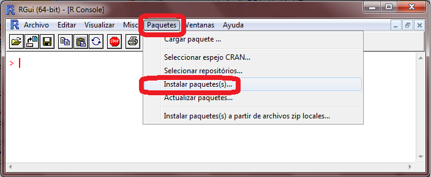
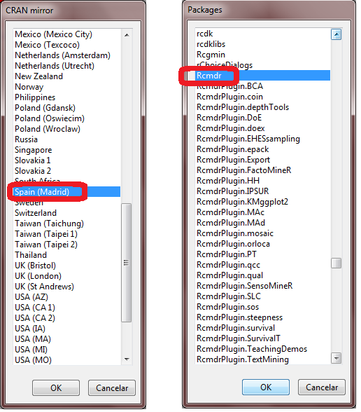

# Interfaces gráficas {#interfaces}

Aunque la consola de R dispone de un editor básico de códido (script),
puede ser recomendable trabajar con un editor de comandos más cómodo y
flexible.

En los últimos años han surgido *interfaces gráficas* que permiten
realizar las operaciones más comunes a través de periféricos como el
ratón. Una lista de de estas interfaces puede ser encontrada en 
[www.sciviews.org/SciViews-R](www.sciviews.org/SciViews-R)

## RStudio {#rstudio}

Un entorno de R muy recomendable es el **RStudio**,
[*http://rstudio.org*](http://rstudio.org):

{width="50%"}

<!-- {width="4.7625in" height="3.95in"} -->

Para instalarlo descargar el archivo de instalación de
[*http://rstudio.org/download/desktop*](http://rstudio.org/download/desktop).

## RCommander {#rcmdr}

`RCommander` es una de las interfaces más populares para `R`. Algunas de
sus ventajas son:

-   Se distribuye también bajo licencia GPL de GNU

-   Fácil instalación

-   Numerosa documentación en castellano

-   Adecuado para la iniciación en la Estadística

-   Introduce a la programación de `R` al mostrar el código asociado a
    las acciones de los menús.

### Instalación de R-Commander 
 
Por ejemplo, la
instalación de la interfaz gráfica R-Commander se puede hacer
directamente desde la ventana de consola tecleando

    > install.packages("Rcmdr")

Otra posibilidad es seleccionar el menú `Paquetes` e
`Instalar paquetes...`

A continuación se abrirá una nueva ventana con todos los posibles
espejos, donde conviene seleccionar el espejo de Madrid.

Una vez elegido el espejo (figura de la izquierda) se seleccionará el
paquete `Rcmdr` (figura de la derecha).

 El programa `R` realizará la correspondiente instalación y,
una vez finalizada, mostrará la pantalla de consola. Entonces se escribe
en la consola

    >library(Rcmdr)

y se abrirá la siguiente ventana de R-Commander.

La ayuda sobre este paquete se obtiene con

    >help(package="Rcmdr")

