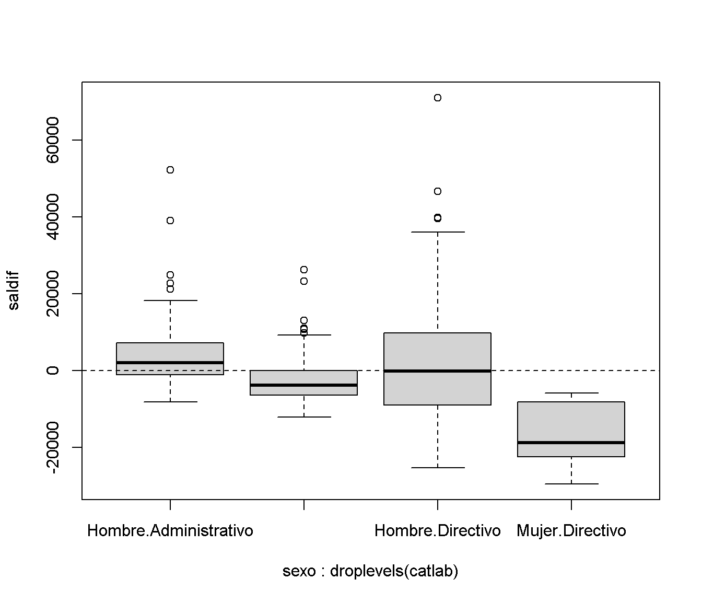

Manipulación de datos con dplyr
===============================


El paquete **dplyr**
--------------------


```r
library(dplyr)
```

**dplyr** Permite sustituir funciones base de R (como `split()`, `subset()`, 
`apply()`, `sapply()`, `lapply()`, `tapply()` y `aggregate()`)
mediante una "gramática" más sencilla para la manipulación de datos:

* `select()` seleccionar variables/columnas (también `rename()`).
* `mutate()` crear variables/columnas (también `transmute()`).
* `filter()` seleccionar casos/filas (también `slice()`).
* `arrange()`  ordenar o organizar casos/filas.
* `summarise()` resumir valores.
* `group_by()` permite operaciones por grupo empleando el concepto
"dividir-aplicar-combinar" (`ungroup()` elimina el agrupamiento).

Puede trabajar con conjuntos de datos en distintos formatos:
     
* `data.frame`, `data.table`, `tibble`, ...
* bases de datos relacionales (lenguaje SQL), ...
* bases de datos *Hadoop* (paquete `plyrmr`).

En lugar de operar sobre vectores como las funciones base,
opera sobre objetos de este tipo (solo nos centraremos en `data.frame`).

### Datos de ejemplo
El fichero *empleados.RData* contiene datos de empleados de un banco.
Supongamos por ejemplo que estamos interesados en estudiar si hay
discriminación por cuestión de sexo o raza.


```r
load("datos/empleados.RData")
data.frame(Etiquetas = attr(empleados, "variable.labels"))  # Listamos las etiquetas
```

```
##                              Etiquetas
## id                  Código de empleado
## sexo                              Sexo
## fechnac            Fecha de nacimiento
## educ            Nivel educativo (años)
## catlab               Categoría Laboral
## salario                 Salario actual
## salini                 Salario inicial
## tiempemp       Meses desde el contrato
## expprev     Experiencia previa (meses)
## minoria           Clasificación étnica
## sexoraza Clasificación por sexo y raza
```

```r
attr(empleados, "variable.labels") <- NULL                  # Eliminamos las etiquetas para que no molesten...
```


Operaciones con variables (columnas)
------------------------------------
### Seleccionar variables con **select()**


```r
emplea2 <- select(empleados, c("id", "sexo", "fechnac", "educ", "catlab", "salario", "salini", "tiempemp"))
head(emplea2)
```

```
##   id   sexo    fechnac educ         catlab salario salini tiempemp
## 1  1 Hombre 1952-02-03   15      Directivo   57000  27000       98
## 2  2 Hombre 1958-05-23   16 Administrativo   40200  18750       98
## 3  3  Mujer 1929-07-26   12 Administrativo   21450  12000       98
## 4  4  Mujer 1947-04-15    8 Administrativo   21900  13200       98
## 5  5 Hombre 1955-02-09   15 Administrativo   45000  21000       98
## 6  6 Hombre 1958-08-22   15 Administrativo   32100  13500       98
```

Se puede cambiar el nombre (ver también *?rename()*)


```r
head(select(empleados, sexo, noblanca = minoria, salario))
```

```
##     sexo noblanca salario
## 1 Hombre       No   57000
## 2 Hombre       No   40200
## 3  Mujer       No   21450
## 4  Mujer       No   21900
## 5 Hombre       No   45000
## 6 Hombre       No   32100
```

Se pueden emplear los nombres de variables como índices:


```r
head(select(empleados, sexo:salario))
```

```
##     sexo    fechnac educ         catlab salario
## 1 Hombre 1952-02-03   15      Directivo   57000
## 2 Hombre 1958-05-23   16 Administrativo   40200
## 3  Mujer 1929-07-26   12 Administrativo   21450
## 4  Mujer 1947-04-15    8 Administrativo   21900
## 5 Hombre 1955-02-09   15 Administrativo   45000
## 6 Hombre 1958-08-22   15 Administrativo   32100
```

```r
head(select(empleados, -(sexo:salario)))
```

```
##   id salini tiempemp expprev minoria     sexoraza
## 1  1  27000       98     144      No Blanca varón
## 2  2  18750       98      36      No Blanca varón
## 3  3  12000       98     381      No Blanca mujer
## 4  4  13200       98     190      No Blanca mujer
## 5  5  21000       98     138      No Blanca varón
## 6  6  13500       98      67      No Blanca varón
```

Hay opciones para considerar distintos criterios: `starts_with()`, `ends_with()`, 
`contains()`, `matches()`, `one_of()` (ver *?select*).


```r
head(select(empleados, starts_with("s")))
```

```
##     sexo salario salini     sexoraza
## 1 Hombre   57000  27000 Blanca varón
## 2 Hombre   40200  18750 Blanca varón
## 3  Mujer   21450  12000 Blanca mujer
## 4  Mujer   21900  13200 Blanca mujer
## 5 Hombre   45000  21000 Blanca varón
## 6 Hombre   32100  13500 Blanca varón
```

### Generar nuevas variables con **mutate()**


```r
emplea2 <- mutate(emplea2, incsal = empleados[,"salario"] - empleados[,"salini"]) 
head(emplea2)
```

```
##   id   sexo    fechnac educ         catlab salario salini tiempemp incsal
## 1  1 Hombre 1952-02-03   15      Directivo   57000  27000       98  30000
## 2  2 Hombre 1958-05-23   16 Administrativo   40200  18750       98  21450
## 3  3  Mujer 1929-07-26   12 Administrativo   21450  12000       98   9450
## 4  4  Mujer 1947-04-15    8 Administrativo   21900  13200       98   8700
## 5  5 Hombre 1955-02-09   15 Administrativo   45000  21000       98  24000
## 6  6 Hombre 1958-08-22   15 Administrativo   32100  13500       98  18600
```


```r
head(mutate(emplea2, tsal = empleados[,"salario"] - empleados[,"salini"]/emplea2[,"tiempemp"]))
```

```
##   id   sexo    fechnac educ         catlab salario salini tiempemp incsal
## 1  1 Hombre 1952-02-03   15      Directivo   57000  27000       98  30000
## 2  2 Hombre 1958-05-23   16 Administrativo   40200  18750       98  21450
## 3  3  Mujer 1929-07-26   12 Administrativo   21450  12000       98   9450
## 4  4  Mujer 1947-04-15    8 Administrativo   21900  13200       98   8700
## 5  5 Hombre 1955-02-09   15 Administrativo   45000  21000       98  24000
## 6  6 Hombre 1958-08-22   15 Administrativo   32100  13500       98  18600
##       tsal
## 1 56724.49
## 2 40008.67
## 3 21327.55
## 4 21765.31
## 5 44785.71
## 6 31962.24
```


Operaciones con casos (filas)
-----------------------------
### Seleccionar casos con **filter()**


```r
head(filter(emplea2, sexo == "Mujer", empleados[,"minoria"] == "Sí"))
```

```
##   id  sexo    fechnac educ         catlab salario salini tiempemp incsal
## 1 14 Mujer 1949-02-26   15 Administrativo   35100  16800       98  18300
## 2 23 Mujer 1965-03-15   15 Administrativo   24000  11100       97  12900
## 3 24 Mujer 1933-03-27   12 Administrativo   16950   9000       97   7950
## 4 25 Mujer 1942-07-01   15 Administrativo   21150   9000       97  12150
## 5 40 Mujer 1933-08-28   15 Administrativo   19200   9000       96  10200
## 6 41 Mujer 1961-03-18   12 Administrativo   23550  11550       96  12000
```

### Organizar casos con **arrange()**


```r
head(arrange(emplea2, salario))
```

```
##    id  sexo    fechnac educ         catlab salario salini tiempemp incsal
## 1 378 Mujer 1930-09-21    8 Administrativo   15750  10200       70   5550
## 2 338 Mujer 1938-08-12    8 Administrativo   15900  10200       74   5700
## 3  90 Mujer 1938-02-27    8 Administrativo   16200   9750       92   6450
## 4 224 Mujer 1934-11-20   12 Administrativo   16200  10200       82   6000
## 5 411 Mujer 1931-08-21   12 Administrativo   16200  10200       68   6000
## 6 448 Mujer 1933-06-05   12 Administrativo   16350  10200       66   6150
```

```r
head(arrange(emplea2, desc(salini), salario))
```

```
##    id   sexo    fechnac educ    catlab salario salini tiempemp incsal
## 1  29 Hombre 1944-01-28   19 Directivo  135000  79980       96  55020
## 2 343 Hombre 1953-06-09   16 Directivo  103500  60000       73  43500
## 3 205 Hombre 1944-06-22   16 Directivo   66750  52500       83  14250
## 4 160 Hombre 1951-08-27   16 Directivo   66000  47490       86  18510
## 5 431 Hombre 1959-01-15   18 Directivo   86250  45000       66  41250
## 6  32 Hombre 1954-01-28   19 Directivo  110625  45000       96  65625
```


Resumir valores con **summarise()**
-----------------------------------


```r
summarise(empleados, sal.med = mean(salario), n = n())
```

```
##    sal.med   n
## 1 34419.57 474
```


Agrupar casos con **group_by()**
-----------------------------


```r
summarise(group_by(empleados, sexo, minoria), sal.med = mean(salario), n = n())
```

```
## # A tibble: 4 x 4
## # Groups:   sexo [2]
##   sexo   minoria sal.med     n
##   <fct>  <fct>     <dbl> <int>
## 1 Hombre No       44475.   194
## 2 Hombre Sí       32246.    64
## 3 Mujer  No       26707.   176
## 4 Mujer  Sí       23062.    40
```


Operador *pipe* **%>% **(tubería, redirección)
-----------------------------
Este operador le permite canalizar la salida de una función a la entrada de otra función. 
`segundo(primero(datos))` se traduce en `datos %>% primero %>% segundo`
(lectura de funciones de izquierda a derecha).

Ejemplos:


```r
empleados %>%  filter(catlab == "Directivo") %>%
          group_by(sexo, minoria) %>%
          summarise(sal.med = mean(salario), n = n())
```

```
## # A tibble: 3 x 4
## # Groups:   sexo [2]
##   sexo   minoria sal.med     n
##   <fct>  <fct>     <dbl> <int>
## 1 Hombre No       65684.    70
## 2 Hombre Sí       76038.     4
## 3 Mujer  No       47214.    10
```

```r
empleados %>% select(sexo, catlab, salario) %>%
          filter(catlab != "Seguridad") %>%
          group_by(catlab) %>%
          mutate(saldif = salario - mean(salario)) %>%
          ungroup() %>%
          boxplot(saldif ~ sexo*droplevels(catlab), data = .)
abline(h = 0, lty = 2)
```




--------------
Para mas información sobre *dplyr* ver por ejemplo la 'vignette' del paquete:  
[Introduction to dplyr](http://cran.rstudio.com/web/packages/dplyr/vignettes/introduction.html).
